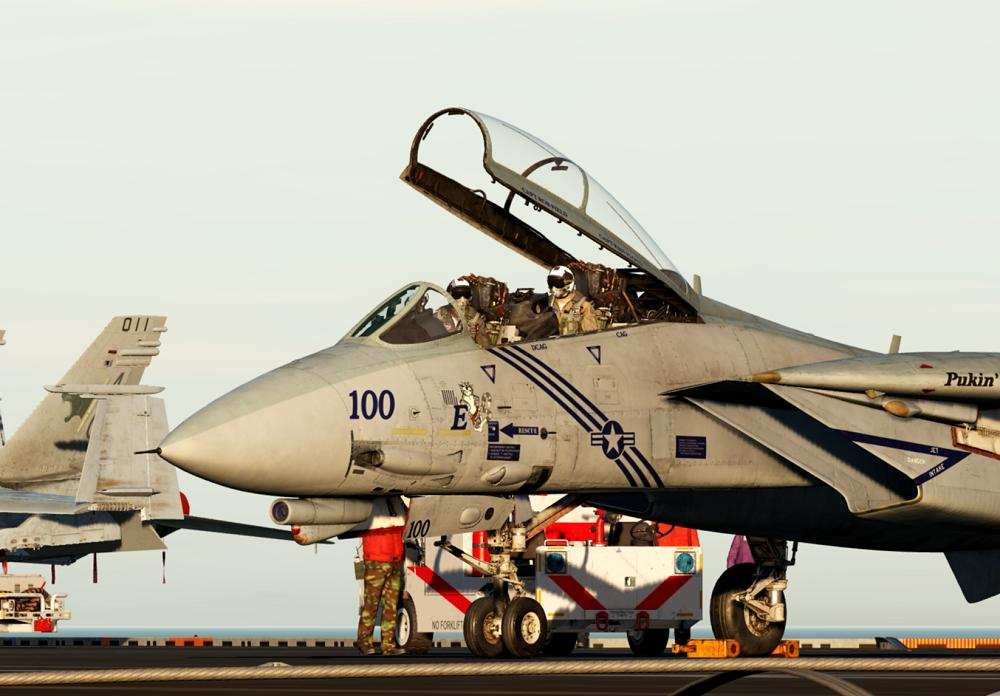

# Lesson 03: F-14B(U) Cold Start Carrier RIO

## Lesson 03: Introduction

Welcome to the cold & dark start up of the F-14B(U) Tomcat on the carrier! Your
aircraft is spawned cold on the parking area of the CVN-74, and you are placed
in the RIO seat. It is not possible to switch seats during the course of the
lesson.

## Objectives

The instructor will guide you through the PRESTART procedure and the POSTSTART
procedure for carrier operations, but without actually starting the engines. All
RIO systems can be used because ground power and external cooling air are
available. Since the back seat doesn't provide primary flight controls, you will
then have the choice to either emphasize on the RIO cockpit and the systems
(which we highly recommend by the way), or to end the lesson.

## Prerequisites

For the procedures covered in this lesson you do not need experience on the
older versions of the Tomcat.

It is recommended that you first glance over the procedures in order to get a
first overview. Look into your kneeboard or the pictures in the briefing window.
Following the procedures from top to down, you may then read through the
respective sections in the aircraft manual for each aircraft system, although
this takes a considerable amount of time and is not really required for
accomplishing the lesson. Another option is to hop into the jet, start over with
the lesson, and in case you are interested in more details on a certain system,
open up the in-game manual and read after while going through the procedures.

## Interaction

Considering you set everything correctly, you can skip instructions by pressing
SPACEBAR, although for many steps it's better to listen carefully before taking
action!

## Planned duration

Considering you listen to all instructions and perform all system tests
carefully, this lesson takes about 20 minutes. If you skip the instructions and
leave out all system tests, this lesson takes about 10 minutes.

## Lesson 03: Documentation

If you feel the need for knowledge, you may read through the following chapters
of the manual:

Chapter >
[External ECS Air Supply](../../../f14ab/systems/enviornmental_control_system.md)

Chapter > [Oxygen System](../../../f14ab/systems/utility.md#oxygen-system)

Chapter >
[ICS - Intercommunications System](../../../f14ab/systems/nav_com/com/intercom.md)

Chapter >
[Fuel System](../../../f14ab/systems/engines_and_fuel_systems/fuel_system.md)

Chapter >
[Internal Lighting](../../../f14ab/systems/lighting.md#internal-lighting)

Chapter >
[Master Test Selector](../../../f14ab/cockpit/pilot/right_console.md#master-test-selector)

Chapter > [Ejection System](../../../f14ab/systems/emergency.md#ejection-system)

Chapter > [Canopy](../../../f14ab/systems/utility.md#canopy)

Chapter > [Systems Overview](../../systems/overview.md)

Chapter > [Link 4A & C Data Link](../../../f14ab/systems/nav_com/link4.md)

Chapter >
[WCS Power Switch](../../../f14ab/cockpit/rio/center_console.md#wcs-power-switch)

Chapter >
[PTID](../../systems/ptid/programmable_tactical_information_display.md)

Chapter >
[AN/AWG-9 and AIM-54 Cooling](../../../f14ab/systems/enviornmental_control_system.md#anawg-9-and-aim-54-cooling)

Chapter >
[EGI ALIGNMENT MODES](../../systems/nav_com/egi.md#egi-alignment-modes)

Chapter > [DTC/MDL](../../systems/mdl/mission_data_loader.md)

Chapter >
[CDNU](../../systems/nav_com/cdnu/control_display_navigation_unit.md#the-cdnu-flight-plan-and-steering-sources)

Chapter >
[IR/TV Switch](../../../f14ab/cockpit/rio/center_console.md#irtv-switch)

Chapter >
[NAVIGATION CONTROLS AND DISPLAYS](../../systems/nav_com/navigation_controls_displays.md#navigation-controls-and-displays)

Chapter >
[AN/ALR-67 RWR](../../../f14ab/systems/defensive_systems/rwr/alr_67.md)

Chapter >
[DECM Controls and Indicators](../../../f14ab/systems/defensive_systems/ecm.md#decm-controls-and-indicators)

Chapter >
[AN/APX-76 IFF Interrogator](../../../f14ab/systems/identification_systems.md)

Chapter >
[Detail Data Display (DDD) and Panel](../../../f14ab/systems/radar/interface.md#detail-data-display-ddd-and-panel)

Chapter > [ALE-47](../../systems/defensive_systems/countermeasures/ale_47.md)

Chapter > [BDHI](../../systems/nav_com/bdhi.md)

Chapter >
[Standby Attitude Indicator](../../cockpit/rio/left_instrument_panel.md#standby-attitude-indicator)

## Lesson 03: Keybindings

Before flying the lesson, check & assign all necessary actions and keybindings
for the F-14B(U) RIO! Take special care for bindings that have no clickable
control elements in the cockpit!

### F-14B(U) RIO → Category → Communications

| Command            | Suggested Assignment |
| ------------------ | -------------------- |
| Communication Menu | <kbd>\\</kbd>        |

### F-14B(U) RIO → Category → Systems

| Command              | Suggested Assignment                                       |
| -------------------- | ---------------------------------------------------------- |
| Seat Adjustment Up   | <kbd>Left Shift</kbd> + <kbd>S</kbd>                       |
| Seat Adjustment Down | <kbd>Left Alt</kbd> + <kbd>Left Shift</kbd> + <kbd>S</kbd> |

### F-14B(U) RIO → Category → Cockpit Mechanics

| Command        | Suggested Assignment                          |
| -------------- | --------------------------------------------- |
| Toggle Canopy  | <kbd>Left Ctrl</kbd> + <kbd>C</kbd>           |
| Canopy - CLOSE | To be assigned (alternative to Toggle Canopy) |
| Canopy - OPEN  | To be assigned (alternative to Toggle Canopy) |

### F-14B(U) RIO → Category → Axis Commands

| Command        | Suggested Assignment |
| -------------- | -------------------- |
| HCU Left/Right | To be assigned       |
| HCU Up/Down    | To be assigned       |

### F-14B(U) RIO → Category → Hand Control Unit

| Command         | Suggested Assignment |
| --------------- | -------------------- |
| HCU Half Action | <kbd>Home</kbd>      |
| HCU Full Action | <kbd>Page Up</kbd>   |
| HCU Offset      | To be assigned       |

## Lesson 03: Audio & Text

Always listen carefully to the instructor. Assume that everything he says is
important. All text is displayed at the top right corner of the screen. The text
remains visible on the screen for a maximum of 1000 seconds, until it either
disappears after that time, or is replaced by new text. You can access the
message log by pressing the ESC key, and then selecting MESSAGES HISTORY
anytime.

## Lesson 03: Tips & tricks

_To be filled in once fellow pilots send some feedback ..._
