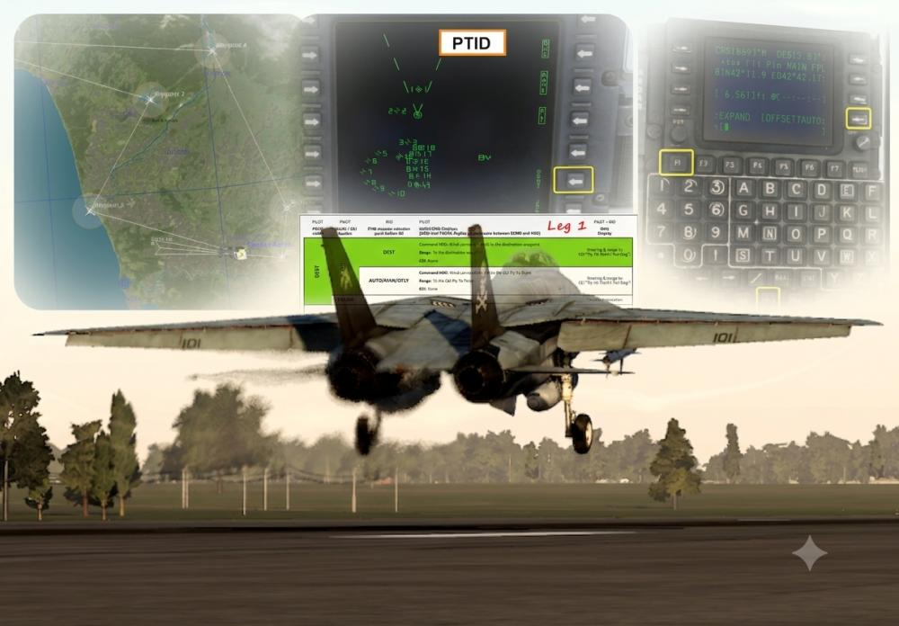

# Lesson 04: F-14B(U) Basic Navigation

## Lesson 04: Introduction

Welcome to the basic navigation flight in the F-14B(U) Tomcat. You aircraft is
hot on the parking spot on the airfield in Senaik-Kolkhi, and you are placed in
the PILOT seat. It is possible to switch seats during the course of the lesson.

## Objectives

The instructor will guide you through the flight through western Georgia.

It first starts with a comparison of the navigations systems of the older and
the newer Tomcat variants, followed by an introduction to the waypoint
management and the BDHI in the new variant.

The instructor then guides you through some cockpit preparations and will
explain the planned route. In order to perform the management of the navigations
system and its waypoints, you may decide to work together with Jester, or switch
seats to do some Jester work from the rear seat on your own.

The flight takes you through a few waypoints over land, and a visit of the
aircraft carrier over sea, using different steering methods, like the EGI
GPS/inertial navigation functionality and the TACAN radio navigation system
functionality.

## Prerequisites

For this flight, you need some experience on any of the older Tomcat variants,
at least in terms of taxi, takeoff and cruise.

## Interaction

Considering you set everything correctly, you can skip instructions by pressing
SPACEBAR, although for many steps it's better to listen carefully before taking
action!

## Planned duration

Considering you listen to all instructions and approach all navigation points,
this flight takes about 30 to 60 minutes, depending on your learning experience
and your airspeed.

## Lesson 04: Documentation

If you feel the need for knowledge, you may read through the following chapters
of the manual:

Chapter > [Systems Overview](../../systems/overview.md)

Chapter > [NAV (general)](../../systems/nav_com/navigation_controls_displays.md)

Chapter > [VDIG-R (pilot seat)](../../systems/vdig_r/overview.md)

Chapter > [BDHI (both seats)](../../systems/nav_com/bdhi.md)

Chapter >
[CDNU (rear seat)](../../systems/nav_com/cdnu/control_display_navigation_unit.md#the-cdnu-flight-plan-and-steering-sources)

Chapter > [PTID (rear seat)](../../systems/ptid/overview.md)

### Other stuff

Please review other topics to brush up your knowledge in case necessary:

- Jester wheel handling
- Seat switching
- Basic aircraft handling
- Flight controls
- Wing sweep
- Flaps & slats
- Landing gear
- Nose wheel steering
- Parking brake
- Wheel braking
- Throttle settings

## Lesson 04: Keybindings

Before flying the lesson, check & assign all necessary actions and keybindings
for the F-14B(U) Pilot, and in case you want to switch seats also for the
F-14B(U) RIO! Take special care for bindings that have no clickable control
elements in the cockpit!

### F-14B(U) Pilot → Category → Axis Commands

| Command         | Suggested Assignment                                                   |
| --------------- | ---------------------------------------------------------------------- |
| Pitch           | To be assigned                                                         |
| Roll            | To be assigned                                                         |
| Rudder          | To be assigned                                                         |
| Throttle Left   | To be assigned                                                         |
| Throttle Right  | To be assigned                                                         |
| Throttle (both) | Alternatively assign this if you only have one throttle axis available |

### F-14B(U) Pilot → Category → Stick

| Command                                         | Suggested Assignment   |
| ----------------------------------------------- | ---------------------- |
| Autopilot Reference / Nosewheel Steering Toggle | <kbd>N</kbd>           |
| DLC Toggle / Countermeasure Dispense            | To be assigned         |
| DLC Thumbwheel Forward                          | To be assigned         |
| DLC Thumbwheel Aft                              | To be assigned         |
| Trigger                                         | De-assign **Spacebar** |

### F-14B(U) Pilot → Category → Throttle

| Command                           | Suggested Assignment |
| --------------------------------- | -------------------- |
| Exterior Lights Master Switch ON  | To be assigned       |
| Exterior Lights Master Switch OFF | To be assigned       |
| Wing Sweep Forward                | To be assigned       |
| Wing Sweep Aft                    | To be assigned       |
| Wing Sweep Auto Mode              | To be assigned       |
| Wing Sweep Bomb Mode              | To be assigned       |

### F-14B(U) Pilot → Category → Communications

| Command            | Suggested Assignment |
| ------------------ | -------------------- |
| Communication Menu | <kbd>\\</kbd>        |

### F-14B(U) Pilot → Category → Flight Control

| Command         | Suggested Assignment                 |
| --------------- | ------------------------------------ |
| Flaps Up        | <kbd>Left Shift</kbd> + <kbd>F</kbd> |
| Flaps Down      | <kbd>F</kbd>                         |
| Trim Pitch Up   | <kbd>Right Ctrl</kbd> + <kbd>.</kbd> |
| Trim Pitch Down | <kbd>Right Ctrl</kbd> + <kbd>;</kbd> |

### F-14B(U) Pilot → Category → Gears, Brakes, and Hook

| Command                    | Suggested Assignment                 |
| -------------------------- | ------------------------------------ |
| Gears Up                   | <kbd>Left Shift</kbd> + <kbd>G</kbd> |
| Gears Down                 | <kbd>Left Ctrl</kbd> + <kbd>G</kbd>  |
| Speed Brake Extend         | <kbd>Left Ctrl</kbd> + <kbd>B</kbd>  |
| Speed Brake Retract        | <kbd>Left Shift</kbd> + <kbd>B</kbd> |
| Wheel Brake Both (Gradual) | To be assigned                       |

### F-14B(U) Pilot → Category → Jester AI

| Command                 | Suggested Assignment                              |
| ----------------------- | ------------------------------------------------- |
| Toggle Menu             | <kbd>A</kbd>                                      |
| Command 1/2/3/4/5/6/7/8 | <kbd>Left Ctrl</kbd> + <kbd>1/2/3/4/5/6/7/8</kbd> |

### F-14B(U) Pilot → Category → Systems

| Command              | Suggested Assignment                                       |
| -------------------- | ---------------------------------------------------------- |
| Seat Adjustment Up   | <kbd>Left Shift</kbd> + <kbd>S</kbd>                       |
| Seat Adjustment Down | <kbd>Left Alt</kbd> + <kbd>Left Shift</kbd> + <kbd>S</kbd> |

### F-14B(U) Pilot → Category → View Cockpit

| Command         | Suggested Assignment |
| --------------- | -------------------- |
| Occupy WSO Seat | <kbd>2</kbd>         |

### F-14B(U) RIO → Category → View Cockpit

| Command           | Suggested Assignment |
| ----------------- | -------------------- |
| Occupy Pilot Seat | <kbd>1</kbd>         |

## Lesson 04: Audio & Text

Always listen carefully to the instructor. Assume that everything he says is
important. All text is displayed at the top right corner of the screen. The text
remains visible on the screen for a maximum of 1000 seconds, until it either
disappears after that time, or is replaced by new text. You can access the
message log by pressing the ESC key, and then selecting MESSAGES HISTORY
anytime.

## Lesson 04: Tips & tricks

_To be filled in once fellow pilots send some feedback ..._
