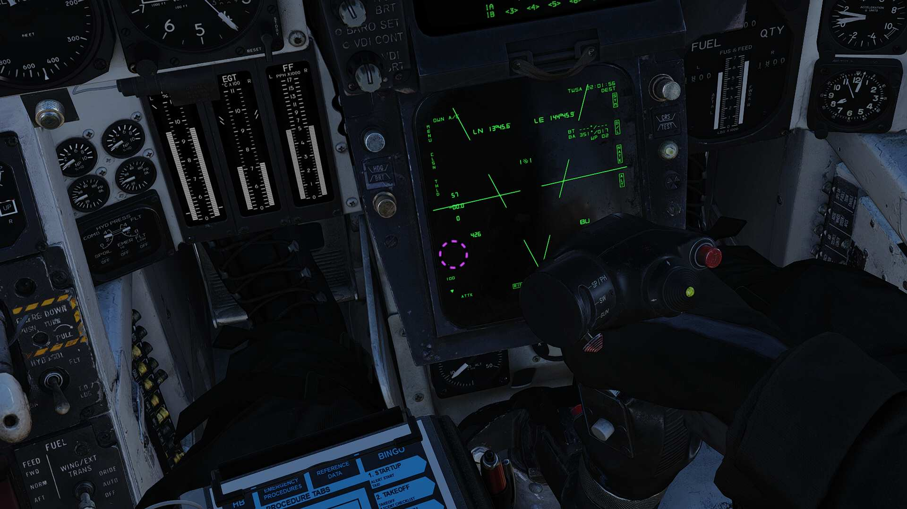

# Jester

> 🚧 Work in Progress

The context command (by default V) allows for intuitive cooperation and exchange
between Pilot and RIO based on the following contexts:

- A/A PDCP Mode - Pilot Display Control Panel A/A

- A/G PDCP Mode - Pilot Display Control Panel A/G

Generally all Jester wheel functions from the F-14A/B are retained. However the
functions are also expanded to fit the new systems.

## Q JESTER

With the addition of QJester the Player can prompt jester to perform specific
actions based on the master mode selection. In all modes it is possible to
prompt jester to select specific pages on the PTID. This is achieved by holding
and releasing the jester context key whilst looking at the desired PTID option
on the HSD in TID repeat.

For example on the PTID tactical page, the player can prompt jester to change
the TID scale meerly by holding and releasing the QJester indicator on top of
the range scale buttons on the left side of the PTID.

## A/A Context Key Actions

1. Holding and releasing the context key on a Target Designate Box in the HUD or
   a TWS track on the PTID prompts jester to hook that track.

2. Holding and releasing the context key whilst looking in the direction in
   azimuth and elevation will prompt jester to scan in the desired direction.

3. Holding and releasing the context key on a visually aquired target will
   prompt jester to try and track that target in TWS.

## A/G Context Key Actions

1. Holding and releasing the context key on a visually aquired area of interest
   will prompt jester to slew the pod in the desired direction and area track
   the location.

2. Holding and releasing the context key on the VDI in LTS repeat will prompt
   jester to move the pod to the indicated location.

