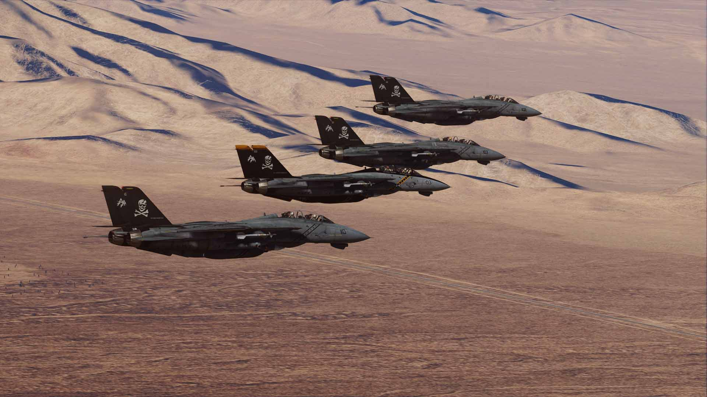

# Normal Procedures

This chapter contains standard procedures for operating the F-14 Tomcat.

The aircrew procedures are separated into individual procedures for the pilot
and radar intercept officer. These separate procedures allow the individual
crew-member to perform the checks without requiring them to read the checks
performed by the other crew-member. The remaining procedures are combined and
are coded for applicable crew-member action.

Provided are complete checklists for full startup and Alert Checklists for quick
start.

| Section | Name                                                            |
| ------- | --------------------------------------------------------------- |
| 1.      | [Takeoff Procedures](../procedures/takeoff_procedures.md) WIP   |
| 3.      | [Tactical Procedures](../procedures/tactical_procedures.md) WIP |
| 4.      | [Landing Procedures](../procedures/landing_procedures.md) WIP   |
| 5.      | [Checklists](../procedures/checklists/overview.md)              |
