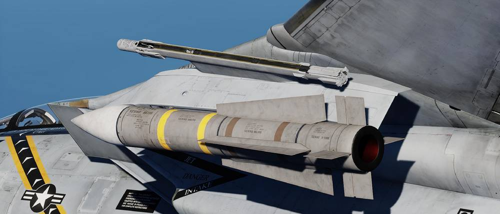

# LAU-138

The LAU-138 chaff dispenser was developed to meet the need for additional chaff
cartridge payload capacity. The launcher itself was developed in Sweden by
CelsiusTech as a chaff dispenser integrated into a rail designed to replace the
LAU-7 Sidewinder rail. Each rail holds up to 160 chaff packages, each smaller
than a normal chaff cartridge while still enabling the mounting of a single
AIM-9 Sidewinder.

On the F-14, the LAU-138 was used mounted on the 1A and 8A stations. While
technically able to be mounted on the respective B stations as well, it was not
possible to refill the launcher while mounted there, so it was not used there
operationally.

With the LAU-138s mounted, the ALE-47 automatically recognizes the amount of
chaff available in the rails.

Each launcher holds 160 chaff packages, and each ejection impulse ejects four
packages from each launcher, each package being about 1/4 the size of a normal
chaff cartridge. This results in each ejection impulse ejecting the equivalent
of two chaff cartridges in total, and a total of 40 ejections being available
from the launchers.

The F-14 also has native countermeasure buckets mounted on the main airframe.
They can be filled with chaff or flares in sets of 10, so for example 30 chaff
and 30 flare can be mounted in the buckets.

The F-14B(U) Tomcat is also equipped with LAU-138 rails; these rails in reality
held BOL chaff and BOL flares. Due to the limitations of the DCS simulation,
only chaff is available for dispensing from the LAU-138.

Each rail is filled with 40 chaff packets, and the rails always dispense
together, providing 40 chaff releases.
