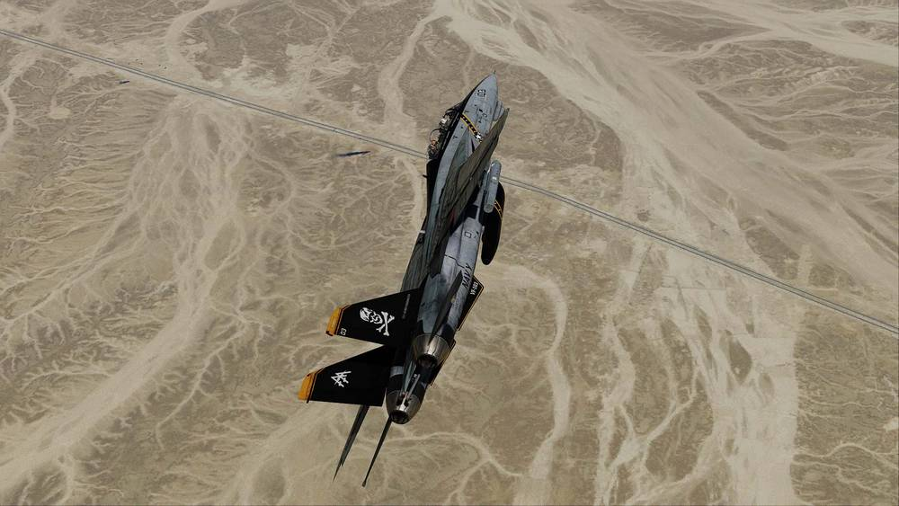

# Defensive Systems

The F-14B(U) Tomcat is equipped with the [ALE-47](countermeasures/ale_47.md)
Countermeasure Dispensing System and can be fitted with the
[LAU-138](countermeasures/lau_138.md) to defend itself against threats by
dispensing chaff or flares.

Also installed on the aircraft is the
[ALR-67](../../../f14ab/systems/defensive_systems/rwr/alr_67.md) Radar Warning
Receiver to increase passive situational awareness by detecting airborne and
surface-to-air radar threats.

For extended protection and radar jamming it can also carry the
[ECM Pods](../../../f14ab/systems/defensive_systems/ecm.md).

