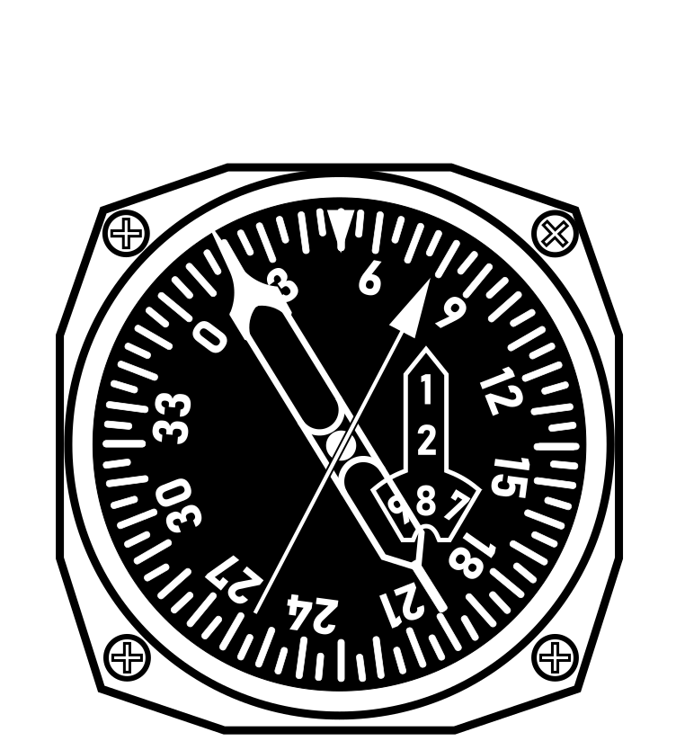
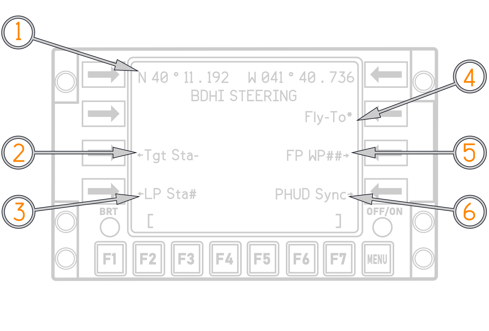

# Bearing Distance Heading Indicator

A BDHI is on the right side of the pilot and RIO instrument panels It displays
aircraft magnetic heading with navigation bearing data and range information. A
fixed index marker at the 12-o’clock position indicates the magnetic heading.

Two servo-driven bearing needles show magnetic bearings to the selected UHF
(ADF) and TACAN stations. The No.1 (single bar) needle receives signals from the
UHF (ADF) system, the No.2 (double bar) needle receives signals from the TACAN
coupler.

|               BDHI                |
| :-------------------------------: |
|  |

## BDHI Steering

If EGI is selected on the TACAN command panel, then the RIO has four options:
selecting the EGI fly−to point (default), selecting a flight plan waypoint,
selecting the GGW/LTS next launch WP (TGT or LP), or synchronizing the BDHI with
HUD steering.

The BDHI Steering Selection Page shown below enables selection of the BDHI
steering source. The page is accessed via the CDNU F4 function key. The default
option for BDHI steering is Fly−To. The RIO selects the other options by
depressing the appropriate LSK. An asterisk next to the LSK shows which option
is active.

(<num>1</num>) Current Steering source waypoint location.

(<num>2</num>) Select Next Launch GGW Target Steering. (Currently selected
Station with programmed Target).

(<num>3</num>) Select Next Launch GGW Launch Point Steering. (Currently selected
Station with programmed Launch Point).

(<num>4</num>) Default the EGI Fly to WP is selected.

(<num>5</num>) Select a waypoint from the FPLN to receive BDHI steering to.
(Separate from EGI Fly-To or DEST Steering Waypoint).

(<num>6</num>) Synchronizes BDHI with HUD/VDIGR steering source.

If the RIO opts for Flight Plan Waypoint Steering (FP WP##), depressing LSK7
will transition the CDNU to the "Steer To" page shown below. This page functions
similar to the "Direct To" page; the active CDNU flight plan is presented, and
the RIO can scroll through the waypoints until the desired waypoint is visible.

Depression of the adjacent LSK activates FP WP steering to that waypoint and
returns the CDNU back to the BDHI Steering Selection Page. The waypoint ID
Number will appear in the FP WP## legend in place of the "##" symbol.

BDHI steering options:

1. Next Launch GGW Target
2. Next Launch GGW LP
3. EGI Fly−To (Default setting)
4. FP WP (any WP in active FP)
5. HUD Sync (Keeps HUD and BDHI steering in Sync).

## AN/ARA-50 UHF AUTOMATIC DIRECTION FINDER

The UHF automatic direction finder is used with the ARC-182 radio. ADF provides
relative bearings to transmitting ground stations or other aircraft. It can
receive signals on any 1 of 30 preset channels or on any manually set frequency
in the 108 to 399.975 MHz range.

The system has a line-of-sight range, varying with altitude.

The system uses the AS-909/ARA-48 ADF antenna. Bearing to transmitting stations
is displayed on the pilot/RIO BDHI (No. 1 needle), pilot HSD, and RIO multiple
display indicator.
