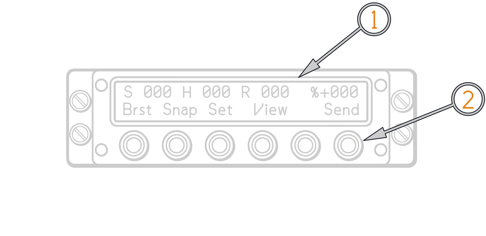
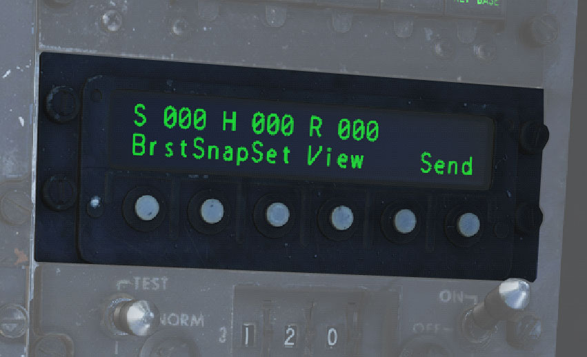
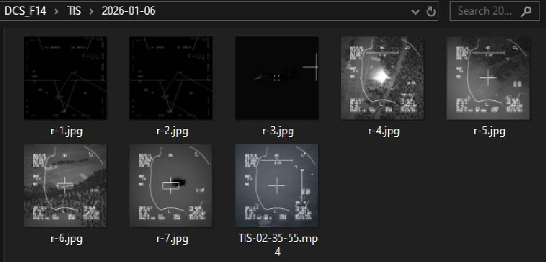
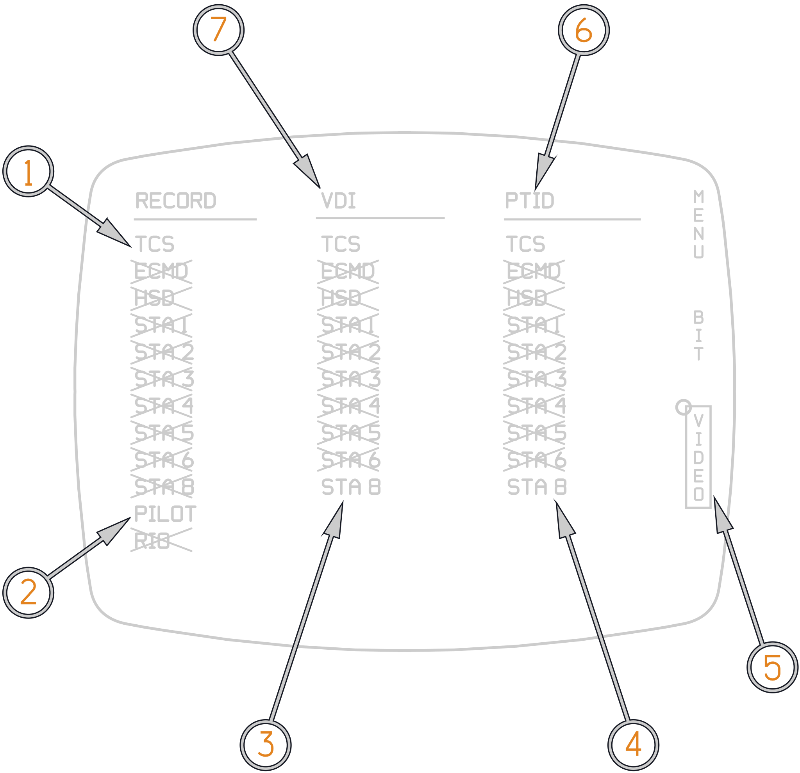
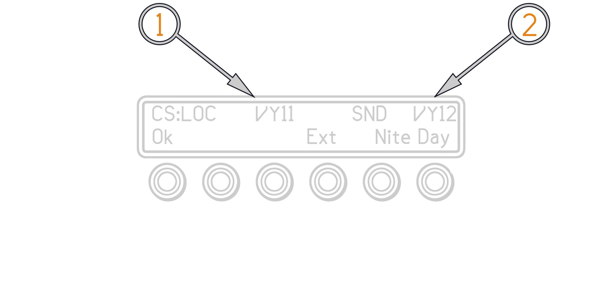
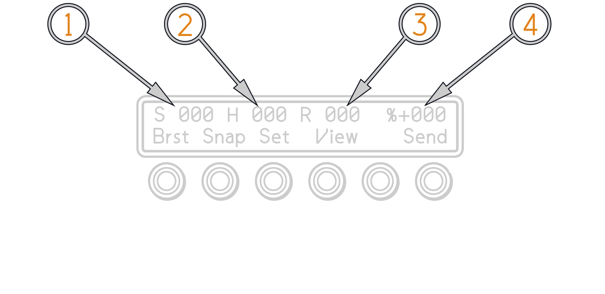

# Fast Tactical Imaging System

The Tactical Imaging Set (also called FTI), captures, digitizes, and compresses
imagery from an external video source, then stores and/or transmits it over a
secure communications link.

The external video source is typically a camera/video system such as the nose
mounted Television Camera System (TCS), Low Altitude Navigation and Targeting
System for Night (LANTIRN), Head Up Display (HUD) camera. Maximum image capture
rate is 4 images/second. In reality the Tactical Imaging Set could also receive
images transmitted by other Tactical Imaging Sets or compatible systems (such as
ground or base stations). Selected images can be displayed on the forward (Video
Display Indicator−VDI) and/or aft (Programmable Tactical Information Display −
PTID) cockpit display.

The Tactical Imaging Set consists of a Remote Control Unit (RCU), Image
Transceiver, Video Tape Recorder (VTR). The RCU mounts in the aft cockpit at the
outboard front of the right side console.

The Tactical Imaging System replaces large parts of the legacy AVTR system. The
Image Transceiver, VTR, Interface Box, and cables are mechanically mounted as
one unit, called the Naval Airborne Video Recorder and Image Transceiver
(NAVGRIT) Unit, which is mounted the right side front fuselage avionics bay.

(<num>1</num>) 48−character alphanumeric display consisting of 2 rows of 24
characters each. Upper row shows operating status. Lower row identifies
functions of switches.

(<num>2</num>) Six pushbutton switches. Functions are as defined by lower row of
display.

## Remote Control Unit (RCU)

The RCU is used to control the Image transceiver mounted in the avionics bay.
The RCU display contains 2 lines of 24 green, night vision compatible,
alphanumeric characters each. The top line provides status and messages. The
bottom line provides a command menu. The command menu defines the functions of
six pushbutton switches located below the display. The command menu, and thus
the switch functions, varies depending on the selected operating mode. Display
brightness is controlled via menu selection.

## Image Transceiver

The Image Transceiver also has two Personal Computer Memories Card International
Association (PCMCIA) card slots. The Image Transceiver has 26 MB of image memory
allocated for storage of uncompressed image frames. The image memory is
volatile, and so stored image frames are lost when power is removed.

In DCS sent and received images are stored in the saved-games directory
`Saved Games\DCS_F14\TIS` For each flown mission where the VTR or FTI are used a
folder with that mission date is created. VTR recordings are stored with a time
stamp. FTI images are stored and named in order of which they are received.

## Airborne Video Tape Recorder (AVTR)

The VTR is an airborne video recorder that can record and play back up to 2
hours of information on a standard Hi 8 format cassette tape. The legacy AVTR
front panel controls are disabled with the exception of the record switch; thus
all VTR control is remotely performed. The RCU duplicates the AVTR record
function through the view menu shown below.

The AVTR can only record one display at a time. The displays are selected via
the ECMD video menu which is accessed via the DDD cursor. The selected display
is also the one that the FTI records for image sending.

### ECMD Video Recording Menu

(<num>1</num>) Hooking TCS with the ECMD cursor the TCS is selected for
recording by the FTI and AVTR.

(<num>2</num>) Hooking Pilot or RIO with the ECMD cursor the HUD or PTID are
selected for recording by the FTI and AVTR.

(<num>3</num>) Hooking STA8 with the ECMD cursor the LANTIRN is selected for
display on the VDI.

(<num>4</num>) Hooking STA8 with the ECMD cursor the LANTIRN is selected for
display on the PTID.

(<num>5</num>) Menu is Boxed.

(<num>6</num>) Hooking TCS with the ECMD cursor the TCS is selected for display
on the PTID.

(<num>7</num>) Hooking TCS with the ECMD cursor the TCS is selected for display
on the VDI.

> Note: ECMD Video Menu display selection is overridden by actuation of the LCP
> TCS/LTS video feed button.

## OPERATING INSTRUCTIONS

### Power-up Sequence

Power up is accomplished using the aft cockpit Sensor Control Panel, moving the
record switch from OFF into standby will apply power. Once power is applied, the
Remote Control Unit (RCU) controls all functions, with the exception of VTR
record which is accomplished by moving the record switch into the ON position.
VTR record can also be initiated through the RCU, overriding the Sensor Control
Panel Record switch position.

#### Set aft cockpit Sensor Control Panel selector to STBY

RCU displays following sequence:

|              |
| ------------ |
| PHOTOTELESIS |

|         |
| ------- |
| RCU 403 |

|                     |
| ------------------- |
| Waiting ATR startup |

|         |
| ------- |
| Unit is |

|                         |
| ----------------------- |
| Waiting for ATR startup |

#### After Image Transceiver startup, the following message sequence appears

|           |
| --------- |
| RCU RESET |

|              |
| ------------ |
| PHOTOTELESIS |

|         |
| ------- |
| RCU 403 |

#### Boot up menu appears

(<num>1</num>) Where LOC is the local call sign (ownship). This is either the
DCS unit name (pilot) set in the mission editor, or the callsign setup in the
TIS DTM section. Up to 6 characters alphanumeric callsigns can be chosen.

(<num>2</num>) SND is the first entry in the send to call sign directory. Can be
set in the TIS DTM menu in the mission editor.

#### Press switch corresponding to desired display brightness level

(if current level is satisfactory, do not press a switch):

- **EXT** − Not used
- **NITE** − Nighttime level from Settings menus
- **DAY** − Daytime level from Settings menus

1. Press OK switch. Main menu appears at currently selected brightness level.

(<num>1</num>) Number of image frames in the send queue.

(<num>2</num>) Number of image frames in the hold queue.

(<num>3</num>) Number of image frames in the receive queue.

(<num>4</num>) Is the VTR mode (S = standby, U = unthreaded, P = playback,
flashing R =recording, all others = blank), ± is either a or a + indicating tape
location is before or after the reset point, and the numbers (currently 000) is
the VTR tape counter time in minutes.

## SETTINGS MENUS

The Settings menus are used to modify configuration parameters for capturing,
compressing, transmitting, and receiving image frames, as well as other system
level functions. The Settings menus are accessed and processed in sequence from
the Main menu (by pressing the SET switch) as shown above.

### Settings Menus' Format

The Settings menus follow the general format:

|                   |
| ----------------- |
| Parameter: ###### |

|                          |
| ------------------------ |
| End BackSet Fld PrevNext |

Where ####### (flashing) is the value of the parameter being set. Switch
functions vary somewhat among menus, and are explained as each menu is
described.

### Send to Call Sign Menu

This menu is used to select/deselect the call signs to be included in the next
transmission. It provides access to submenus, which are used to maintain the
call sign directory. The menu contains one value field. When selected, the first
call sign in the directory is listed whether or not it is selected for
transmission. The directory can be stepped through using the NEXT switch, and
each entry can be selected or deselected, as desired. The displays for a call
sign value differ slightly depending on whether that value is selected or not
selected.

For a selected call sign value:

For a non−selected call sign value:

**END** − Return to Main menu

**MOD** − Display Modify Call Sign menu

**SET** − Select next menu in sequence

**YES** − Select call sign

**NO** − Deselect call sign

**NEXT** − Change currently displayed call sign to next call sign in directory

The callsign directory can be edited using the TIS DTM menu in the mission
editor.

### Modify Call Sign Menu

This menu is used to add a new call sign to the directory or delete an existing
call sign from the directory. It also provides access to the Edit Call Sign
menu, which is used to define a newly added call sign.

**DONE** −Return to Send to Call Sign menu

**DEL** − Delete the current call sign from the directory and display the next
value (if no next value, default is 000000)

**NEW** − Create new unselected call sign with value of 000000 (if value 000000
already exists, switch has no effect)

**EDIT** − Display Edit Call Sign menu

**PREV** − Change currently displayed call sign to previous call sign in
directory

**NEXT** − Change currently displayed call sign to next call sign in directory

### Edit Call Sign Menu

This menu is used to change the name of an existing call sign, including a newly
added call sign (000000). Each character in the call sign is considered a
separate value field. Valid entries for each character are numerals, upper case
letters, and blanks (, located in sequence between Z and 0). Blanks are not
permitted within the body of the call sign; however, if a call sign has less
than 6 characters, trailing blanks must be added to complete the 6 character
call sign. Trailing blanks appear on the display only when the call sign value
field is being edited.

**OK** − Return to Modify Send to Call Sign menu

**FLD** − Select next field in call sign

**PREV** − Change currently selected call sign character to previous letter or
number

**NEXT** − Change currently selected call sign character to next letter or
number

### Local Call Sign Menu

This menu is used to modify the call sign associated with the Tactical Imaging
Set. Each character in the call sign is considered a separate value field. Valid
entries for each character are numerals, upper case letters, and blanks (4,
located in sequence between Z and 0). Blanks are not permitted within the body
of the call sign; however, if the call sign has less than 6 characters, trailing
blanks must be added to complete the 6 character call sign. Trailing blanks
appear on the display only when the call sign value field is being edited.

**END** − Return to Main menu

**BACK**− Display PTAC Quick Start menu

**SET** − Display Brightness menu

**FLD** − Select next field in call sign

**PREV** − Change currently selected call sign character to previous letter or
number

**NEXT** − Change currently selected call sign character to next letter or
number

### Send/Delete Function Menu

This menu is used to toggle the send/delete mode parameter on or off. In
send/delete mode, captured images are deleted as they are sent. With send/delete
mode turned off, images are copied to the receive queue as they are sent. Valid
values are YES and NO.

**END** − Return to Main menu

**BACK**− Display Send−to Call Sign menu

**SET** − Display Capture Rate menu

**NEXT** − Toggle send and delete mode value

### Capture Rate Menu

This menu is used to change the time interval between image captures in burst
mode. Valid values range from 0.1 to 999.0. Values are incremented or
decremented in 0.1−second steps when the value is less than 1 second, and in
1−second steps when the value is greater than 1 second. Incrementing once from
999.0 or decrementing once from 0.1 disables burst mode and enables single shot
mode. In this case, the value field indicates SINGLESHOT.

> The capture rate can be set to 0.1 or 0.2 seconds/image; however, these
> settings are below the Tactical Imaging Set minimum capture rate value
> (fastest capture). If the capture rate is set to 0.1 or 0.2 seconds/image, the
> Tactical Imaging Set will capture image frames at its fastest speed, which is
> approximately 0.28 second/image in capture/hold mode. In capture/send mode,
> the minimum capture rate value is substantially higher due to the compression
> required to transfer image frames to the send queue.

**END** − Return to Main menu

**BACK** − Display Send/Delete menu

**SET** − Display Capture Time menu

**PREV** − Decrement currently displayed

**NEXT** − Increment currently displayed value

### Capture Time Menu

This menu is used to change the duration of image captures in burst mode. Valid
values range from 001 to 999. Values are incremented or decremented in 1−second
steps. Incrementing once from 999 or decrementing once from 001 selects
continuous capturing. In this case, the value field indicates CONTINUOUS.

**END** − Return to Main menu

**BACK** − Display Capture Rate menu

**SET** − Display Max Key Time menu

**PREV** − Decrement currently displayed value

**NEXT** − Increment currently displayed value

### Display Brightness Menu

This menu is used to set RCU display brightness level for daytime or nighttime
viewing, Valid values are EXTERNAL (not used), DAY, and NIGHT.

**END** − Return to Main menu

**BACK** − Display Local Call Sign menu

**SET** − Display Image Dimension menu

**DIM** − Decrease brightness of display for selected DAY or NIGHT value

**BRT** − Increase brightness of display for selected DAY or NIGHT value

**NEXT** − Change currently selected brightness value to next value

### Format SRAM Card Menu

This menu is used to format the Image card (also called the Static Random Access
Memory (SRAM) card) used to store the image frames in the send and receive
queues. Valid values are YES and NO (NO is default).

**END** − Return to Main menu

**BACK** − Display Date and Time menu

**SET** − Display View Version Number menu

**FMT** − Format Image card if format value is YES (if format value is NO, this
switch has no effect)

**NEXT** − Toggle format yes/no value

Formatting an Image card causes all stored image frames in the send and receive
queues to be deleted and the display to momentarily read:

|                     |
| ------------------- |
| Dumping SEND & RECV |

When all images are deleted, the display momentarily changes to read:

|                      |
| -------------------- |
| Formatting SRAM card |

## CAPTURING/COMPRESSING/SAVING/TRANSMITTING/RECEIVING IMAGES

### Capturing Images

Image frames are captured in either burst mode or snap mode. In burst mode,
image frames are captured at predetermined intervals for a predetermined length
of time. In snap (single shot) mode, a single image frame is captured. The
captured image frames are then either transmitted immediately (capture/send
mode) or stored in the image buffer/hold queue (capture/hold mode). All modes
and parameters are set using the Settings menu.

#### Capturing Images in Burst/Hold Mode

> Note If the specified capture rate is SINGLESHOT, the BRST switch label does
> not appear.

1. From the Main menu, press the BRST switch. The capture sequence proceeds
   automatically with image frames being captured at the specified rate for the
   specified duration (capture time).

2. While the image frames are being captured, the menu appears as follows:
   

3. The hold queue field (H012) increases by 1 as each image frame is captured.

> Note If the hold queue is full (typically 188 image frames), burst mode is
> discontinued automatically.

Burst length and Burst interval are changed in the settings menu.

#### Capturing Images in Snap Mode

From the Main menu, press the SNAP switch. The capture sequence proceeds
automatically with one image frame being captured. The Main menu remains
unchanged, except that the hold queue field H012 increases by 1.

### Saving Images

In capture/hold mode when no call signs are selected for transmission and
reception is not occurring, all captured− but−not−compressed image frames in the
hold queue can be compressed and stored in the send queue. In this situation,
the following menu appears:

Pressing the SEND switch transfers one image at a time from the send que (S002)
into the Image card.

> 🚧 Work In Progress.

### Transmitting Images

Image frames which have been captured and compressed are send using the SEND
switch on the Main menu. The SEND switch appears when the Tactical Imaging Set
is not currently transmitting or receiving image frames, there is at least one
image frame in the send and/or hold queue, and at least one send−to call sign is
selected. New image frames can be captured during transmission. Transmission of
image frames on command is accomplished as follows:

> Note The Tactical Imaging Set transmits image frames to all selected call
> signs, but it does so sequentially, that is, it transmits all image frames to
> the first selected call sign.

1. On the Main menu, press the view key the following menu appears:
   

2. In the view menu press the Hold key, the cockpit display will now display the
   images captured in the hold cue and the following menu appears:
    Within the hold
   menu scroll to the image or images that are to be transferred to the send
   cue. With the MARK key images are transferred into the send cue.

3. On the Main menu, press the SEND switch. The Tactical Imaging Set
   automatically shifts into data mode, and the following menu appears:
   

a. If there are image frames in the send queue with a valid callsign selected in
the settings menu, those image frames are transmitted.

b. If there are no images in the send cue, the send switch stores all images in
the Hold cue on the image card.

c. The S=00% displays to the aircrew the percentage of transmitted data
successfully received by the receiving station.

### Receiving Images

Image reception is normally accomplished after coordinating voice communication
with the transmitting station. Image reception cannot occur during transmission,
and the Image card must have sufficient memory available to store the received
images. Reception is initiated when a transmission to a call sign matching the
local call sign is received. The local call sign is set using the Settings menu.
Once reception is initiated, it proceeds until complete with no user
intervention. When reception is complete, the Tactical Imaging Set sends an
acknowledgement to the sending station, and the Main menu appears on the RCU.

1. Ensure that the transmitting station has the correct receiver callsign set in
   the settings menu. By default the unit name is used as the callsign. The
   local callsign can be changed in the settings menu. All callsigns of a group
   are stored by default. Callsigns can als be pre programmed via the DTM in the
   mission editor TIS menu.

2. When reception begins, the following menu appears with the R000 field
   flashing:
   

3. Once images have been received the R002 menu will show the amount of images
   received. For example R002. These images can be viewed via the view/send menu
   described below.

## VIEWING IMAGES

Images available for viewing are captured image frames in the hold queue,
captured, marked, or sent image frames in the send queue, received, sent, or
uploaded image frames in the receive queue, and live/playback VTR output. When
no viewing option is selected, Television Camera System (TCS) output is
displayed on the cockpit display. Image frames in the hold, send, and/or receive
queue can also be deleted. All functions are accomplished using the View menu.

1. Pressing the VIEW switch on the Main menu accesses the View menu.

2. From the View menu, press the SEND switch. The View Send menu sequence
   appears as follows, and the first image frame in the queue is decompressed
   and appears on the cockpit display:

(Progress bar indicating status of decompression)

Switch functions are as follows:

**END** − Return to Main menu

**DEL** − Delete current image frame

**PREV** − Display next image frame in queue

**NEXT** − Display previous image frame in queue

b. Press the PREV or NEXT switch until the desired image frame is displayed

The decompressed image appears on the cockpit display. The number of the image
frame displayed is its position in the queue. This position is based on the
image frames assigned image code (time code for FTI−captured image frames,
externally assigned for received and previously loaded image frames). The queue
wraps around so that the image frame selected by pressing the NEXT switch when
viewing the last image frame in the queue is image frame number 1, and the image
frame selected by pressing the PREV switch when viewing image frame number 1 is
the last image frame in the queue.

## CONTROLLING VTR FUNCTIONS

The VTR can be controlled from either the RCU or the aft cockpit Sensor Control
Panel, with the Sensor Control Panel taking precedence. When the Sensor Control
Panel RECORD switch is set to OFF, power is removed from the Tactical Imaging
Set, and the VTR tape is unthreaded. When the Sensor Control Panel RECORD switch
is set to RECD, the VTR is commanded to record. When the Sensor Control Panel is
set to STBY (normal situation), the VTR is commanded to perform the function set
by the RCU. In either case, the Sensor Control Panel indicator lights indicate
standby, end of tape (EOT), or unthreaded VTR status, as applicable. In
practice, it is recommended that if the Sensor Control Panel is used to control
the VTR record function, the RCU have STBY selected. If the RCU is used to
control the VTR functions, the Sensor Control Panel selector must be set to
STBY.

1. VTR control functions are part of the Tactical Imaging Set view functions The
   View menu is accessed by pressing the VIEW switch on the Main menu. The View
   menu appears as follows:
   
   - **END** − Return to Main menu
   - **REC** − Set VTR to record function

2. Once the VTR is set to record an event mark switch appears on the RCU panel.
   The VTR recording time is also displayed.
   
