# NAVIGATION CONTROLS AND DISPLAYS

The Tomcat has a multitude of displays to show navigation data. Different input
methods can be used to display different navigation data at the same time. The
CDNU and PTID are the only Navigation data displays that also offer input
methods. The CDNU is the primary navigation input device.

Tactical navigational information is displayed on the VDIG-R, PMDIG, and BDHI.
The type of information displayed is predicated on the PDCP display mode and
steering sub-mode selected. System navigation information is displayed on the
CDNU, PTID and HSD. Below a summary of system outputs available to the displays.
Specific presentations for each navigation mode are presented in the navigation
modes and steering section. All displays provide navigation information with
respect to magnetic north. The navigation command and control grid displays are
discussed in the PTID chapter.

## Pilot

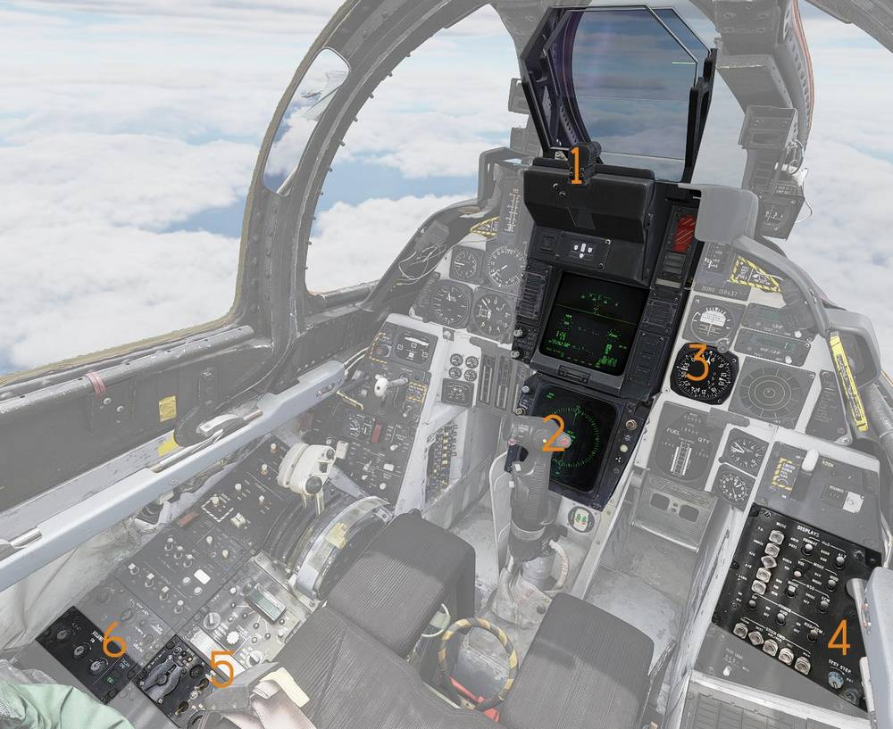

(<num>1</num>) Vertical Display Indicator Group Replacement (VDIG-R)

(<num>2</num>) Horizontal Situation Display (HSD)

(<num>3</num>) Bearing Distance Heading Indicator (BDHI)

(<num>4</num>) Pilot Display Control Panel (PDCP)

(<num>5</num>) TACAN Control Panel

(<num>6</num>) TACAN CMD Panel

## RIO

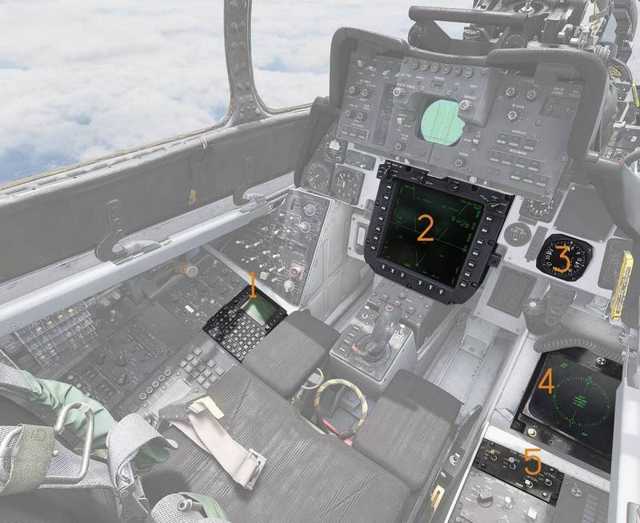

(<num>1</num>) Control Display Navigation Unit (CDNU)

(<num>2</num>) Programmable Tactical Information Display (PTID)

(<num>3</num>) Bearing Distance Heading Indicator (BDHI)

(<num>4</num>) Electronic Countermeasure Display (ECMD)

(<num>5</num>) Electronic Countermeasure Display Control Panel

## System Architecture and Terminology

With the F-14B Upgrade the Navigation system was upgraded significantly,
replacing entire component groups or supplementing them with newer components.
At the core of the Navigation system is the Embedded GPS INS (EGI). The EGI is
controlled by the CDNU. The F-14s weapon system is controlled by the F-14s
Mission Computer (FMC). The FMC requires analogue signals and interfaces with
the CDNU and the EGI via the Computer Signal Data Converter (Replacement)
CSDC(R).

This means, that whilst the overall navigation solution for the Tomcat is
determined by the EGI, there are four distinct sources for steering information:

1. The EGI steering solution which is controlled via the CDNU.

2. The FMC steering solution which is controlled via the PTID.

3. BDHI steering controlled via the CDNU.

4. TACAN steering controlled via the Pilots TACAN panel.

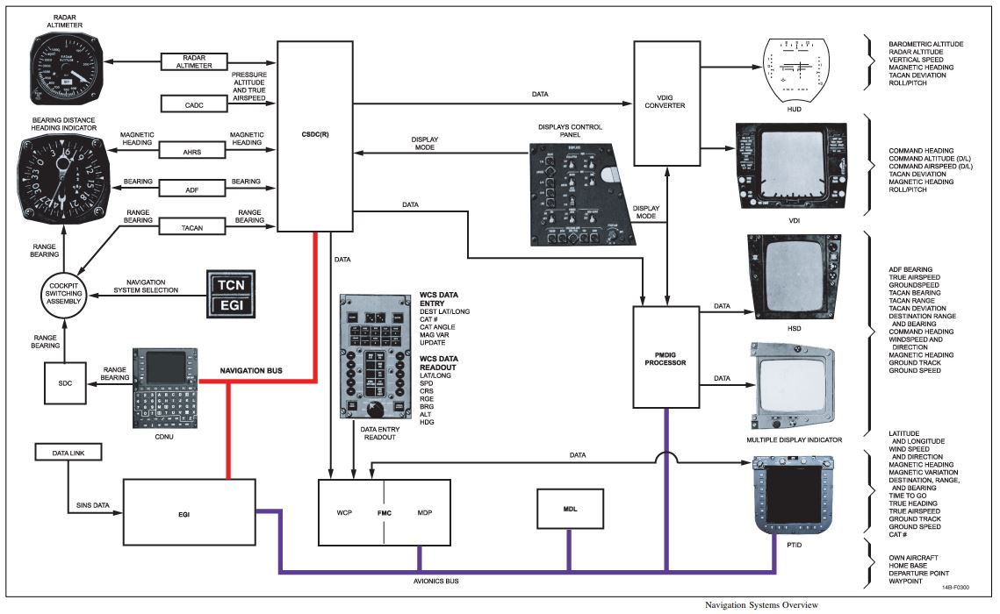

### EGI Steering

The EGI provides flight plan AUTO, OFLY and MAN steering selected on the CDNU.
If EGI (MAN/OFLY/AUTO) steering is selected via the PTID and EGI is selected on
the TACAN CMD panel, the HUD and HSD reference the EGI steering solution. The
current EGI steering waypoint is shown on the PTID as a "Hot-Dog" waypoint. The
EGI always provides steering to the currently active flight plan waypoint.

### Destination Steering

The FMC provides two basic types of steering Navigation and Attack, Navigation
steering is commonly referred to as destination steering. Any waypoint in the
Flight Plan can be designated as the Destination waypoint. If destination
steering is selected via the PTID tactical page using PBs 6, 8, and 9 and EGI is
selected on the TACAN CMD panel, the HUD and HSD reference the destination
steering solution. Destination steering is available on the HUD in all HUD
modes, and is only available on the HSD if the DEST steering sub-mode is
selected on the PDCP.

### BDHI Steering

Steering information to the CDNU Fly−To point (listed as the first waypoint on
the CDNU Flight Plan page) can be displayed on the BDHI by ensuring that EGI is
selected on the TACAN Control Panel. If EGI is selected, then the RIO has four
options: selecting the EGI fly−to point (default), selecting a flight plan
waypoint, selecting the GGW/LTS next launch WP (TGT or LP), or synchronizing the
BDHI with HUD steering. Options are available on the BDHI Steering Selection
page, accessed via the CDNU F4 function key. The RIO selects options by
depressing the appropriate LSK. An asterisk next to the LSK shows which option
is active.

### TACAN Steering

TACAN steering is shown on the HSD, HUD and BDHI if the Pilot or RIO has TACAN
selected on the TACAN CMD panel. All displays will now reference the TACAN
station as the steering source. The HSD will only show TACAN steering if TACAN
is selected on the PDCP sub-mode.

> TACAN Yardstick is always displayed on the HUD with a valid TACAN station
> regardless of TACAN CMD panel EGI/TACAN switch position.

## Navigation Display Matrix

| PDCP Mode | TACAN/EGI Pushbutton | PTID Steering Select (PB 9) | HUD/HSD/ECMD Displays (DEST and TACAN Display is the same between ECMD and HSD)                                                                                                                                                       | BDHI Display                                         |
| --------- | -------------------- | --------------------------- | ------------------------------------------------------------------------------------------------------------------------------------------------------------------------------------------------------------------------------------- | ---------------------------------------------------- |
| TACAN     | EGI                  | AUTO MAN OFLY DEST          | **Command Heading:** Wind corrected Heading to the EGI Fly-To Point. **Range:** To the EGI Fly-To Point. **CDI Bar:** Displayed (to the EGI Fly-To Point) for the course entered in the CDNU Flightplan                               | Steering and range to EGI "Fly-To" Point ("Hot Dog") |
| TACAN     | TACAN                |                             | **Command Heading:** Wind corrected Heading (to the TACAN Station) required to maintain the HSD selected course. **Range:** To the TACAN Station. **CDI Bar:** Displayed (to the TACAN) for the course dialed on the HSD course knob. | TACAN                                                |
| DEST      | EGI                  | AUTO MAN OFLY               | **Command Heading:** Wind corrected Heading to the EGI Fly-To Point. **Range:** To the EGI Fly-To Point. **CDI Bar:** None                                                                                                            | Steering and range to EGI "Fly-To" Point ("Hot Dog") |
| DEST      | EGI                  | DEST                        | **Command Heading:** Wind corrected Heading to the Destination Waypoint. **Range:** To the Destination Waypoint. **CDI Bar:** None                                                                                                    | Steering and range to EGI "Fly-To" Point ("Hot Dog") |
| DEST      | TACAN                |                             |                                                                                                                                                                                                                                       | TACAN                                                |

> With the PDCP mode in TACAN, then EGI or TACAN steering are the only available
> options for the HUD display. Destination Steering will not be displayed on the
> HUD even with the PTID Steering Select Pushbutton (PB 9) selected to DEST ##.

## Steering Select Sources

1. Dest steering: activated via PTID, waypoint selected via PTID rotary or CDNU.

2. EGI steering: activated via PTID, waypoint selected via CDNU.

### EGI Steering on the HUD/HSD

To display steering information to the CDNU Fly−To point on the HUD and HSD, the
RIO must first select AUTO, OFLY or MAN using the PTID Steering Select Rotary
(PB 9). The pilot must then select DEST or TACAN on the PDCP.

> Note The TACAN Range displayed on the left side of the HUD is always present
> regardless of the PDCP mode or the status of TACAN/EGI command pushbutton With
> PDCP mode in TACAN, the TACAN/EGI command determines whether TACAN or EGI
> steering is displayed on the BDHI/HUD/HSD.

### AUTO/MAN/OFLY/CDNU Steering

Selection of "AUTO/MAN/OFLY/CDNU" (indication is dependent on steering mode
selected on CDNU Flight Plan page, and the status of the EGI) on the PTID
Destination Steering Select Rotary PB provides steering to the CDNU Fly−To
waypoint on the HUD, HSD and BDHI when either DEST or TACAN is selected on the
PDCP (assuming EGI is on). If DEST is selected on the PDCP, the HSD steering is
derived by the FMC, but it is calculated for the same point as the CDNU
calculation. For TACAN selected, the same data seen on the BDHI is provided on
the HSD TACAN display. Both the Hot Dog and the Destination Steering symbols are
posted on the fly−to waypoint if DEST is selected on the PDCP, or TACAN is
selected on the PDCP with EGI selected on the TACAN Select Switch. The following
table summarizes each mode:

| MODE | DESCRIPTION                                                                                                                                                                                                                                                                                                                                                                    |
| ---- | ------------------------------------------------------------------------------------------------------------------------------------------------------------------------------------------------------------------------------------------------------------------------------------------------------------------------------------------------------------------------------ |
| AUTO | Steering to the next waypoint in a flight plan is in accordance with FAA requirements for a "lead turn" when doing Airways Navigation. The lead turn is calculated using a fixed angle of bank, aircraft speed, and course geometry. Automatic sequencing occurs when the aircraft passes an imaginary line perpendicular to the inbound course through the "lead turn" point. |
| MAN  | Manual steering to a flight plan waypoint. No automatic sequencing to subsequent waypoint occurs upon reaching the selected waypoint.                                                                                                                                                                                                                                          |
| OFLY | Steering calculations are provided directly to the desired waypoint so that the aircraft passes directly over the waypoint. Automatic sequencing occurs when the aircraft passes an imaginary line perpendicular to the inbound course through the waypoint.                                                                                                                   |

### Destination Steering via CDNU

The RIO can select the destination steering source directly from the PTID TAC
display page. Selecting (or "boxing") PTID PB6 (DEST) will replace the normal
Steering Mode display on PB9 with the destination steering rotary on PB8 and
PB9.

The RIO can then use PB8 and PB9 to step through the available waypoints,
stopping at the WP number to be designated Destination Steering Point. Unboxing
the DEST pushbutton (PB6) restores the Steering Mode display. To designate a
DEST waypoint via the CDNU, the RIO:

1. Hooks the desired waypoint (Note: if the waypoint is not visible on the PTID,
   the NVD WP page can be used to select the desired waypoint)

2. PTID − Select WPEDIT (PB 8) to bring up the Waypoint Edit 1/2 page on the
   CDNU

3. CDNU − Using LSK 2, cycle through the options until ":DEST" is visible then
   depress ENTER (LSK 6)

4. Verify "D" is posted on the desired CDNU Waypoint Edit Page

5. PTID − Using PB 9, ensure DEST ## is displayed, where ## is the waypoint
   number.

6. PDCP − Pilot must select DEST to display steering information for the
   destination waypoint on the HUD.

### PDCP Display Modes and Steering Sub-modes

The pilot has the option of selecting any one of five VDIG display formats,
depending on the flight phase, to provide him with the data necessary to
accomplish the particular flight phase. These five display modes are arranged as
five vertical, mutually exclusive push-buttons on the pilot’s display control
panel. The five phases are takeoff (T.O.), CRUISE, air-to-air (A/A),
air-to-ground (A/G), and landing (LDG). Note ACM selection overrides the CRUISE
A/A and A/G modes; however, it does not override the T.O. or LDG modes. In
addition to controlling the VDIG(R) formats, the display mode selections also
controls armament and FMC logic.

In addition to the essential data such as altitude, vertical speed indicator,
etc., the VDIG(R) format also provides steering cues. In each of the PDCP
display modes, the pilot has the capability of displaying several types of
steering commands. Altogether there are five distinct steering command
sub-modes: TACAN, destination (DEST), AWL/PCD, vector (VEC), and manual (MAN).
The five selections are arranged horizontally along the bottom of the display
control panel. The five steering sub-modes determine the display format on the
pilot’s HSD and the RIO’s multiple display indicator. The HSD and multiple
display indicator present, in a horizontal plane, steering to the selected
point. The HSD follows the five sub-modes when the pilot places the HSD-MODE
switch to NAV. The RIO also performs the same function by setting the MODE
switch on this multiple display indicator control panel to NAV. Also, when LDG
is selected, the pilot has the option of displaying ILS or ACL information via
switches that can be used to individually and independently select the HUD and
VDI for display.

A typical choice would be to select ILS (SPN-41/ARA-63) for the HUD and for D/L
to VDI. Note All steering commands (such as command course and command heading)
are processed to some extent through the FMC prior to display. The STEERING
indicator legend on the PTID provides a readout for the RIO to inform him of
what sub-mode the pilot has chosen.

## EGI vs DEST Steering mode use-case examples

EGI Steering provides the aircrew with steering information to the currently
active flight plan waypoint. The currently active flight plan waypoint is shown
on the FLPN page, and is denoted by the Hot-Dog symbol on the PTID. The CDNU has
4 steering modes, the default steering mode is MAN. In MAN steering the flight
plan does not advance automatically, it can only be advanced through using the
DIR function. The DIR function will pass all bypassed waypoints into history. In
AUTO or OFLY the EGI automatically sequences the waypoints once passed. This has
the advantage of lowering crew tasks during critical phases of flight. It is
particularly helpful for long routes and low level navigation, where a lot of
waypoints need to be passed in short order.

AUTO and OFLY have the disadvantage of passing waypoints into history, only 5
history waypoints are stored.

Destination steering provides steering to any flight plan waypoint regardless of
its position in the flight plan. There is not Automatic sequencing of waypoints,
the RIO has to manually select the desired waypoint via the PTID rotary or the
CDNU WP edit page. This mode is particularly helpful in missions where no long
routes are required such as a DCA mission.

In Destination no waypoints pass into history, but the RIO always has to
manually select the next desired waypoint once a waypoint has been passed.

### DEST steering

|                                    PDCP                                     |                     TACAN CMD Panel                     |
| :-------------------------------------------------------------------------: | :-----------------------------------------------------: |
|         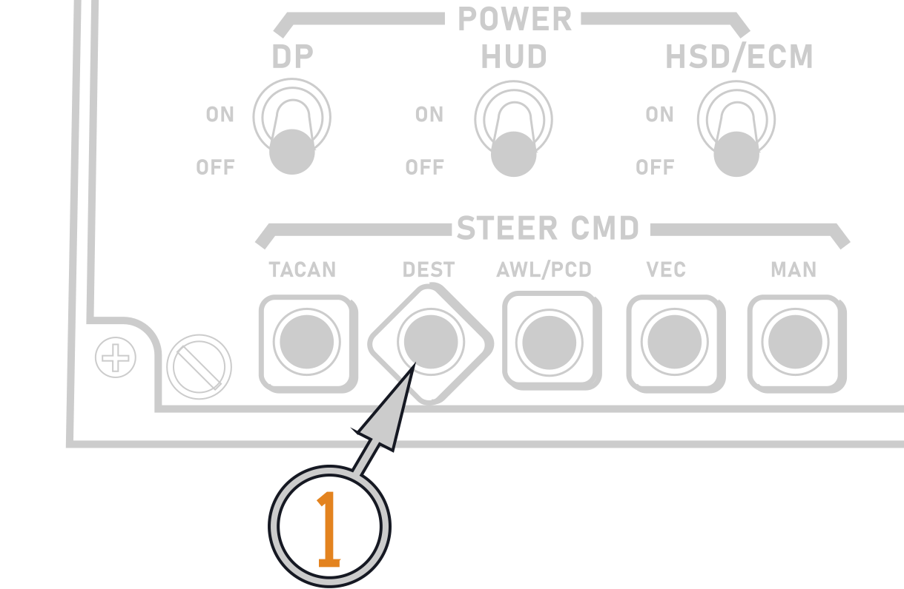         | 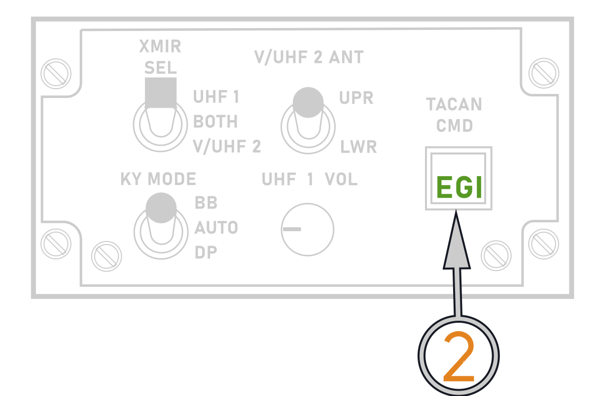 |
|                                    PTID                                     |                                                         |
| 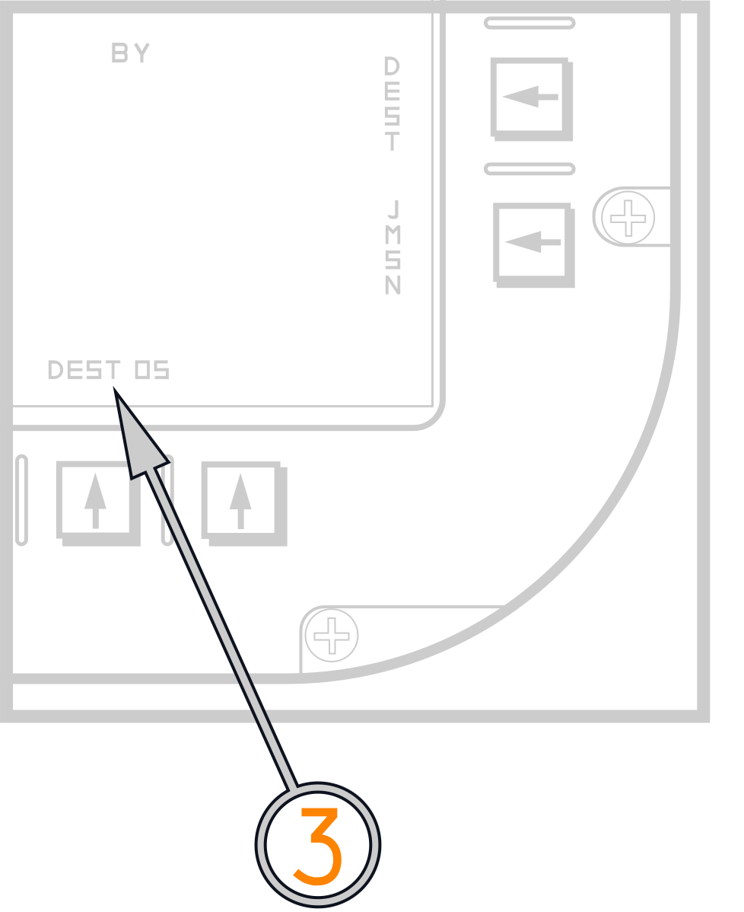 |                                                         |

(<num>1</num>) PDCP sub-mode: DEST

(<num>2</num>) TACAN CMD Panel: EGI

(<num>3</num>) PTID: DEST on PB9

|                                    Result:                                    |                                                               |
| :---------------------------------------------------------------------------: | :-----------------------------------------------------------: |
|                                      HUD                                      |                              HSD                              |
|  | 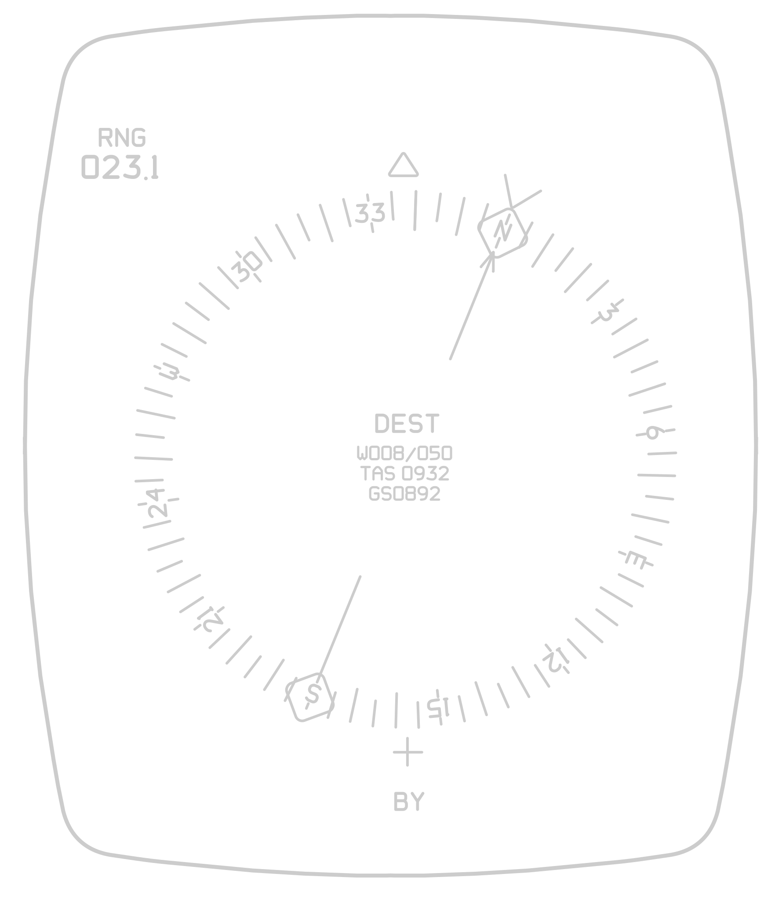 |

HUD/HSD: Show DEST wp.

### EGI steering

|                                    PDCP                                    |                     TACAN CMD Panel                     |
| :------------------------------------------------------------------------: | :-----------------------------------------------------: |
|                 |  |
|                                    PTID                                    |                                                         |
| 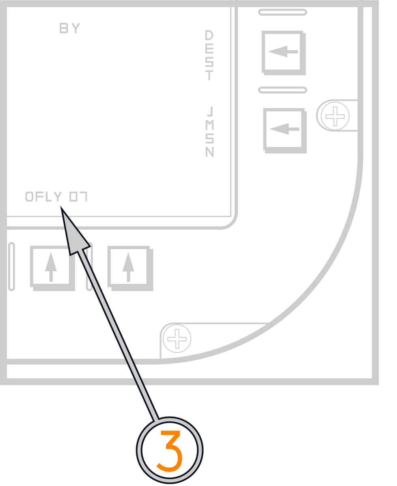 |                                                         |

(<num>1</num>) PDCP sub-mode: DEST

(<num>2</num>) TACAN CMD Panel: EGI

(<num>3</num>) PTID: OFLY on PB09

|                                   Result:                                   |                                                               |
| :-------------------------------------------------------------------------: | :-----------------------------------------------------------: |
|                                     HUD                                     |                              HSD                              |
| 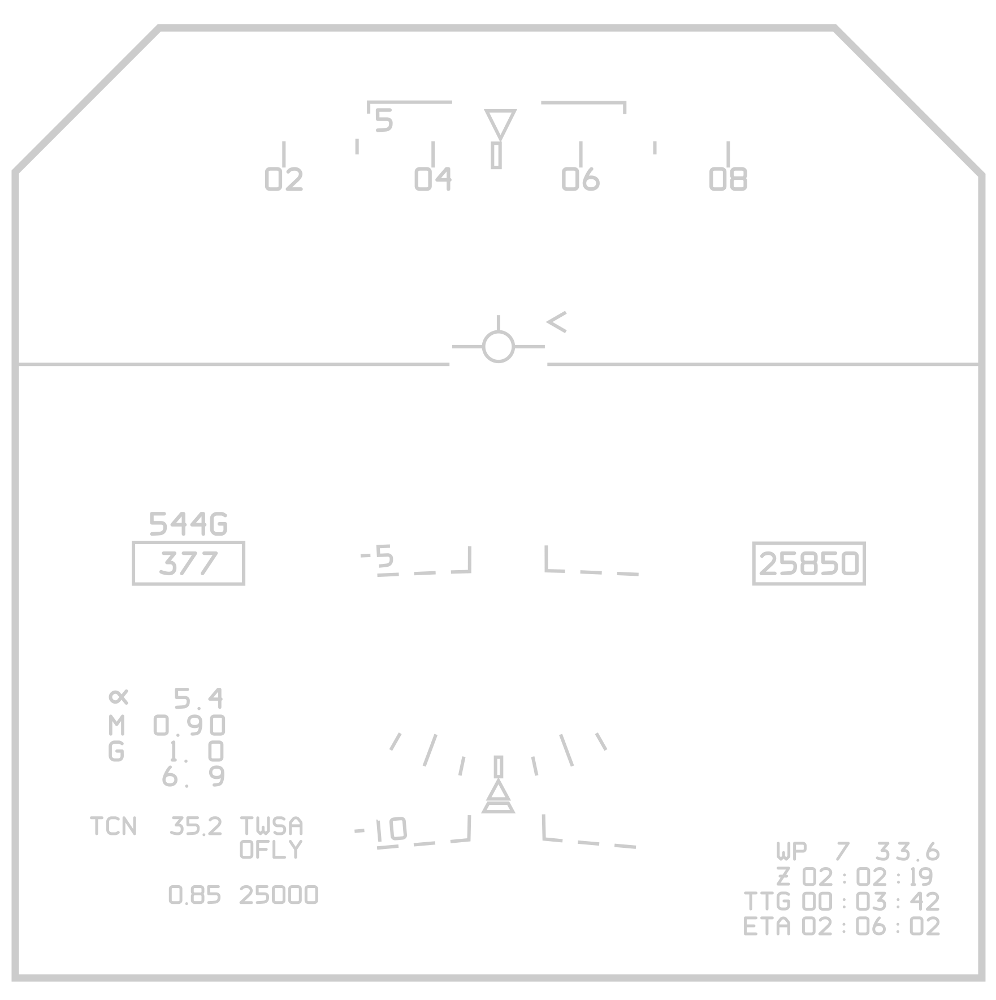 |  |

HUD/HSD: Show Hot-Dog wp.

### TACAN steering

|                             PDCP                             |                     TACAN CMD Panel                     |
| :----------------------------------------------------------: | :-----------------------------------------------------: |
| 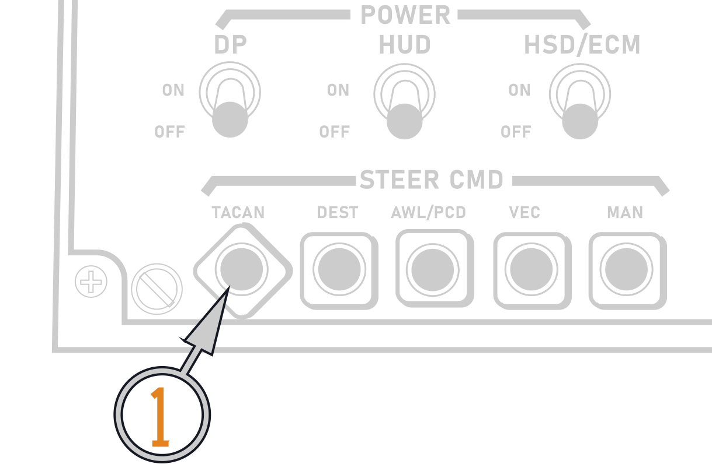 | 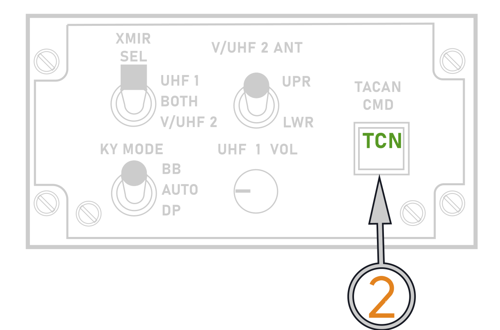 |

(<num>1</num>) PDCP sub-mode: TACAN

(<num>2</num>) TACAN CMD Panel: TACAN

|                                   Result:                                   |                                                                 |
| :-------------------------------------------------------------------------: | :-------------------------------------------------------------: |
|                                     HUD                                     |                               HSD                               |
| 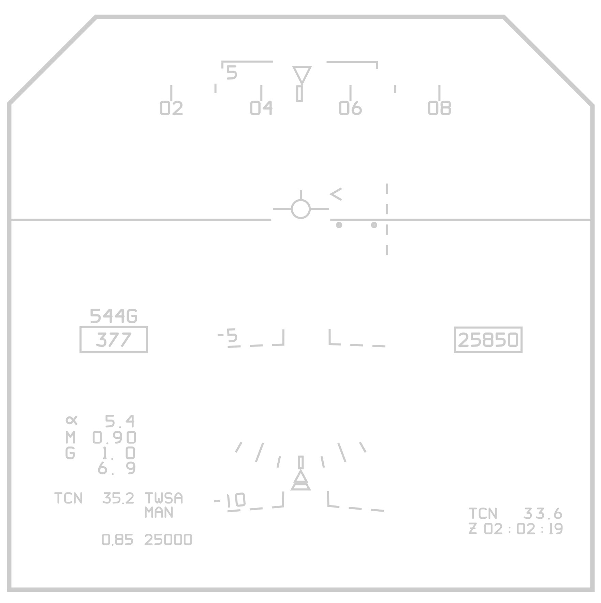 | 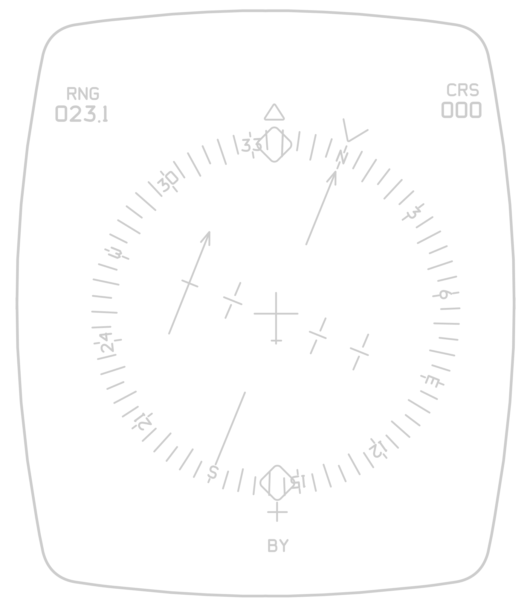 |

HUD/HSD: Show TACAN steering.
