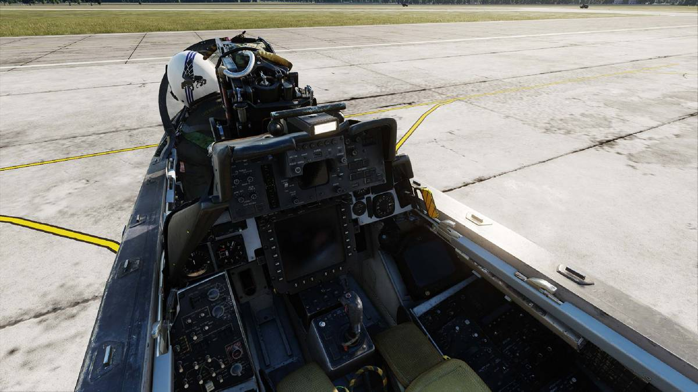

# Systems Overview

| Section | Name                                                                          |
| :-----: | ----------------------------------------------------------------------------- |
|   1.    | [Vertical Display Indicator Group-Replacement (VDIG-R)](./vdig_r/overview.md) |
|   2.    | [Programmable Tactical Information Display (PTID)](./ptid/overview.md)        |
|   3.    | [Programmable Multiple Display Indicator Group (PMDIG)](./pmdig/overview.md)  |
|   4.    | [Digital Flight Control System (DFCS)](./dfcs/overview.md)                    |
|   5.    | [Mission Data Loader (MDL)](./mdl/overview.md)                                |
|   6.    | [LANTIRN Targeting System (LTS)](./lantirn/overview.md)                       |
|   7.    | [Navigation & Communication](./nav_com/overview.md)                           |
|   8.    | [Defensive Systems](./defensive_systems/overview.md)                          |
