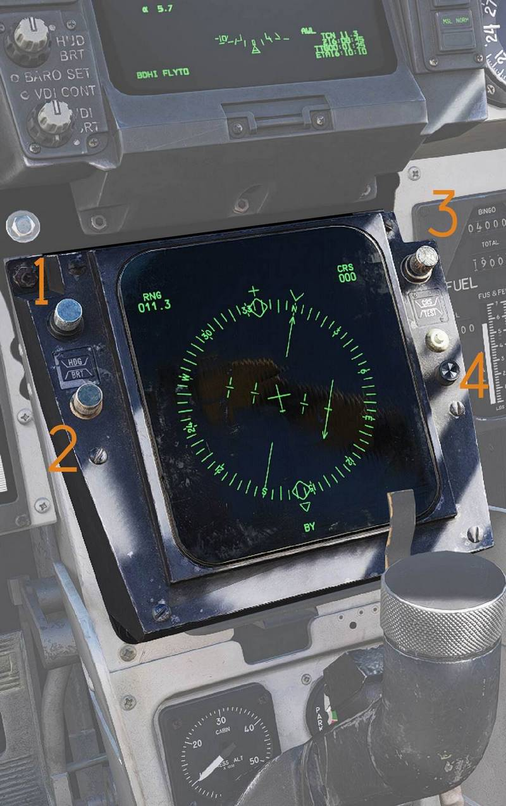
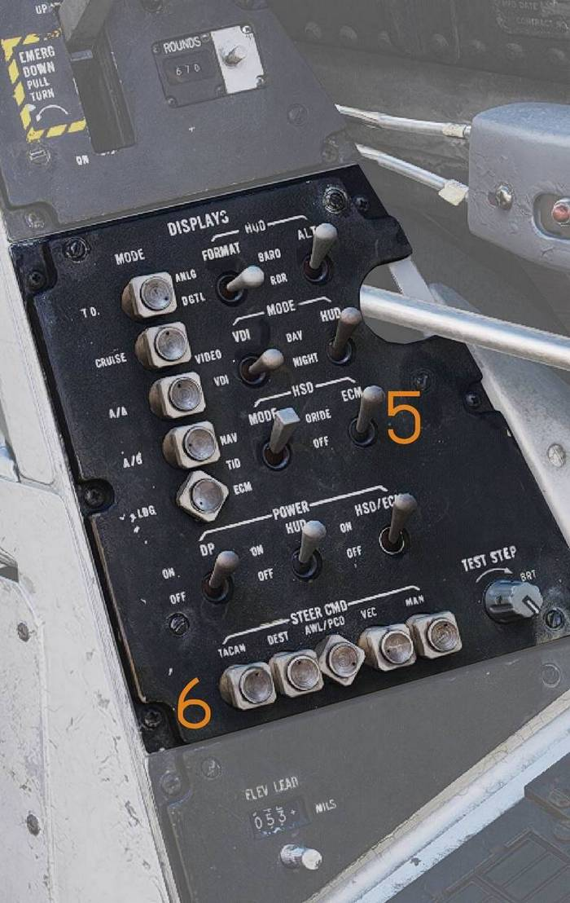
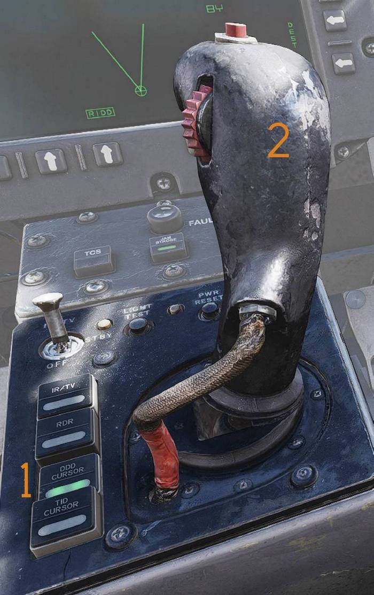
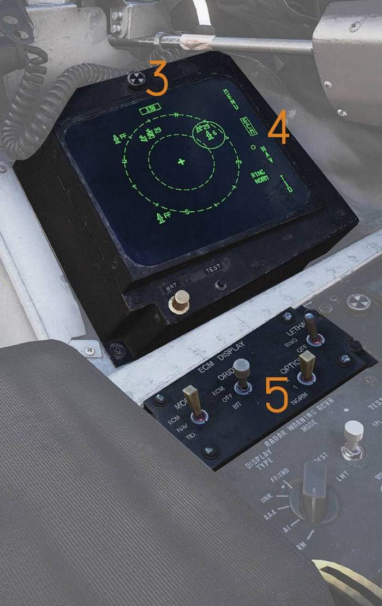
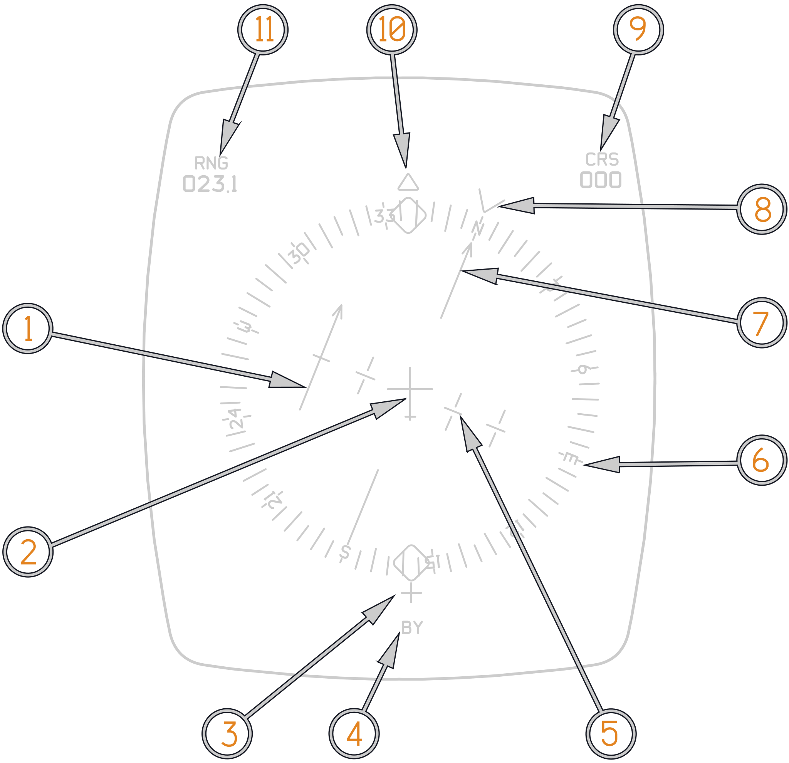
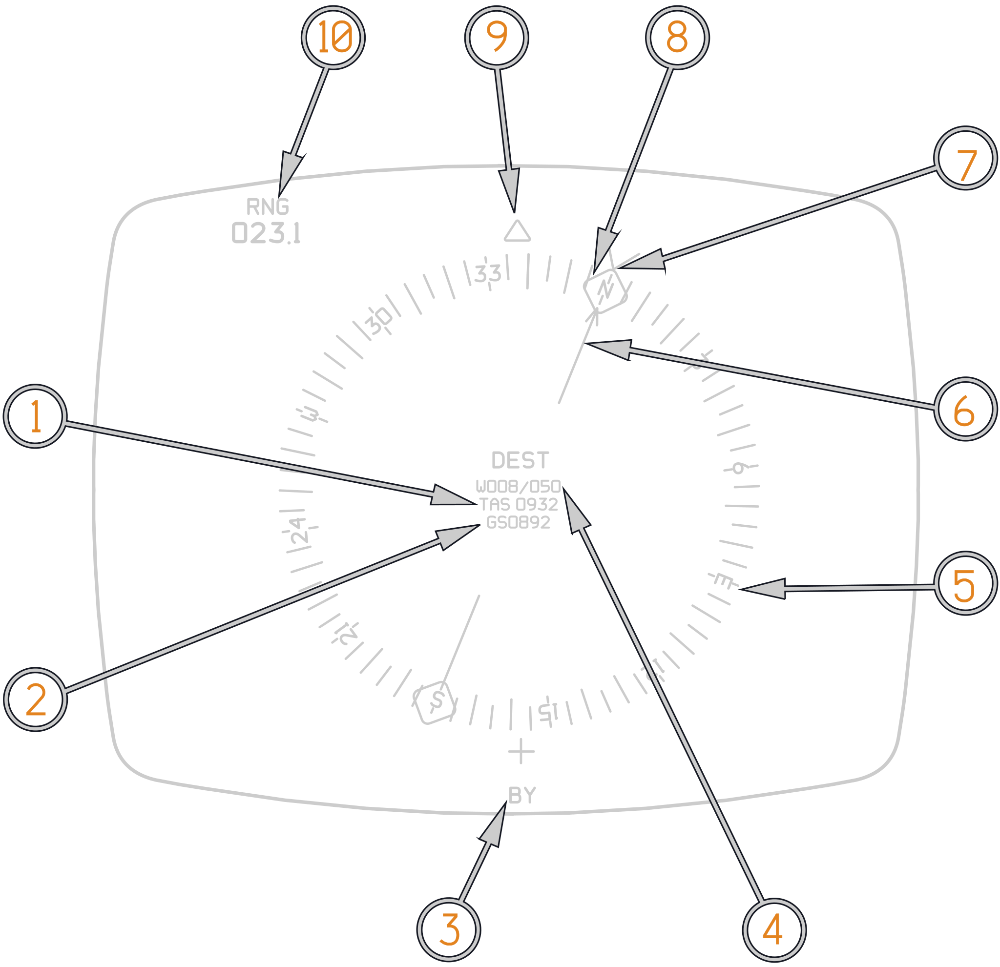
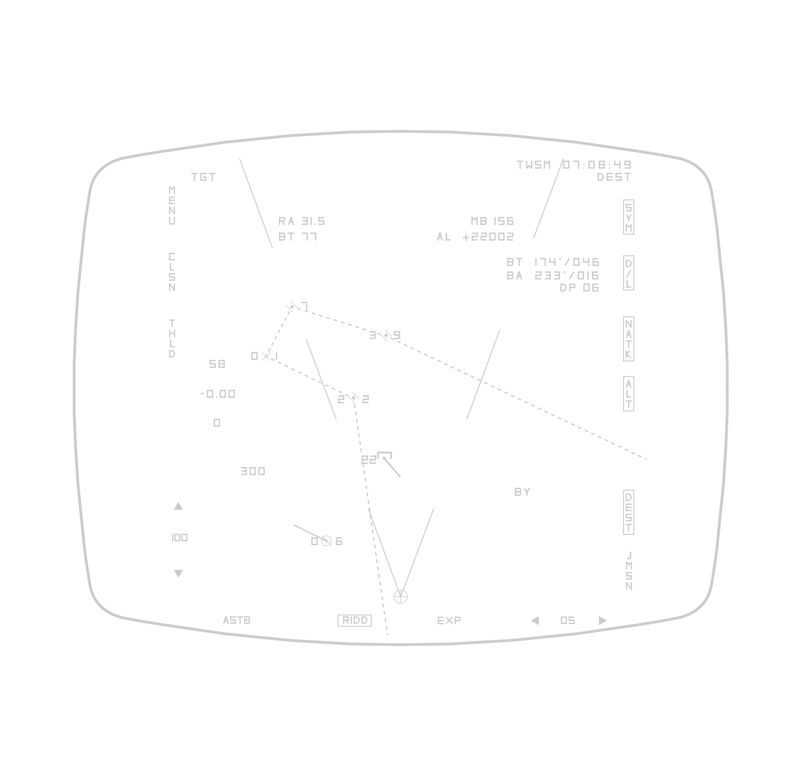
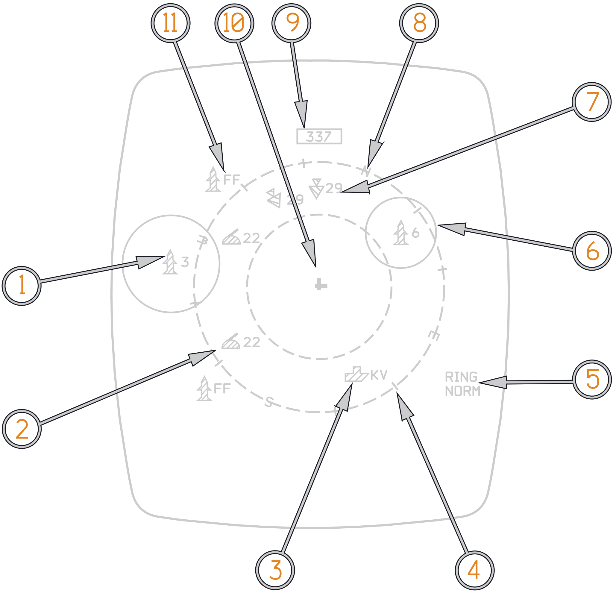
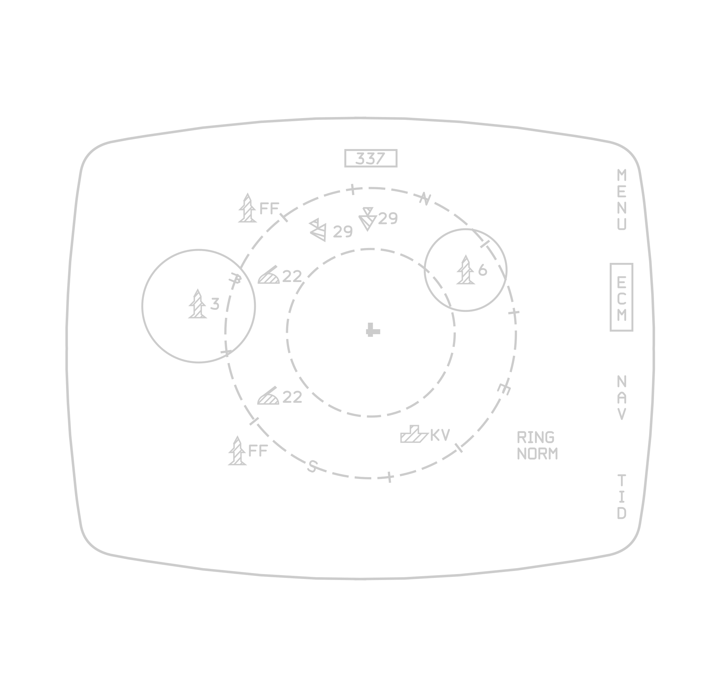
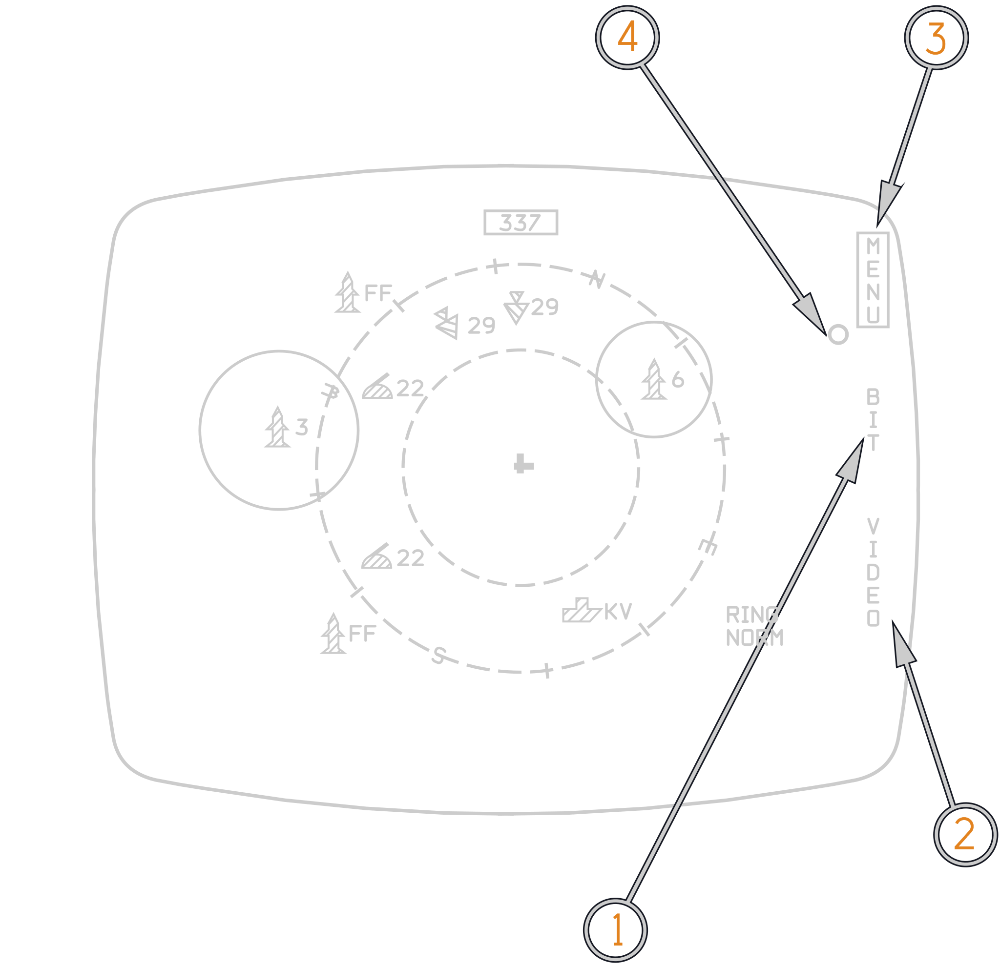

# Programmable Multiple Display Indicator Group

The PMDIG provides the pilot and RIO with navigation or tactical data. The PMDIG
is composed of the pilot horizontal situation display (HSD) and the RIO
Electronic Counter Measure Display (ECMD). Both the ECMD and HSD are capable of
display Navigation and Electronic countermeasure data, as well as operating in
the PTID repeat mode.

## Pilot Horizontal Situation Display

The HSD is the pilot’s primary navigation display. The HSD is also capable of
repeating the RIO tactical information display presentation and the Electronic
countermeasure page.

The HSD indicator and the multiple display indicator are formatted in horizontal
plan position indicator or in horizontal plane, depending on display mode. The
HSD display consists of a cathode ray tube, providing a 5-inch diameter
(approximate) display format. The display format is dependent on the position of
the HSD MODE switch (NAV, ECM or PTID).

|                       PMDIG HSD                        | PMDIG PDCP                                             |
| :----------------------------------------------------: | ------------------------------------------------------ |
|  |  |

(<num>1</num>) The HDG control adjusts the heading reference bug in TACAN mode.

(<num>2</num>) The BRT control adjusts HSD brightness.

(<num>3</num>) The CRS control sets desired course in MAN (manual) and TACAN
modes.

(<num>4</num>) The TEST button resets the HSD if overload protection has tripped
and displays the HSD IR field test display.

(<num>5</num>) HSD Mode switches. ORIDE/OFF: If in ORIDE ECM display will
override MODE select. NAV/TID/ECM: selects between NAV, PTID repeat and the ECM
page.

(<num>6</num>) STEER CMD selectors: will select Steer Command display for both
Pilot and RIO.

## RIO Electronic Countermeasure Display

The ECMD is the RIO’s primary navigation display. The ECMD is also capable of
repeating the RIO tactical information display presentation and The Electronic
countermeasure page. Additionally only the RIOs ECMD has an ECMD menu page
accessible with the use of the HCU cursor in DDD mode. In DDD mode the ECMD menu
items will appear. As long as the HCU cursor is set to DDD the Cursor selections
will override the switch position set on the ECMD control panel. Once a
different HCU Cursor option is selected the ECMD will default back to the
display selected on the ECMD Control Panel.

The ECMD Pages are: PTID Repeat, NAV, ECM, and MENU. Within MENU the RIO can
select BIT (No Function) and VIDEO. In the Video Page the RIO can select which
displays of the PMDIG are recorded by the FTI and VDIG-R. Additionally, the RIO
can control which displays are presented on HSD and VDI for the pilot and ECMD
and PTID for the RIO.

|                       PMDIG HCU                       | PMDIG ECMD                                              |
| :---------------------------------------------------: | ------------------------------------------------------- |
|  |  |

(<num>1</num>) DDD Cursor Selected on HCU control panel.

(<num>2</num>) HCU Cursor on ECMD with HCU half action selected.

(<num>3</num>) ECMD in ECM page format.

(<num>4</num>) ECMD menu and HCU cursor displayed.

(<num>5</num>) ECMD Control Panel.

## PMDIG Modes

The PMDIG can operate in multiple display modes. In Navigation the Pilots
selection on the PDCP (TACAN; DEST; AWL; MAN; VEC) determine the overall display
for both HSD and ECMD. PTID Repeat and ECM are individually selectable by Pilot
and RIO can be selected independently by the aircrew.

### Navigation Modes

The navigation mode is selected by the pilot with the HSD MODE switch on the
pilot display control panel. When the navigation mode is initiated, any one of
four navigation sub-modes (TACAN, destination, vector, or manual) can be
selected. They are selected on the pilot display control panel with STEER CMD
push-buttons.

#### TACAN Steering Mode

The TACAN Steering Mode Provides course deviation steering to the selected TACAN
station, or to the selected EGI Fly-To point, depending on the TACAN CMD control
panel button position (TACAN/EGI).

(<num>1</num>) TACAN Deviation Bar with TO-FROM Arrow.

(<num>2</num>) Aircraft Reticle.

(<num>3</num>) TACAN Bearing Tail.

(<num>4</num>) Nav Mode code.

(<num>5</num>) TACAN Deviation Ticks +/-6°.

(<num>6</num>) Cardinal Directions.

(<num>7</num>) Selected TACAN Course.

(<num>8</num>) Selected Heading.

(<num>9</num>) Selected TACAN Course Readout.

(<num>10</num>) TACAN Bearing Head.

(<num>11</num>) Range to TACAN station in nautical miles.

#### Destination Steering Mode

The Destination Steering display provides course destination steering to the
currently selected destination steering point, or the currently selected EGI
Fly-To Point depending on the RIOs PTID steering selection.

(<num>1</num>) True Airspeed (TAS).

(<num>2</num>) Ground Speed (GS).

(<num>3</num>) Navigation Source Code.

(<num>4</num>) Wind Direction and speed.

(<num>5</num>) Cardinal Directions.

(<num>6</num>) Command Course or Ground Track.

(<num>7</num>) Magnetic Heading.

(<num>8</num>) Command Heading.

(<num>9</num>) TACAN Bearing.

(<num>10</num>) Range to Destination station in nautical miles.

### PTID Repeat Mode

The PTID repeat mode provides display of the PTID presentations on the Pilots
HSD and RIOs ECMD and is initiated with the MODE switch on the Pilots PDCP or
the Mode switch on the RIOs ECMD Control Panel. If the RIO selects TV on the
PTID, the HSD will continue to present PTID attack symbology while the PTID
displays TV. The PTID repeat mode is available for both pilot HSD and RIO ECMD.
For the Pilot the PTID repeat mode is selected on the PDCP, for the RIO the PTID
repeat mode is selected on the ECMD control panel.

### ECM Display Mode

The ECM Display mode is selectable via the PDCP for the pilot and via the ECMD
control panel for the RIO. The ECMD control panel and ECMD menu provided
declutter options for the RIO that are presented to both pilot and RIO ECM
display. The ECM display has an override mode that will automatically display
the ECM page as soon as a threat is detected. The override mode can be turned
off on the PDCP and the ECMD control panel.

| Icon                                                   | Meaning               |
| ------------------------------------------------------ | --------------------- |
|        | Seaborne Threat Radar |
|          | AAA Threat Radar      |
|       | SAM Threat Radar      |
|           | A/A Threat Radar      |
|  | Unknown Threat Radar  |

(<num>1</num>) SA-3 Surface-To-Air Radar Detected.

(<num>2</num>) AAA Threat Radar detected. (Pantsir)

(<num>3</num>) Ship Threat Radar detected. (Kirov)

(<num>4</num>) Tick marks in 30° on outer ring.

(<num>5</num>) Relative Lethality rings enabled (RING).

(<num>6</num>) SA-6 Surface-To-Air Radar Detected.

(<num>7</num>) Mig-29 Air-To-Air Radar Detected.

(<num>8</num>) North.

(<num>9</num>) Current Aircraft heading.

(<num>10</num>) Ownship.

(<num>11</num>) Flat Face Surface-To-Air Search Radar Detected.

### ECMD Menu

The ECMD Menu is only displayed to the RIOs ECMD and is only shown with the HCU
cursor in DDD mode. The ECMD menu selections are achieved via half action HCU
cursor.

> Cursor is inhibited if radar mode is set to pulse.

As long as the DDD HCU mode is active the Menu selections on the ECMD menu
override the switch on the ECMD control panel. Once DDD Cursor mode is exited
the switch position on the ECMD overrides the menu selection and the menu
disappears.

#### ECM Display

The RIOs ECM display can be selected with the use of the ECMD menu and ECMD
cursor, or via the ECMD control panel ECM switch position.

(<num>1</num>) Built In Test (BIT) Page. (No Function)

(<num>2</num>) Video page, accessed by hooking with ECMD cursor.

(<num>3</num>) Menu is Boxed.

(<num>4</num>) ECMD cursor and menu are only displayed if HCU is in DDD cursor
mode and Pulse Radar mode is not selected.

#### BIT Display

> No Function

#### Video Display

(<num>1</num>) Hooking TCS with the ECMD cursor the TCS is selected for
recording by the FTI and AVTR.

(<num>2</num>) Hooking Pilot or RIO with the ECMD cursor the HUD or PTID are
selected for recording by the FTI and AVTR.

(<num>3</num>) Hooking STA8 with the ECMD cursor the LANTIRN is selected for
display on the VDI.

(<num>4</num>) Hooking STA8 with the ECMD cursor the LANTIRN is selected for
display on the PTID.

(<num>5</num>) Menu is Boxed.

(<num>6</num>) Hooking TCS with the ECMD cursor the TCS is selected for display
on the PTID.

(<num>7</num>) Hooking TCS with the ECMD cursor the TCS is selected for display
on the VDI.

> Note: ECMD Video Menu display selection is overridden by actuation of the LCP
> TCS/LTS video feed button.
