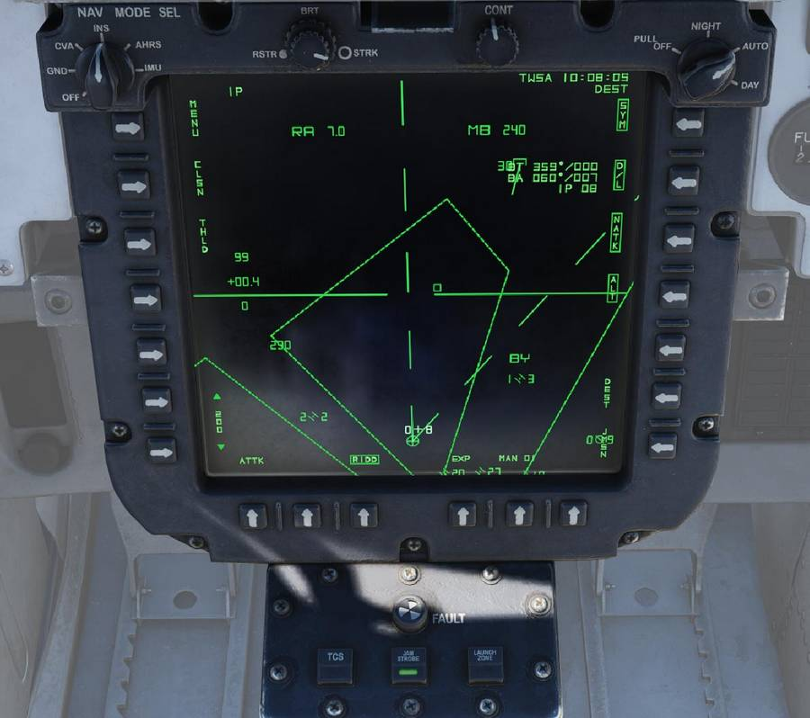

# Programmable Tactical Information Display

| Section | Name                                                                                                                            |
| :-----: | ------------------------------------------------------------------------------------------------------------------------------- |
|   1.    | [The PTID](../ptid/programmable_tactical_information_display.md#programmable-tactical-information-display)                      |
|   2.    | [PTID Waypoints](../ptid/programmable_tactical_information_display.md#waypoints)                                                |
|   3.    | [Tactical Page](../ptid/programmable_tactical_information_display.md#tactical-page)                                             |
|   4.    | [Menu Page](../ptid/programmable_tactical_information_display.md#menu-page)                                                     |
|   5.    | [Navigation Data Plot Line Page](../ptid/programmable_tactical_information_display.md#navigation-data-plot-line-nvd-plt-page)   |
|   6.    | [Plot Lines](../ptid/programmable_tactical_information_display.md#plot-lines)                                                   |
|   7.    | [Navigation Data Waypoint Page](../ptid/programmable_tactical_information_display.md#navigation-data-waypoint-page-nvd-wp-page) |
|   8.    | [Bullseye](../ptid/programmable_tactical_information_display.md#bullseye)                                                       |
|   9.    | [Navgrid](../ptid/programmable_tactical_information_display.md#nav-grid)                                                        |
|   10.   | [All Weather Landing Page](../ptid/programmable_tactical_information_display.md#all-weather-landing-awl-page)                   |
|   11.   | [JDAM Mission Page](../ptid/programmable_tactical_information_display.md#jdam-mission-jmsn-page)                                |
|   12.   | [Stores Management Page](../ptid/programmable_tactical_information_display.md#stores-management-page-sms-page)                  |
|   13.   | [PTID Steering](../ptid/programmable_tactical_information_display.md#ptid-steering)                                             |
