# Programmable Tactical Information Display

The Programmable Tactical Information display (PTID) was intended to replace the
ageing Tactical Information Displays (TID) in all tomcats. As part of the F-14B
Upgrade Program all F-14B(U)s were equipped with the PTID as it serves as a
central part to integrate all updates to the tomcat in a functional way.

The PTID like the old TID displays A/A Tactical Information. However it also
incorporates many updates to the A/A information, such as Target Altitude in
thousands of feet or Bullseye. For a complete list of functions refer to the
chapters below. PTID allowed for a deep integration of various menu pages, or
the loading of Magnetic Tape Memory (MTM) functions, such as the TID Avia
Display, or the Air-To-Ground Magnetic Tapes.

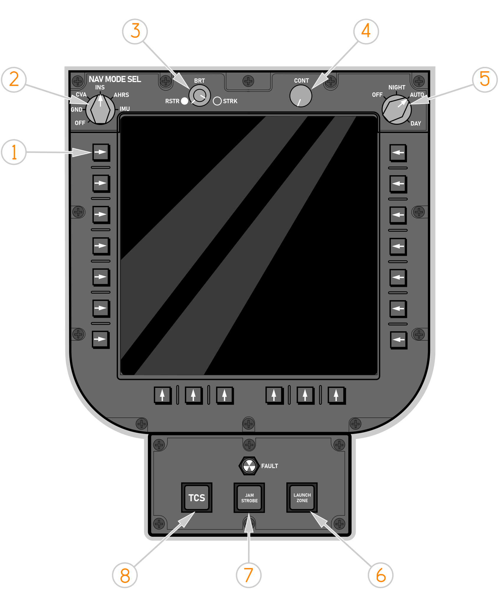

(<num>1</num>) Push Button (PB). The PTID has 20 Push-buttons numbered from top
right to top left. (with pushbutton 20 being the one pointed at)

(<num>2</num>) Nav Mode select switch.

(<num>3</num>) Brightness Knob.

(<num>4</num>) Contrast Knob.

(<num>5</num>) PTID display mode.

(<num>6</num>) Launch Zone declutter.

(<num>7</num>) Jam Strobe declutter.

(<num>8</num>) TCS/LTS video feed toggle.

The IP-1643A/A Programmable Tactical Information Display (PTID) is the primary
interface for the RIO with the WCS and the Radar. The PTID has 3 Primary pages
for Navigation purposes:

- PTID TAC Page

- Navigation Data Plot Line (NVD PLT) Page

- Navigation Data Waypoint (NVD WP) Page

## Waypoints

The F−14B uses a common numbering scheme for display of waypoints. The CDNU,
PTID (including the FLIR display), and HUD will all display the same two digit
number assigned to each waypoint. When a flight plan is first activated, the
waypoints are assigned numbers from 01 to 50 in flight plan order. When new
waypoints are added, they are assigned numbers sequentially beginning with
number 51. When waypoints are deleted, the remaining waypoints retain their
original number.

Due to limitations with the F-14 Mission Computer (FMC) PTID can only display 18
waypoints at a time. Because of that limitation a prioritization scheme is used.

Waypoints that are always displayed when they are within range scale selected on
the PTID:

- FP; IP; HB; DP; HA; ST;

- Priority WP 1-3

- Generic Priority 4-7

- Destination Steering Waypoint

- EGI Fly-To Waypoint "Hot Dog"

| Icon                                                                     | Meaning                               |
| ------------------------------------------------------------------------ | ------------------------------------- |
|    | Defence Point                         |
|     | Destination Waypoint                  |
|        | Fixed Point                           |
|      | Generic Waypoint                      |
|            | Home Base                             |
|      | Hostile Area                          |
|        | EGI Fly-To Waypoint/ Hot-Dog Waypoint |
|     | Initial Point                         |
|  | Surface Target                        |

> 💡 A special waypoint designation may be assigned to any Waypoint. For example
> there might be a surface target with the Waypoint ID 67. Each of the special
> waypoints can only exist once in a flight plan.

> 💡 EGI "Hot Dog" and Destination Steerpoint symbology is applied to any
> waypoint that is designated as such. The symbology is overlaid.

## Tactical Page

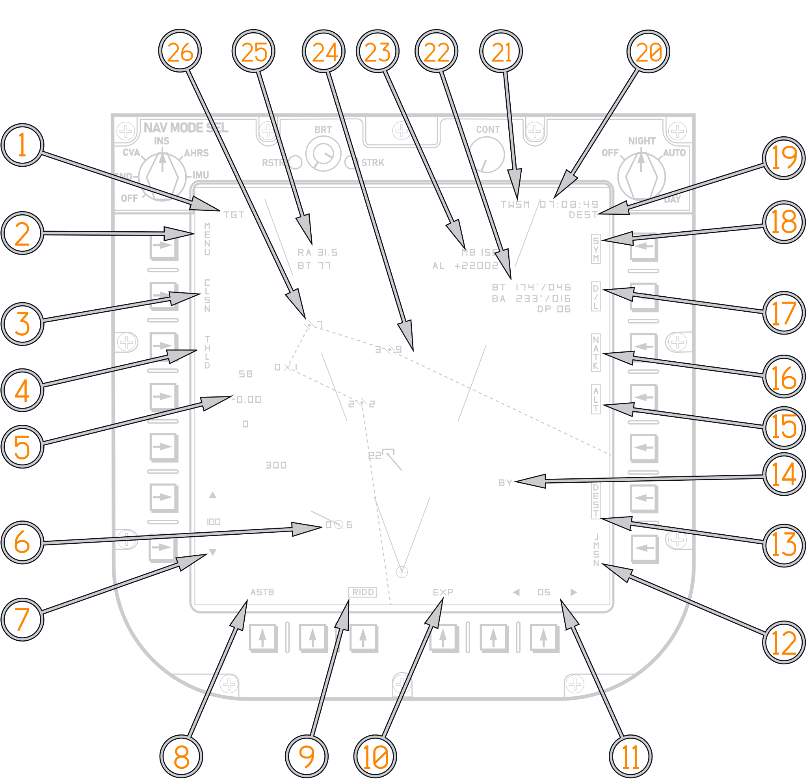

(<num>1</num>) PTID DATA Source: SNSR, OWN A/C, TGT 1,

(<num>2</num>) PTID MENU PAGE (Boxes when selected)

(<num>3</num>) Collision Steering (Boxes when selected)

(<num>4</num>) Track hold (Boxes when selected)

(<num>5</num>) Radar Elevation limits at PTID range scale.

(<num>6</num>) Bullseye waypoint with North spike.

(<num>7</num>) PTID Range Scale.

(<num>8</num>) PTID Mode ASTB GSTB ATTK.

(<num>9</num>) RID Disable (No Function)

(<num>10</num>) TID Expand

(<num>11</num>) DEST Steering mode is selected - Waypoint rotary is available.

(<num>12</num>) JMSN Page

(<num>13</num>) Dest

(<num>14</num>) BY current Nav source Mode

(<num>15</num>) Radar Update (Boxes when Radar is in an Update state - no
function)

(<num>16</num>) Non Attack Declutter (Unboxing declutters)

(<num>17</num>) D/L TrackDeclutter (Unboxing declutters)

(<num>18</num>) Symbology Declutter (Unboxing declutters)

(<num>19</num>) PDCP Steering mode: DEST TACAN MAN

(<num>20</num>) Zulu Time

(<num>21</num>) Radar Mode

(<num>22</num>) BT: Bullseye to Target; BA: Bullseye to Own Aircraft; DP 06:
selected Bullseye waypoint

(<num>23</num>) MB: Magnetic Bearing; AL: Altitude

(<num>24</num>) Plot Line

(<num>25</num>) RA: Range; LT: Target Aspect

(<num>26</num>) EGI Fly To point (Hot-Dog)

## Menu Page

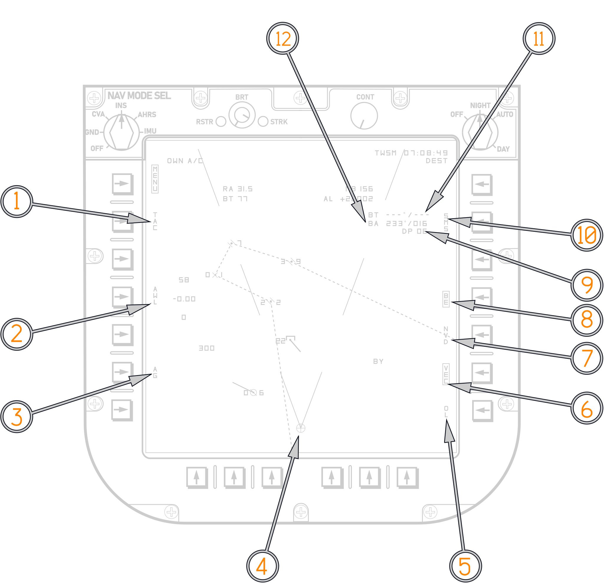

(<num>1</num>) Toggles back to tactical page.

(<num>2</num>) Opens AWL (TID Avia Page).

(<num>3</num>) Loads the A/G magnetic Tapes.

(<num>4</num>) PTID Tactical Symbology is still shown.

(<num>5</num>) Overlay (OL) disables PTID overlay, helpful during TCS or LTS
operation.

(<num>6</num>) Velocity Vector (VEC) Declutter.

(<num>7</num>) Navigation Data (NVD) page NVD Opens NVD PLT Page.

(<num>8</num>) Bullseye or Nav Grid Overlay. Is boxed when enableled.

(<num>9</num>) Waypoint selected as Bullseye (DP 06).

(<num>10</num>) Opens Stores Management (SMS) Page.

(<num>11</num>) 11 with no hook and no HCU half action Target Bullseye is empty.

(<num>12</num>) Bullseye Aircraft is always displayed.

## Navigation Data Plot Line (NVD PLT) Page

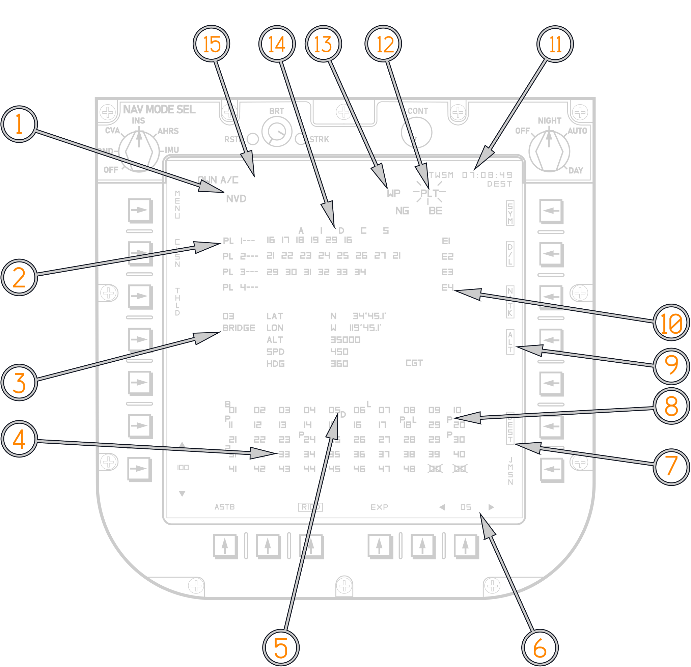

(<num>1</num>) NVD Page Selected

(<num>2</num>) Plot Lines Each Plot line has different dash length.

(<num>3</num>) Hooked waypoint.

(<num>4</num>) Dash through WP shows current EGI Steer Point.

(<num>5</num>) Destination steering point.

(<num>6</num>) Destination steering point rotary.

(<num>7</num>) Destination steering boxed to show rotary on PB8 and PB9.

(<num>8</num>) Generic Priority Waypoint.

(<num>9</num>) Altitude declutter. (No Function on NVD page, same as other
declutters)

(<num>10</num>) E4 - If hooked erases desired plot line.

(<num>11</num>) Zulu Time.

(<num>12</num>) NVD PLT Page is selected (PLT Highlighted). The NVD PLT Page is
the default when hooking NVD from the full PTID menu.

(<num>13</num>) To Select NVD WP page hook "WP" with TID cursor

(<num>14</num>) Plot Line Options: Append. Insert. Delete. Change. Sequence.

(<num>15</num>) F posted indicating FMC is being updated with CDNU data.

## Plot Lines

Plot Lines may be drawn between a group of waypoint to delineate areas of
interest like restricted areas, the Forward Edge Battle Area (FEBA), areas of
hostile forces etc. A plot line may be inserted between any two waypoints
contained in the CDNU active flight plan. Up to nine waypoints may be strung
together to plot complex areas.

The RIO can designate up to four separate plot line groups. Up to nine waypoints
may be used per plot line group, with a maximum of 20 waypoints for all four
plot line groups combined. If there is an attempt to assign more waypoints than
allowed a "PL FULL" advisory is displayed at the top of the PTID. If the PTID is
not able to display all plot lines at once, "PL MASK" is displayed in the same
location.

Plot lines are cleared whenever a flight plan clear command is executed on the
CDNU, or a new flight plan is loaded into the CDNU.

The [PTID NVD PLT](#navigation-data-plot-line-nvd-plt-page) page is available
for plot line definition and editing. The NVD PLT page is the NVD default page.
The WP acronym on the top line must be selected to display the NVD WP page. NAV
GRID/Bullseye activation is accomplished on the NVD PLT or NVD WP page via
hooking the respective acronyms. While in any NVD page, the RIO can access the
PLT page by hooking the PLT acronym located on the top right of the NVD pages.
If WP or NG is hooked, deselecting either also brings up the PLT page. The PLT
page displays the following information:

- Plot information on the top of the display

- Information about the hooked waypoint as displayed on the WP page

- A table of the 50 waypoints resident in the CDNU

On the NVD PLT page, the waypoints selected for each plot line are shown in a
table on the upper half of the page. The unique line type used for the plot line
is shown to the right of the plot line number (PL1, PL2, PL3, or PL4) and is
simply different lengths of dashes. The line type is set by the system.

At the top and at either side of the plot line table on the PLT page is a list
of one− or two−character acronyms for each of the five plot line edit functions.
The edit functions include:

- "A" — Append. Appends a hooked WP to the end of any plot line.
- "I" — Insert. Inserts a hooked WP in front of any selected WP in any plot
  line.
- "D" — Delete. Deletes a selected WP from any plot line.
- "C" — Change. Changes a selected WP in any plot line to the hooked WP
- "S" — Sequence. Append a set of selected WPs in the active flight plan on to
  the end of any plot line. Corresponding Plot Line number must also be
  selected.
- "E#" — Erase. Erases an entire plot line.
- "PL" — Display Plot line. Turn the display of the plot line on/off. Default is
  on.

The CAP may also be used to edit plot lines.

### Appending Plot Line Waypoints

To append a waypoint to a plot line using the NVD PLT page:

1. Hook "A"
2. Hook the desired plot line number (1 to 4)
3. Hook the desired waypoint from the bottom half of page.

The hooking sequence can be in any order. For example, if a waypoint is already
hooked, hooking "A" and then plot line # will append the hooked waypoint to the
plot line. "A" will be crossed out and disabled when a total of 20 waypoints
have been used for all plot lines.

### Inserting Plot Line Waypoints

To insert a waypoint into a plot line using the NVD PLT page:

1. Hook "I"
2. Hook the desired waypoint from the bottom half of page
3. Hook the waypoint number in a plot line in front of which the new waypoint is
   to be inserted.

The first two steps can be done in either order. "I" will be crossed out and
disabled when 20 waypoints have been used for all plot lines.

### Deleting Plot Line Waypoints

To delete a waypoint from a plot line using the NVD PLT page:

1. Hook "D"
2. Hook the desired waypoint number on a plot line to delete the waypoint from
   the plot line.

### Changing Plot Line Waypoints

To change a waypoint in a plot line using the NVD PLT page:

1. Hook "C"
2. Hook a waypoint from the bottom half of the page
3. Hook a waypoint for a plot line to replace the waypoint with the one selected
   from the bottom half of the page.

The first two steps can be done in any order.

### Appending Sets of Waypoints (Sequencing)

To append a sequence of waypoints to a plot line using the NVD PLT page:

1. Hook "A"
2. Hook the desired plot line number (1 to 4)
3. Hook the first waypoint in the desired sequence from the bottom half of page
4. Hook "A" to disable the Append function
5. Hook the last waypoint in the sequence from the bottom half of the page
6. Hook "S" to append the waypoint sequence to the selected plot line.

The first three steps can be done in any order. With "S" function and a waypoint
hooked, "xx" is displayed after the last waypoint (until the next HCU half
action) if the selected sequence of waypoints exceeds the maximum number of
waypoints allowed in a given plot line (9), or for all the plot lines (20).

### Erasing Plot Lines

To erase all the waypoints in a plot line:

- Hook "E1" to erase Plot Line 1

- Hook "E2" to erase Plot Line 2

- Hook "E3" to erase Plot Line 3

- Hook "E4" to erase Plot Line 4

### Enable/Disable Display of Plot Lines from PTID NVD PLT Page

The RIO can suppress display of a plot line on the PTID Tactical page by hooking
the PL symbol on the NVD PLT page for the desired plot line. When plot line
display is enabled, the line type is displayed to the right of the plot line
number. When the plot line display is disabled, the line type is not displayed.
The default condition is to enable plot line display.

## Navigation Data Waypoint Page (NVD WP) Page

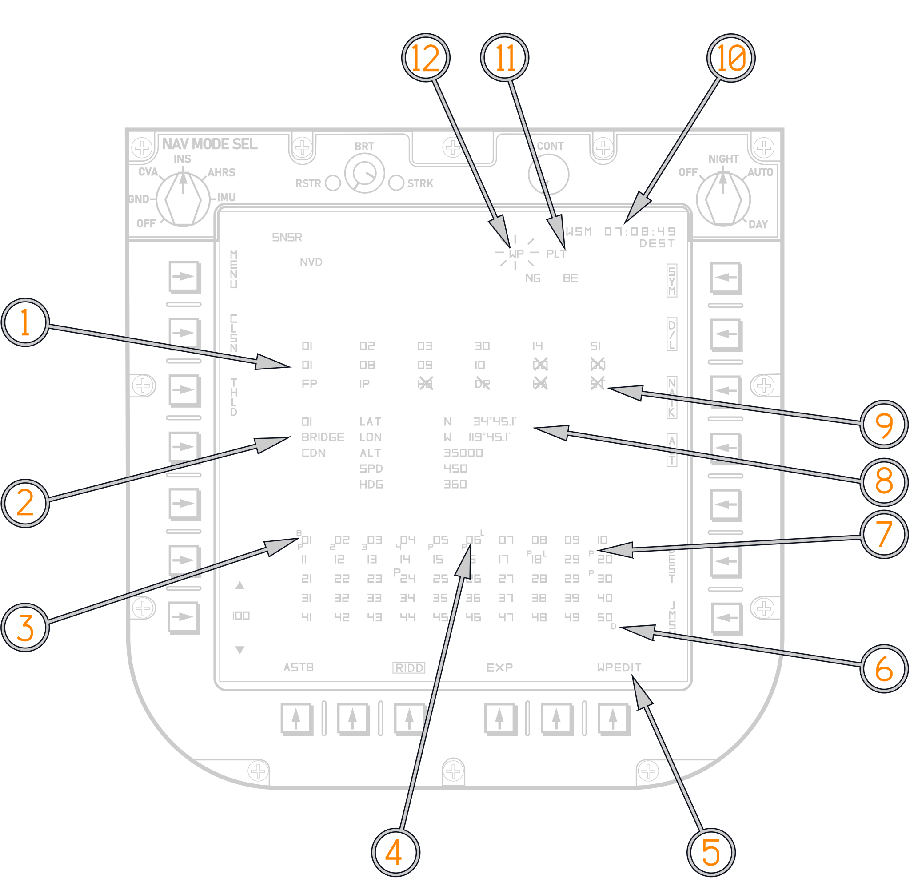

(<num>1</num>) Priority Waypoints are displayed in the upper data blocks.
Special waypoint pseudo files are always displayed but crossed out when no
waypoint is assigned.

(<num>2</num>) Waypoint data from a hooked waypoint, either hooked from lower or
upper data block.

(<num>3</num>) Current Bullseye waypoint. Can be redesignated by hooking desired
waypoint on NVD page and pressing TID offset. Or through the CAP

(<num>4</num>) Lantirn Waypoint designated by an L posted above.

(<num>5</num>) Opens WP Edit Page on CDNU for currently hooked waypoint.

(<num>6</num>) Current DEST Steering waypoint.

(<num>7</num>) Generic Priority waypoint.

(<num>8</num>) L/L displayed in coordinate format chosen on CDNU
[CDNU RNAV Page](../nav_com/cdnu/control_display_navigation_unit.md#rnav-inav-page).

(<num>9</num>) Empty waypoint files are crossed out.

(<num>10</num>) Zulu Time.

(<num>11</num>) PLT acronym is now dimmed. To enter NVD PLT page again hook the
PLT acronym with the HCU cursor.

(<num>12</num>) WP acronym is now bright, indicating NVD WP page is being
displayed.

## Bullseye

The Bullseye Grid provides F-14 aircrews with a means to quickly and accurately
locate the position of airborne or ground targets based on position data from a
fixed geographical point. The Bullseye mode provides a digital readout of range
and bearing from a designated pseudo file (Bullseye Reference Point) to any
hooked symbol, an active PTID cursor, or PTID cursor spot hook. Bullseye Grid is
selected by the RIO and displayed using any of the three PTID tactical display
formats.

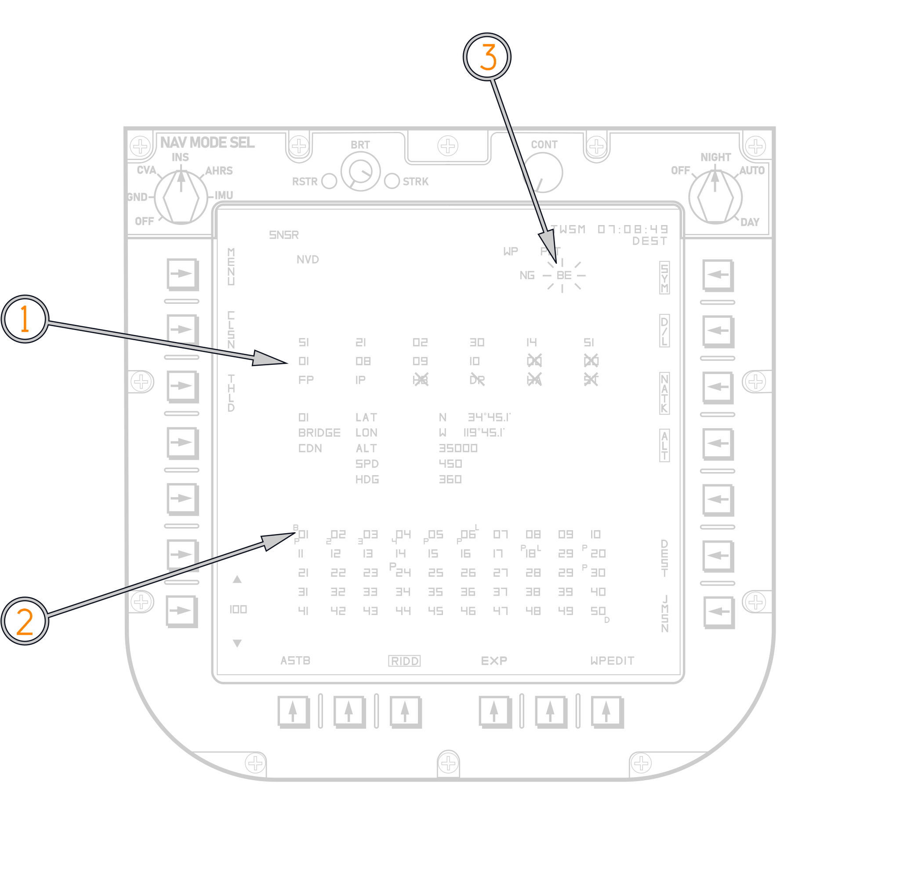

(<num>1</num>) Hooking any waypoint on either TAC Page, NVD Plt Page or NVD WP
page will let that waypoint be designated as bullseye.

(<num>2</num>) Current Bullseye waypoint. Can be redesignated by hooking desired
waypoint on NVD page and pressing TID offset. Or through the CAP

(<num>3</num>) BE Acronym on NVD PLT or NVD WP page is highlighted.

Bullseye Grid is displayed in the tactical and menu page and in all range scales
with the PTID in GSTAB, ASTAB or ATTK. It consists of data readouts for range
and bearing from the Bullseye Reference Point to own aircraft and to a hooked
symbol, an active PTID cursor, or PTID cursor spot hook, and designated BE
waypoint number. The Bullseye display is available during air-to-air and
air-to-ground.

When the Bullseye Grid mode is active, the "BE" acronym on the PTID full menu is
brightened. The Bullseye Grid displays consist of bearing and range readouts
which are displayed in the upper right submenu area of the PTID. The bearing
display is located to the left of the range readout and consists of a
three-digit readout ranging from 001 to 360° accompanied by a dimmed degree
symbol. The range display is a three-digit readout from 000 to 999 nm. If there
is no active cursor, spot hook, or hooked symbol, dashes will be displayed for
the target bearing and range readouts.

Immediately below the bearing and range readout the alphanumeric identifier for
the Bullseye Reference Point is posted. The Bullseye Reference Point is selected
from the NVD WP or PLT page.

The system permits re-designation of the Bullseye reference point on the NVD WP
or PLT page, or TAC page via the TID offset function. From NVD WP or PLT page,
the RIO hooks the desired point (using lower list of waypoints), and then
selects the TID Offset button on the HCU. A ‘B’ character appears adjacent to
the waypoint ID to indicate the Bullseye selection. Bullseye re-designation
using the TID Offset button will not work if NG is selected instead of BE on the
NVD WP or PLT page. The CAP BE REDESIG function (D/L #4) can also be used
instead of the TID Offset button.

### Bullseye Grid Entry

The weapon system automatically enables Bullseye Grid on power−up and major mode
transitions. It will select the designated waypoint as the reference point. If
no waypoint is designated as the Bullseye reference point, the system will
select the first waypoint in the flight plan as the default Bullseye.

If Bullseye Grid is deselected, it may be reselected using the following
procedure:

1. On the PTID full menu, select NVD to transition to the Navigation Data Plot
   Line page.

2. On the NVD PLT page, cursor hook the "BE" acronym.

3. The "BE" acronym will brighten if an active pseudo file has been selected as
   the Bullseye Reference Point. If BE does not brighten, designate a BE on the
   NVD PLT or WP page, using the TID offset button.

4. Once the "BE" acronym is brightened on the NVD PLT page, select MENU on the
   NVD PLT page to return to the PTID full menu.

5. On the PTID full menu, verify BE selected.

### Bullseye Grid Mode Exit

Bullseye Grid can be exited by any of the following actions:

1. With the Bullseye Grid Mode active, select MENU. On the PTID full menu,
   deselect BE. The Bullseye Grid Mode can be restored by re-selecting BE on the
   PTID full menu. Note The "north spike" will remain with the Bullseye
   Reference Point until "BE" is de-selected from an NVD page.

## Nav Grid

Navigation command and control grid (NAV GRID) enhances fleet air defense by
providing navigation and command/control information during combat air patrol
operations and for fleet defense of a specific fixed position. NAV GRID has two
major advantages: it provides aircraft position relative to a geographic
reference point (YY) common to all fleet defense units and eliminates dependence
on navigation aids such as tacan during anti-air warfare operations. F-14 combat
air patrols using NAV GRID can report target contacts using grid coordinates or
range and bearing relative to YY in addition to normal reports referenced to own
aircraft position. NAV GRID is selected by the RIO and displayed on the tactical
information display.

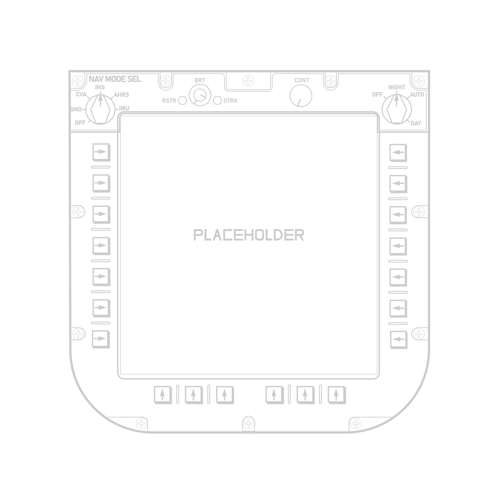

## All Weather Landing (AWL) Page

AOA, VV, ILS, and ACLS are displayed on the PTID when AWL is hooked on PTID
menu.

By hooking the +ACL acronym on the PTID, the ACLS display replaces the ILS and
the ACL is highlighted. If the ACLS data becomes invalid, the azimuth and
elevation needles are not displayed. When a waveoff signal is received, a
waveoff "X" appears and the azimuth and elevation needles are cleared. If no
ACLS or ICLS data is received for more than 2 seconds, a TILT acronym appears on
the PTID.

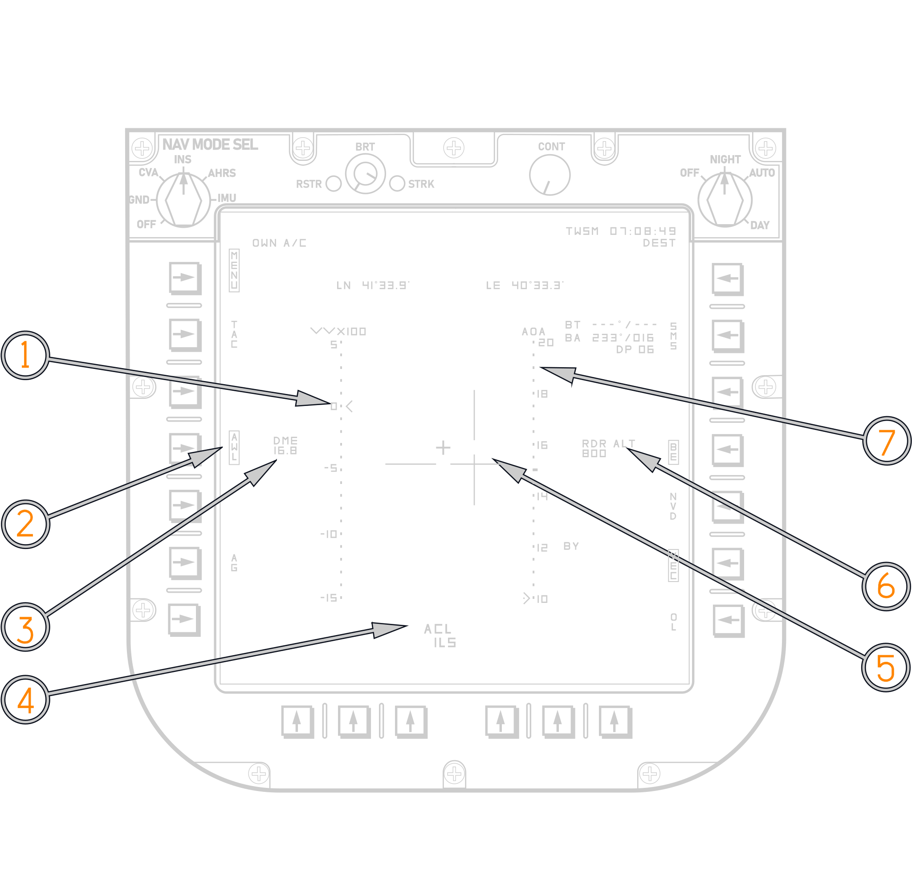

(<num>1</num>) VV Caret and Vertical Velocity in hundreds of feet per minute.

(<num>2</num>) AWL Page is boxed. Note as AWL is a Magnetic Tape function,
loading AWL will unload the AG Magnetic Tapes. Reference the
[Magnetic Tape Section](../../weapons/overview.md#magnetic-tape-load) for a
detailed discussion.

(<num>3</num>) TACAN Range.

(<num>4</num>) ACLS or ICLS needles are shown depending on which is hooked.

(<num>5</num>) ACLS or ICLS needles.

(<num>6</num>) Radar Altitude.

(<num>7</num>) AOA Caret.

## JDAM Mission (JMSN) Page

The PTID JDAM mission page provides the ability for the RIO to update and review
the Pre Planned Missions used for JDAM employment. The Tomcat has the ability to
store up to 8 Pre-Planned Missions per station. These Pre Planned missions
contain Target Data, Launch Data and Terminal Impact Parameters. The Target
coordinates of any pre planned mission can also be edited during flight via the
CDNU.

For a detailed explanation of JDAM Targeting in either a Pre-Planned or a Target
of Opportunity format, refer to the Weapons chapter of this manual.

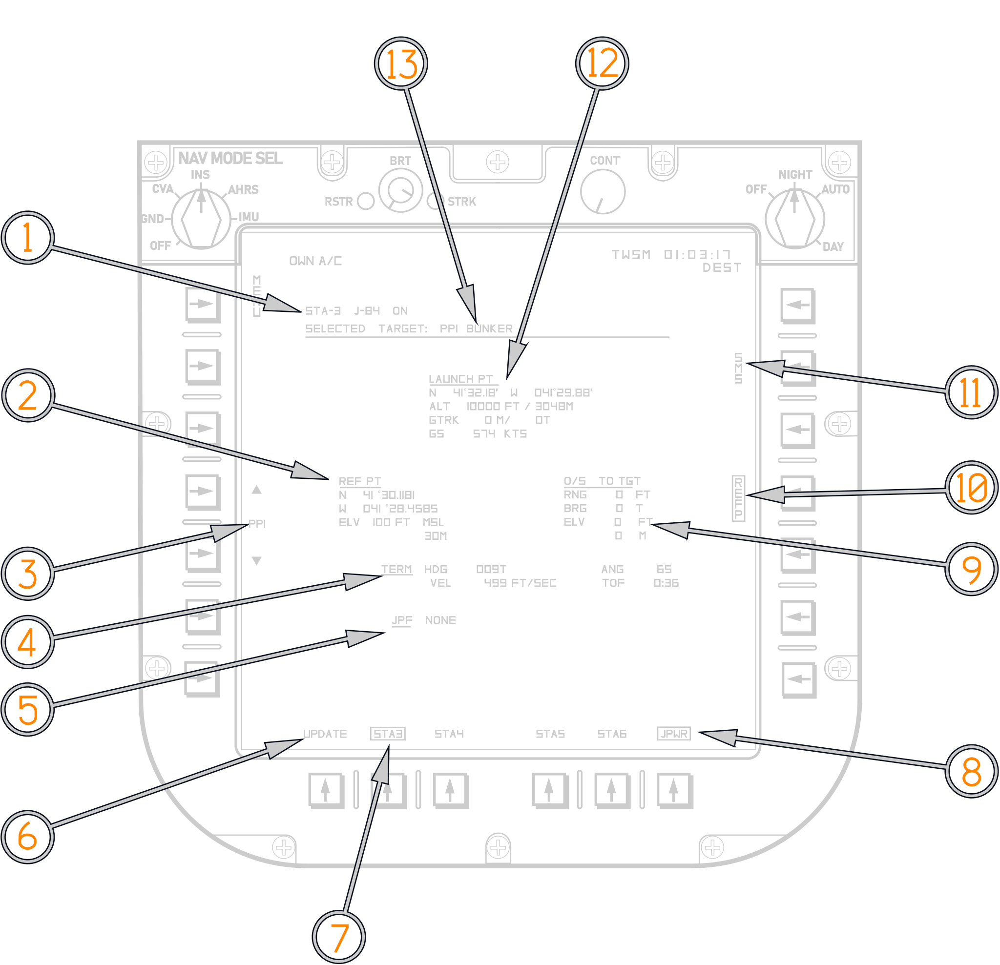

(<num>1</num>) Selected Station, Loaded Weapon and Loaded Weapon status.

(<num>2</num>) Reference Point (Target) Coordinates and Elevation

(<num>3</num>) Toggles through Pre Planned Missions (PP)

(<num>4</num>) Terminal heading and Velocity of JDAM. Can only be pre planned in
Mission Editor.

(<num>5</num>) Joint Precision Fuze. (No Function currently)

(<num>6</num>) After loading DTM (Data Transfer Module) or if Coordinates are
changed in flight JDAM needs to be updated via usage of the UPDATE button.

(<num>7</num>) Selected Station (STA) is boxed.

(<num>8</num>) JDAM Power. Boxed if powered on. Once powered on an 8 minute
timer will appear, that counts down to 5 at which point it disappears.

(<num>9</num>) Offset To Target (No Function)

(<num>10</num>) Reference Point (Target) edit is selected (Boxed). (No
Function).

(<num>11</num>) Returns to SMS Page.

(<num>12</num>) Launch Point coordinates and Altitude. Cannot be edited in
flight. Must be pre planned via Mission Editor.

(<num>13</num>) Currently selected Pre Planned Mission (PP1) and name set in
Mission Editor.

## Stores Management Page (SMS) Page

The Stores Management Page is a dedicated PTID display to advise the aircrew of
the currently loaded stores status. It also provides the RIO with the ability to
switch the Gun Rate between High (HI) and Low (LO).

HI - Selects 6,000 rounds per minute. Normally used for air-to-air operation.

LO - Selects 4,000 rounds per minute. Normally used for air-to-ground operation.

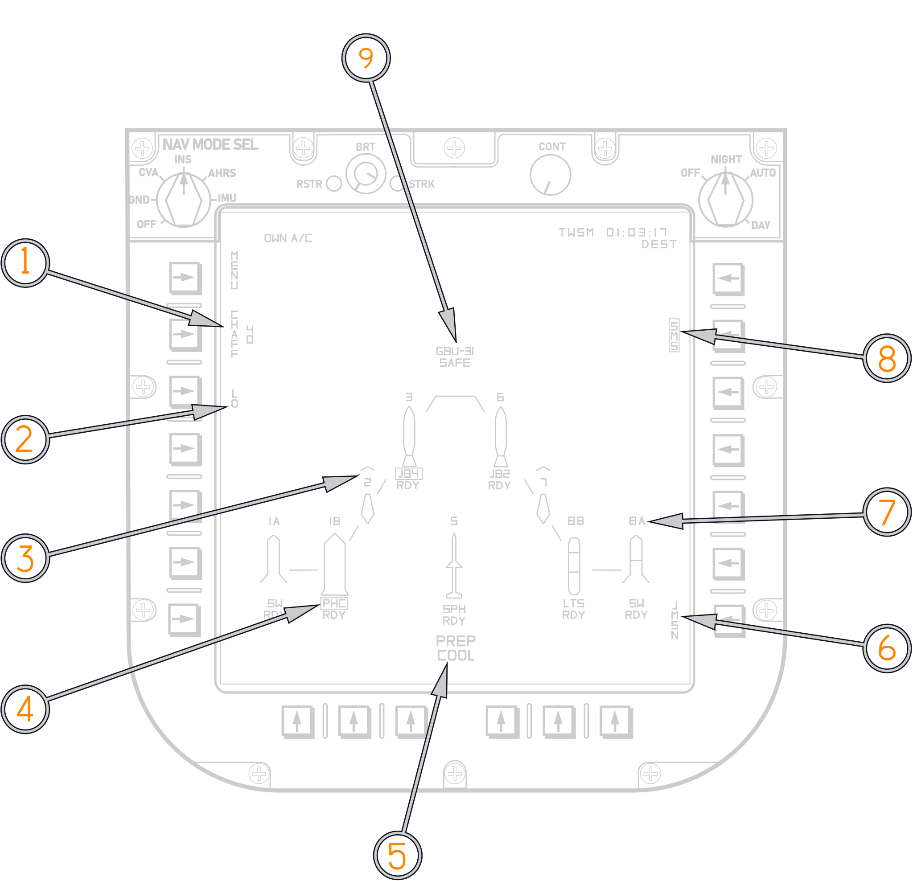

(<num>1</num>) Chaff loaded in ALE-47 or LAU-138.

(<num>2</num>) Gun Rate (HI/LO).

(<num>3</num>) Fuel Tank selected for jettison indicated with "roof".

(<num>4</num>) Selected Station is Boxed. Station Status (RDY) indicated below.

(<num>5</num>) Missile Prep and Missile Cool selected on VDIGR bezel indicated.

(<num>6</num>) Switches to JMSN page.

(<num>7</num>) Station number indicated above weapon.

(<num>8</num>) SMS page Boxed. Unboxing will return to TAC page.

(<num>9</num>) Selected Weapon Type on Armaments Control Panel (ACP). And Master
Arm Status. (SAFE/ARM/TNG).

## PTID Steering

Two basic types of steering are provided: navigation and attack.

The F−14B provides the capability of selecting any of the waypoints in a flight
plan as the CDNU Fly−To ("hot dog") point and/or the DEST Steering waypoint. The
RIO may also select steering to a GGW target or Launch Point (LP). Fly−To
steering is selected by choosing one of the EGI options (AUTO, MAN, OFLY, or
CDNU) using the PTID Steering Select rotary pushbutton (PB 9).

The rotary also provides for selection of DEST, LP, or TGT. These choices are
discussed in subsequent paragraphs. EGI, DEST, LP, or TGT steering may be
presented on the HUD and ECMD, but only TACAN and EGI steering are available on
the BDHI.

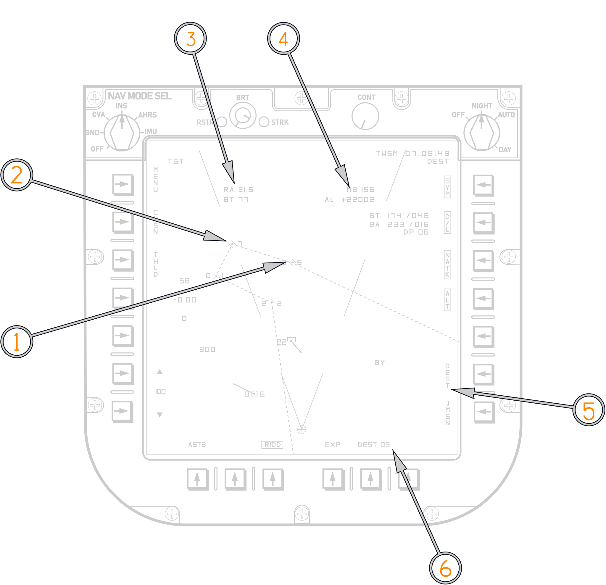

(<num>1</num>) Destination Waypoint (05).

(<num>2</num>) EGI Fly-To Waypoint (Hot-Dog) (07).

(<num>3</num>) Range to waypoint when hooked on PTID or NVD pages.

(<num>4</num>) Magnetic Bearing to waypoint when hooked on PTID or NVD pages.

(<num>5</num>) Pushbutton 6 is unboxed, steering to Dest Waypoint 5 is active.

(<num>6</num>) Destination is selected on Pushbutton 9. Steering to waypoint 05
is provided.

### PTID Steering Selection

Steering information presented on the HUD and HSD is commanded with the PTID
Steering Select pushbutton (PB9). Repeated depression of the pushbutton provides
the following selections in the order given:

- AUTO/MAN/OFLY/CDNU (EGI Steering − only one of these selections will be
  available depending on what is selected on the CDNU Flight Plan page)

- DEST (Destination Steering)

- LP/TGT (GGW Steering − LP requires CP selection on the ACP, while TGT requires
  selection of Manual on ACP)

The number of the waypoint will be displayed to the right of the PTID selected
steering mode above PB 9 (e.g., DEST 03 or AUTO 07).

If GGW steering is selected, the station number of the next launch weapon will
be displayed. The "Hot−Dog" symbol is displayed on the PTID and indicates the
waypoint to which the CDNU is calculating steering information. If there is no
valid Fly−To point, no waypoint number is displayed above PB 9, and the Hot Dog
is removed from the PTID.

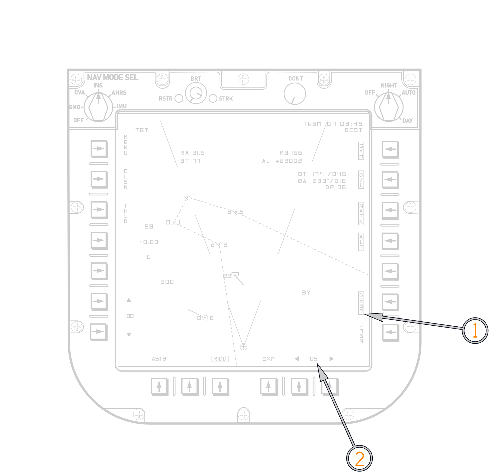

With Pushbutton 6 (<num>1</num>) boxed the Dest rotary on Push Button 8 and 9
(<num>2</num>) becomes available. Once a selection via PB08 and PB09 is made PB
06 has to be unboxed to make the steering displays show the selected. DEST
steering solution.

|                                                                          Steering Selection                                                                          | Option                                                                     |
| :------------------------------------------------------------------------------------------------------------------------------------------------------------------: | -------------------------------------------------------------------------- |
|               AUTO(<num>1</num>) Selected on CDNU. Steering becomes available when selected on PTID, sequencing happens regardless of PTID selection.                |  |
|                        OFLY (<num>2</num>) Steering becomes available when selected on PTID, sequencing happens regardless of PTID selection.                        | 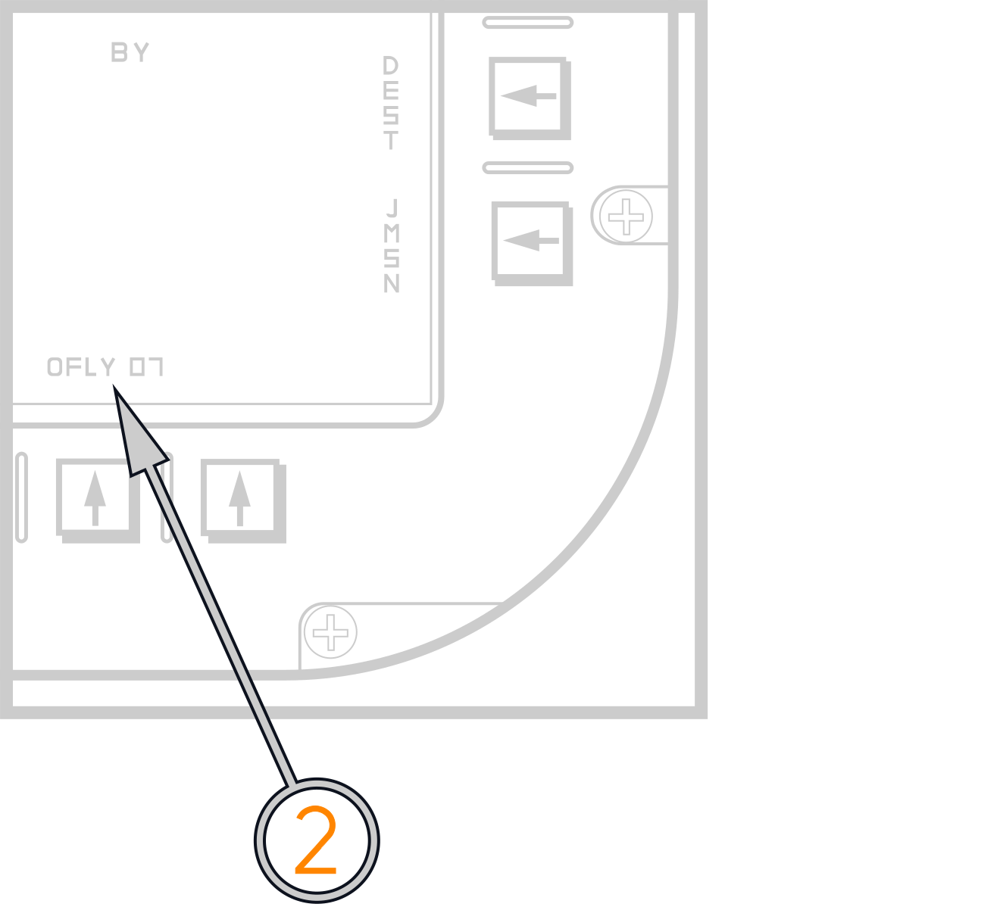 |
|                                      MAN (<num>3</num>) Steering becomes available when selected on PTID, no sequencing occurs.                                      |    |
| TGT (<num>4</num>) Either Launch Point (LP) or Target shown on PTID depending on ACP selection (MAN or PLT). Next Launch GGW Station is shown (Currently Station 3). |    |
| LP (<num>5</num>) Either Launch Point (LP) or Target shown on PTID depending on ACP selection (PLT or MAN). Next Launch GGW Station is shown (Currently Station 3).  |      |
