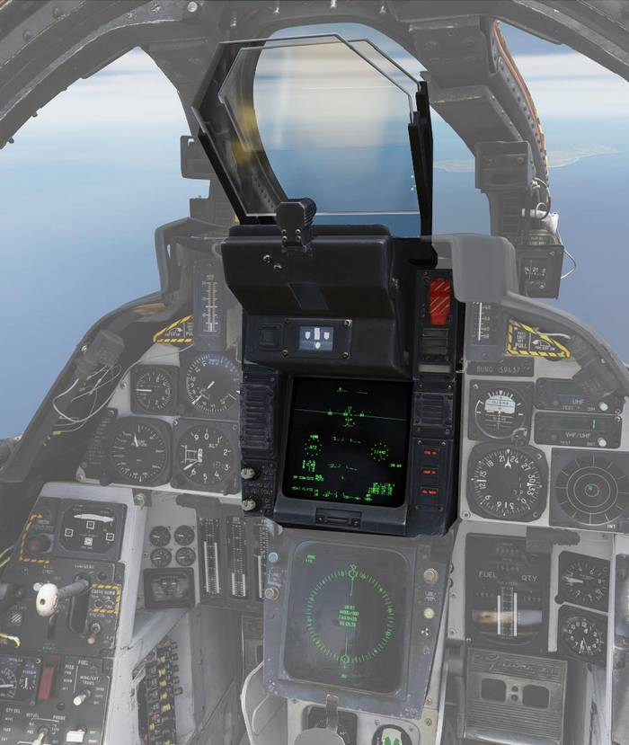

# Vertical Display Indicator Group Replacement

| Section | Name                                                                                     |
| :-----: | ---------------------------------------------------------------------------------------- |
|   1.    | [Takeoff](../vdig_r/vertical_display_indicator_group_replacement.md#takeoff)             |
|   2.    | [Cruise](../vdig_r/vertical_display_indicator_group_replacement.md#cruise)               |
|   3.    | [Air-To-Air](../vdig_r/vertical_display_indicator_group_replacement.md#air-to-air)       |
|   4.    | [Air-To-Ground](../vdig_r/vertical_display_indicator_group_replacement.md#air-to-ground) |
|   5.    | [Landing](../vdig_r/vertical_display_indicator_group_replacement.md#landing)             |
|   6.    | [AWL](../vdig_r/vertical_display_indicator_group_replacement.md#landing)                 |
