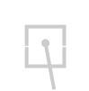
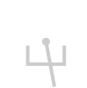
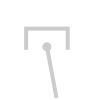
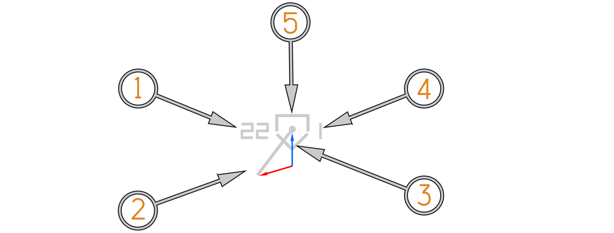
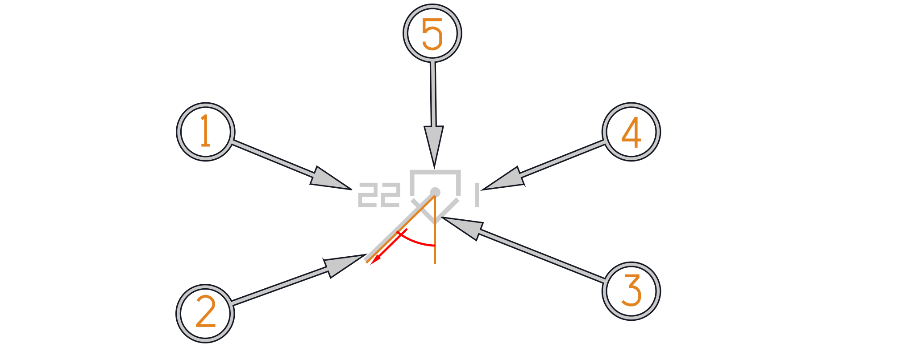
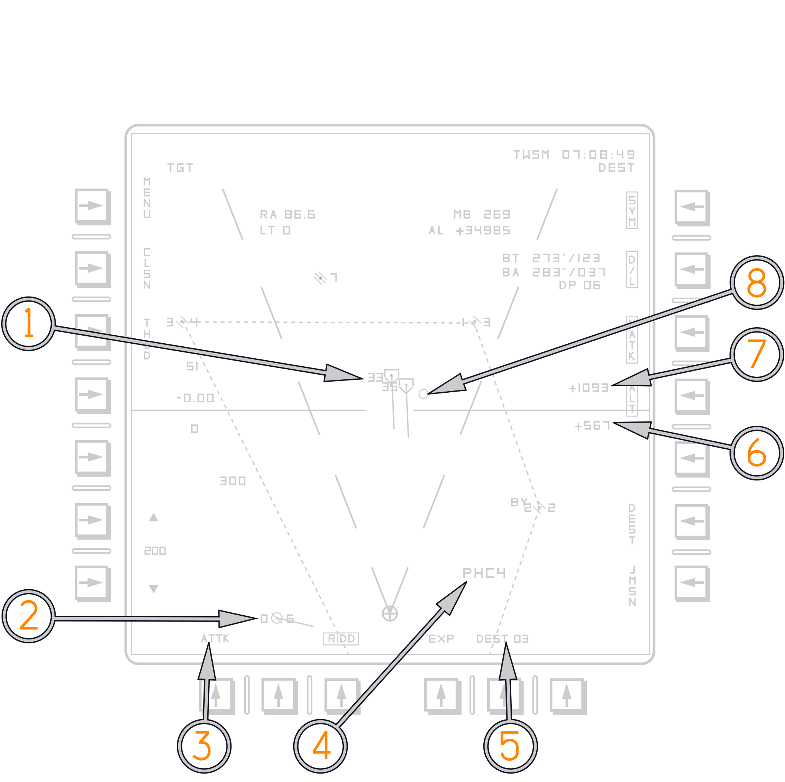
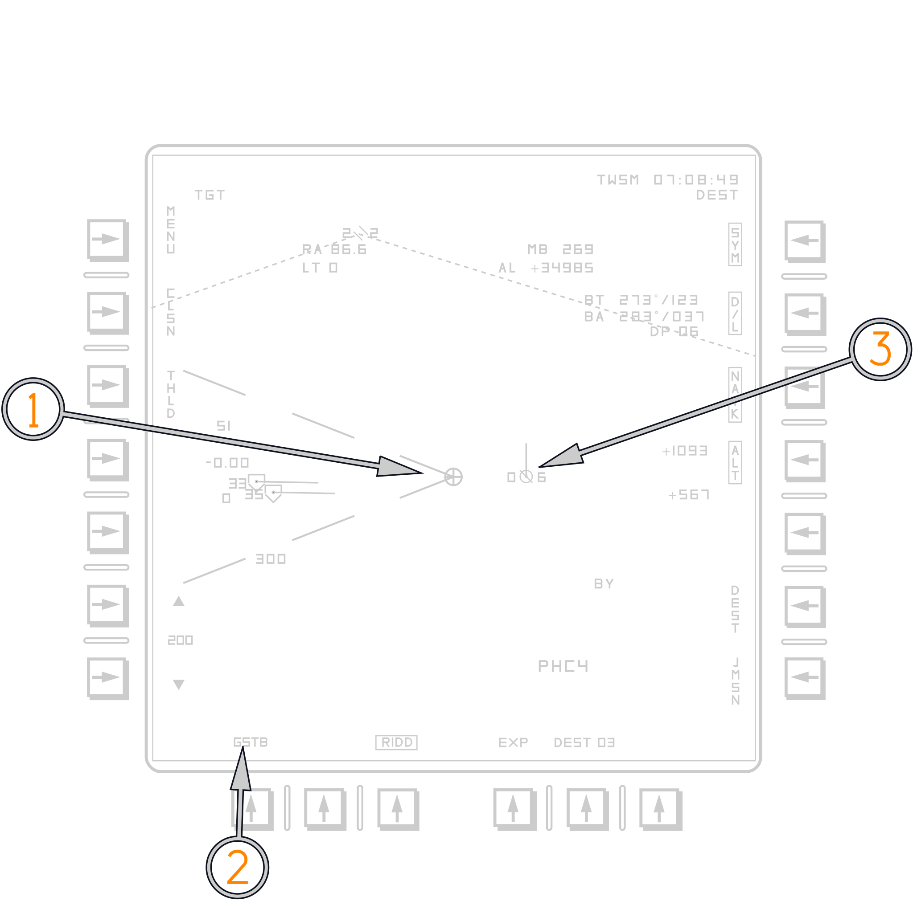
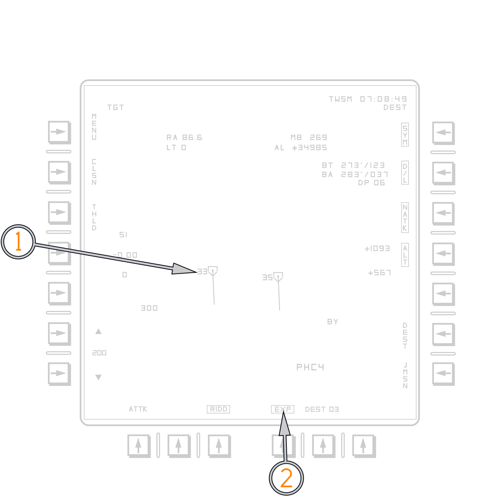

# Programmable Tactical Information Display

## Buffer Readouts

The PTID buffer readouts provide information for any hooked pseudo-file. With
A/A TWS or STT Tracks the Buffer reads out Range and Target Aspect (LT/RT) on
the left and Magnetic Bearing and Altitude on the right. With waypoint
pseudo-files the buffer only reads out bearing and range to the waypoint. The
CAP can be used to access more readouts depending on the RIO selection. JDAM
Launch Points and JDAM Targets read out Range and Time to Go when hooked.

## HAFU

HAFU Symbology (Hostile, Ambiguous, Friendly, or Unknown). F-14B(U) uses the
same HAFU symbology as other contemporary fighters.

Top Half: The top half of the symbol indicates identification from your onboard
sensors

Bottom Half: The bottom half of the symbol indicates the identification by
offboard sensors (donors)

Vector: A line leading from the HAFU indicates two different things depending on
the selection of ground stab or aircraft/attack stab

Shape: The top and bottom elements of the HAFU can have three shapes:

- Hemisphere: Friendly
- Bracket: Unknown/Bogey
- Caret: Hostile/Bandit

| Meaning              | Combined                                                           | Datalink                                                        | Radar                                                        |
| -------------------- | ------------------------------------------------------------------ | --------------------------------------------------------------- | ------------------------------------------------------------ |
| Bandit/Hostile (ROE) |     |     |     |
| Bogey/Unknown        |      |    |    |
| Friendly             |  |  |  |

## Target Aspect

In the Tomcat TA is displayed as a readout on the top left of the PTID. Either
as LT or RT for left or right of nose. Alternatively target aspect is displayed
in GND Stab mode. In ATTK or A/C STAB the PTID presents a vector that accounts
not only for bandit heading and speed but also for own heading and speed.

### Track Files in Aircraft or Attack Stabilized mode

(<num>1</num>) Target Altitude in thousands of feet.

(<num>2</num>) Own Ship / Bandit Heading Vector. (Blue arrow: Ownship vector.
Red arrow: track vector).

(<num>3</num>) Hostile/Bandit Datalink Track.

(<num>4</num>) Firing Order Number (FONO). (Displayed with AIM-54 selected
only).

(<num>5</num>) Unknown/Bogey Radar Track.

### Track Files in Ground Stabilized mode

(<num>1</num>) Target Altitude in thousands of feet.

(<num>2</num>) Target Aspect Angle.

(<num>3</num>) Hostile/Bandit Datalink Track.

(<num>4</num>) Firing Order Number (FONO). (Displayed with AIM-54 selected
only).

(<num>5</num>) Unknown/Bogey Radar Track.

## PTID Attack Stab

(<num>1</num>) Hooked Track files are highlighted.

(<num>2</num>) Bullseye waypoint is designated by a "North Spike" emanating from
it pointing towards true north. In this case the Defence Point (DP) has been
designated as bullseye.

(<num>3</num>) Attack Stabilized Mode is selected via PTID Pushbutton 13.
Depressing the Pushbutton toggles to a different mode.

(<num>4</num>) Currently selected weapon (AIM-54C) and quantity (4).

(<num>5</num>) Destination Steering (DEST) to waypoint 3 is is selected.

(<num>6</num>) Target Radial Velocity (Vr). Vr: Target velocity component along
LOS to F−14. Preceded by a minus sign when opening.

(<num>7</num>) Target Closure (Vc). Preceded by a minus sign when opening.

(<num>8</num>) PTID Cursor, actuated with HCU half action. Bullseye is always
referenced to: 1. Hooked Pseudo-file, or 2. Cursor Location, when half action is
actuated.

## PTID Ground Stab

(<num>1</num>) Own A/C symbol is placed in center of PTID screen. PTID display
is now always referenced towards true north.

(<num>2</num>) Ground Stabilized Mode is selected via PTID Pushbutton 13.
Depressing the Pushbutton toggles to a different mode.

(<num>3</num>) Bullseye waypoint North Spike is pointing true north.

## Expand Mode

(<num>1</num>) In PTID Expand mode, the TID "zooms" in on a hooked pseudo-file
or hooked location, allowing for better visual breakout of waypoints or TWS
tracks. Expand mode does not change any radar operation.

(<num>2</num>) Expand mode (EXP) is selected (boxed).

## PTID Bullseye Readouts

For a detailed discussion on PTID Bullseye refer to the
[Bullseye section](../../systems/ptid/programmable_tactical_information_display.md#bullseye)
in the PTID chapter.

## AWG-9 Radar

For a detailed discussion on the AWG-9 Radar refer to the
[AWG-9 section](../../../f14ab/systems/radar/overview.md) in the F-14A/B manual.
