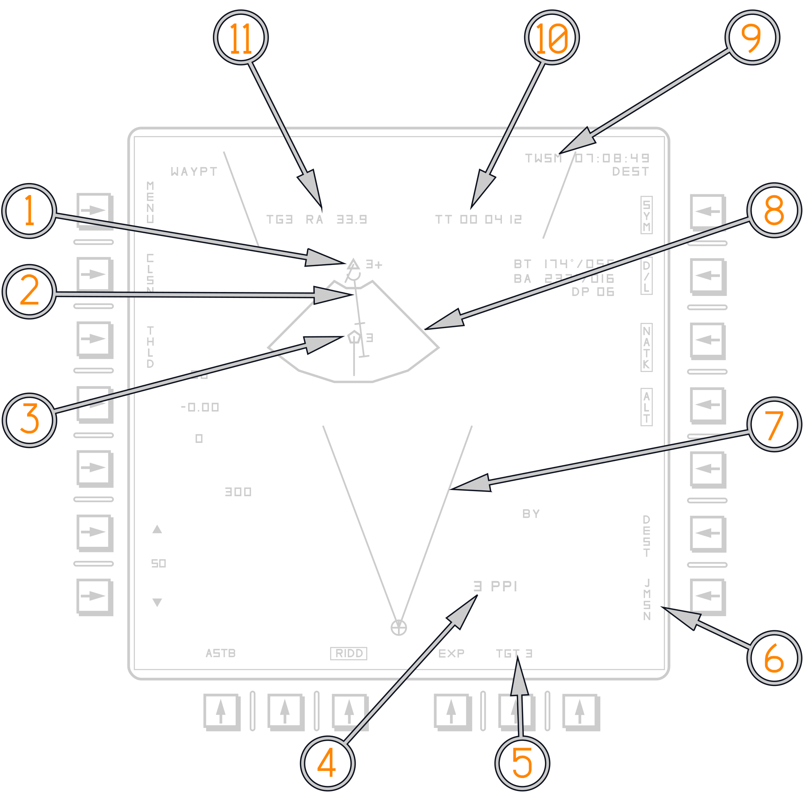
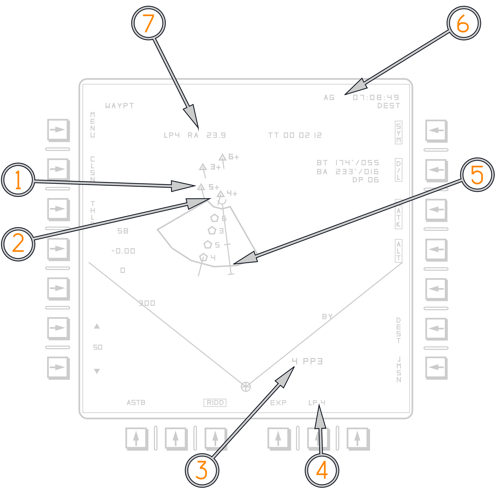
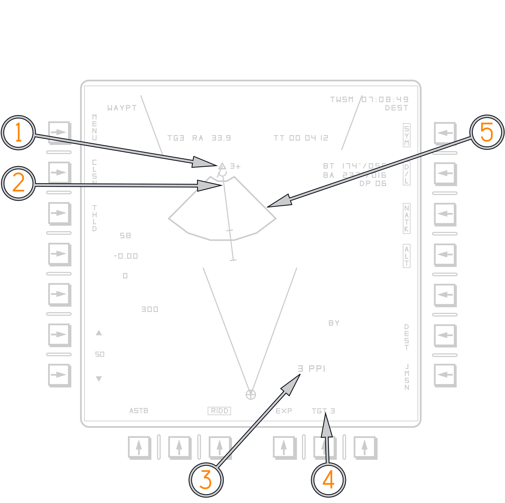
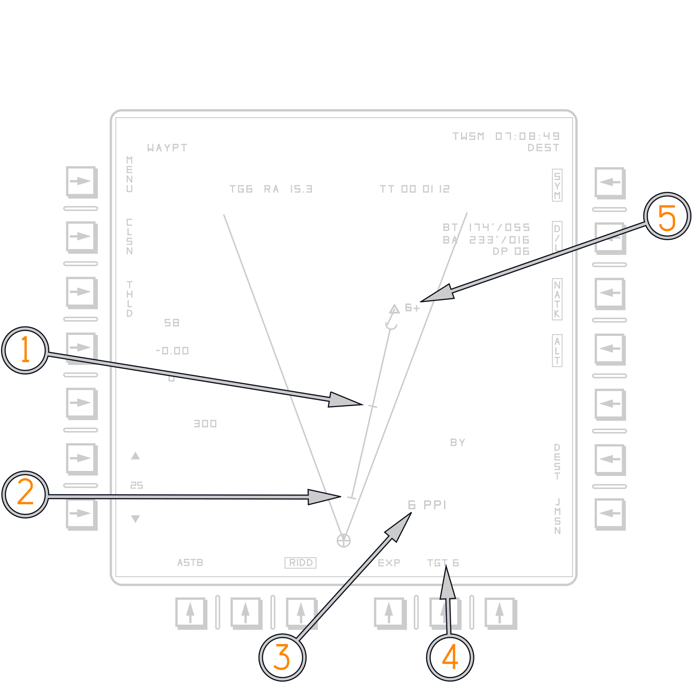
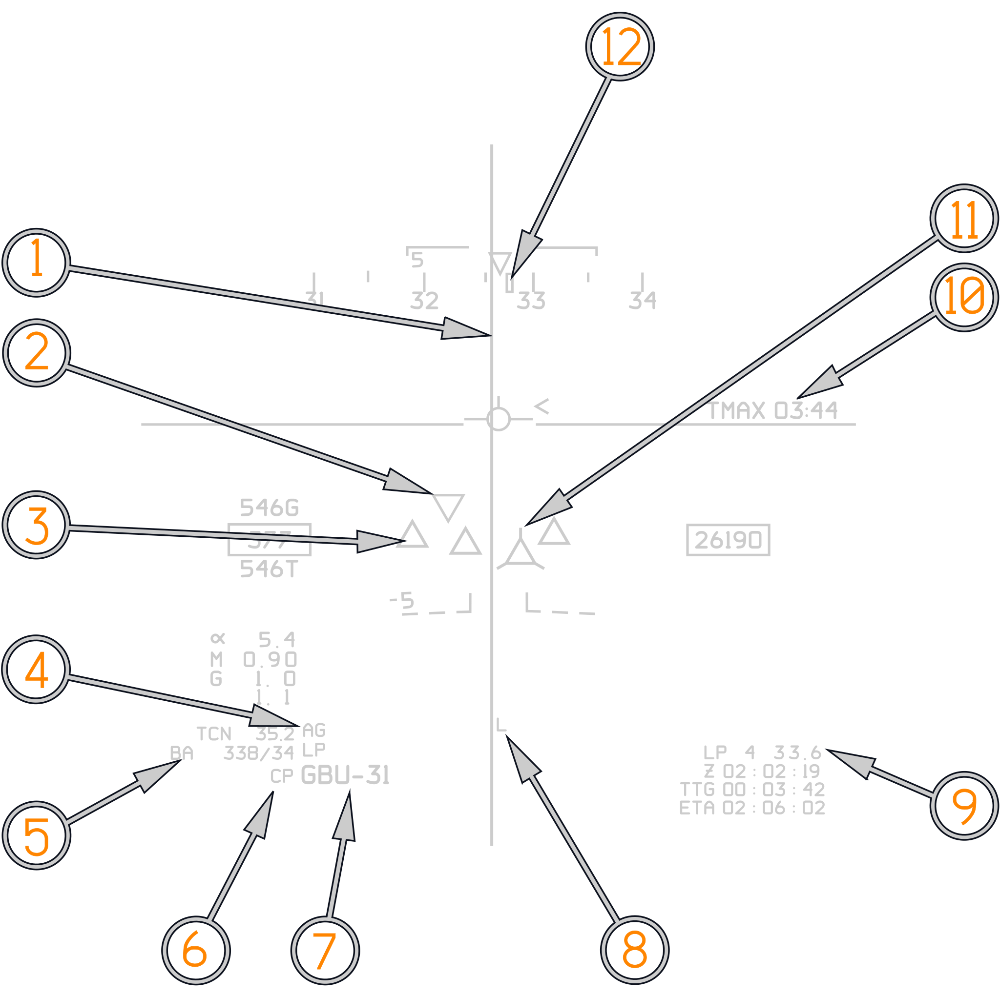
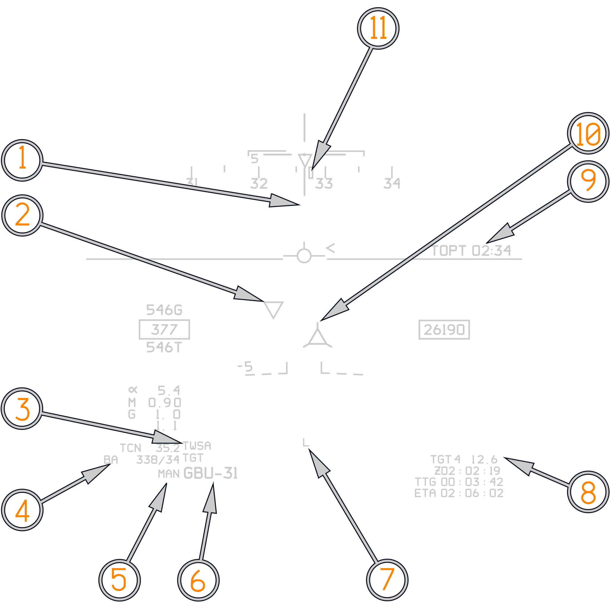
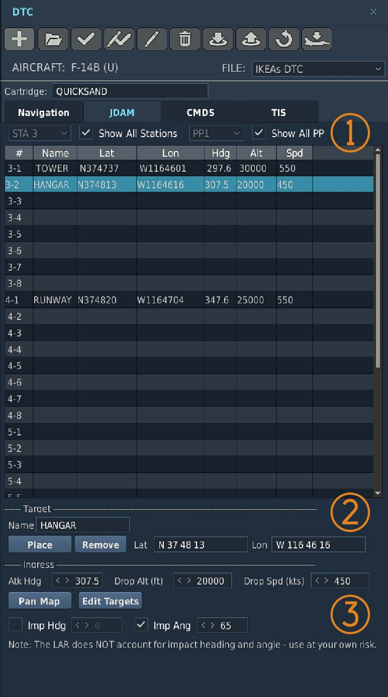
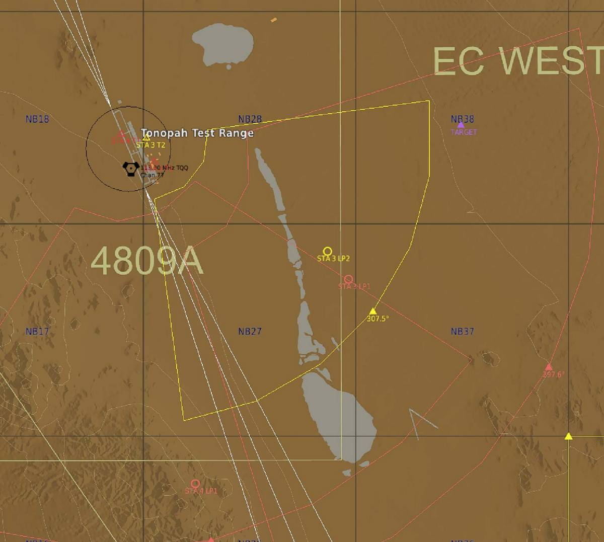

# GPS Guided Weapons Employment

GPS Guided Weapons (GGW) can be employed in two ways in the F-14B(U). Either
weapons employment can be pre-planned and programmed via the MDL, or Targets of
Opportunity can be programmed into the GGWs in flight.

Unlike other contemporary fighters, the F-14B(U) does not have a dedicated TOO
mode, but weapons employment on Targets of Opportunity is just as possible.

Associated equipment for GGW targeting and employment are the: Programmable
Tactical Information Display (PTID), the Control Display Navigation Unit (CDNU),
the Armament Control Panel (ACP) for the RIO, and the Vertical Display Indicator
Group Replacement (VDIGR), Horizontal Situation Display (HSD), and the Bearing
Distance Heading Indicator (BDHI) for the Pilot.

## Pre-Planned Missions

The F-14B(U)'s Mission Data Processor (MDP) can store up to 8 Pre-Planned
Missions per station. These Pre-Planned Missions include data for the Target
(REFP), terminal attack parameters for the weapon to meet, Launch Acceptability
Region data, and Pre-Planned Launch Point coordinates.

## ACP Attack Mode Steering Options

The F-14B(U)'s Weapons Control Processor can provide two types of attack
steering: Launch Point and Target Steering. The steering options are selected
via the Armament Control Panel (ACP). Target Steering is presented when Manual
Mode is selected on the ACP Delivery Mode rotary. Launch Point steering is
presented when CPTR Pilot is selected on the Delivery Mode rotary.

In Manual mode, the HUD "Time to" (TMAX, TOPT, TMIN) displays are referenced to
the ROPT release strobe. The first tick mark indicates MAX range of the GGW. The
second tick mark indicates OPT range of the GGW. The final half-circle indicates
MIN range of the GGW.

In Computer Pilot mode, the HUD "Time to" (TMAX, TREL, TMIN) displays are
referenced to the LAR boundary and Launch Point. TMAX indicates time until the
LAR boundary, TREL indicates time until the Launch Point, and TMIN indicates
time until minimum range of the GGW.

## Pre-Planned Launch Acceptability Region

The Pre-Planned Launch Acceptability Region (PPLAR) cue is developed using the
launch and targeting data entered during mission planning. This static cue is
intended to provide a representation of the selected mission as planned before
flight. PPLARs are saved in each Pre-Planned Target Data Set if that Pre-Planned
Mission has a Target associated with it. Up to 8 Pre-Planned Missions can be
saved per station and reviewed via the JDAM Mission Page (JMSN). LAR data in the
Pre-Planned Missions cannot be changed; however, target coordinates associated
with the Pre-Planned Mission can be reprogrammed in flight, allowing for
flexibility when using the PPLAR cue.

## Pre-Planned Launch Point Cue

The Pre-Planned Launch Point cue is displayed only when a valid launch point for
the GGWs exists. All GGW station launch points are shown on the PTID Tactical
Page at the same time. This static, pentagon-shaped cue indicates the launch
point defined during mission planning. It is intended to provide a reference
with which to steer to the pre-planned release point. The Pre-Planned Launch
Point cue is removed when a Pre-Planned Mission with a previously defined launch
point has its Target Coordinates changed.

## Bearing to Launch Point Cue

The Bearing-to-Launch Point Line cue is displayed only in PP mode when a valid
launch point exists for the next launch GGW. This static cue indicates the
aircraft heading into the pre-planned launch point and is represented by a line
drawn outward from the launch point along the launch heading. It is intended to
provide a simple means to achieve pre-planned release conditions by aligning the
aircraft flight path with the launch point along the launch heading. GGW Launch
Points can be hooked by the RIO on the PTID Tactical Page to provide Range and
Time To Go (TTG) readouts in the PTID Buffer.

## GGW Target Cue

The GGW Target cue indicates the location of the JDAM target relative to the
aircraft for the priority next-launch GGW station. This cue is presented as a
solid triangle when a PP mission is selected. The JDAM Target cue is intended to
provide a graphical means of verifying correct target placement. This cue is
displayed for all selected GPS Guided Weapons. A "+" sign with a number next to
the Target Cue indicates which station the target cue is for. GGW Target cues
can be hooked by the RIO on the PTID Tactical Page to provide Range and Time To
Go (TTG) readouts in the PTID Buffer.

## GGW Terminal Heading Cue

The Terminal Heading cue indicates the selected terminal impact heading oriented
about the GGW target symbol. This straight-line cue is intended to provide a
graphical representation of the terminal heading that the assigned JDAM weapon
will attempt to achieve after launch. The Terminal Heading cue is displayed
whenever the associated GGW Target cue is displayed.

## ROPT Release Strobe

The Range Optimum (ROPT) Release Strobe functions as a Predictive Maximum Range
cue. It represents the theoretical maximum launch range if the aircraft is
heading towards the target. It is intended to provide the best-case absolute
maximum launch range for the existing flight conditions. This dynamic cue
facilitates a quick, direct on-axis targeting solution without taking into
account terminal impact parameters.

The first tick mark indicates MAX range of the GGW. The second tick mark
indicates OPT range of the GGW. The final half-circle indicates MIN range of the
GGW.

## Primary Release Modes

JDAM weapons may be delivered singly or in quantity in either the Manual or
Computer Pilot delivery mode. Timing cues for GGWs reference a level delivery;
the selection of Computer Pilot is primarily intended to provide Launch Point
Steering cues on the VDIG-R. When all GGW-capable stations are selected, the
default release sequence is 4 - 5 - 3 - 6. Ripple and Pairs settings on the ACP
can theoretically be used with JDAM; however, due to fin actuation concerns, it
is most ideal to release JDAMs only in 2-second intervals.

### Single Release

Single JDAM release is achieved by selecting the desired station on the ACP.
Stations 4 - 5 - 3 - 6 are available for JDAM carriage.

### Quantity Release

Quantity releases of JDAMs are possible but not recommended. The
[ACP Setup](../../../../f14ab/stores/air_to_ground/weapon_settings.md) for JDAMs
for a quantity release is identical to any other unguided store.

## Typical PTID Tac Page Cues for JDAM releases

### PTID Tac Page Cues, Single Pre-Planned Target with Launch Point

(<num>1</num>) GGW Target. (Station 3 Weapon)

(<num>2</num>) ROPT Release Strobe.

(<num>3</num>) Station 3 Launch Point.

(<num>4</num>) Selected Station and Pre Planned Mission Selected on that
station.

(<num>5</num>) Target Steering selected (Manual on ACP).

(<num>6</num>) JMSN Page.

(<num>7</num>) AWG-9 Radar Scan limits. In manual on ACP AWG-9 continues to run
A/A tapes.

(<num>8</num>) Pre-Planned LAR.

(<num>9</num>) Current Radar Mode.

(<num>10</num>) TT: Time To Go To Hooked JDAM target.

(<num>11</num>) Hooked JDAM Target.

### PTID Tac Page Cues, Multiple Pre-Planned Targets with multiple Launch Points

(<num>1</num>) GGW Target. (Station 5 Weapon)

(<num>2</num>) Next Launch GGW target (station 4 weapon). The next launch GGW
target is the only one the LAR and ROPT release strobes are displayed for.

(<num>3</num>) Next Launch GGW target (station 4 weapon) and selected
Pre-Planned Mission for that weapon.

(<num>4</num>) Launch Point steering (ACP: computer Pilot) is selected for
station 4.

(<num>5</num>) ROPT release strobe.

(<num>6</num>) Computer Pilot is selected on ACP, AG Tapes are loaded, radar is
in A/G ranging.

(<num>7</num>) Launch Point for Station 4 is hooked. Range and Time To Go for
that launch point are displayed.

### PTID Tac Page Cues, Single Target Of Opportunity without Launch point, with reprogrammed PPLAR

(<num>1</num>) GGW Target. (Station 3 Weapon)

(<num>2</num>) ROPT release strobe.

(<num>3</num>) Next Launch GGW target (station 3 weapon) and selected
Pre-Planned Mission for that weapon.

(<num>4</num>) Target steering (ACP: Manual) is selected for station 3.

(<num>5</num>) Pre-Planned LAR without Launch Point. (Mission was programmed
with new coordinates).

### PTID Tac Page Cues, Single Target Of Opportunity without launch point, without PPLAR

(<num>1</num>) ROPT release strobe. Second tick mark: Optimum Range.

(<num>2</num>) ROPT release strobe. First tick mark: MAX Range.

(<num>3</num>) Next Launch GGW target (station 6 weapon) and selected
Pre-Planned Mission for that weapon.

(<num>4</num>) Target steering (ACP: Manual) is selected for station 6.

(<num>5</num>) Station 6 Target.

## Typical VDIG-R A/G Cues for JDAM releases

### VDIG-R A/G Cues, Multiple Pre Planned Targets, Launch Point Steering

(<num>1</num>) Bomb fall line. (BFL).

(<num>2</num>) LANTIRN Triangle. Showing LANTIRN LOS.

(<num>3</num>) GGW Triangle. All Programmed GGW targets are shown as Triangles
in the HUD.

(<num>4</num>) Current Radar Mode. "AG" indicates Air To Ground tapes are loaded
and the radar is in A/G ranging mode.

(<num>5</num>) Bullseye to Own Aircraft.

(<num>6</num>) Attack mode selected on ACP. CP denotes Computer Pilot is
selected.

(<num>7</num>) Weapon Selected on ACP weapons wheel. (GBU-31).

(<num>8</num>) "L" Denotes LANTIRN Laser is armed.

(<num>9</num>) Launch Point for selected station and distance to launch point
are shown.

(<num>10</num>) TMAX indicates time to LAR boundary.

(<num>11</num>) Hooked GGW Triangle is shown on HUD. Denoted by "Whiskers".

(<num>12</num>) Command Heading to GGW Launch point.

### VDIG-R A/G Cues, Target Steering

(<num>1</num>) Bomb Reticle (Shown in Manual Mode).

(<num>2</num>) LANTIRN Triangle. Showing LANTIRN LOS.

(<num>3</num>) Current Radar Mode. In Manual AWG-9 uses normal A/A radar modes.
(TWSA).

(<num>4</num>) Bullseye to Own Aircraft.

(<num>5</num>) Attack mode selected on ACP. MAN denotes Manual is selected.

(<num>6</num>) Weapon Selected on ACP weapons wheel. (GBU-31).

(<num>7</num>) "L" Denotes LANTIRN Laser is armed.

(<num>8</num>) Selected Station Target and Distance to target is shown.

(<num>9</num>) TOPT indicates time to Optimum Launch Parameters. Before TOPT
TMAX is displayed. TMAX references the ROPT release strobe MAX range tick mark.
After TOPT, TMIN is displayed. TMIN references the ROPT release strobe MIN range
tick mark.

(<num>10</num>) Hooked GGW Triangle is shown on HUD. Denoted by "Whiskers".

(<num>11</num>) Command Heading to GGW Target.

## JDAM Mission Page (JMSN)

The PTID JDAM mission page provides the ability for the RIO to update and review
the Pre Planned Missions used for JDAM employment. The Tomcat has the ability to
store up to 8 Pre-Planned Missions per station. These Pre Planned missions
contain Target Data, Launch Data and Terminal Impact Parameters. The Target
coordinates of any pre planned mission can also be edited during flight via the
CDNU.

(<num>1</num>) Selected Station, Loaded Weapon and Loaded Weapon status.

(<num>2</num>) Reference Point (Target) Coordinates and Elevation

(<num>3</num>) Toggles through Pre Planned Missions (PP)

(<num>4</num>) Terminal heading and Velocity of JDAM. Can only be pre planned in
Mission Editor.

(<num>5</num>) Joint Precision Fuze. (No Function currently)

(<num>6</num>) After loading DTM (Data Transfer Module) or if Coordinates are
changed in flight JDAM needs to be updated via usage of the UPDATE button.

(<num>7</num>) Selected Station (STA) is boxed.

(<num>8</num>) JDAM Power. Boxed if powered on. Once powered on an 8 minute
timer will appear, that counts down to 5 at which point it disappears.

(<num>9</num>) Offset To Target (No Function)

(<num>10</num>) Reference Point (Target) edit is selected (Boxed). (No
Function).

(<num>11</num>) Returns to SMS Page.

(<num>12</num>) Launch Point coordinates and Altitude. Cannot be edited in
flight. Must be pre planned via Mission Editor.

(<num>13</num>) Currently selected Pre Planned Mission (PP1) and name set in
Mission Editor.

## Pre-Planned JDAM Employment

JDAM mission planning is achieved via the DCS Mission Editor. The F-14B Upgrade
comes equipped with a Mission Data Loader system. This allows for the creation
and distribution of custom DTMs (Data Transfer Modules). For each GGW-capable
station, mission planners can pre-program up to 8 Pre-Planned Missions. A
pre-programmed Pre-Planned Mission always includes a LAR and Terminal Impact
Parameters for the GGW. Due to DCS limitations, the Terminal Impact Parameters
cannot be properly accounted for in the calculation of the Pre-Planned LAR.

(<num>1</num>) With "Show all stations" and "Show all PP" the list below shows
all 8 pre planned missions for each station. So 3-1 is pre planned mission 1 for
station 3. Un-ticking either will show only pre planned missions for the
selected station, or show only the selected pre planned mission for each
station.

(<num>2</num>) Once a target point has been placed on the map or its coordinates
entered manually, a target name can be specified. This target name is displayed
on the JMSN page on PTID.

(<num>3</num>) The Launch and Terminal Parameters for each pre planned mission
can be defined. Attack heading, launch altitude and launch speed (in ground
speed) are stored in the pre planned missions. Terminal attack parameters are
also stored per pre planned mission. Currently the LAR only accounts for the
default impact angle of 65°.

Once a target has been placed on the map, the attack heading can be modified by
dragging the triangle at the outside of the LAR to its desired location. The
currently selected pre planned mission is highlighted in yellow. All other pre
planned missions are shown in red. The currently selected launch point is
denoted by a circle. This circle can be placed anywhere within the confines of
the LAR. When employing multiple JDAMs in sequence it is recommended to place
the launch points in sequence. The default JDAM release sequence is 4 - 5 -
3 - 6. It is recommended to place the launch points in that order.

## Target Of Opportunity JDAM Employment

Targets of Opportunity may also be engaged with GGWs. In principle, the
reprogramming of Pre-Planned Missions with TOO coordinates is simple.

Any flight plan waypoint stored in the CDNU can have its coordinates copied into
the JMSN page via the
[WP Edit 2/2 page](./../../../systems/nav_com/cdnu/control_display_navigation_unit.md#waypoint-edit-page-22).
The CDNU
[WP Edit 2/2 page](./../../../systems/nav_com/cdnu/control_display_navigation_unit.md#waypoint-edit-page-22)
provides the ability to send any coordinate to the JMSN page by depressing
LSK 7. The coordinates will always be sent to the currently selected Pre-Planned
Mission for the CDNU-selected station.

As such, it is desirable to select the JMSN page before coordinate transfer is
initiated and confirm that the desired Pre-Planned Mission is selected.

Coordinates in the CDNU can be entered multiple ways:

- Either via normal
  [waypoint entry](./../../../systems/nav_com/cdnu/control_display_navigation_unit.md#fpln-page-insert-a-waypoint)
  through the flight plan.
- Through the
  [High Precision Waypoint Edit](./../../../systems/nav_com/cdnu/control_display_navigation_unit.md#high-precision-waypoint-edit-page)
  page.
- Or with the
  [LANTIRN pod](./../../../systems/nav_com/cdnu/control_display_navigation_unit.md#fpln-insert-with-lantirn).

### Step by Step GGW TOO guide

1. A/G Selected on PDCP
2. A/G Hooked on Full PTID menu. (Jester does automatically).
3. Conduct normal ACP weapons setup (Sta Select, Fuze, Weapon Type).
4. Select Manual on ACP ATTACK options. Pilot gets TMAX, TOPT, TMIN timers.
5. LANTIRN Target Designated.
6. Depress S-7 (FOV) Hat on LANTIRN for 2 seconds. Waypoint 51 and up is created
   in flight plan.
7. Select newly created LTS waypoint on CDNU.
8. Horizontal scroll to Waypoint Edit 2/2 Page.
9. Open JMSN page via PTID Tac Page.
10. Select Desired Station and Desired Pre Planned Mission.
11. Confirm Elevation and Coordinates on CDNU depress LSK7 on CDNU (GGW) to
    transfer coordinates to JMSN page.
12. Depress Update on JMSN page to update JDAM.
13. Select Target Steering on PTID (PB9). Or Target Steering on BDHI (F4) key on
    CDNU.

## Pre-Planned JDAM tutorial by Baltic Dragon

<iframe width="560" height="315" src="https://www.youtube.com/embed/ESqfmpumaTw?si=3seGNP5sjMU_NE_9"
title="DCS: F14B(U) JDAM training: pre-planned mode" frameborder="0"
allow="accelerometer; autoplay; clipboard-write; encrypted-media; gyroscope; picture-in-picture; web-share"
referrerpolicy="strict-origin-when-cross-origin" allowfullscreen></iframe>
