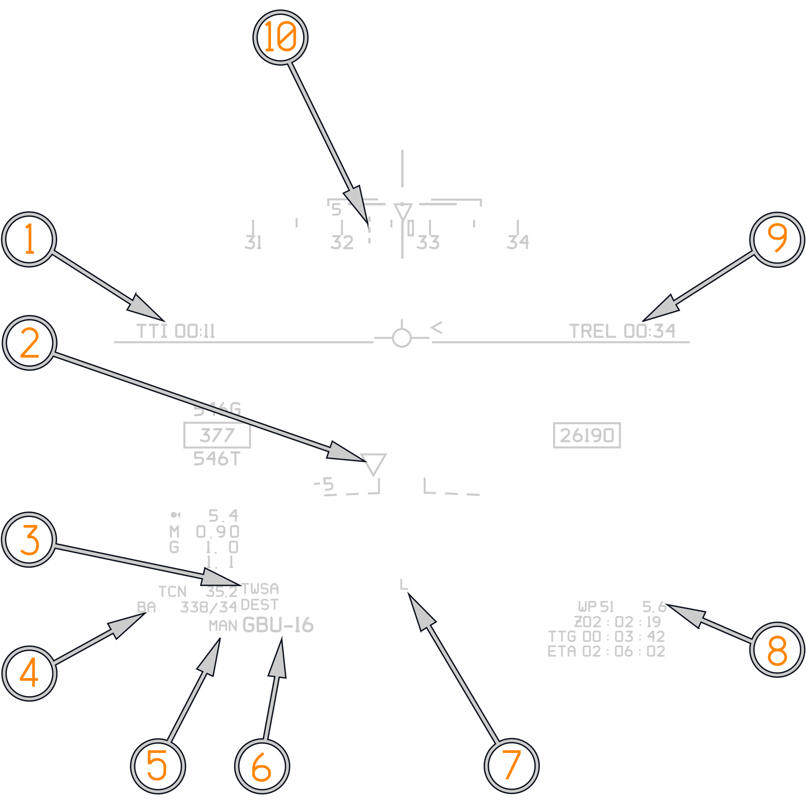
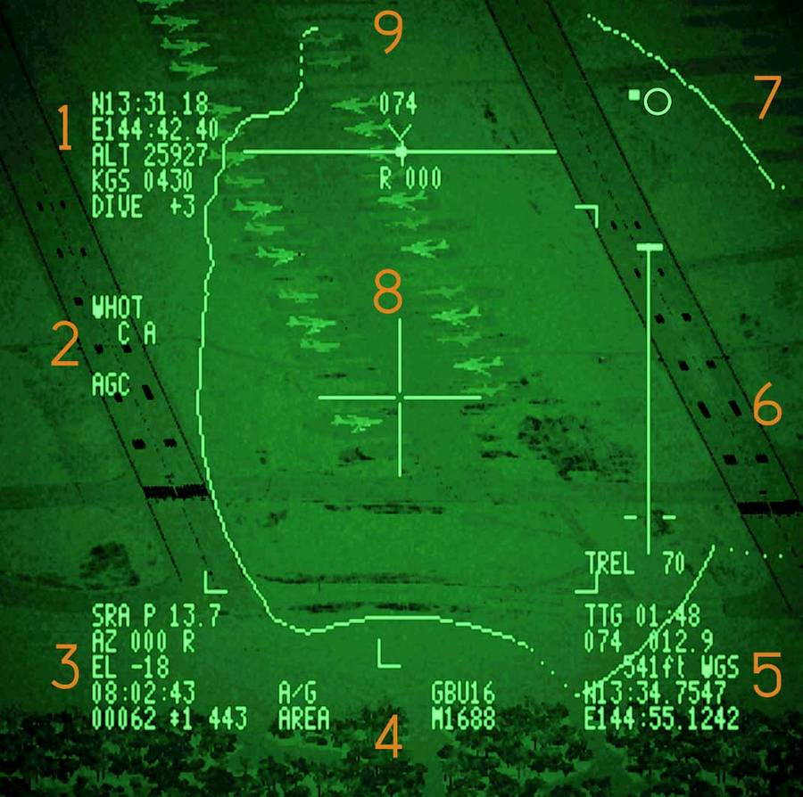

# Laser Guided Bombs

The F-14B(U) features the LANTIRN pod fully integrated into the weapons system
via the 1553 data bus. The LANTIRN and HUD are integrated such that the HUD
displays a dashed alignment cue, TREL indicator, TTI indicator, and LTS Line of
Sight (LOS) indicator.

The LTS display on the PTID is largely similar; however, the larger display
provides significantly improved LTS resolution. For a complete discussion of the
LANTIRN Targeting System (LTS), refer to the
[LANTIRN chapter](../../../systems/lantirn/overview.md).

## Typical VDIG-R Formats

(<num>1</num>) Time to Impact (TTI). Shown only after weapon release.

(<num>2</num>) LANTIRN Triangle. Showing LANTIRN LOS.

(<num>3</num>) Current Radar Mode. In Manual AWG-9 uses normal A/A radar modes.
(TWSA).

(<num>4</num>) Bullseye to Own Aircraft.

(<num>5</num>) Attack mode selected on ACP. MAN denotes Manual is selected.

(<num>6</num>) Weapon Selected on ACP weapons wheel. (GBU-16).

(<num>7</num>) LANTIRN and Mask Status: "L" Denotes LANTIRN Laser is armed.

(<num>8</num>) Selected waypoint (51) and Distance to waypoint is shown.

(<num>9</num>) TREL indicates time to Release, repeated on LANTIRN TREL cue.

(<num>10</num>) LANTIRN command heading showing direct path to designated
target, repeated on LANTIRN display.

## LANTIRN and Mask Status

Centrally in the HUD lower half (<num>7</num>) the LANTIRN and Mask Status cue
is displayed:

**L** Laser Armed - Nothing will be displayed when the laser is not armed. An
"X" will be superimposed on the "L" when the laser is inhibited from firing
(above 40k, Weight−On−Wheels, laser failure, LOS masked or LTS not in track
mode).

**L** (Flashing) Laser Firing - Whenever the Laser is firing (either in Training
or Combat) the "L" flashes for the duration of the Laser Fire period. If the
Laser is not firing, a solid "L" will be displayed.

**M** Laser Masked - Whenever the Laser is masked by the ownship, a solid "M"
symbol will be displayed. M (Flashing) Pending Laser Mask. As the Laser
approaches the ownship masking regions (as determined by the pod and currently
displayed on the PTID), an "M" will be displayed on the HUD and will flash when
the LOS is within 5° of the mask region (coming or going).

## Typical LGB LANTIRN Formats

(<num>1</num>) Own Aircraft positional data:

- Position
- Altitude
- Groundspeed
- Pitch Angle

(<num>2</num>):

- WHOT (White Hot) or BHOT (Black Hot)
- AGC (Automatic Gain Control) or
- MGC (Manual Gain Control)

(<num>3</num>) Pod Information

- SRA: slant range
- AZ and EL is pod line of sight azimuth and elevation relative aircraft ADL
- UTC Time
- IBIT Codes

(<num>4</num>):

- A/G Mode or A/A Mode
- Rates Track (RATES)
- Area Track (AREA)
- Point Track (POINT)
- LASER CODE
- Weapon Type

(<num>5</num>):

- Target Information Q (Current Slew Point) (Except for QSNO, QADL, QHUD)
- Time to go until on top of the Currently selected Q
- Bearing and Range to Q
- Elevation to Q
- Location of Q (only Displayed if a Location Q is selected)

(<num>6</num>) Attack Information:

- Vertical line is the bomb release cue.
- The bomb release cue, is only shown if the selected Q is QDES and shows a
  vertical line along which a release cue travels downwards.
- TREL (Time to Release) changes to
- TIMP (Time to Impact) after bomb release

(<num>7</num>) North Indicator.

(<num>8</num>) LTS Reticle.

(<num>9</num>) Attack Information:

- Steering guidance towards the selected Q.
- Top line is deviation from heading (L/R Degrees)
