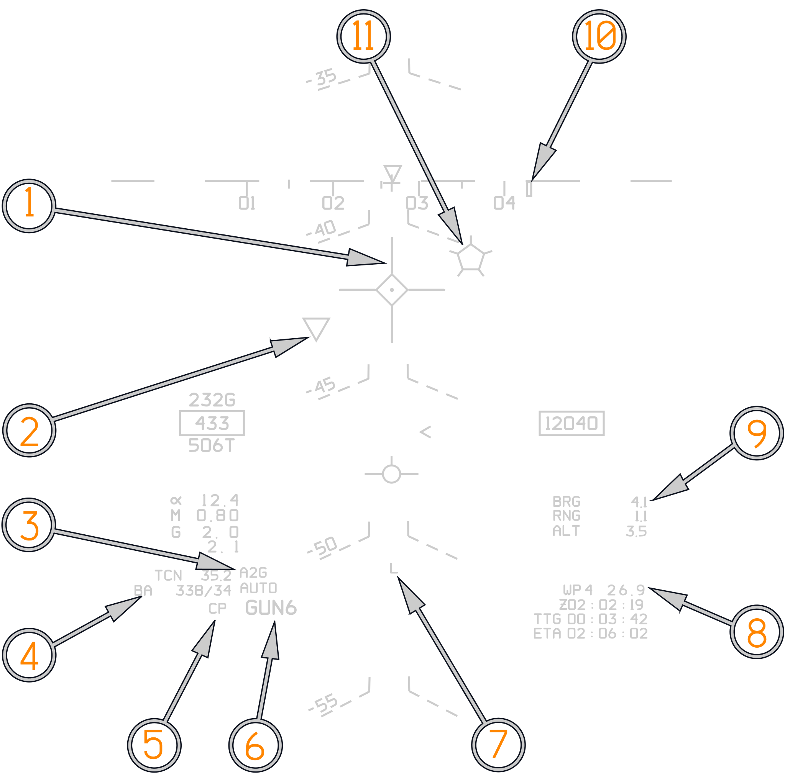
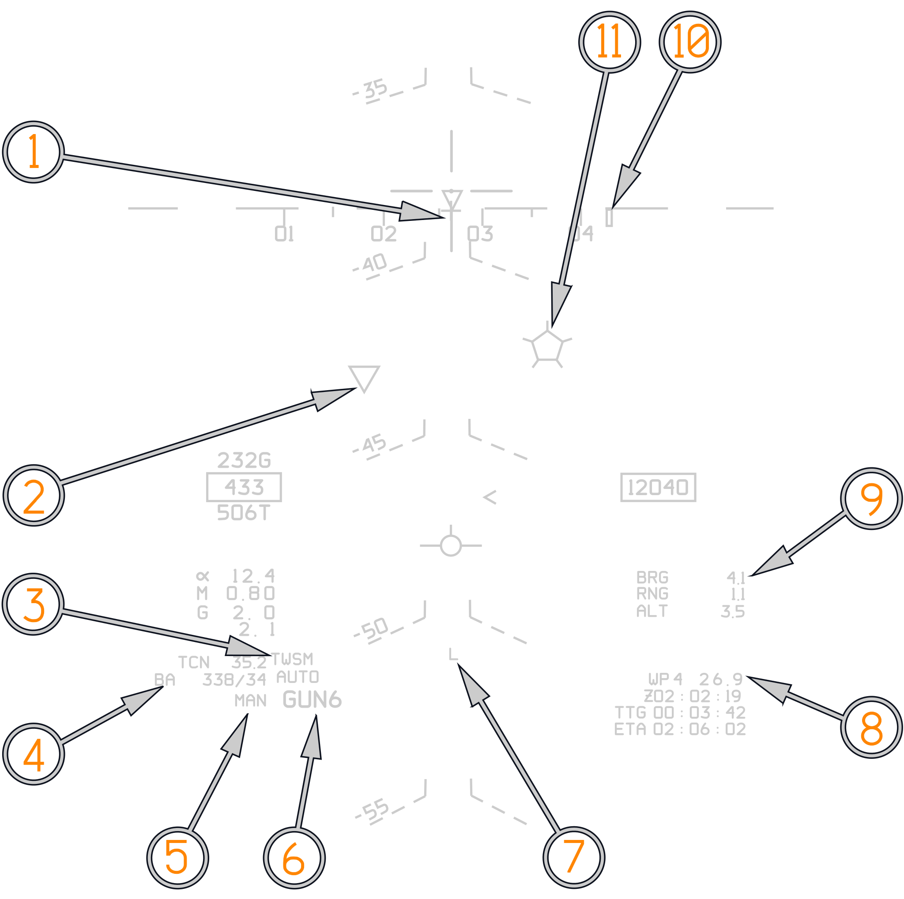

# Unguided Weapons Employment

Air-to-ground delivery is initiated by pilot selection of the **A/G** mode on
the display control panel. After tape read-in (about 30 seconds), the WCS
initiates the air-to-ground mode and enables relevant symbology on the displays.

The weapon selection automatically switches to ordnance (**ORD** on the HUD)
unless the pilot has selected another weapon. All other options are set by the
RIO in the back seat.

The available attack modes in the F-14 are set by the **ATTK MODE** selector in
the RIO pit and are:

- **CMPTR TGT**: Computer target, a semi-automatic computer-guided mode similar
  to a CCRP mode in newer aircraft.
- **CMPTR IP**: Computer initial point, an extended CMPTR TGT mode using a known
  initial point (IP) as a reference for store delivery. Mostly used in
  situations where the actual target is expected to be hard to locate visually
  and is located closely to an easily identifiable reference point/landmark.
- **CMPTR PLT**: Computer pilot, a manual computer and pilot-guided mode using
  the WCS for store impact point indication on HUD. Similar to a CCIP mode in
  newer aircraft.
- **MAN**: Manual, manual backup mode in which the HUD displays a pipper
  (crosshair) on the HUD at the deflection set by the pilot. Used in case of a
  systems failure prohibiting the other modes.
- **D/L BOMB**: Data-link bomb, an automatic mode in which the pilot is steered
  via data-link cues for remotely controlled store delivery. (Not implemented in
  DCS at this point in time.)

For a complete discussion of unguided bombing modes refer to the
[Weapon Delivery chapter](../../../../f14ab/stores/air_to_ground/weapon_delivery.md).

## Computer Pilot

The computer pilot mode uses the WCS to continually calculate and display an
impact point for the configured store on the HUD.

When selected, the HUD displays the current store impact point in real-time
using the pipper (crosshair). The target designation diamond is used when the
WCS is configured for rockets and overlays the pipper to indicate that the
configured store is out of range when displayed. As in the Computer Target and
IP modes, the pull-up cue is used to indicate aircraft below safe store release
altitude when at or above the velocity vector.

To correctly engage the desired target, the pilot flies the impact point pipper
on the HUD over the target and then depresses the bomb release button.

When using rockets, the pilot should wait until the diamond disappears,
indicating that the selected store is within range and then use the control
stick trigger to fire the rockets.

(<num>1</num>) A/G GUN Pipper. Diamond means out of range. When in range Diamond
disappears.

(<num>2</num>) Inverted Triangle denotes LANTIRN LOS. No "N" within triangle
means LANTIRN is tracking in either point or area track.

(<num>3</num>) Current Radar Mode. In Computer Pilot AWG-9 uses defaults to A2G
ranging.

(<num>4</num>) "BA" Bullseye to Own Aircraft, shown with valid Bullseye in A/A
and A/G.

(<num>5</num>) Selected Attack mode on ACP. "CP": Computer Pilot.

(<num>6</num>) Weapon Type selected. For gun displayed with rounds counter in
hundreds of rounds.

(<num>7</num>) LANTIRN Laser Armed.

(<num>8</num>) Currently selected EGI Fly-To waypoint (WP 4) and range.

(<num>9</num>) Bearing, Range and Altitude to Surface target, only displayed in
A/G if RIO has Surface Target Waypoint Hooked on PTID.

(<num>10</num>) Steering cue to currently selected waypoint. In this case the
EGI Fly-To Point WP4.

(<num>11</num>) Surface Target (Pentagon). Hooked denoted by whiskers.

## Manual

The Manual (MAN) air-to-ground mode serves as a backup delivery mode when the
computer-assisted attack modes are unavailable or when no Air to Ground Radar
Ranging is desired. In principle, it functions similarly to Computer Pilot
(CPTR) mode, requiring the pilot to fly the HUD pipper onto the target during
the attack. Unlike CPTR mode, however, the pipper is not updated by the WCS.
Instead, it is displayed at a fixed depression below the Aircraft Datum Line
(ADL), calculated for the planned delivery profile.

The required pipper depression is set using the Elevation Lead Panel on the
pilot's right-side vertical console. The appropriate setting is determined from
weapon delivery tables or estimated by the pilot based on the intended release
altitude, dive angle, and airspeed.

When an A/G program is loaded and MANUAL is selected on the Attack Mode Selector
of the ACP, the AWG-9's air-to-ground radar ranging function is disabled while
the selected A/G program remains active. This allows the AWG-9 to continue
operating in all air-to-air radar modes while still permitting the employment of
air-to-ground stores that do not require radar ranging.

(<num>1</num>) A/G GUN Pipper. Diamond means out of range. When in range Diamond
disappears.

(<num>2</num>) Inverted Triangle denotes LANTIRN LOS. No "N" within triangle
means LANTIRN is tracking in either point or area track.

(<num>3</num>) Current Radar Mode. In Manual AWG-9 uses normal A/A radar modes.
(TWSA).

(<num>4</num>) "BA" Bullseye to Own Aircraft, shown with valid Bullseye in A/A
and A/G.

(<num>5</num>) Selected Attack mode on ACP. "CP": Computer Pilot.

(<num>6</num>) Weapon Type selected. For gun displayed with rounds counter in
hundreds of rounds.

(<num>7</num>) LANTIRN Laser Armed.

(<num>8</num>) Currently selected EGI Fly-To waypoint (WP 4) and range.

(<num>9</num>) Bearing, Range and Altitude to Surface target, only displayed in
A/G if RIO has Surface Target Waypoint Hooked on PTID.

(<num>10</num>) Steering cue to currently selected waypoint. In this case the
EGI Fly-To Point WP4.

(<num>11</num>) Surface Target (Pentagon). Hooked denoted by whiskers.
