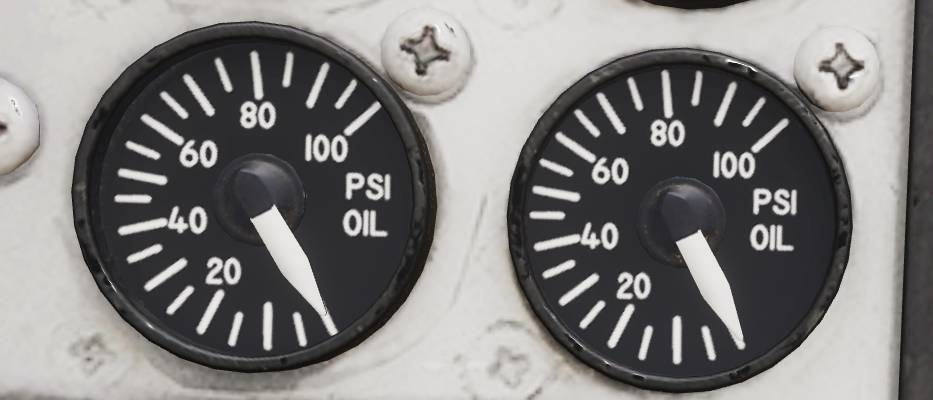
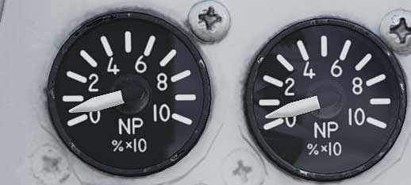
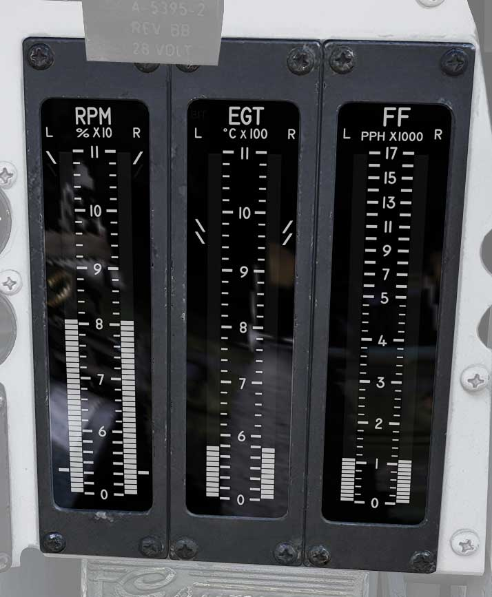

# Left Knee Panel

## Hydraulic Pressure Indicator

Shows hydraulic pressure of the combined and flight hydraulic systems.

- SPOIL (Spoiler): ON/OFF-flag indicates pressurization of outboard spoiler
  module.
- EMER FLT HI: ON/OFF-flags indicates backup flight hydraulic system pressures
  when HI or LOW is selected respectively.

## Oil Pressure Indicator

Displays oil pressure for each engine. Range is 0 - 100 psi, normal range is
25 - 65 psi, varying with engine rpm.

## Exhaust Nozzle Position Indicator

Displays position of engine nozzles. On the F-14A, it is shown as a range from
0 - 5 with 5 being fully open. On the F-14B, it is shown as a percentage range
from 0% to 100%.

## Engine Instrument Group

Displays engine RPM (High-pressure compressor rotor speed (N2)), TIT (Turbine
Inlet Temperature) for the F-14A or EGT (Exhaust Gas Temperature) for the F-14B,
and FF (Fuel Flow) for respective engine.

> 💡 FF is not indicated for the additional fuel used in afterburner.
