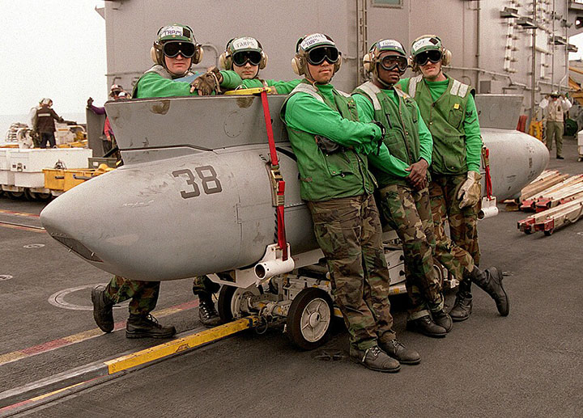

# Pods

## TACTS Pods

The TACTS pod is an analysis pod used during training missions, carried on LAU-7
rails instead of AIM-9s, normally on station 1A and 8A. They are normally
carried as a pair of two, one on each side.

> 💡 In DCS, their functionality is purely cosmetic.

## LANTIRN

 _U.S. Navy photo by Photographers Mate
Airman Jason Frost. (030122-N-9403F-002)_

The LANTIRN was adapted for use on the F-14 Tomcats during the 1990s as the
F-14’s role started to gravitate towards including the precision strike role.

The version carried on the Heatblur DCS F-14B Tomcat represents the earliest
integrations of the LANTIRN, the pod being carried only on station 8B and
hardwired to the control panel in the RIO cockpit and to the video input on the
TID/VDI.

For more information regarding the use of the LANTIRN pod, see
[the section about it](../systems/lantirn/overview.md) under the General Design
and Systems Overview chapter.

## TARPS

 _U.S. Navy photo by Photographers Mate
2nd Class Gloria J. Barry. (980320-N-4541B-008)_

The Tactical Airborne Reconnaissance Pod System, or TARPS, was developed to
provide carrier air wings with an organic tactical reconnaissance capability as
dedicated aircraft such as the RA-5C Vigilante and RF-8G Crusader were withdrawn
from service, allowing modified F-14s to perform photographic reconnaissance,
mapping, maritime surveillance, and pre- and post-strike damage assessment.

For more information regarding the use of the TARPS pod, see
[the section about it](../systems/tarps.md) under the General Design and Systems
Overview chapter.
