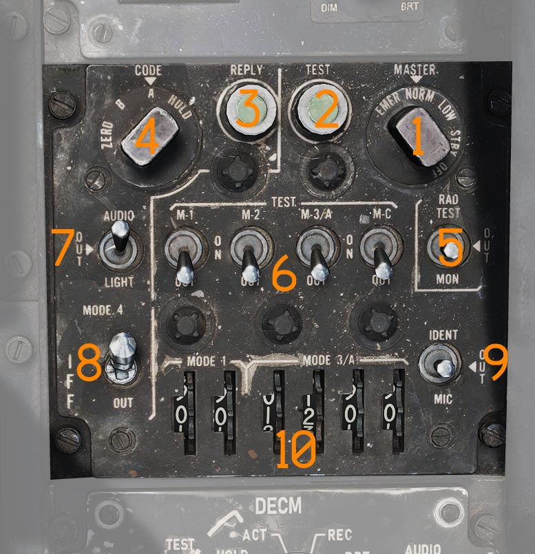
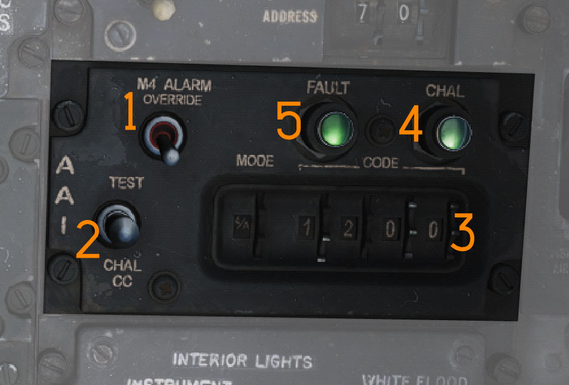

# Identification Systems

The transponder and interrogator can be controlled by the RIO with a panel on
the [right console](../cockpit/rio/right_console.md).

## AN/APX-72 Transponder System

The transponder automatically responds to challenges from surface or airborne
radar sets and serves supplementary purposes such as providing momentary
identification of position upon request and transmitting a specially coded
response to indicate an emergency.

The system operates by receiving coded interrogation signals and transmitting
coded response signals to the source of the challenge, with a proper reply
indicating the target is friendly.

The system features four modes. Mode 1, Mode 2, and Mode 3 are provided for
security identification, personal identification, and traffic identification,
respectively.

Codes for Modes 1 and 3 can be set in the cockpit, while the code for Mode 2
must be set on the ground, ranging from 0000 to 7777. Mode 1 is limited to two
digits 00 to 77.

The codes for Mode 4 are automatically inserted by Ground Crew before flight,
the Crew Chief can be asked to insert them on demand as well.

> 💡 The Tomcat features a full IFF simulation. In DCS this system also works
> with any other cooperating aircraft, such as the F-4E, M-2000C, F1, JF-17,
> F-15E, Harrier and more. Other aircraft, or AI-controlled aircraft fall back
> to coalition based interrogation, assuming the Tomcats transponder to always
> be enabled and set to the correct M4 code for the current coalition, ignoring
> the real state of the transponder. See chapter
> [Mission Editor](../dcs/mission_editor.md#iff) for options on AI-controlled
> aircraft.

### Self Test operation

To self test Modes 2 and 3, place the master switch (<num>1</num>) to NORM and
hold the switch for the desired test mode to the upper position. If the test
light on the IFF control panel illuminates, this indicates the mode is operating
properly.

Mode 1 and Mode C do not have self testing capabilities.

### Normal Operation

To operate the IFF system, start by rotating the master switch (<num>1</num>) to
STBY. After an approximate 80-second warmup delay, the system receives full
power, but interrogations are blocked.

Set the Mode 1, Mode 2, Mode 3, Mode 4, and Mode C switches (<num>6</num>) as
directed, along with the Mode 1 and Mode 3 code selector switches
(<num>10</num>) and Mode 4 function switch (<num>8</num>). Set the master switch
(<num>1</num>) to NORM to make the system ready for operation on the selected
modes. If the master switch (<num>1</num>) is rotated from OFF directly to an
operating mode, it also has to go through the warmup period first before it is
fully operational.

#### Interrogation of Position

For Interrogation of Position (I/P) switch operation, place the I/P switch
(<num>9</num>) in the IDENT position or place it in the MIC position and press
the UHF microphone. The IFF system responds with special I/P signals.

#### Warning Light

If the IFF warning light and MASTER CAUTION light come on momentarily, check the
Mode 4 selector switch (<num>8</num>) ON and the master switch (<num>1</num>)
NORMAL. Repeated illumination of the MASTER CAUTION light may be stopped only by
placing the master switch (<num>1</num>) OFF, resulting in the loss of all IFF
capability, or by placing the Mode 4 function switch (<num>8</num>) to ZERO.
Before or during flight, if the master switch (<num>1</num>) is placed OFF, the
IFF and MASTER CAUTION lights will not illuminate upon interrogation.

Normal IFF operation will be available, after an 80-second warm-up, when the
master switch (<num>1</num>) is again placed to NORMAL.

#### M4 Zero/Hold

The codes for Mode 4 are automatically erased on shutdown, when the IFF system
loses power. This can also be commanded by moving the Mode 4 function switch
(<num>8</num>) into the ZERO position and holding it there for approximately 5
seconds. Once zeroed, the IFF warning light will illuminate and Mode 4 will not
be available during the remainder of the flight.

Codes can be inserted again by the Ground Crew. The HOLD position of the Mode 4
function switch is inoperative on the DSCG variant of the F-4E and was added
later for the DMAS only. Holding the switch in that position for 15 seconds will
retain the mode 4 codes during the next shutdown, preventing them from
automatically getting zeroed.

### Emergency Operation

Upon ejection from either cockpit, the IFF emergency operation automatically
becomes active.

If the master switch (<num>1</num>) is in the OFF position before ejection, the
system will begin operation after an approximate 80-second delay.

In an emergency, rotate the master switch (<num>1</num>) to EMER. The replies
for Modes 1 and 2 are special emergency signals of the codes selected on the
applicable dials, while Mode 3 replies are special emergency signals of
code 7700.

## Interrogator System AN/APX-76

The AN/APX-76 IFF (Identification Friend or Foe) interrogator is integrated into
the AN/AWG-9 operation. Then interrogator antenna itself is located on the
AN/AWG-9 antenna gimbal platform.

An IFF system works by sending out an interrogation pulse and then listening for
returns from cooperating transponders. In addition to the unencrypted civilian
mode the AN/APX-76 is capable of interrogating in the encrypted military mode 4.
This ensures that targets replying to mode 4 interrogations are indeed friendly.

The AN/APX-76 can be used both in search radar modes and in STT radar modes. To
enable interrogation the IFF switch is depressed on the Detail Data Display
Panel which then activates the interrogator for as long as the button is held up
to 10 seconds max.

When enabled IFF received IFF returns are then overlaid on the normal AN/AWG-9
radar returns on the DDD. A friendly target will be indicated with two bars, one
above and one below the normal radar return. As the AN/APX-76 is a secondary
mode radar (transponder radar) apart from the AWG-9 the IFF can sometimes also
detect targets not detected by the AWG-9. In this case the IFF return will not
have a radar echo inside it.

In the search mode this is overlaid over each target replying and in STT over
the STT target. Additionally, if the STT target is hooked on the TID the DDD
will switch from normal range display to a ±10 NM display to enable display of
multiple returns in case of closely grouped targets.

- **1. M4 ALARM OVERRIDE switch**
  - Switch disabling the mode 4 tone alarm in the RIO headset.

- **2. TEST-CHAL CC switch**
  - Switch spring-loaded to center controlling IFF challenge and test.
    - TEST: Momentary actuation, tests the AN/APX-76 by interrogating own
      transponder. If the same codes are set, two solid lines appear on DDD at 3
      and 4 miles.
    - CHAL CC: Momentary actuation starts a 10-second interrogation cycle, only
      showing returns with the correct mode and code on DDD.

- **3. CODE selector thumbwheels**
  - Thumbwheels controlling mode and code used for interrogation. The first
    wheel sets the mode, and the last four set the code.

- **4. CHAL light**
  - Light indicating active interrogation in progress.

- **5. FAULT light**
  - Light indicating a fault in the AN/APX-76.

To challenge friendly or civilian aircraft using the AN/APX-76, the RIO sets the
interrogation mode on the first roller-display. It can be set to either OFF, or
Mode 1, 2, 3, 4/A or 4/B (<num>3</num>).

The other four digits are used to set the IFF code to interrogate for Modes 1 to
3 (<num>3</num>). The code for Mode 4/A and 4/B is set by the ground personal.

Once setup, interrogation can be initiated by either pressing the IFF button on
the DDD or moving the Test/Challenge Switch (<num>2</num>) to the CHAL CODE
position.

> 💡 The Test/Challenge switch will only send a challenge via the AN/APX-76
> system, while the Challenge Button includes an interrogation by Combat-Tree,
> if activated.

The radar screen presents the results of the interrogation with lines around the
contacts position:

- line above; the aircraft has a matching transponder mode (likely friendly, or
  at least neutral)
- line below; the aircraft has a matching transponder code (likely friendly)

[DDD with friendly contacts] WIP - INSERT IMAGE

Each time the AN/APX-76 is sending an interrogation, the challenge light
(<num>4</num>) illuminates.

### Test

The interrogation system can be tested by holding the Test/Challenge Switch
(<num>2</num>) in the TEST position.

During the test, the system will inject two artificial transponder responses at
ranges 3.5 NM and 4.5 NM.

The test is successful if the challenge lamp (<num>1</num>) illuminates and the
DSCG screen shows two lines at the corresponding distances that span over the
entire screen.

![DDD with IFF Test] WIP - INSERT IMAGE
