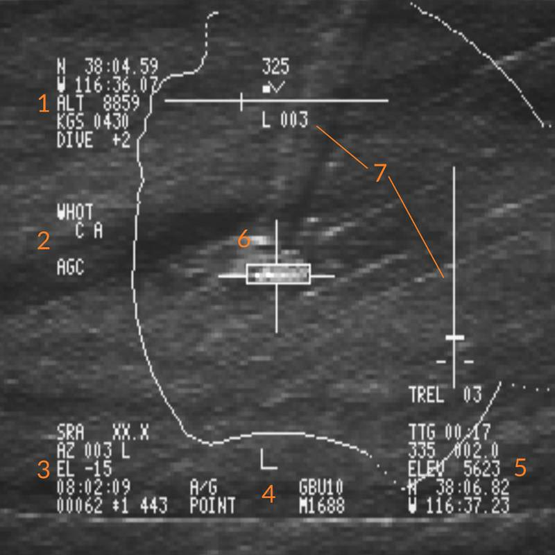

# LANTIRN

 _U.S. Navy photo by
Photographer’s Mate 2nd Class Felix Garza Jr. (030325-N-4142G-009)_

The LANTIRN or Low Altitude Navigation and Targeting Infrared for Night began
life as combined targeting and navigation pods designed for the F-15E and F-16.
When the US Navy became interested in using the F-14 Tomcat in the A/G role,
Martin Marietta (now Lockheed Martin) began its own program to show that the
LANTIRN could quickly be adapted for F-14 use.

As the pod was adapted for the F-14, the secondary navigation pod was deleted,
keeping only the targeting pod. The pod was wired up to its own control panel as
the F-14 didn’t have the required 1553-bus for complete integration. The control
panel was patched into the TCS to TID video feed allowing it to select either
the TCS or the LANTIRN for display on the TID and VDI.

While the pod can read waypoints and selected weapon from the WCS, the pod has
its own GPS receiver and is otherwise self-contained and controlled only via its
own control panel. Additionally, it also has its own weapons release guidance
removing the need to boresight the pod to the aircraft, a time-consuming task.

The FLIR sensor itself has three different zoom levels or fields of view (FoV).
The Wide FoV limits are 5.9° and allows a maximum slew rate of 8.5°/s. The
Narrow FoV limits are 1.7° and allows a maximum slew rate of 1.8°/s. The last
mode, the Expanded FoV is a digital zoom of the Narrow FoV, meaning that the
resolution will be worse in this mode. The FoV limits for the Expanded FoV are
0.8° with a max slew rate of 0.7°/s.

## Controls and Displays

All the controls for the LANTIRN are situated on its own control panel mounted
on the RIO’s left side console when the pod is present, including the switch
controlling what video feed the TID and VDI display in the TV mode.

### LANTIRN Video Elements

The FLIR (Forward Looking InfraRed) video-feed from the LANTIRN has superimposed
data readout for the crew’s use. This video-feed can be viewed both on the TID
(in TV-mode) and on the VDI (also in TV-mode) when the FLIR feed is selected on
the control panel.

#### **Ownship data block (<num>1</num>)**

Data for the aircraft is displayed in the upper left corner of the screen:

- Own aircraft position (Lat/Long with Decimal Minutes)
- Own aircraft altitude
- Own aircraft speed (Knots Ground Speed)
- Own aircraft pitch angle

#### **Image settings block (<num>2</num>)**

Below the ownship data are the settings for the LANTIRN image:

- **WHOT/BHOT**: IR image polarity (Black Hot or White Hot).
- **AGC/MGC**: Image gain control mode (Automatic Gain Control or Manual Gain Control)

#### **LANTIRN pod data block (<num>3</num>)**

Data for the pod is displayed in the lower left corner of the screen:

- Slant Range (**SRA**) between the aircraft and the location at the center of the crosshairs.
- Pod Azimuth (**AZ**) relative to the aircraft's Armament Datum Line (**ADL**).
- Pod Elevation (**EL**) relative to the aircraft's Armament Datum Line (**ADL**).
- Current UTC time.
- IBIT codes

> 💡 IBIT codes are not implemented currently and the clock will show local
> time.

#### **Tracking and Weapon data block (<num>4</num>)**

Data regarding tracking or queueing modes and weapon information is located in the middle at the bottom of the screen:

- LANTIRN Operation Mode: **A/A** or **A/G**
- Tracking/Queuing mode: Point or Area track, QDES/QADL/QHUD/QWPX/QSNO, RATES
- Selected Weapon
- Laser code
- Laser status: Steady L when the Laser is armed, flashing L when the laser is firing.

#### **Target/Queue point data block (<num>5</num>)**

Data regarding the current Target or Queue point (except QADL/QHUD/QSNO) is located in the bottom right corner of the screen:

- Time to Go (**TTG**): Time until the aircraft is above the selected point.
- Bearing and Range to the point.
- Elevation (**ELEV**): Altitude above Mean Sea Level of the point (ft).
- Position of the point (Lat Long with Decimal Minutes)

#### **Crosshairs (<num>6</num>)**

Located in the center of the screen, they indicate the LANTIRN's exact Line of Sight (**LOS**), i.e where the pod is actually pointing.

When using the wider Fields of View (**FOV**), the Field of View of the next narrower setting will be indicated by corner markers around the crosshair.

Additionally, a small white square indicates the direction relative to the aircraft the pod is pointing:

- Up/Down : Elevation of the pod. When the square is in the upper half of the screen, the pod is looking ahead. When the square is in the bottom half, the pod
is looking behind the aircraft. When the square is in the middle of the screen, the pod is looking straight down.
- Left/Right: Azimuth of the pod. The further the square is from the centerline of the screen, the further it is looking Left/Right from the flightpath.

The pod is limited in the amount of deflection it can achieve both by its mechanical limits and by its installation on the aircraft, which will mask the view
in certain positions.

This is indicated on the screen by a **Masking Line** drawn around the screen. When the white square intersects this line, the pod is masked by the aicraft.
Maneuver the aircraft to place the target within the viewing limits of the LANTIRN.

Finally, when tracking an object in **Point Track** mode, a bounding box around the object will be displayed.

#### **Steering and release guidance (<num>7</num>)**

Located on top of the screen is the **Lateral Steering Cue**.

It displays:

- Ownship heading
- Heading error relative to the target (Left/Right degrees to go towards the target).

On the right side of the screen is the **Bomb Release Cue**. It provides a visual cue for the release of the weapon as well as numeric data:

- **TREL**: Time until Release
- **TIMP**: Time until Weapon Impact. Displayed once the weapon is released

### Control Panel

The control panel contains all the controls for the pod, including the control
stick.

The power switch for the LANTIRN pod is located top left (<num>1</num>) with
**OFF** disabling power to the system, **IMU** (blocked in above image) powering
only the LANTIRN IMU and **POD** powering the whole system.

> 💡 IMU selection has no current DCS function.

The **MODE** switch (<num>2</num>) switches the POD sensor between **STBY**
(Standby) and **OPER** (Operational).

The **LASER ARMED** (<num>3</num>) light illuminates when the laser is armed
while the **LASER** switch (<num>4</num>) arms it. (ARM and SAFE positions
available.)

Down right is the **VIDEO** switch (<num>5</num>) which controls what video is
fed to the TID and VDI, FLIR selecting LANTIRN FLIR video and TCS selecting TCS
video.

The four grouped indicator lights (<num>6</num>) indicate various error states
in the LANTIRN system and the **IBIT** button (<num>7</num>) initiates the IBIT
(Initialized Built-In-Test).

> 💡 The IBIT and fault indicators are not currently implemented in DCS.

### Control Stick

Located on the left side of the cockpit, the LANTIRN Control Stick is fixed,
and features the controls to operate the pod.

#### **S3 Hat (<num>1</num>)**

The S3 hat is a 4-way hat located on the left of the grip, and controls the following functions :

- Left: **Queue Waypoint -**. Slews the LANTIRN to the **previous waypoint** in the system.

- Right: **Queue Waypoint +**. Slews the LANTIRN to the **next waypoint** in the system.

- Up: Selects **Point Track** mode, which attempts to lock a high contrast spot.

    This mode can be useful when light and weather conditions allow, as well as for moving targets.
  
- Down: Selects **Area Track** mode, which stabilises the LANTIRN to a point on the ground.

    This mode does not rely on the target contrasting against the surrounding scenery,
    and reduces the chances of the track being lost during LGB employment.

#### **Slew Hat (<num>2</num>)**
Located in the middle of the stick grip, the slew hat is used to manually slew the LANTIRN's line of sight around.

Depressing the hat toggles the polarity of the Infrared (IR) image between White Hot (WHOT) and Black Hot (BHOT).

#### **S4 Hat (<num>3</num>)**
The S4 hat is a 4-way hat located on the right of the grip, and controls the following functions :
- Left: No function

- Right: **Queue Designation**. Slews the LANTIRN to the last stored designation.

- Up: **Queue ADL** (Armament Datum Line) or **Queue HUD** (Waterline Symbol) depending on the LANTIRN operation mode (**A/A** or **A/G** respectively)

- Down: **Queue Snowplow**. A fixed setting looking forwards at a fixed depression to scan below and ahead of the aircraft's flightpath.

#### **FOV Toggle (<num>4</num>)**
The red button on top is used to cycle between the three fields
of view (zoom levels) of the IR sensor.

#### **LANTIRN Operation Mode Select Switch (<num>5</num>)**
The two-way hat on the side selects the mode of operation for the pod.

- Forwards: Air to Ground Mode.
- Backwards: Air to Air Mode.

#### **Slider (<num>6</num>)**
Located on the left side of the stick grip is a two way slider,
spring-loaded to return to center. It is used as a modifier for the **S4 Hat**

- Forwards:

    - Short: Selects Manual Gain Control **MGC** and enables setting a custom image gain
    using **S4 Hat Up/Down**, and custom image level with **S4 Hat Right/Left**.    
        - Pressing again sets the custom gain value.    
        - Pressing a third time returns the image gain to Automatic Gain Control **AGC**.

    - Long: Pressing and holding for 2 seconds enters **MGC** in customizable mode.
 
 
- Aft:
  
  - Short: Selects laser code editing mode. 
  Use **S4 Hat Left/Right** to scroll through the laser code digits and **S4 Hat Up/Down** to increase/decrease the value for each digit.

  - Long: Selects **Manual Focus Control**, using **S4 Hat Up/Down** to adjust the image focus.

#### **LANTIRN Trigger (<num>7</num>)**
Located on the front of the stick is a two-stage trigger.

- First detent: Manual firing of the Laser.
- Second detent: Fires the laser and stores a target designation in the system at the location under the LANTIRN's line of sight.

#### **Laser Latch Button (<num>8</num>)**
Located at the front on the bottom of the stick grip. Fires the laser for 60 seconds.
Press the **LANTIRN Trigger First Stage** to stop the laser and reset the 60 second timer.

## Startup

To start the LANTIRN from cold, set the power switch to POD. This will start the
LANTIRN power-up sequence which takes 8 minutes. When ready, this will be
indicated by the MODE switch showing STBY.

When at STBY, depression of the MODE button switches the system to OPER
(Operational), enabling the LANTIRN sensor after a 30-second initialization.

Lastly, to allow display of LANTIRN FLIR video, select FLIR on the VIDEO switch.
