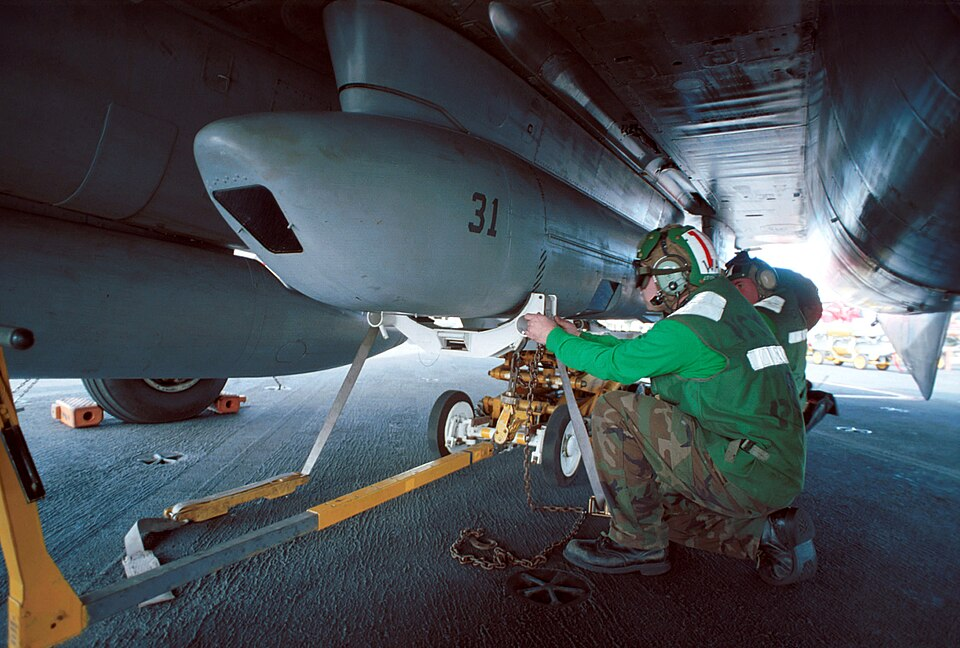

# Tactical Airborne Reconnaissance Pod System (TARPS)

 _U.S. Navy photo by Photographer’s Mate
3rd Class Brian Fleske. (000304-N-0507F-005)_

The Tactical Airborne Reconnaissance Pod System, or TARPS, was developed to
provide carrier air wings with an organic tactical reconnaissance capability as
dedicated aircraft such as the RA-5C Vigilante and RF-8G Crusader were withdrawn
from service. Entering fleet service in the early 1980s, TARPS allowed suitably
modified F-14s to perform photographic reconnaissance, mapping, maritime
surveillance, and pre- and post-strike damage assessment.

The TARPS pod is carried on weapons station 5, on the starboard side of the
tunnel between the engine nacelles. It contains three sensor bays. The forward
bay houses a KS-87 serial frame camera configured for either vertical or 45°
forward-oblique photography. The center bay normally contains a KA-99 panoramic
camera providing wide, horizon-to-horizon coverage, while the aft bay houses an
AN/AAD-5 infrared line scanner for night and reduced-visibility reconnaissance.
Aircraft position and flight information are recorded alongside the imagery to
assist with its interpretation after the mission.

The TARPS is operated primarily by the RIO using a dedicated control panel,
while the pilot flies the planned reconnaissance run and can also initiate
camera operation when configured. Unlike the TCS, the original TARPS was
principally a film-based recording system and did not provide a live sensor
image on the TID or VDI. The exposed film was removed and processed after
recovery for analysis by intelligence personnel.

In DCS, TARPS functionality is currently limited to the KS-87D camera configured
in the vertical, looking straight down position. Photography is initiated and
concluded by using the special dedicated keybind. The TARPS control panel,
navigation and HUD steering integration, automatic camera sequencing, KA-99
panoramic camera and AN/AAD-5 infrared line scanner are not currently simulated.
