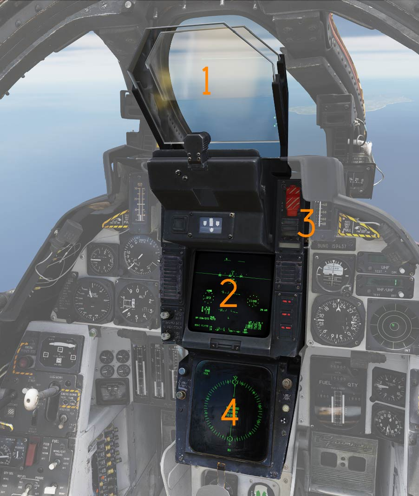
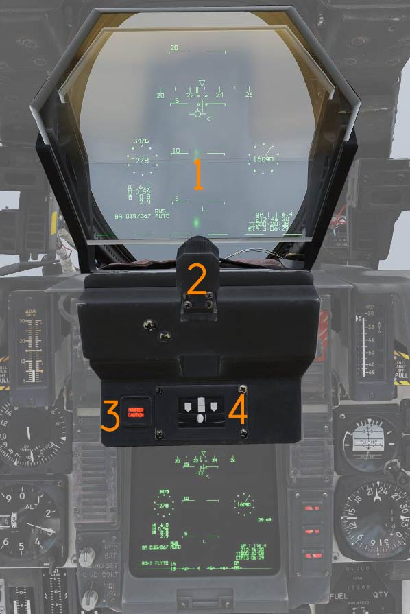
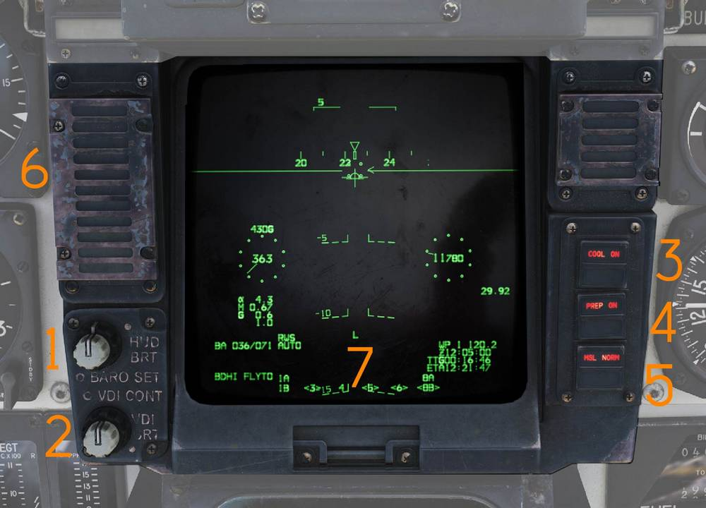
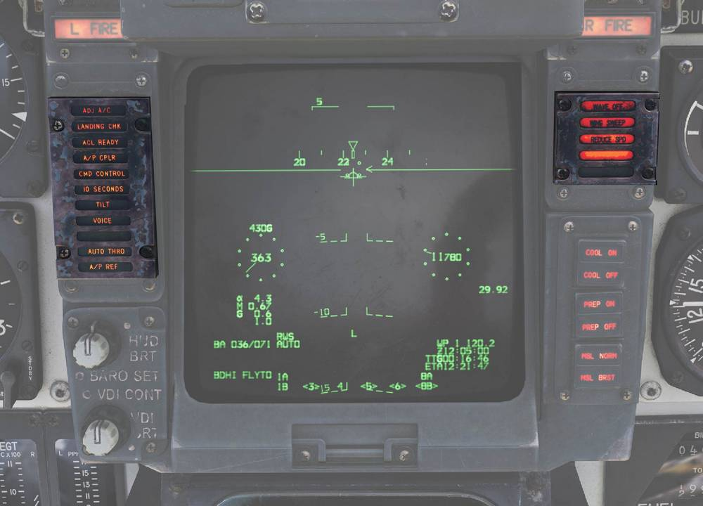
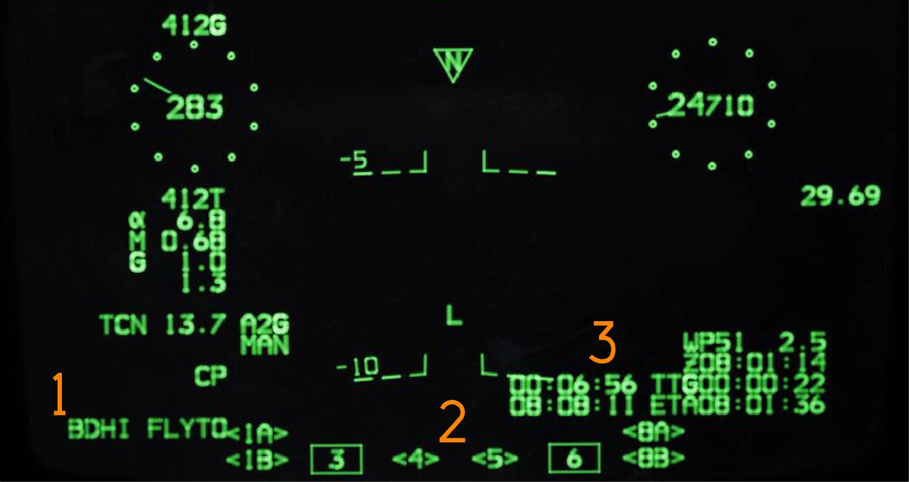
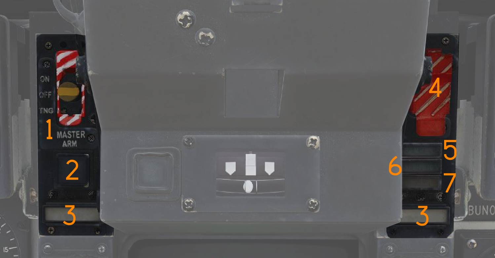
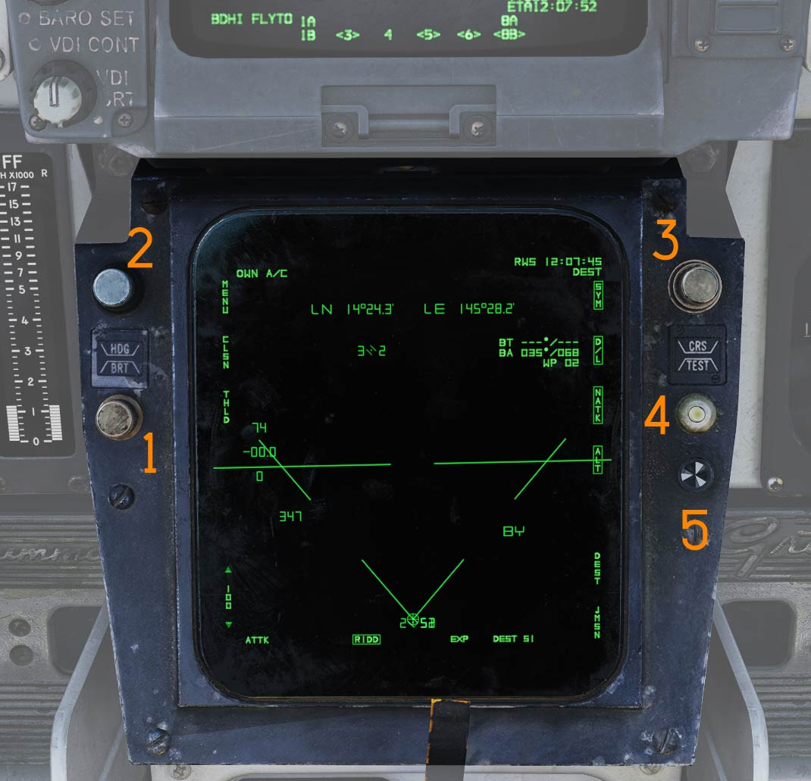
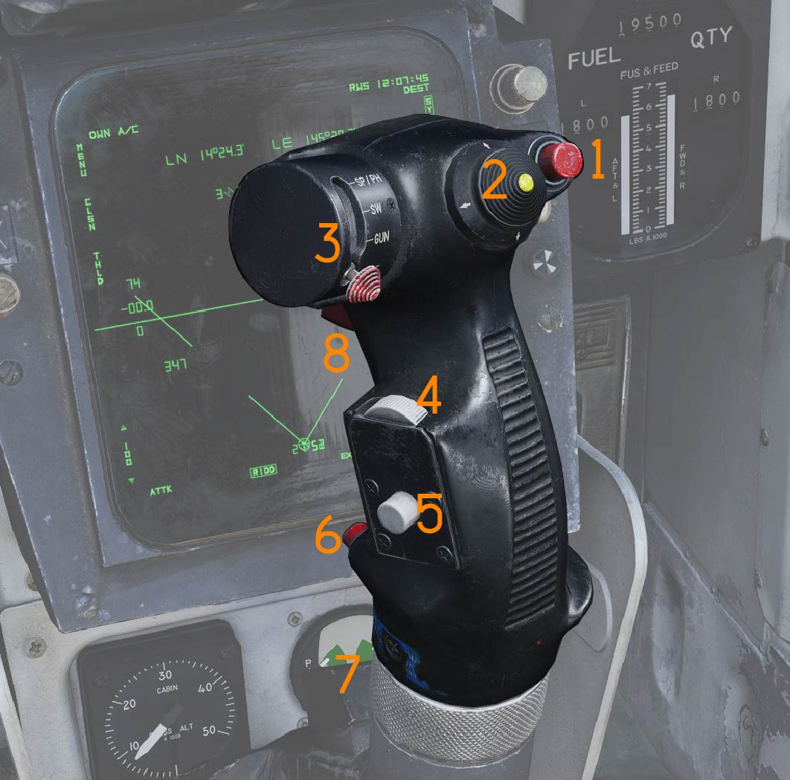

# Center Panel

> 💡 The center panel consists of the:
>
> - Vertical Display Indicator Group Replacement (VDIG-R) (<num>1/2/3</num>)
>   - Heads-Up Display (<num>1</num>)
>   - Vertical Display Indicator (<num>2</num>)
>   - Air Combat Maneuver Panel (ACM) (<num>3</num>)
> - Horizontal Situation Display Indicator (HSD) (<num>4</num>)
> - Pilot control stick
> - Cabin Pressure Altimeter
> - Emergency Brake Pressure Indicator

## Vertical Display Indicator Group - Replacement

The VDIG(R) system displays—the HUD and VDI—are mounted in the chassis unit
assembly, along with peripheral indicators and switches. The HUD and VDI are
located in the front cockpit behind the center windscreen. The HUD is the
primary source of flight information. Flight-critical data (airspeed, altitude,
and attitude) is presented on the HUD in all modes. The Stores Status Indicator
flag information is selectively displayed on the VDI HUD repeat.

With the introduction of the VDIG-R and the HUD assembly, the ACM panel switches
were relocated. In the F-14B(U), some the traditional ACM panel switches are
moved to other parts of the VDIG-R. Additionally, the Master Arm and the ACM
cover have been reversed in the F-14B(U).

## Heads-Up Display

The HUD assembly is part of the [VDIG-R](../../systems/vdig_r/overview.md). Like
the VDI it provides the pilot with symbology for takeoff, cruise, air−to−air
(A/A), air−to−ground (A/G) and landing. Electronically generated symbology
portrays aircraft attitude, command, and tactical information.

The information is displayed on the Heads Up Display (HUD) (<num>1</num>) and
depends on mission phase and the mode of operation the pilot selects for a given
phase. The Vertical Display Indicator (VDI) acts as a HUD repeater, or can
display TCS or LANTIRN video.

Part of the HUD assembly is the cockpit television sensor (CTVS) (<num>2</num>),
the MASTER CAUTION light and reset button (<num>3</num>) and the turn-and-slip
indicator (<num>4</num>).

### Cockpit Television Sensor (CTVS)

The cockpit television sensor (CTVS) (<num>2</num>) records the HUD for
registration of weapons delivery. It activates for 10 seconds after each trigger pull if
the AVTR is powered in the backseat. The gun cam overrides any other currently
chosen recorded source for the duration of the 10 seconds. For more details
refer to the [Airborne Video Tape Recorder Chapter](../../systems/nav_com/com/fast_tactical_imaging_set.md#airborne-video-tape-recorder-avtr).

### Master Caution Light and Button

The MASTER CAUTION light and reset button (<num>3</num>) flashes to indicate a
status change on the pilot caution/advisory panel.

Press to acknowledge and extinguish the light until the next event.

### Turn-and-Slip Indicator

The turn-and-slip indicator (<num>4</num>) displays rate of turn about the
aircraft vertical axis and slip/skid.

The upper section contains an electrically driven pointer, where one needle
deflection corresponds to a 360° turn in four minutes. The lower section
contains an inclinometer with a ball suspended in damping fluid.

> 💡 For more information see relevant chapters under
> [Navigation](../../systems/nav_com/overview.md) and
> [Weapons and Weapons Employment Overview](../../weapons/overview.md).

## Vertical Display Indicator (VDI)

The vertical display indicator (VDI) repeats the HUD by displaying flight and
weapon information.

### HUD Brightness Control

- Upper rotary: HUD BRT control (<num>1</num>) adjusts HUD brightness.
- Lower rotary: HUD/VDI BARO SET (<num>1</num>) barometric altitude selector.

### VDI Brightness Control

- Upper rotary: VDI BRT control (<num>2</num>) adjusts VDI brightness.
- Lower rotary: VDI CONT control (<num>2</num>) adjusts VDI contrast.

### Sidewinder Cooling Pushbutton

Toggle pushbutton with light indication (<num>3</num>) providing manual control
of Sidewinder seeker cooling.

Sidewinder cooling is automatically set to ON when ACM mode is selected.

### Missile Preparation Pushbutton

Toggle pushbutton with light indication (<num>4</num>) commanding the WCS to
prepare AIM-54 and AIM-7 missiles.

Missile preparation is automatically set to ON when ACM mode is commanded.

### Missile Mode Pushbutton

Toggle pushbutton with light indication (<num>5</num>) selecting missile launch
mode.

- NORM - Normal missile launch mode.
- BRSIT - Boresight missile launch mode.

Controlled by the WCS when in ACM mode.

### VDI Caution Lights

VDI-mounted caution lights (<num>6</num>) provide data link warning and caution
indications.

| Indicator    | Function                                                                                                                                                                  |
| ------------ | ------------------------------------------------------------------------------------------------------------------------------------------------------------------------- |
| ADJ A/C      | Advisory light indicating other aircraft close to own traffic pattern.                                                                                                    |
| LANDING CHK  | Advisory light indicating carrier has a channel ready for ACL and that the crew should prepare for carrier landing.                                                       |
| ACL READY    | Warning light indicating CATCC has acquired the aircraft and is transmitting glidepath information to the aircraft.                                                       |
| A/P CPLR     | Warning light indicating CATCC is ready to control the aircraft.                                                                                                          |
| CMD CONTROL  | Warning light indicating the aircraft is under data link control for landing.                                                                                             |
| 10 SECONDS   | Indicates 10 seconds to arrival at the EGI Fly-To point.                                                                                                                  |
| TILT         | Warning light indicating no data link command received for the last 2 seconds during ACL. When not in ACL, it indicates no data link messages during the last 10 seconds. |
| VOICE        | Warning light indicating CATCC not ready for ACL, switch to standard voice procedures.                                                                                    |
| A/P REF      | Warning light indicating autopilot selected but not engaged. Exception: altitude and heading hold.                                                                        |
| WAVEOFF      | Warning light indicating waveoff commanded.                                                                                                                               |
| WING SWEEP   | Warning light indicating failure in both wing-sweep channels or disengagement of spider detent.                                                                           |
| REDUCE SPEED | Warning light indicating flap retraction failure with greater than 225 knots indicated airspeed. Also indicates safe Mach number exceeded.                                |
| ALT LOW      | Non-functional, light on radar altimeter is used instead.                                                                                                                 |

## VDI Specific Displays

Specific VDI Displays (<num>7</num>) .

### BDHI fly-to mode Indicator

BDHI fly-to mode indicator (<num>1</num>).

| Name       | Description                                                                      |
| ---------- | -------------------------------------------------------------------------------- |
| BDHI FLYTO | EGI Fly−To waypoint is selected                                                  |
| BDHI WP #  | Flight Plan Waypoint # is selected                                               |
| BDHI PHUD  | The BDHI steer to point will remain synchronized with the HUD steer to point     |
| BDHI TGT # | GGW/LTS Target waypoint for station # is selected (MAN selected on the AWP)      |
| BDHI LP #  | GGW/LTS Launch Point waypoint for station # is selected (CP selected on the AWP) |
| BDHI TACAN | TACAN is selected on the TACAN Command Panel                                     |

### Stores Status Indicators

Station status Indicators (<num>2</num>) indicate weapon readiness for each
station.

The Stores Status Indicators are displayed on the bottom of the VDI display. SSI
display is inhibited in PDCP T.O. or LDG modes.

- A boxed station indicates a station is selected.
- A station flanked by <> indicates the station is ready.

### Primary and Secondary time to go

The CDNU has a Time Selection Page accessed via the CDNU F6 function key. The
Time Selection menu allows the RIO to select the source for HUD/VDI Primary and
Secondary TTG and ETA windows. The Primary TTG/ETA is present on both the HUD
and VDI. To avoid cluttering the HUD, the Secondary TTG/ETA is present ONLY on
the VDI (<num>3</num>) and defaulted to OFF. If desired, the RIO must manually
select the Secondary TTG/ETA to ON via the F6 page.

## Air Combat Maneuver Panel

Main pilot armament control panel.

### Master Arm Switch

The MASTER ARM switch (<num>1</num>) enables weapons release and selective and
auxiliary jettison.

- OFF - Disables electrical power to release circuitry.
- ON - Enables electrical power to release circuitry. Position is locked until
  the master arm cover is lifted.
- TNG - Enables in-flight training mode.

> 💡 The MASTER ARM bus is interlocked with the landing gear control lever,
> disabling all releases except emergency jettison while the gear is down.

> 💡 ACM jettison and emergency jettison are not disabled by MASTER ARM.

### HUD Cage Switch

HUD CAGE pushbutton (<num>2</num>) is on the left side of the VDIG(R) bezel,
which selects between the Flight Path Marker (FPM) when uncaged, or Climb/Dive
Marker (CDM) when caged, for display on the HUD. The HUD maintains the last
pilot section (CAGED or UNCAGED) when the PDCP selection is changed, unless PDCP
selection is A/G. PDCP A/G default is UNCAGED.

### Engine Fire Warning Lights

The L FIRE and R FIRE lights (<num>3</num>) illuminate when fire is detected in
the respective engine.

### ACM Switch/Cover

The ACM (Air Combat Maneuver) switch/cover (<num>4</num>) enables ACM mode when
lifted and provides access to the ACM JETT button.

### ACM Jettison Button

The ACM JETT button (<num>4</num>) is located under the ACM cover and commands
jettison of stores selected on the RIO’s ARMAMENT panel.

Sidewinders are not jettisoned even if selected.

### SEAM Lock Light

The SEAM LOCK light (<num>5</num>) illuminates to indicate that Sidewinder
acquisition is in progress while in slaved and boresight SEAM modes.

The light illuminates during the 4.5-second SEAM acquisition attempt and remains
illuminated if the seeker locks onto a target.

### Collision Light

The COLLISION light (<num>6</num>) indicates collision steering has been
selected during AWG-9 STT operation.

### Hot Trigger Light

The HOT TRIG light (<num>7</num>) illuminates when HOT TRIGGER conditions are
satisfied. When illuminated, pulling the trigger will release a weapon.

## Horizontal Situation Display Indicator (HSD)

The horizontal situation display (HSD) displays navigational information to the
pilot and can repeat the RIO’s TID.

### HSD Brightness Control

The BRT control (<num>1</num>) adjusts HSD brightness.

### Heading Bug Control

The HDG control (<num>2</num>) adjusts the heading reference bug in TACAN mode.

### Course Control

The CRS control (<num>3</num>) sets desired course in MAN (manual) and TACAN
modes.

### Test Button

The TEST button (<num>4</num>) resets the HSD if overload protection has tripped
and displays the HSD IR field test display.

### BIT Indicator

The BIT indicator (<num>5</num>) indicates HSD failure by displaying white
flags. Reset by rotating clockwise.

> 💡 For more information see relevant chapters under
> [Navigation](../../systems/nav_com/overview.md) and for the TID repeat
> Tactical Information Display (TID) and Associated Controls.

## Cabin Pressure Altimeter

Displays cabin pressure in 1,000-foot increments from 0 to 50,000 feet.

## Emergency Brake Pressure Indicator

Displays hydraulic pressure available from the emergency brake accumulators to
the auxiliary and parking wheel brake systems.

### Parking Brake Pressure

The PARK indication shows brake pressure available for parking brakes.

The green segment indicates 2,150 to 3,000 psi and the red segment indicates
1,900 to 2,150 psi. When in the green, sufficient pressure is available for
approximately three brake applications.

### Auxiliary Brake Pressure

The AUX indication shows brake pressure available for the auxiliary brake
system, usable via toe brakes.

The green segment indicates 2,150 to 3,000 psi (approximately 13 to 14
applications) and the red segment indicates 1,900 to 2,150 psi (approximately
five applications).

## Control Stick

The control stick provides aircraft roll and pitch control and contains
additional weapon and aircraft control functions.

### Bomb Release Button

The bomb release button (<num>1</num>) is the stores release control used for
air-to-ground ordnance (except rockets) and loaded external countermeasures.

### Pitch and Roll Trim Hat

The pitch and roll trim hat (<num>2</num>) controls aircraft trim.

Up/down commands pitch trim and left/right commands roll trim.

### Weapon Select Hat

Selector hat (<num>3</num>) moveable up and down and depressible. Used to select
weapon type and variants.

- SP or PH - Selects AIM-7 or AIM-54. Depression toggles between types.
- SW - Selects AIM-9. Depression toggles between stations.
- GUN - Selects M61A1 Vulcan gun.
- OFF - Inhibits weapon release.

### DLC and Maneuver Flap Command Wheel

The DLC and maneuver flap command wheel (<num>4</num>) controls DLC or maneuver
flaps depending on configuration.

With DLC engaged, forward rotation extends spoilers and aft rotation retracts
spoilers.

With flaps up and DLC disengaged, forward rotation retracts maneuvering
flaps/slats and aft rotation extends them.

The control logic is that pulling the wheel toward the pilot increases lift and
pushing it away decreases lift.

### DLC Engage/Disengage and Countermeasure Dispense Button

The DLC engage/disengage and countermeasure dispense button (<num>5</num>)
engages DLC when flaps are down, throttles are below MIL, and no spoiler system
failure is present.

With flaps up, this button commands the
[ALE-47](../../systems/defensive_systems/countermeasures/ale_47.md) to dispense
program 8. The CMDS programs can be defined in the mission editor.

DLC disengages with another momentary press, raising flaps, or advancing either
throttle to MIL.

### Autopilot Reference and Nosewheel Steering Button

The autopilot reference and nosewheel steering button (<num>6</num>) toggles
nosewheel steering with weight on wheels.

With weight off wheels, it engages enabled autopilot modes.

[Flight Controls Section](../../systems/dfcs/overview.md)

### Autopilot Emergency Disengage Paddle

The autopilot emergency disengage paddle (<num>7</num>) disengages all autopilot
modes and DLC and releases autopilot switches and roll and pitch SAS switches to
OFF.

With weight on wheels, it additionally reverts throttle mode to MAN (manual)
while depressed.

### Weapon Firing Trigger

The weapon firing trigger (<num>8</num>) is a two-stage trigger.

The first detent enables CTVS and gun camera which will record for 10 seconds. The second 
detent releases the selected forward-firing weapon.
