# Left Side Console

> 💡 The Left Side Console consists of the:
>
> - Sensor Control Panel (<num>1</num>)
> - Control Display Navigation Unit (CDNU) (<num>2</num>)
> - LANTIRN Control Panel (LCP) (<num>3</num>)
> - Computer Address Panel (CAP) (<num>4</num>)
> - Communication / TACAN Command Panel (<num>5</num>)
> - Radar Beacon Control Panel (<num>6</num>)
> - Power System Test Panel (<num>7</num>)
> - KY-28 Control Panel (<num>8</num>)
> - Oxygen-Vent Airflow Control Panel (<num>9</num>)
> - G-Valve Button (<num>10</num>)
> - Liquid Cooling Control Panel (<num>11</num>)
> - Eject Command Lever (<num>12</num>)

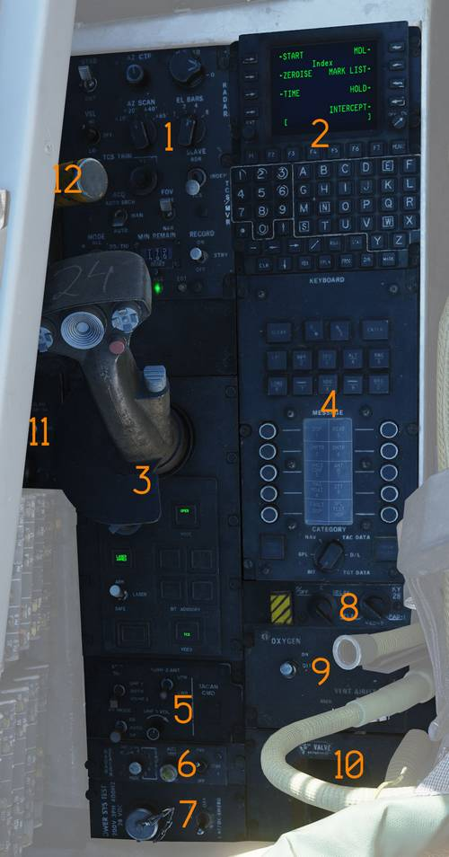

## Sensor Control Panel

The Sensor Control Panel (<num>1</num>) controls radar scan geometry, TCS
operation, and AVTR recording.

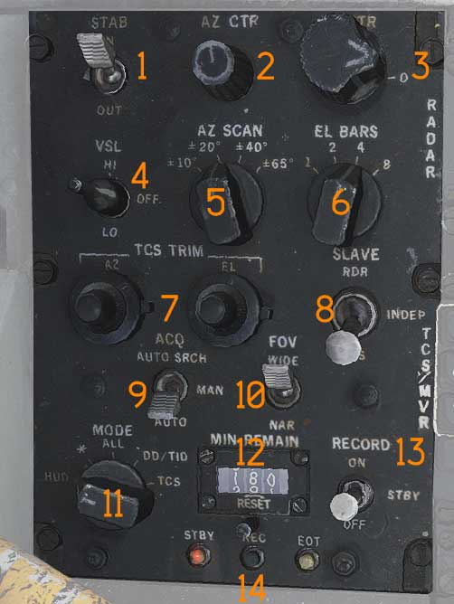

### Stabilization Switch

The STAB switch (<num>1</num>) controls ground stabilization of the radar.

### Azimuth Center Knob

The AZ CTR knob (<num>2</num>) sets the center of the radar azimuth scan.

### Elevation Center Knob

The EL CTR knob (<num>3</num>) sets the center of the radar elevation scan.

### VSL Switch

The VSL switch (<num>4</num>) is spring-loaded to the OFF position and selects
vertical scan mode.

- VSL HI
- VSL LO

### Azimuth Scan Knob

The AZ SCAN knob (<num>5</num>) selects azimuth scan width.

### Elevation Bars Knob

The EL BARS knob (<num>6</num>) selects number of elevation scan bars.

### TCS Trim Knobs

The TCS TRIM knobs (<num>7</num>) adjust azimuth and elevation alignment of TCS
video.

### Slave Switch

The SLAVE switch (<num>8</num>) selects which sensor is slaved to the other.

### Acquisition Switch

The ACQ switch (<num>9</num>) selects TCS acquisition mode.

- AUTO SRCH
- MAN
- AUTO

### Field of View Switch

The FOV switch (<num>10</num>) selects TCS field of view.

- WIDE
- NAR

### AVTR Mode Knob

The MODE knob (<num>11</num>) selects what the airborne video tape recorder
records.

> In the F-14B Upgrade that knob is disabled. VTR recording is selected via the
> ECMD. Reference the
> [Fast Tactical Imaging](../../systems/nav_com/com/fast_tactical_imaging_set.md)
> section of this manual.

### Minutes Remaining Display

The MIN REMAIN display (<num>12</num>) shows remaining recording time.

### Record Switch

The RECORD switch (<num>13</num>) controls AVTR operation.

- OFF
- STBY
- ON

[FTI](../../systems/nav_com/com/fast_tactical_imaging_set.md) is set to operate
with the switch in STBY or ON.

### AVTR Indicator Lights

The indicator lights (<num>14</num>) show AVTR status.

- STBY
- EOT (end of tape)
- REC

## Control Display Navigation Unit (CDNU)

The CDNU (<num>2</num>) replaces the CAP in most of its Navigation input
functions. The CDNU acts as the primary interface with the Navigation system for
the RIO.

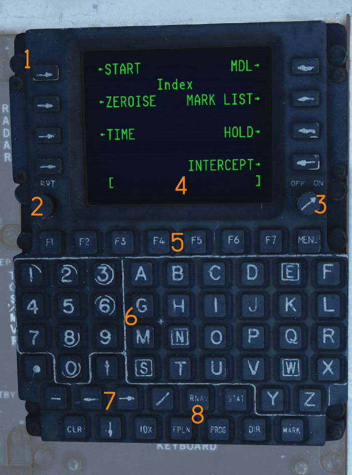

### Line Select Keys

Eight Line Select Keys (<num>1</num>) (LSKs) (Numbered 1 through 8 from left to
right) are used to initiate functions selected, insert data from the scratchpad,
change the mode of operation, or change display to the page indicated when a Go
To Arrow is displayed.

### Brightness knob

The BRT control (<num>2</num>) adjusts CDNU brightness.

### On / Off knob

The ON / OFF knob (<num>3</num>) turns the CDNU ON or OFF.

### Scratchpad

The Scratchpad (<num>4</num>) enclosed by brackets, is the bottom line on the
display, and is used to display data entered using the alphanumeric keys.

### Function keys

The Function keys (<num>5</num>), F1 through F7, allow the operator to perform
specific, aircraft related functions without accessing a particular CDNU page.
Depressing the MENU Key displays the MENU Page, a quick reference guide to the
available functions.

### Keypad

The Keypad (<num>6</num>) Alphanumeric keys allow the selection of either
numbers or letters for entry into the scratchpad. The "N" "S", "E", and "W" keys
are highlighted so they may be easily located when entering position in
Latitude/Longitude coordinates.

### Arrow Keys

The Arrow keys (<num>7</num>) are provided to permit vertical and horizontal
scrolling of pages.

### Dedicated Menu Select Keys

The FPLN (flight plan), PROG (progress), DIR (direct), RNAV (area navigation),
and MARK (<num>8</num>) dedicated select keys allow the RIO to call up and
display navigation data on the CRT.

The STAT (status), MENU, and IDX (index) dedicated select keys permit access to
a variety of information applicable to the general flight operation and
maintenance of the navigation system.

## LANTIRN Control Panel (LCP)

The control panel (<num>3</num>) contains all the controls for the pod,
including the control stick.

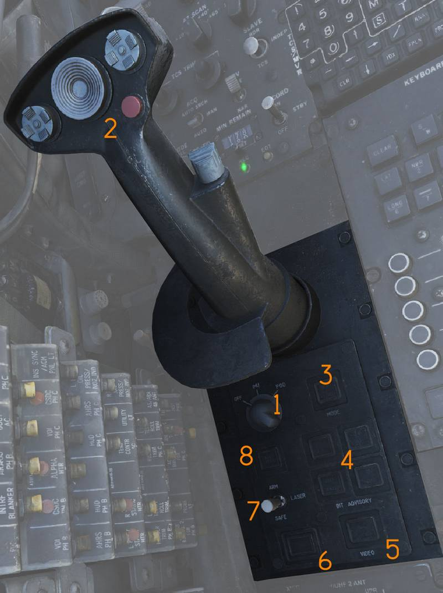

### Power switch

Three-position rotary switch (<num>1</num>). OFF - No power applied to ITS or
targeting pod. IMU - Powers ITS without powering targeting pod. Performs GPS
alignment. POD - Provides full power to targeting pod and ITS.

### Hand Operated Controller

Provides for selection of critical targeting pod operating functions
(<num>2</num>) detailed explanation in LANTIRN chapter.

### Mode switch

Standby/operate switch (<num>3</num>) and indicator.

Following application of full power (POD on), STBY lamp off until all internal
checks complete, FLIR has cooled to operating temperature, gimbal is stowed, and
system is in low power state and ready to be commanded to operate mode.

STBY - Pressing switch when STBY is on commands system to operate mode, while
gimbal is un-stowing, lamp will flash. When gimbal is un-stowed, OPER lamp comes
on and STBY lamp goes off.

OPER - Pressing switch when OPER is on commands system to standby mode and stows
gimbal. While gimbal is stowing, STBY lamp will flash and when fully stowed,
STBY lamp is on steady and OPER lamp is off.

### Bit Advisory Lamps

The four grouped indicator lights (<num>4</num>) indicate various error states
in the LANTIRN system

### Video toggle switch

This switch selects either TCS or FLIR video (<num>5</num>) and provides
positive indication of current video output mode in use. Default selection at
power on is TCS.

- FLIR - LANTIRN FLIR video mode.
- TCS - Television Camera System video mode.

### IBIT switch

The IBIT button (<num>6</num>) initiates the IBIT (Initialized Built-In-Test).

### LASER Arm switch

Lever locked laser arm switch (<num>7</num>).

- SAFE- Laser cannot be fired.
- ARM - Laser can be fired (If all conditions are met).

### LASER Armed lamp

Lamp (<num>8</num>) which indicates laser is armed. LASER ARMED lamp is on when
LASER arm switch is in ARM and is off when LASER arm switch is in SAFE.

## Computer Address Panel (CAP)

The Computer Address Panel (<num>4</num>) is used to enter data into the Weapon
Control System.

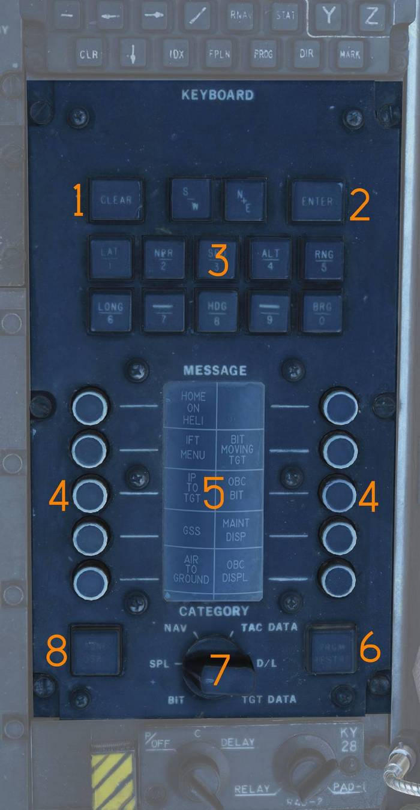

### Clear Button

The CLEAR button (<num>1</num>) clears the current TID buffer without entering
data.

### Enter Button

The ENTER button (<num>2</num>) inserts buffered data into the WCS.

### Prefix and Numerical Buttons

The numerical and prefix buttons (<num>3</num>) are used for data entry.

### Message Selection Buttons

The MESSAGE buttons (<num>4</num>) select functions indicated on the MESSAGE
drum.

### Message Indicator Drum

The MESSAGE drum (<num>5</num>) displays available WCS message functions.

### Program Restart Button

The PRGM RESTRT button (<num>6</num>) restarts the active WCS program.

### Category Selector Knob

The CATEGORY knob (<num>7</num>) selects the active MESSAGE category.

### Tune Disable

The TUNE DSBL function (<num>8</num>) is non-functional.

> 💡 All CAP buttons include indicator lights that illuminate based on selected
> function.

## Communication / TACAN Command Panel

Panel (<num>5</num>) controlling radio selection, antenna routing, and selects
between TCN (TACAN) or EGI (Embedded GPS INS) as the navigation data source.

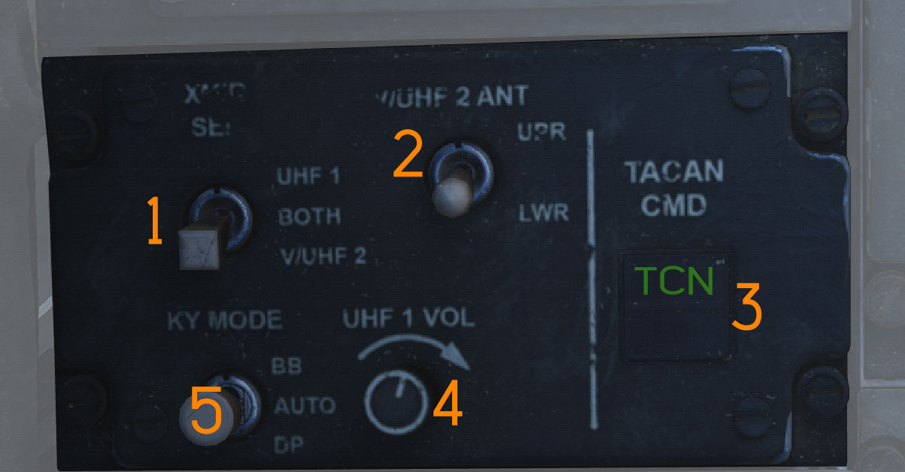

### Transmitter Select Switch

The XMTR SEL switch (<num>1</num>) selects which radio is keyed by the RIO PTT.

- UHF 1 - ARC-159.
- BOTH - Both radios.
- V/UHF 2 - ARC-182.

### V/UHF 2 Antenna Switch

The V/UHF 2 ANT switch (<num>2</num>) selects antenna used by the ARC-182.

- UPR - Upper antenna.
- LWR - Lower antenna.

### TACAN/EGI Command Switch

The TACAN/EGI CMD switch (<num>3</num>) selects whether steering displays
display TACAN or EGI steering.

### UHF 1 Volume Knob

The UHF 1 VOL knob (<num>4</num>) controls UHF-1 audio volume to the RIO
headset.

### KY Mode Switch

The KY MODE switch (<num>5</num>) is only functional with KY-58 encryption.

The simulated aircraft uses KY-58; this switch is non-functional.

## Radar Beacon Control Panel

Panel (<num>6</num>) controlling the AN/APN-154 radar beacon.

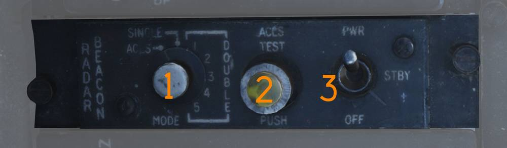

### Beacon Mode Selector

The MODE selector (<num>1</num>) selects beacon operating mode.

- SINGLE - Responds to single-pulse interrogation.
- DOUBLE - Responds to double-pulse code.
- ACLS - Enables ACLS augmentation for carrier landings.

### ACLS Test Button

The ACLS TEST button (<num>2</num>) includes a green indicator light.

- Illuminates during successful test.
- Flashes when SPN-42 radar sweep is detected.
- Steady illumination indicates radar lock-on for ACLS.

### Power Switch

The PWR switch (<num>3</num>) controls beacon electrical power.

- PWR - Beacon fully active.
- STBY - Warm-up mode; ACLS replies enabled if MODE is ACLS.
- OFF - Beacon off.

## Power System Test Panel

Power System Test Panel (<num>7</num>).

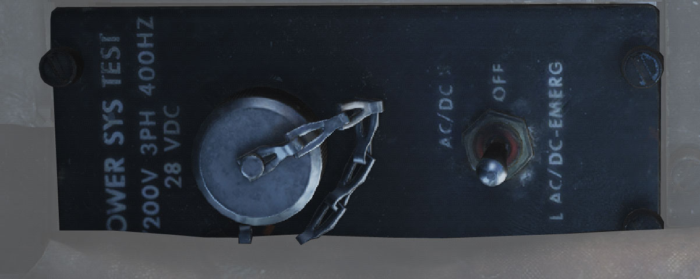

> 💡 Non-functional in DCS.

## KY-28 Control Panel

Encryption control panel (<num>8</num>) for secure voice communications.

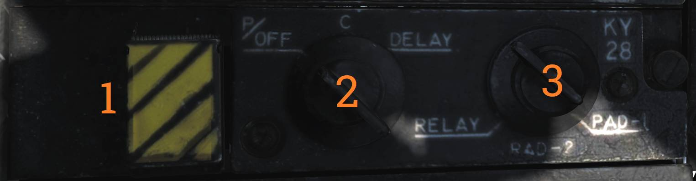

### Zeroize Switch

The ZEROIZE switch (<num>1</num>) clears all encryption keys when actuated.

### Power-Mode Switch

The power-mode switch (<num>2</num>) selects KY-58 operating mode.

### Radio Select Switch

The radio select switch (<num>3</num>) selects which radio is encrypted.

## Oxygen-Vent Airflow Control Panel

Panel (<num>9</num>) controlling ventilation airflow and oxygen supply to the
RIO.

### Vent Airflow Dial

The VENT AIRFLOW dial controls airflow through the pressure suit or seat
cushions when no pressure suit is worn.

### Oxygen Switch

The OXYGEN switch controls oxygen flow to the RIO oxygen mask.

- ON - Oxygen supplied to mask.
- OFF - Oxygen flow shut off.

## G-Valve Button

The G-valve button (<num>10</num>) is pressed to test inflation of the g-suit.

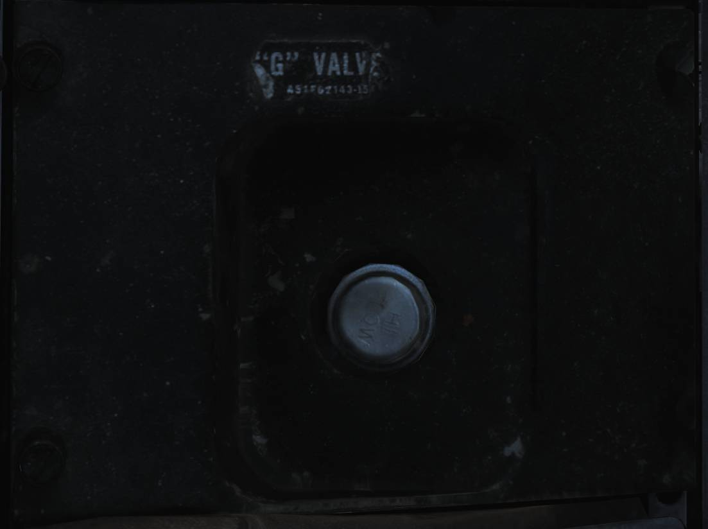

## Liquid Cooling Control Panel

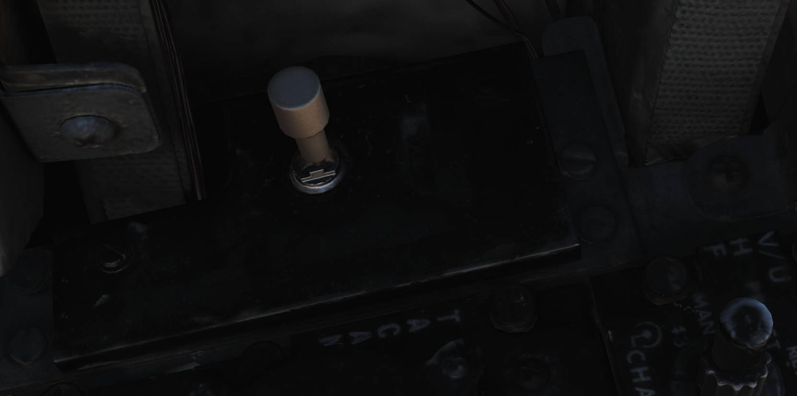

LIQ COOLING switch (<num>11</num>) controlling the liquid cooling system for the
AWG-9 and AIM-54. The AWG-9 circuit can be enabled independently of the AIM-54.
This switch needs to be enabled for the respective system before AWG-9 operation
or AIM-54 missile preparation.

## Eject Command Lever

The EJECT CMD lever (<num>12</num>) determines ejection logic when the RIO
ejects.

- PILOT (lever forward) - Only the RIO ejects.
- MCO (lever aft) - Both crewmembers eject.

Pilot-initiated ejection always ejects both crew members.
