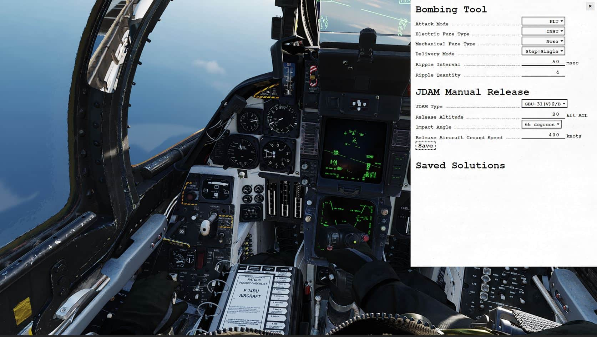

# Bombing Tool

In the F-14, the Bombing Tool gives the Pilot a simplified method to transfer
desired bombing release settings to Jester. The tool is entirely optional to use
for the pilot, as the traditional method of transferring weapon release settings
via the Jester Wheel works alongside the bombing tool. The tool simplifies the
workflow for the Pilot by reducing the time spent in the Jester wheel, if you
require multiple release settings to be set.

For the B(U) aircraft variant, the tool also provides a JDAM Manual Release
Calculator. This can be used to calculate horizontal RMAX (Maximum Release
Range) & TOF (Time of Flight) at different drop parameters, useful in preparing
for a TOO JDAM release.

The tool can be accessed with **RCtrl+B**.

## Input

For each release setting, Jester will automatically change the setting once an
option is entered.

### Attack Mode

- Pilot (PLT)
- Target (TGT)
- Initial Point (IP)
- Manual (MAN)

### Electric Fuze Type

- Instantaneous (INST)
- Preset Time Delay 1 (DLY 1)
- Preset Time Delay 2 (DLY 2)
- Air-burst (VT)
- Safe (SAFE)

### Mechanical Fuze Type

- Nose
- Nose Tail

### Delivery Mode

- Step | Single
- Step | Pairs
- Ripple | Single
- Ripple | Pairs

### Ripple Interval

Tells Jester to set the desired bomb release interval in milliseconds (ms). You
can set it in 10 ms increments per click.

### Ripple Quantity

Tells Jester the desired quantity of bombs to release upon the press of 'weapon
release'.

## JDAM Manual Release

Used to calculate horizontal RMAX (Maximum Release Range) & TOF (Time of Flight)
at different drop parameters.

### JDAM Type

Set to desired JDAM type (drag and glide coefficients are adjusted per JDAM
type).

### Release Altitude

Enter altitude at which you plan to release the weapon. Values in kft, increment
of 5 per click.

### Impact Angle

Set desired final weapon impact angle. Currently only 65 degrees modelled &
selectable.

### Release Aircraft Ground Speed

Enter the planned ground speed for release. Note it is ground speed and **NOT**
IAS or TAS. Increment of 50 knots per click.

Once all parameters are entered, you may click **Save** to add the entry to the
Saved Solutions list, from which you can refer to later during the flight.

> 💡 In order to close the manual, make sure to first remove keyboard focus from
> it by clicking anywhere else in the cockpit.
