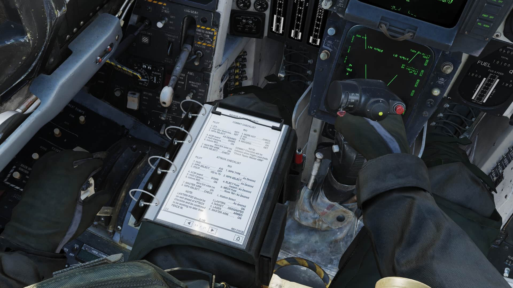

# Checklist Tool

Both crew members can access the Checklist Tool, which provides the crew with
Normal Procedure, Attack & Emergency Checklists, as well as aircraft reference
data. The checklist procedures are an abridged version of the checklists found
in the NAVAIR 01-F14AAP-1B NATOPS Pocket Checklist.

The Checklist Tool can be interacted with the mouse in the cockpit. Navigation
works as follows:

- Each of the 11 sections can be quickly skipped to from the front contents page
  by clicking on the right-hand side section list.
- The pages can also be scrolled manually using the arrows on the bottom
  navigation bar.
- Return to the contents page via the **Home** icon on the bottom right.

The checklist tool is present on both Pilot & RIO 3D models, on the left leg. It
also remains fully interactive on the 3D model itself, without the need to open
it via the keybind. The tool has a default keybinding of **RCtrl+C**.

> 💡 In order to close the checklist tool, make sure to first remove keyboard focus from
> it by clicking anywhere else in the cockpit.
