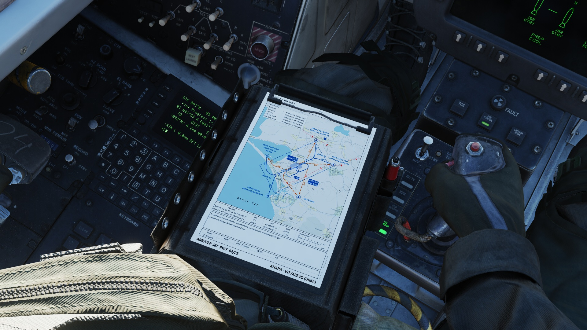

# Checklist Tool

The checklist tool is present on both Pilot & RIO 3D models,
on the left leg. It also remains fully interactive on the 3D
model itself, without the need to open it via the keybind.
The Pilot / RIO 3D models have a default keybinding of
<kbd>RSHIFT</kbd> + <kbd>P</kbd>.

In order to cycle kneeboard configurations, the **clamp** at
the top of the kneeboard must be <kbd>clicked</kbd>.

## Checklist Configuration

The checklists included provides the crew with Normal Procedure,
Attack & Emergency Checklists, as well as aircraft reference
data. The checklist procedures are an abridged version of the checklists found
in the NAVAIR 01-F14AAP-1B NATOPS Pocket Checklist.

The Checklist configuration can be interacted with the mouse in the cockpit.
Navigation works as follows:

- Each of the 11 sections can be quickly skipped to from the front contents page
  by clicking on the right-hand side section list.
- The pages can also be scrolled manually using the arrows on the bottom
  navigation bar.
- Return to the contents page via the **Home** icon on the bottom right.

 The 2D version of the Checklist configuration has a default keybinding
 of <kbd>RCTRL</kbd> + <kbd>C</kbd>.

## Clipboard Configuration

The clipboard configuration provides the crew with the familiar DCS 
kneeboard on the Pilot & RIO models.

Pages can be cycled in desired direction by <kbd>clicking</kbd> on the left or right 
side of the page.

In order to access the clipboard configuration, the clamp at the top of the
kneeboard must be <kbd>clicked</kbd>. This will cycle through the tool configurations.

Alternatively, you can change pages through using the regular keybinds, default:
- <kbd>]</kbd> - Page Up
- <kbd>[</kbd> - Page Down

The 2D version of the Clipboard configuration has a default keybinding
of <kbd>RSHIFT</kbd> + <kbd>K</kbd>.

> 💡 In order to close the 2D checklist tool, make sure to first remove keyboard focus from
> it by clicking anywhere else in the cockpit.
