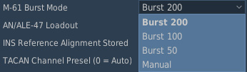
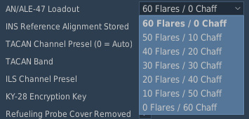
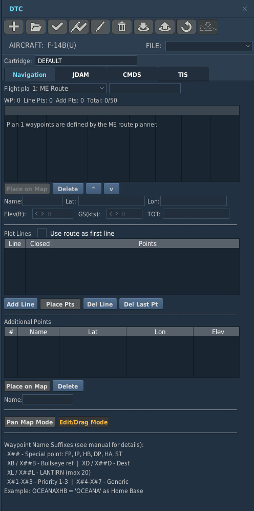
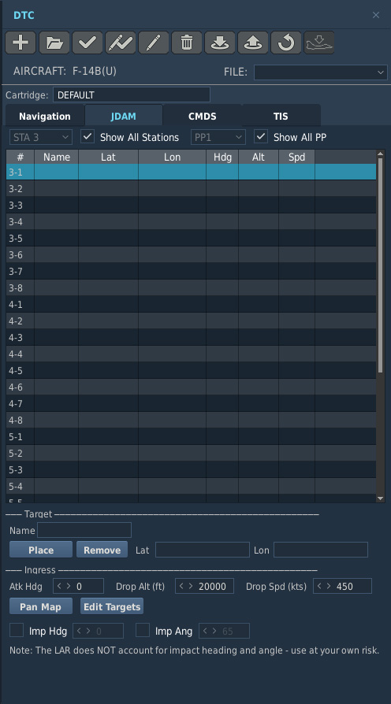
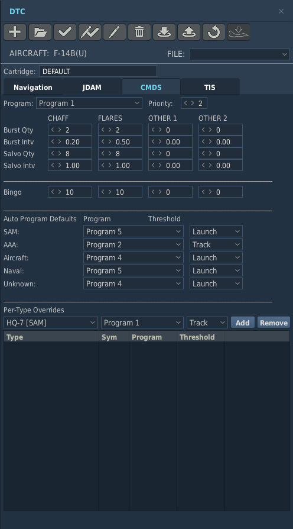
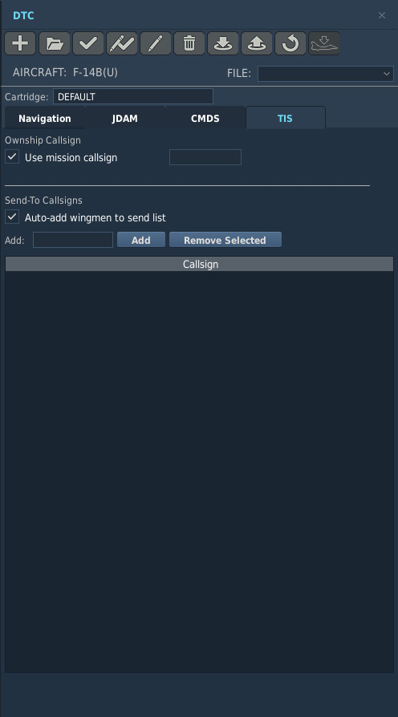

# Mission Editor

> 🚧 Work in Progress

The F-14 has many aircraft-specific settings and waypoints that are configured
in the **Mission Editor**.

## Additional Aircraft Properties

Aircraft specific options are set up under the Additional Properties for
Aircraft page available when setting up an aircraft group containing F-14s.

### M-61 Burst Mode

This dropdown allows for changes in the M61's max burst length. The "Manual"
option fires until empty.

### AN/ALE-47 Loadout

This dropdown allows for changes in the AN/ALE-47 countermeasure loadout.

### INS Reference Alignment Stored

This sets whether INS reference is pre-aligned at spawn. This allows for a
stored alignment to be completed upon aircraft cold start.

### TACAN Channel Preset and Band

This allows the initial TACAN channel and band to be preset.

### ILS Channel Preset

This allows the initial ILS channel preset to be set.

### KY-28 Encryption Key

This allows the initial KY-28 encryption key to be preset.

### Refueling Probe Cover Removed

This option removes the refueling probe cover while loaded in the mission. This
option overrides the livery refueling probe cover option.

## DTC

The F-14B Upgrade has its Mission Data Loader integrated into DCS' Mission
Editor using the DTC menu. Refer to the
[Mission Data Loader section](../systems/mdl/mission_data_loader.md) on more
in-depth how to use MDL with the DTC menu.

### Navigation

Refer to the
[Flight Plan subsection](../systems/mdl/mission_data_loader.md#flight-plan) of
the MDL section for more information.

### JDAM

See the
[Pre-Planned JDAM Employment section](../weapons/air_to_ground/gps_guided_weapons/ggw_employment.md#pre-planned-jdam-employment)
for further information on programming the JDAMs using the DTC menu.

### CMDS

See the
[Programmer section](../systems/defensive_systems/countermeasures/ale_47.md#programmer)
for further information on programming the ALE-47 using the DTC menu.

### TIS (Tactical Imaging Set)

Refer to the
[Fast Tactical Imaging System](../systems/nav_com/com/fast_tactical_imaging_set.md)
page for further information on how to use the Tactical Imaging Set.

#### Ownship Callsign

Callsign for ownship can be changed here. By default, "Use mission callsign", is
checked which means the DCS unit name (pilot) set in the mission editor is used.

#### Send-To Callsigns

The option to disable or enable the ability to auto-add wingmen to send list is
provided. Additionally, callsigns can be manually added to the send list.
