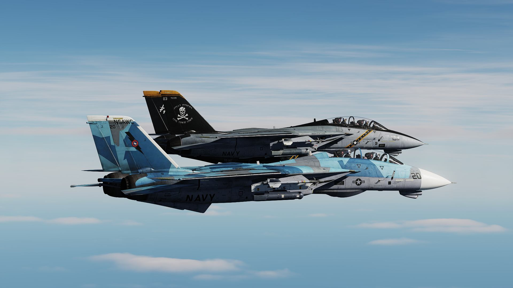

# Lesson 02b: F-14B(U) Cold Start Carrier PILOT

## Lesson 02b: Introduction

Welcome to the cold & dark start up of the F-14B(U) Tomcat on the carrier! Your
aircraft is spawned cold on the parking area of the CVN-74, and you are placed
in the PILOT seat. It is not possible to switch seats during the course of the
lesson.

### Objectives

The instructor will guide you through an extremely abbreviated INTERIOR
INSPECTION procedure, the full PRESTART procedure, the full ENGINE START
procedure, and the POSTSTART procedure for carrier operations until step 26. As
you will notice, the procedures are basically the same as in lesson 02a (cold &
dark from airfield as pilot), but now steps 27 to 51 are left out now, because
they were performed before connecting the catapult. You will then have the
choice to either taxi to the ramp, perform all these checks, and then takeoff on
your own discretion without guidance, or to end the lesson.

### Prerequisites

For the procedures covered in this lesson you do not need experience on the
older versions of the Tomcat.

It is recommended that you first glance over the procedures in order to get a
first overview. Look into your kneeboard or the pictures in the briefing window.
Following the procedures from top to down, you may then read through the
respective sections in the aircraft manual for each aircraft system, although
this takes a considerable amount of time and is not really required for
accomplishing the lesson. Another option is to hop into the jet, start over with
the lesson, and in case you are interested in more details on a certain system,
open up the in-game manual and read after while going through the procedures.

### System tests

As you will notice, many steps during the course of the procedures are system
tests. If you don't want to perform them, you may bypass them by pressing
SPACEBAR during the explanations. For the purpose of DCS, these tests are in
fact not necessary, because in DCS the aircraft is always spawned in a perfect
condition. All such steps are introduced with the phrase "SYSTEM TEST" in the
on-screen text of the DCS window.

### Interaction

Considering you set everything correctly, you can skip instructions by pressing
SPACEBAR, although for many steps it's better to listen carefully before taking
action!

### Planned duration

Considering you listen to all instructions and perform all system tests
carefully, this lesson takes about 20 minutes. If you skip the instructions and
leave out all system tests, this lesson takes about 10 minutes.

## Lesson 02b: Keybindings

Before flying the lesson, check & assign all necessary actions and keybindings
for the F-14B(U) Pilot!

Take special care for bindings that have no clickable control elements in the
cockpit!

### F-14B(U) Pilot > Category > Axis Commands

| Action                                                               | Binding        |
| -------------------------------------------------------------------- | -------------- |
| "Pitch"                                                              | to be assigned |
| "Roll"                                                               | to be assigned |
| "Rudder"                                                             | to be assigned |
| "Throttle Left"                                                      | to be assigned |
| "Throttle Right"                                                     | to be assigned |
| "Throttle (both)"; alternatively if you have only one axis available | to be assigned |

### F-14B(U) Pilot > Category > Stick

| Action                                            | Binding                   |
| ------------------------------------------------- | ------------------------- |
| "Autopilot Reference / Nosewheel Steering Toggle" | N                         |
| "DLC Toggle/Countermeasure Dispense"              | to be assigned            |
| "DLC Thumbwheel Forward"                          | to be assigned            |
| "DLC Thumbwheel Aft"                              | to be assigned            |
| "Trigger"                                         | please de-assign SPACEBAR |

### F-14B(U) Pilot > Category > Throttle

| Action                              | Binding        |
| ----------------------------------- | -------------- |
| "Exterior Lights Master Switch ON"  | to be assigned |
| "Exterior Lights Master Switch OFF" | to be assigned |
| "Left Engine Cutoff - ON"           | to be assigned |
| "Right Engine Cutoff - ON"          | to be assigned |
| "Wing Sweep Forward"                | to be assigned |
| "Wing Sweep Aft"                    | to be assigned |
| "Wing Sweep Auto Mode"              | to be assigned |
| "Wing Sweep Bomb Mode"              | to be assigned |

### F-14B(U) Pilot > Category > Communications

| Action               | Binding |
| -------------------- | ------- |
| "Communication menu" | \       |

### F-14B(U) Pilot > Category > Flight Control

| Action             | Binding    |
| ------------------ | ---------- |
| "Catapult Hook up" | U          |
| "Catapult Salute"  | LShift + U |
| "Flaps Up"         | LShift + F |
| "Flaps Down"       | F          |
| "Trim Pitch Up"    | RCtrl + .  |
| "Trim Pitch Down"  | RCtrl + ;  |

### F-14B(U) Pilot > Category > Gears, brakes, and hook

| Action                       | Binding        |
| ---------------------------- | -------------- |
| "Gears Up"                   | LShift + G     |
| "Gears Down"                 | LCtrl + G      |
| "Hook Extend"                | LCtrl + H      |
| "Hook Retract"               | LShift + H     |
| "Speed brake extend"         | LCtrl + B      |
| "Speed brake retract"        | LShift + B     |
| "Wheel brake both (Gradual)" | to be assigned |

### F-14B(U) Pilot > Category > Jester AI

| Action        | Binding   |
| ------------- | --------- |
| "Toggle menu" | A         |
| "Command 3"   | LCtrl + 3 |
| "Command 4"   | LCtrl + 4 |

### F-14B(U) Pilot > Category > Systems

| Action                 | Binding           |
| ---------------------- | ----------------- |
| "Seat Adjustment Up"   | LShift + S        |
| "Seat Adjustment Down" | LAlt + LShift + S |

## Lesson 02b: Audio & Text

Always listen carefully to the instructor. Assume that everything he says is
important. All text is displayed at the top right corner of the screen. The text
remains visible on the screen for a maximum of 1000 seconds, until it either
disappears after that time, or is replaced by new text. You can access the
message log by pressing the ESC key, and then selecting MESSAGES HISTORY
anytime.

## Lesson 02b: Tips & tricks

_To be filled in once fellow pilots send some feedback ..._
