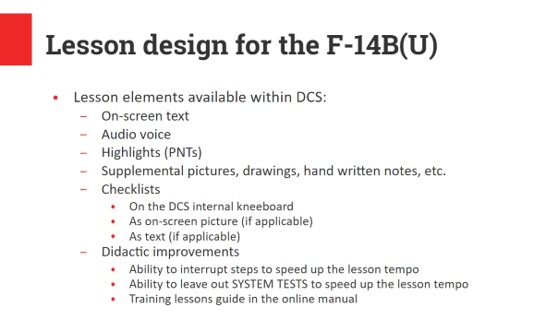

# Training Lessons

> 🚧 Work in Progress

## Introduction

Welcome! Since its arrival in DCS in 2019, the F-14 Tomcat has set the standard
for double seater aircraft. Now, we are proud to introduce the upgraded
F-14B(U). This variant brings essential modernizations to the legendary
airframe, enhancing its combat effectiveness in the digital battlespace. Whether
you are a seasoned Tomcat pilot or just at the very beginning of your aircraft
qualifications, the training lessons introduce you to new features of the B(U)
variant. You will work through the new systems, refined avionics, and updated
workflows that are required to master this wonderful airplane. We've thoroughly
revised the most important lessons in order to improve the quality, stability,
clarity, and learning experience for the most important crew members during the
course of our long-term Tomcat journey, and that is YOU.

## Lesson design

The training lessons for the F-14B(U) have been designed in such a way that, as
a beginner, everything important that you need for a successful start is
explained, without knowing much about the older A/B variants of the Tomcat, and
without reading too much right at the beginning. The lesson design follows the
didactic concept of combining multiple information channels (reading, listening,
observing/checking, doing) to achieve maximum learning effect, focusing on
important things and leaving out unnecessary things whenever possible. The
complexity and richness of the F-14B(U) lessons is somewhere in the middle
between the original F-14A/B lessons from 2019, and the newer F-4E lessons
from 2024. The following slide shows the didactic elements used in the F-14B(U)
training lessons:

## For beginners

For beginners, it should be easy to follow the instructions, because everything
is explained by using on-screen text and audio, together with highlights of the
relevant controls & indications in the cockpit. By initially leaving out steps
that contain a SYSTEM TEST, the lessons can be accomplished in a brief time.
These tests are in fact not necessary for DCS, because in DCS the Tomcat is
always spawned in perfect condition, and you can rely on the systems when you
enter the cockpit. In real life, things were somewhat different though.

## For the pros

Pilots that are interested in details, or pilots approaching the aircraft on a
study level, may accomplish steps containing a SYSTEM TEST as written in the
books. Therefore, a longer lesson duration must be planned. Pilots with
knowledge of the former Tomcat versions will experience no difficulties in going
through the additional steps required by the new equipment. Note that not all
system tests from the books are currently possible, simply because certain
subsystems are not available in DCS.

## Goals

The lessons should enable Tomcat pilots to understand the basic functions of the
new equipment, and how to use it. As pilot or RIO, you can use the lessons as
"initial training", or as "recurrent training" whenever you have not flown for a
long time and need a refresher. By the way: We recommend a refresher after 30
days of not flying the bird. Please note that the lessons require a certain
level of knowledge about DCS and also basic flying skills. The lessons don't
explain flying as such, but rather the aircraft, its systems and their usage and
behavior. The lessons may therefore be understood as interactive "type training"
/ "recurrent training", but not as "basic flying training".

## Your way through

Due to the design, systems, and age of the jet, it has peculiarities. Precise
application of system knowledge in daily duty is the key to success. With the
Tomcat, you will be challenged in so many ways. So be ready! We leave it up to
you whether you want to get into the cockpit immediately without studying the
manual, or whether you want to read before. Decide for yourself! If you want to
hop into the jet immediately, the training lessons will provide you with enough
knowledge to successfully complete them. You can even study this manual section
or other parts of the manual during your flights; this is an innovation that
came with the DCS F-4E Phantom II in 2024 and is now available for all F-14
variants as well. Use keybinding "Manual - Open" (RShift + M) to open up the
manual while flying. The lessons can be paused any time by using the PAUSE or
ACTIVE PAUSE keys. Of course, you are welcome in practicing multi-tasking by
flying at the same time as studying the manual; that is not explicitly
forbidden! Generally speaking, learning by doing is the core strategy for being
a good crew member, but you should read the manual and carefully study the
systems if you want to become a real pro.

## Procedures

We have depicted the important "normal procedures" of the aircraft. These
procedures are based as closely as possible on the real procedures, although we
were aware that it would not be possible to implement everything in the
simulation. Therefore, certain procedures had to be altered, shifted, or omitted
entirely. Omitting steps of the original procedures leads to leaving out their
numbering during the course of the procedure. Please note that the procedure can
therefore continue with step 27 right after step 22. Think, for example, of the
ejection seat harness, the oxygen mask and its test, the transponder, or similar
items which cannot be set or tested. Furthermore, certain steps were not coded
because the respective controls/switches are already set correctly after
spawning the aircraft. This was decided in order to help you speed up the lesson
tempo and to get you in the air as quickly as possible; of course you may check
all these items after entering the cockpit and before pressing SPACEBAR for the
first time.

## Interaction

For many steps, you will need to press the SPACEBAR to confirm what you have
done / checked / heard / found in the cockpit, or to simply progress with the
lesson. Therefore, please make sure that the SPACEBAR key is not assigned to any
other action, like "Weapon fire" or similar.

## Lesson overview

For your training on the F-14B(U) Tomcat, these lessons are currently available:

### Difference training

Lesson 01: F-14BU Differences Familiarization

Lesson 04: F-14BU Basic Navigation

### Type training

Lesson 02a: F-14BU Cold Start Airfield PILOT

Lesson 02b: F-14BU Cold Start Carrier PILOT

Lesson 03: F-14BU Cold Start Carrier RIO

### Weapon training

F-14BU JDAM PP Mode

F-14BU JDAM TOO Mode

## General Tips & Tricks

- Once the lesson was loaded, right before pressing SPACEBAR for the first time,
  please make sure that the actions (keybindings and HOTAS assignments) are done
  properly. For this, go to OPTIONS > CONTROLS and assign keys and joystick /
  throttle buttons to the most important actions. The lessons usually provide a
  list of actions used in that particular lesson, and a few more that we think
  you could need. DCS only provides a rough basic setup for most HOTAS controls
  available on the market, so it is worth looking into this before beginning.

- Make sure your system is able to keep a suitable frame rate of at least 30 fps
  throughout the normal game play. For this, adjust your graphic settings in
  OPTIONS > SYSTEM. You may load one of the INSTANT ACTION MISSIONS, and see how
  your system performs.

- The lessons contain a lot of audio material spoken by an instructor, so be
  prepared to listen a lot. Therefore, adjust the audio settings to a
  comfortable level in OPTIONS > AUDIO. The lessons are designed in a way, so
  that no other surrounding noise disturbs the flow of the lesson, with the
  exception of one lesson, which has a nice surprise right at the beginning
  (sorry, but we couldn't resist).

## Time acceleration

The influence of the time accelerationfunction on the stability of the lessons
is not documented properly. The lessons do not contain phases in which nothing
happens for a long time, so mostly you will not need it. To be on the safe side,
it is most probably better not to use the time acceleration function, especially
if you would like to save track files of your lessons.

## Lesson got stuck

There might be situations in which you feel the lesson does not continue or no
longer works properly for any reason. Fortunately, this happens very rarely!
Nevertheless, if you get stuck in a lesson, you should take the following
measures:

- Act like a pilot: Stay calm!

- Check if everything is actually set up as required and according to the
  checklist / procedure. If necessary, check each of the previous steps
  individually and carefully, starting from the top by asking yourself the
  following questions: "What is written in the procedure / checklist / book?"
  and "How did I set it up?". An example is the Wing Sweep Handle; it can be
  moved aft, but if the oversweep locks open, you may then move it further aft.
  This requires precision and patience, but also knowledge of how the lever and
  the control and indication system works.

- You may repeat the step before, and then approach the current step once again.

- If that does not help and you cannot go further:

- Quit the mission and SAVE DEBRIEFING (log-file) and SAVE TRACK (trk-file) in
  the debriefing screen.

- In such a case, we recommend flying the mission again before posting in the
  forums.

- If you then still suspect the same issue, please open a new ticket in the DCS
  forum: English > Licensed Third Party Projects > Heatblur Simulations > DCS:
  F-14B(U) > [Problems](https://forum.dcs.world/forum/1434-bugs-problems) Please
  add as much information as possible in order to help us finding the issue.
  Best is to add a track file of your flight. We apologize for that, and also
  thank you in advance for your efforts reporting a possible bug!
