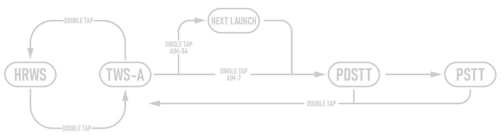
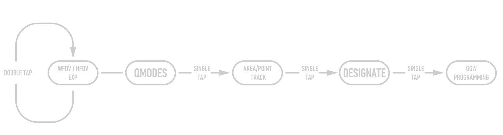

# Jester

> 🚧 Work in Progress

The context command (by default V) allows for intuitive cooperation and exchange
between Pilot and RIO based on the following contexts:

- A/A PDCP Mode - Pilot Display Control Panel A/A

- A/G PDCP Mode - Pilot Display Control Panel A/G

## A/A Context Key Actions

## A/G Context Key Actions

