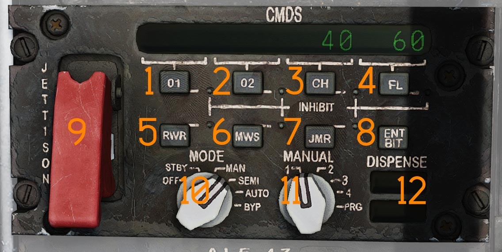
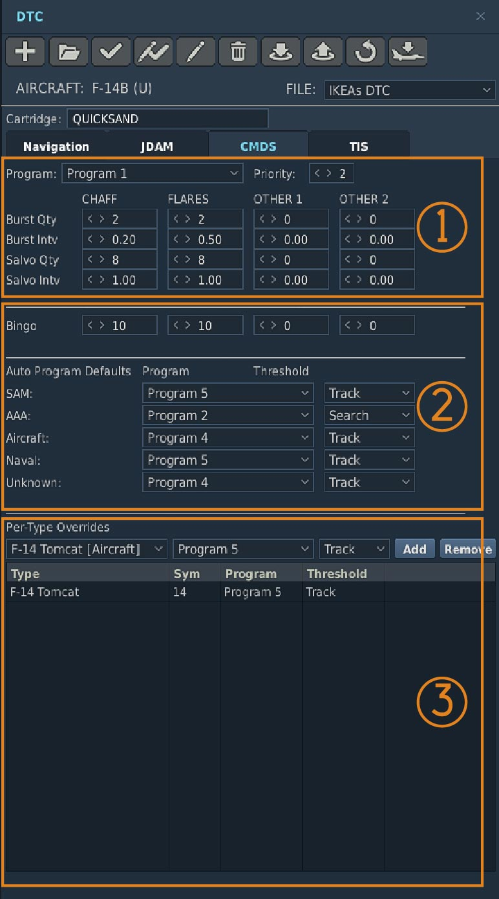
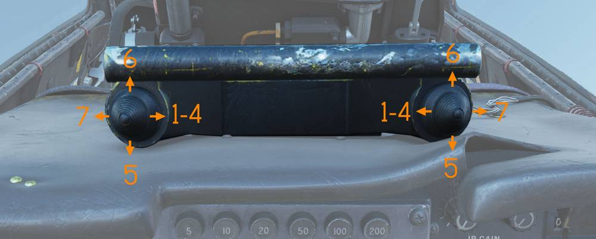

# AN/ALE-47 Countermeasures Dispensing Set

The F-14B Upgrade is equipped with the AN/ALE-47 Countermeasure Dispensing Set.
The ALE-47 uses the legacy launchers from the AN/ALE-29 and integrates the
LAU-138 Chaff and Flare Dispenser.

The launchers each have two sections, one containing 10 cartridges and the
other 20. They are referred to as the left and right dispensers, even though the
left dispenser is actually the forward launcher and the right dispenser is the
aft launcher, with both mounted in line on the left side of the tailhook.

The launchers have a total capacity of 60 cartridges. Each section can hold only
one type of cartridge, meaning that any combination of cartridges is possible as
long as the quantity of each type is a multiple of 10. The ALE-47 recognizes
loaded cartridges, so when reloading cartridges the panel automatically presents
totalized countermeasure values.

The system provides eight programs that can be defined in the Mission Editor
CMDS section of the DTC. The pilot only has control of Program 8 via the DLC
switch on the control stick. Programs 5, 6, and 7 are actuated using the RIO's
countermeasure switches located above the DDD. Programs 1 through 4 can be used
as automatic, semi-automatic, or manual programs. Depending on the selected
operating mode, these programs are dispensed using the inboard RIO
countermeasure switch located above the DDD.

## Digital Control Display Unit (DCDU)

The DCDU is located on the RIO right side console. It serves as the primary
operator interface with the CMDS. The DCDU allows the operator to jettison
remaining expendables, see system information as displayed by the 16 character
display, inhibit the dispensing of specified countermeasures, initiate BIT,
select mode of operation, and select one of four pre-programmed dispense
programs.

### INHIBIT Button Functions

The INHIBIT function is initiated by pressing one of seven expendable inhibit
buttons: Other 1, Other 2, Chaff, Flares, Radar Warning Receiver (RWR), Missile
Warning System (MWS), or Jammer (JMR). When depressed, the respective LED will
illuminate when the countermeasure type is inhibited from dispensing.

#### OTHER 1 Button

The (O1) button (<num>1</num>) Inhibits countermeasure type O1.

#### OTHER 2 Button

The (O2) button (<num>2</num>) Inhibits countermeasure type O1.

#### CHAFF Button

The (CH) button (<num>3</num>) Inhibits countermeasure type chaff.

#### FLARES Button

The (FL) button (<num>4</num>) Inhibits countermeasure type flares.

#### Radar Warning Receiver Button

The RWR button is (<num>5</num>) not utilized.

#### Missile Warning System Button

The MWS button (<num>6</num>) Inhibits dispense programs 7 and 8.

#### JAMMER Button

The JAMMER button is (<num>7</num>) Not utilized.

> 💡 Not functional.

#### ENTER/BUILT IN TEST Button

Actuating the ENT/BIT switch (<num>8</num>) results in initializing IBIT, or
advances past queries returning a "no" response when system queries are
presented on the DCDU.

> 💡 Not functional.

### Guarded JETTISON Switch

The guarded JETTISON switch (<num>9</num>) initiates a complete dispense of any
remaining DTM designated jettison-able countermeasures.

### MODE Control Switch

The Mode control switch (<num>10</num>) is a 6-position rotary switch is used to
select one of six modes of operation.

### MANUAL Switch

The Manual switch (<num>11</num>) is a 5-Position rotary that allows selection
of countermeasure dispense programs 1 through 4 and PROGRAM (PRG).

### READY/NO GO Display

The Ready display (<num>12</num>) is not utilized. Only illuminated during
system power-up.

The NO GO annunciator illuminates when the CMDS is NOT ready to dispense because
of a system failure, during initial power-up, and in BYP Mode.

#### OFF Position

OFF mode interrupts all power to the CMDS dispenser assemblies. This MODE of
operation is overridden by JETTISON only

#### STANDBY Position

STBY mode allows the CMDS to power-up and initialize. The only dispensing
function available while in STBY is JETTISON.

#### MANUAL Position

MAN mode allows the operator to select a manual program for dispensing. One of
the Four programs (1-4) selected by the MANUAL switch can be initiated by
actuating the designated DISPENSE switch. In manual the system will default to
the program chosen on the manual switch and the actuation of the inboard switch
on the countermeasure dispense switches only dispenses that chosen program.
Programs 5, 6 and 7 may also be dispensed by actuating the RIO countermeasure
dispense switches above the DDD. Countermeasures will be dispensed in accordance
with parameters as defined by the MDL.

#### SEMI-AUTOMATIC Position

SEMI mode allows the operator to select a manual dispensing program. One of four
preset programs, selected with the MANUAL switch, can be initiated by actuating
the designated DISPENSE switch. When the system detects a threat programmed via
the MDL, it selects the appropriate dispensing program. However, the selected
program will only be dispensed once the RIO depresses the inboard countermeasure
switch. As long as enough countermeasures remain, the operator requested program
can be dispensed at the same time as the semi-automatic program. All programs
are available for semi-automatic dispensing, provided they are pre-set via the
DTM.

#### AUTOMATIC Position

AUTO mode allows the system to respond automatically to detected threats. When
the system detects a threat programmed via the MDL, it automatically selects and
dispenses the appropriate countermeasure program without requiring RIO input.
All programs are available for automatic dispensing, provided they are pre-set
via the DTM.

The inboard countermeasure switch is disabled as long as no program has been
selected by the system. Programs 5, 6, 7, and 8 continue to function normally.

#### BYPASS Position

BYP allows selection of bypass mode for jettison only. To select the BYP
position press knob down at AUTO position and turn.

### CMS MANUAL Switch

The Manual switch (<num>11</num>) is a 5-Position rotary that allows selection
of countermeasure dispense programs 1 through 4 and PROGRAM (PRG).

#### Positions 1 through 4

Switch positions 1 through 4 are used to select one of four pre-programmed
dispense programs. The selected dispense program is initiated by a command from
the designated dispense switch in MAN, SEMI, and AUTO modes.

#### PROGRAM Position

If PRG is selected the ALE-47 system will default to manual program 4 for
dispense.

### READY/NO GO

The Ready display (<num>12</num>) is not utilized. Only illuminated during
system power-up.

The NO GO annunciator illuminates when the CMDS is NOT ready to dispense because
of a system failure, during initial power-up, and in BYP Mode.

## Controls and Operation

> 💡 In DCS the F-14 countermeasure loadout is set in the Mission Editor, see
> DCS Mission Editor Functions Specific to the HB DCS F-14 or controlled through
> the radio menu under ground crew. The default setting in the mission editor is
> bypassed. To see the real loadout check the kneeboard.

## Programmer

The Programmer is part of the Programmer Panel Assembly and is the central
processing, controlling and communications unit of the CMDS.

### Countermeasure preset priority

Priorities can be assigned to any program. When a higher priority program is
running, initiating a lower priority program will not have any effect, where
initiating a higher priority program will override the previously running
program.

### Bingo

A Countermeasure Bingo can be defined in the Mission editor and programmed into
the MDL. When that Bingo state is reached the ALE-47 panel with show "LoXX",
where XX indicates the number of countermeasures of any type remaining as per
the DTM setting.

> 🔴 WARNING: All countermeasure cartridge ejection is inhibited while the
> weight on wheels sensor is active, preventing countermeasure ejection while on
> the ground.

(<num>1</num>) In this section the operator can select the program-specific
chaff and flare burst quantities, burst intervals, salvo quantities, and salvo
intervals. The dropdown selects which program is currently being modified.
Program 7 is the default program for Jester to dispense. Program 8 is the pilot
dispensing program.

(<num>2</num>) In this section the default auto programs are selected. Programs
1–8 are available for automatic or semi-automatic release. For example, setting
Program 5 as the default SAM program with the threshold Track will have Program
5 be automatically dispensed when a SAM radar is in track mode. Depending on
operator choice, the ALE-47 will then dispense the desired program automatically
(AUTO) or select the automatic program to then be released only once the RIO
depresses the inboard countermeasure switch.

(<num>3</num>) In this section threat-specific programs can be chosen, whereas
in the section above only general threat categories can be chosen. For example,
when selecting the radar type F-14 with the threshold Track, once an F-14 STT
lock is detected by the ALR-67, Program 5 will be selected.

## RIO Hand Hold Switches

Two countermeasure switch hats (<num>1</num> and <num>2</num>) are located on
the RIO center handhold and are used to initiate release of countermeasures.

The switches are functionally mirrored.

- **Up** - Initiates CMS program 6.
- **Down** - Initiates CMS program 5.
- **Inboard** - Initiates CMS program 1-4, depending on which semi-automatic
  program is selected or which program is selected on the DCDU.
- **Outboard** - Initiates CMS program 7.

## Countermeasure dispenser setup

The F-14 both has the native countermeasure buckets mounted on the main
airframe, as detailed above they can be filled with chaff or flares in sets
of 10. So for example 30 chaff and 30 flare can be mounted in the buckets.

The F-14B(U) tomcat is also equipped with the LAU-138 rails, these rails in
reality held BOL Chaff and BOL Flares. Due to the limited DCS simulation only
Chaff is available for dispensing from the LAU-138.

Each rail is filled with 40 chaff packets, the rails always dispense together,
providing 40 chaff releases.
