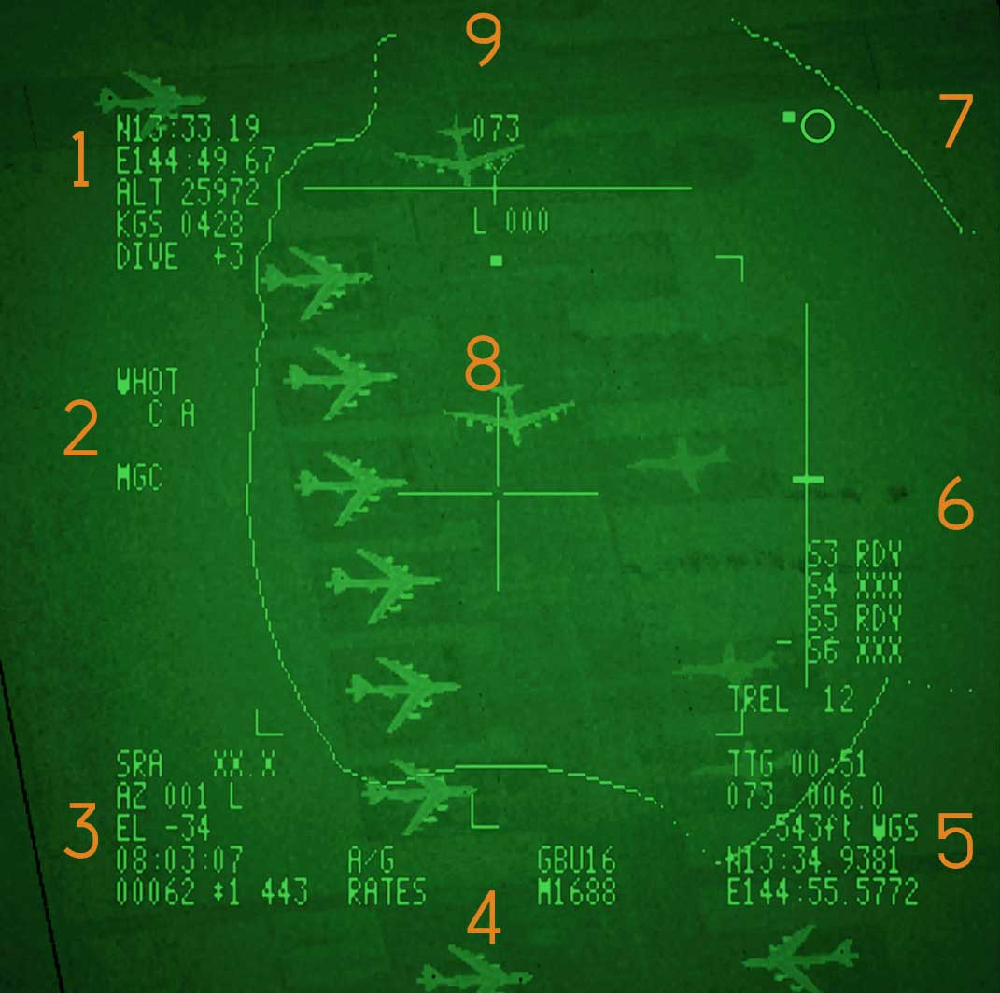

# LANTIRN

The **LANTIRN (Low Altitude Navigation and Targeting Infrared for Night)**
system was originally developed as a combined navigation and targeting pod for
the F-15E and F-16. When the U.S. Navy sought to expand the F-14 Tomcat's
air-to-ground capability, Martin Marietta (now Lockheed Martin) adapted the
targeting pod for integration with the aircraft. The navigation pod was omitted,
leaving only the targeting pod in service with the F-14.

On early F-14 implementations, the aircraft lacked the required MIL-STD-1553
data bus for full integration. The LANTIRN pod therefore operated as a largely
self-contained system.

The F-14B Upgrade introduces full integration between the aircraft and the
LANTIRN pod. The pod now communicates directly with aircraft systems, allowing
the VDIGR to display the LANTIRN line of sight in all operating modes.
Integration with the AWG-9 radar also enables the pod to automatically slave to
the radar line of sight.

The LANTIRN control panel (LCP) is retained in the F-14B Upgrade, TCS Video Feed
or LTS video feed can still be toggled via the LCP TCS/LTS video switch. TCS or
LANTIRN video feeds can also be selected through the
[ECMD video Menu](../../../f14bu/systems/pmdig/programmable_multiple_display_indicator_group.md#video-display).

The LANTIRN FLIR sensor provides three selectable fields of view. The Wide field
of view covers 5.9° and supports a maximum slew rate of 8.5° per second. The
Narrow field of view covers 1.7° with a maximum slew rate of 1.8° per second.
The Expanded field of view provides a 0.8° digital zoom of the Narrow field of
view, reducing image resolution while limiting maximum slew rate to 0.7° per
second.

## A/A Mode

Integration with the AWG-9 radar enables the pod to automatically slave to the
radar line of sight during air-to-air when QADL is selected and the radar is in
STT. The RIO can command a LANTIRN point track to continue tracking the target
independently, even if the STT track is lost. If point track is subsequently
lost, the pod automatically returns to QADL.

## A/G Mode

In A/G mode the LANTIRN operates in 3 Basic Tracking modes:

### Area Track

Area track enables the LTS to track a fixed Infrared (IR) scene if the scene
contains some temperature variations or thermal texture. The LTS enters area
track when commanded by the RIO or when the system defaults from point track.
Once selected, an AREA status indication appears on the RIO PTID LTS display. If
area track is selected but lock-on is unobtainable, the LTS defaults to computed
rates track.

### Computed Rates Track

Computed rates track provides interim line of sight (LOS) control during the
transition from one LOS control scheme to another, or whenever track is
temporarily broken. The computed rates track logic calculates the current
position of the target from previous target motion data to maintain target
tracking until the ensuing function takes control of the LTS LOS. The LTS
defaults to the computed rates track function if other tracking modes cannot be
entered or maintained.

### Point Track

Point track enables the LTS line of sight (LOS) to track a hot spot such as a
tank or vehicle. The LTS enters point track when selected by the RIO. Once
selected, a POINT status indication appears on the PTID LTS display. If point
track is selected but lock-on cannot be obtained or maintained (e.g., the target
is too close and has too little thermal detail to point track), the LTS defaults
to area track mode, except A-A mode in which case the LTS transitions to
computed rates mode.

> 💡 Point Track with the LANTIRN can only be engaged on object that appear
> white on a dark background no matter the polarity mode (WHOT or BHOT). In DCS,
> due to limitations in simulation, Point Track can only be initiated in WHOT
> mode. Once Point Track is successfully engaged in WHOT, it is possible to
> change the polarity to BHOT.

## Q (Cue) Modes

- Q Waypoint: With Q waypoint any of 20 LTS designated waypoints can be toggled
  to. (See Waypoint list explanation below).

- Q GGW Target: GPS Guided Weapon Targets Stored in the Mission Data Processor
  can be cued by the LTS, these targets are stored separately from the overall
  20 waypoint list.

- Q HUD: slaves the LTS LOS to the HUD.

- Q SNOWPLOW: slaves the sensor to the ground 15 NM directly in front of the
  aircraft along own aircraft heading. QADL and QHUD slave the sensor to either
  ADL (in A/A) or the aircraft wings symbol on the HUD (in A/G).

- Q DES: slaves the LTS back to the last obtained designation.

- Q Bullseye: slaves the LTS to the Bullseye Designated waypoint.

## Waypoint List

The LANTIRN Pod can access a list of 20 waypoints designated either during pre
flight planning or via the CDNU. Additionally any newly created LTS waypoint is
stored in the LTS waypoint list. The LTS waypoint list is modified via the
[WP Edit 2/2 page](../../systems/nav_com/cdnu/control_display_navigation_unit.md#waypoint-edit-page-22).
LTS waypoints are marked by a small L posted on the
[NVD PLT](../../systems/ptid/programmable_tactical_information_display.md#navigation-data-plot-line-nvd-plt-page)
and
[NVD WP](../../systems/ptid/programmable_tactical_information_display.md#navigation-data-waypoint-page-nvd-wp-page)
pages.

## Coordinate formats

The CDNU
[RNAV](../../systems/nav_com/cdnu/control_display_navigation_unit.md#rnav-inav-page)
page lets the RIO toggle between DMS, DMM and MGRS coordinate formats for
display on the LTS display.

| Type         | Display Example                 |
| ------------ | ------------------------------- |
| MGRS         | 37TDH4989754515                 |
| Lat/Long DMM | N4358.257W10700.347             |
| Lat/Long DMS | LAT N133528.44 LONG E1445647.76 |

## LTS Designated Waypoints

The RIO may create a new CDNU flight plan waypoint directly from a LANTIRN
target designation. After establishing a valid LANTIRN target designation,
holding the **S-7** switch on the LANTIRN Control Panel (LCP) for at least **2
seconds** stores the designated target coordinates (latitude/longitude) and GPS
Figure of Merit (FOM) as a new waypoint in the active flight plan. New
LTS-generated waypoints are assigned the next available waypoint number
beginning with **Waypoint 51**.

If fewer than **20** waypoints in the flight plan are designated as LANTIRN
(LTS) waypoints, the new waypoint is automatically assigned the LTS designation
and is identified by an **"L"** in the upper-right corner of the waypoint number
on the PTID NVD page. If 20 LTS-designated waypoints already exist, the waypoint
is still created but is not assigned the LTS designation.

The waypoint name is automatically generated to indicate the quality of the
target designation using the following format:

`/LT[Laser][GPS][FOM]`

Where:

- The first character is:
  - "\*" – Valid laser range available at designation.
  - "-" – No valid laser range available.

- The second character is:
  - "\*" – GPS aiding available at designation.
  - "-" – GPS aiding unavailable.

- The final digit is the GPS **Figure of Merit (FOM)**.

Examples:

- "`/LT**1`" – Valid laser range, GPS aiding available, FOM 1.
- "`/LT-*4`" – No laser range, GPS aiding available, FOM 4.

When the designation is made with both valid laser ranging and GPS aiding, and
the GPS Figure of Merit is **1** ("`/LT**1`"), the target altitude displayed by
the LANTIRN is transferred to the waypoint. If these conditions are not met, the
waypoint altitude is set to 0 feet.

Holding the **S-7** switch for more than two seconds always creates a new
waypoint. If valid target coordinates are not currently displayed on the FLIR,
such as when operating in QHUD mode, the last available target coordinates are
stored instead. Likewise, if the LANTIRN is cued to a GPS-Guided Weapon (GGW)
target or an existing waypoint, those displayed coordinates are copied into the
new waypoint.

If the LANTIRN calculates a negative Height Above Ellipsoid (HAE) during
waypoint creation, an incorrect altitude may be transferred to the CDNU. In this
case, the RIO must manually correct the waypoint altitude using the CDNU after
the transfer is complete.

## LANTIRN North Cue

During close air support (CAS) or Forward Air Controller Airborne FAC(A)
missions it is crucial for the aircrew to know where north is based on where the
LTS is looking. As such with the F-14B(U) software tapes an LTS north indicator
was introduced. The circle represents a simplified rotating compass the square
always points to where north is. So if for example the square is left of the
circle, then the LANTIRN pod is facing eastwards.

## LANTIRN Line Of Sight Cue

The LANTIRN Line of Sight Cue is presented in the VDIG-R when the RIO has LTS
selected on the LCP. It replaces the TCS cue in both A/A and A/G when selected.
If LANTIRN is in a non tracking mode an "N" is presented at the bottom of the
triangle. The tracking modes are AREA Track and POINT track. In all other modes
or Q modes an N is posted in the triangle. When the LTS cue is outside the HUD
field of view it becomes dashed. In A/A with LANTIRN slewed to the radar LOS in
STT the LTS LOS cue points along the radar LOS.

## LANTIRN Video Elements

(<num>1</num>) Own Aircraft positional data:

- Position
- Altitude
- Groundspeed
- Pitch Angle

(<num>2</num>):

- WHOT (White Hot) or BHOT (Black Hot)
- AGC (Automatic Gain Control) or
- MGC (Manual Gain Control)

(<num>3</num>) Pod Information

- SRA: slant range
- AZ and EL is pod line of  
  sight azimuth and elevation  
  relative aircraft ADL
- UTC Time
- IBIT Codes

(<num>4</num>):

- A/G Mode or A/A Mode
- Rates Track (RATES)
- Area Track (AREA)
- Point Track (POINT)
- LASER CODE
- Weapon Type

(<num>5</num>):

- Target Information Q (Current Slew Point) (Except for QSNO, QADL, QHUD)
- Time to go until on top of the Currently selected Q
- Bearing and Range to Q
- Elevation to Q
- Location of Q (Only Displayed if a Location Q is selected)

(<num>6</num>) Attack Information:

- Stores Status and Time To Impact Indicators. (S6XXX) (S3RDY)
- Vertical line is the bomb release cue.
- The bomb release cue, is only shown if the selected Q is QDES and shows a
  vertical line along which a release cue travels downwards.
- TREL (Time to Release) changes to
- TIMP (Time to Impact) after bomb release

(<num>7</num>) North Indicator.

(<num>8</num>) LTS Reticle.

(<num>9</num>) Attack Information:

- Steering guidance towards the selected Q.
- Top line is deviation from heading (L/R Degrees)

## LANTIRN Display on PTID

The LANTIRN pod feed is displayed on PTID via depressing the TCS switch in front
of the HCU. With the video feed enabled TCS and LTS feeds can be toggled via the
LANTIRN control panel or the
[ECMD video Menu](../../../f14bu/systems/pmdig/programmable_multiple_display_indicator_group.md#video-display).

Once the TCS or LANTIRN feeds are displayed on PTID they are overlaid with the
PTID symbology. To disable the PTID symbology depress Pushbutton 7 OL on the
[PTID Menu](../../systems/ptid/programmable_tactical_information_display.md#menu-page).

For a complete discussion of LANTIRN modes and controls refer to the
[LANTIRN Chapter](../../../f14ab/systems/lantirn/overview.md) in the F-14A/B
manual.
