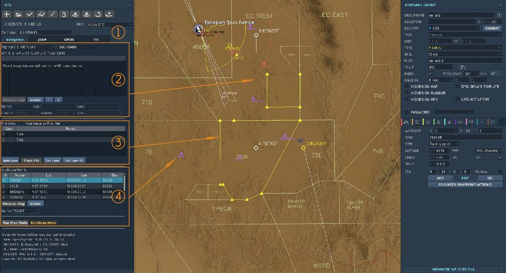

# Mission Data Loader

The Mission Data Loader (MDL) provides bulk storage of mission-essential data.

The Data Transfer Module (DTM) can be loaded in the Mission Editor with a range
of navigation and mission computer data. Navigation data are transferred to the
CDNU using a special pass-through function of the EGI.

The MDL may contain two separate waypoint databases, a magnetic variation
(MAGVAR) table, up to twelve flight plans, and the current GPS almanac. The
waypoint databases contain 5-character alphanumeric identifiers and the
associated data for each waypoint, as well as the effective dates of the
information.

The primary waypoint database is maintained on the MDL. When a DTM is inserted
into the MDL, identifier indices are automatically transferred into CDNU memory
to speed the search process when a specific waypoint is requested. Transfer of
the indices to the CDNU takes approximately 60 seconds. The primary waypoint
database is not available until this process is complete.

The MDL Start page is accessed by scrolling up from the EGI Start 1/2 page or
down from the EGI Start 2/2 page. Display line 3 contains the MDL cartridge
label and date stamp; display line 3 is blank if no cartridge is installed.
Display line 5 contains the date stamp for the MAGVAR table if it is loaded;
otherwise, it is blank. Pressing LSK4 on this page erases the flight plan
currently loaded into the CDNU. Pressing LSK8 transfers the user to the Flight
Plan Select 1/2 page.

(<num>1</num>) Indicates data is from the Revisionary Database.

(<num>2</num>) Name of current Flight Plan.

(<num>3</num>) Mag Var Date.

(<num>4</num>) Erases currently loaded flight plan.

(<num>5</num>) Date of Cartridge edit.

(<num>6</num>) Date of the currently loaded flight plan.

(<num>7</num>) Date of the currently loaded mag var table.

(<num>8</num>) LOAD accesses the
[FPLN select page](../nav_com/cdnu/control_display_navigation_unit.md#flight-plan-select-page).

If a primary database exists on the MDL, this is indicated by "↑PRI↑" on display
line 2 of the MDL Start page. Display line 1 displays the effective dates for
the database. Display line 3 displays the MDL cartridge label and date stamp;
display line 3 is blank if no cartridge is installed. Display line 5 displays
the date stamp for the magnetic variation database in the CDNU; display line 5
is blank if the database does not exist.

## Flight Plan

(<num>1</num>) In the top section, the major categories of the DTM can be
selected. The cartridge name is physically shown on the cartridge in the
aircraft.

Navigation lets the operator plan 12 unique flight plans with 50 preset
waypoints each. JDAM lets the operator pre-plan a JDAM strike. CDMS lets the
operator define countermeasure profiles. TIS lets the operator enter special
settings for the Tactical Imaging Set.

(<num>2</num>) In the flight plan drop-down, the operator may select a flight
plan for modification. The first flight plan is always defined as the standard
Mission Editor route. All subsequent flight plans are planned in the DTM. Flight
plans should be named in the box to the right of the drop-down; this name is
displayed on the CDNU FPLN page. Waypoints may be assigned a 5-character
alphanumeric label. See the section below for special waypoint designations.
Desired ground speed, Time on Target, and latitude/longitude may also be
entered.

(<num>3</num>) Plot line waypoints in the CDNU are the same as normal flight
plan waypoints. The DTM menu allows for the quick insertion of plot line
waypoints that are loaded into the aircraft with the plot lines already drawn.
In the
[PTID NVD PLT Page](../../../f14bu/systems/ptid/programmable_tactical_information_display.md#navigation-data-plot-line-nvd-plt-page),
any waypoint may be added to or removed from a plot line. When creating plot
lines with the DTM menu, the plot line waypoints are inserted at the end of the
50-waypoint flight plan. Up to 9 waypoints may be defined per plot line, with up
to 20 total waypoints across all plot lines.

(<num>4</num>) Additional points are also normal flight plan waypoints, but
unlike the waypoints described in sections 2 and 3, they are not connected to a
plot line or standard flight plan. These are ideally used as general-purpose
waypoints, such as LANTIRN targets, airfields, or other navigation waypoints.

## Designation of Special Points, Bullseye, LANTIRN, and Priority Waypoints

The aircrew may designate any of the waypoints in a flight plan as the Bullseye
waypoint or a LANTIRN waypoint, as well as designating them for one of the six
special waypoints (FP, IP, HB, DP, HA, or ST).

This is done in the mission editor by appending the appropriate alphanumeric
string to the waypoint name while assembling the flight plan. Addition of the
Bullseye or LTS designation does not alter the waypoint label seen on the CDNU.
The additional characters are used internally by the CDNU and MDP. The
designation can also be changed on the CDNU.

### Special Point Designation

If a waypoint name ends in "X##", where ## refers to any of the WCS Special
Waypoints designators (FP, IP, HB, DP, HA, ST), then the CDNU will identify then
waypoint as being assigned to that special waypoint. For example, "OCEANA" may
be designated as Home Base by appending "XHB" to the waypoint name so that it
reads: "OCEANAXHB".

The CDNU will not display the suffix, only the root name, although it will store
the entire name. Note that waypoints designated as Special Points may also be
designated as Destination or Bullseye waypoints. See the following paragraphs.

> CAUTION If more than one waypoint is designated as the same Special Point
> (e.g. 2 WP’s assigned as HB) in a flight plan, the navigation system will
> ignore all of the waypoints so designated.

Upon activation of a flight plan, if the following designations are attached
after the "X" or "X##" at the end of a waypoint name, the CDNU will identify the
points accordingly.

- "B" − Bullseye

- "D" − Destination

- "1" − Priority 1

- "2" − Priority 2

- "3" − Priority 3

- "4" − "7" − Generic Priority

- L − LTS

The D, 1, 2, 3, 4, 5, 6, 7 and L modifications can also be made after Flight
Plan upload using the CDNU Waypoint Edit 1/2 page. The Bullseye ‘B’ designation
can be made or changed using the PTID NVD WP page, the TID OFFSET function, or
BE REDESIG (D/L FB #4) on the CAP.

### Bullseye Designation

If a waypoint name ends in "XB" or "X##B", where ## refers to any of the WCS
Special Waypoint designators (FP, IP, HB, DP, HA, ST), the CDNU will identify
the waypoint as the Bullseye Reference Point. For example, the waypoint "DALLAS"
can be designated as the bullseye waypoint by changing its name to "DALLASXB".
The CDNU will continue to display "DALLAS", but the MDP will identify the
waypoint as the Bullseye Reference Point. Only one Bullseye waypoint can be
designated in any given flight plan. If more than one waypoint name has the
Bullseye suffix, the navigation system will ignore all of the points so
designated.

### LTS Designation

If a waypoint ends in "XL" or "X##L", where ## refers to any of the WCS Special
Waypoint designators (FP, IP, HB, DP, HA, ST), the navigation system will
transfer that waypoint to the LCP. For example, the waypoint "DALLAS" can be
designated as a LANTIRN waypoint by changing its name to "DALLASXL". The CDNU
will continue to display "DALLAS", but the weapon system will identify the
waypoint as a LANTIRN waypoint. Up to 20 waypoints may be so designated. If more
than 20 waypoints are designated as LANTIRN waypoints, only the first 20 in the
flight plan will be transferred to the LCP.

### Waypoint Display Priority

Due to system limitations a maximum of 18 waypoints − the six special points
(FP, IP, HB, DP, HA, ST) and twelve additional waypoints − can be displayed at
one time on the PTID TAC or NVD WP pages. With each flight plan able to contain
up to 50 waypoints, some sort of prioritization scheme must be used to which
waypoints will be visible at any given time on the PTID. The priorities used by
the WCS for display are (in order):

- Special Point

- Priority WP (1, 2, and 3 in order)

- Bullseye

- Hooked WP

- CDNU Fly−To WP (AUTO/MAN/OFLY)

- Destination WP

- Previous Hooked WP

- Generic Priority

- WP range

(the closest without a higher priority) With this scheme, the RIO may assign a
priority to a waypoint so that it is always one of the 18 waypoints displayed
(provided it is within range scale selected on the PTID). Waypoints that have
two priority designations are counted only once for the purposes of display.

For example, if the Bullseye Point is also Hooked, it is given the Bullseye
priority and no point is given the Hooked Point priority. Likewise, if a
waypoint is both a Special Point and one of the priority waypoints as listed
above, it is treated as a Special Point for display purposes and its status as a
priority waypoint is ignored.

### Plot Lines

Plot Lines may be drawn between a group of waypoint to delineate areas of
interest like restricted areas, the Forward Edge Battle Area (FEBA), areas of
hostile forces etc. A plot line may be inserted between any two waypoints
contained in the CDNU active flight plan. Up to nine waypoints may be strung
together to plot complex areas.

For an in depth discussion of plot lines refer to the
[PTID Plot Line chapter](../ptid/programmable_tactical_information_display.md#plot-lines).

## JDAM Planning Tool

The JDAM Planning Tool section is found in the
[GGW Pre Planned Employment Section](../../../f14bu/weapons/air_to_ground/gps_guided_weapons/ggw_employment.md#pre-planned-jdam-employment).

## ALE-47 Counter Measure Dispensing system (CDMS) programming

The CDMS programmer is found in the
[ALE-47 Section](../../../f14bu/systems/defensive_systems/countermeasures/ale_47.md#programmer).

## Tactical Imaging System

The TIS Section is found in the
[FTI Section](../../../f14bu/systems/nav_com/com/fast_tactical_imaging_set.md).
