# THE CDNU

The C-12284/A Control Display Navigation Unit (CDNU) is the primary control and
display interface for the EGI-based navigation system. The CDNU, installed on
the RIO’s left-hand console, is the bus controller for the NAVBUS, controlling
the exchange of digital information between the EGI, the CSDC(R), and itself.
The Computer Address Panel (CAP) in the F-14B(U) still serves a function, but no
navigation inputs are made through it anymore. The Navigation functions of the
CAP either do not work or the options in the drum have been replaced to serve
other functions.

Associated equipment for navigation is: The F-14 Mission Computer (FMC), the
H-764G Embedded GPS/INS (EGI), the Computer Signal Data Converter (Replacement)
[CSDC(R)], the A/A24G-39 Attitude Heading Reference Set (AHRS), the C-12284/A
Control Display Navigation Unit (CDNU), and a Signal Data Converter (SDC).

## CDNU Display

Electronic pages and a page tree structure are used on a Cathode Ray Tube (CRT)
(<num>1</num>) to display information and provide control of various navigation
system functions. Pages are accessed by pressing the function keys, dedicated
keys, arrow keys, or Line Select Keys (LSKs) as required. Each page consists of
an eight−line (22 characters per line) display. Not all lines will be utilized
for each page. Lines 1, 3, 5, and 7 are data lines, and are divided into two
parts — left screen and right screen — that correspond to the adjacent LSK. The
title, information, and annunciation lines are located between the data lines.
Annunciation messages, displayed on the annunciation line, alert the operator to
conditions requiring attention.

### CDNU Front Panel

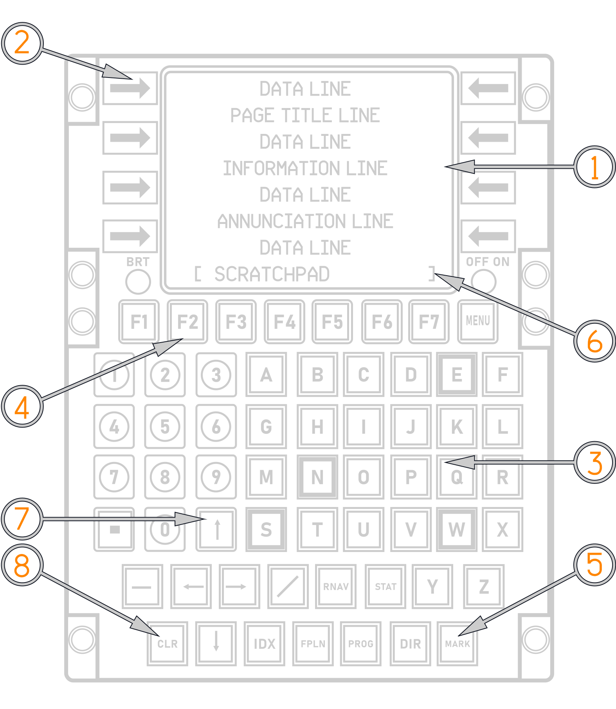

## Line Select Keys

Eight Line Select Keys (LSKs) (<num>2</num>) are used to initiate functions
selected, insert data from the scratchpad, change the mode of operation, or
change display to the page indicated when a Go To Arrow is displayed. The LSKs
will operate in a rotary or toggle manner depending on the mode or function
indicated on the display. Rotary operation will be active if there are more than
two options available to the RIO (e.g., AIDED/ UNAIDED/GPS), and toggle
operation will be active if there are only two options (e.g., ON/OFF). Options
are selected by pressing the LSK adjacent to the appropriate displayed message.
Data is first entered into the scratchpad from the keyboard, and is then entered
into the proper data line by depressing the appropriate LSK.

## Alphanumeric Keys

Alphanumeric keys (<num>3</num>) allow the selection of either numbers or
letters for entry into the scratchpad. The "N" "S", "E", and "W" keys are
highlighted so they may be easily located when entering position in
Latitude/Longitude coordinates.

## Function Keys

The function keys, F1 through F7 (<num>4</num>), allow the operator to perform
specific, aircraft related functions without accessing a particular CDNU page.
The Figure below lists the function associated with each key. Depressing the
MENU Key displays the MENU Page, a quick reference guide to the available
functions.

### CDNU Function MENU

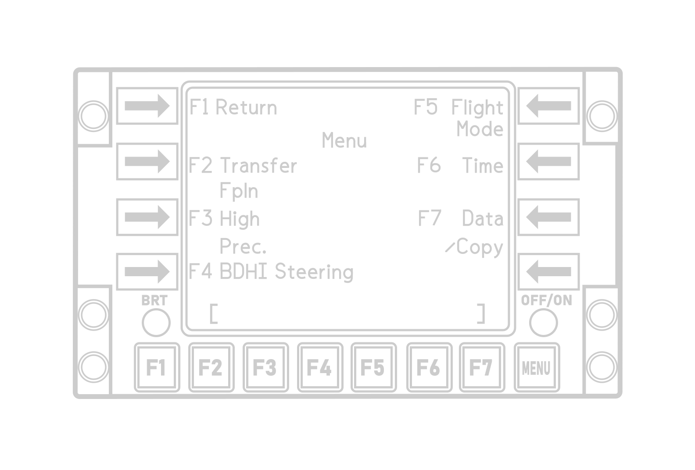

| KEY  | FUNCTION                                                                                                                   |
| ---- | -------------------------------------------------------------------------------------------------------------------------- |
| F1   | Returns the CDNU to the previously selected page.                                                                          |
| F2   | Reloads the active CDNU flight plan into the MDP, clearing any existing flight plan waypoints (in the MDP) in the process. |
| F3   | Calls up the High Precision Coordinate Edit page.                                                                          |
| F4   | Calls up the BDHI Steering Selection Page.                                                                                 |
| F5   | Toggles the source of Flight Mode determination between the PDCP and the CDNU. Default is "P" (PDCP).                      |
| F6   | Calls up the Time Selection Page for the HUD/VDI.                                                                          |
| F7   | [Data For?/Copy What?](#data-forcopy-what)                                                                                 |
| MENU | Displays all Function key functions                                                                                        |

## Dedicated Select Keys

The Dedicated Select Keys (<num>5</num>) allow the RIO to call up and display
navigation data on the CDNU. The STAT (status), MENU, and IDX (index) dedicated
select keys permit access to a variety of information applicable to the general
flight operation and maintenance of the navigation system at any time.

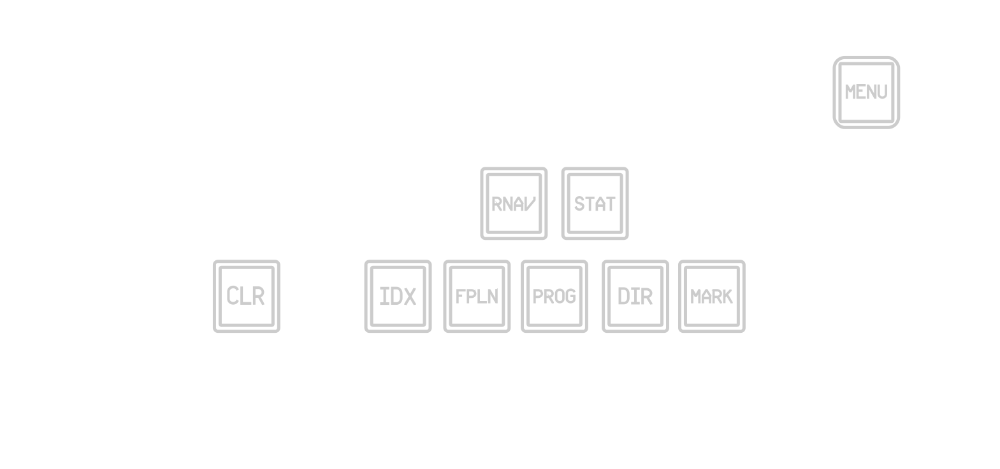

| KEY  | FUNCTION             |
| ---- | -------------------- |
| FPLN | Flight plan Page     |
| PROG | Progress Page        |
| DIR  | Direct Page          |
| RNAV | Area navigation Page |
| MARK | Mark function        |
| STAT | Status Page          |
| MENU | Function Key Menu    |
| IDX  | Index Page           |

## Scratchpad

The scratchpad is the bottom line on the display,(<num>6</num>), enclosed by
brackets, and is used to display data entered using the alphanumeric keys. It is
a buffer to hold all keystrokes prior to executing the input. Error messages
will also be displayed in the scratchpad if operational or data entry conditions
are not met. Incorrect scratchpad entries are cleared with the CLR key. The
scratchpad is automatically cleared when the system accepts valid inputs.

## Page Scrolling

Arrow keys (<num>7</num>) are provided to permit vertical and horizontal
scrolling of pages [e.g., switching between the EGI Start 1/2 and EGI Start 2/2
pages (vertical), and between [RNAV Pages](#rnav-inav-page) (horizontal)].
Special arrow characters are displayed adjacent to the left-hand scratchpad
bracket to indicate the type of scrolling available.

Vertical scrolling is accomplished by pressing the "↑" and "↓" arrow keys.
Pressing the "↑" arrow key moves one toward the beginning of a set of data
(e.g., a lower numbered intercept). Lateral page scrolling is accomplished by
pressing the "←" and "→" arrow keys. Holding the arrow keys causes page
scrolling to continue until the key is released.

## Clear Key

The CLR (<num>8</num>) (clear) key is considered a special function control key.
When the key is pressed momentarily, the last character displayed in the
scratchpad is deleted. Holding down the clear key will clear all characters in
the scratchpad.

Error messages can be cleared by depressing the CLR key when the message
appears. The key will also clear certain annunciation messages when the
scratchpad is blank and annunciation messages are displayed on line six of the
display.

## Common Symbology

CDNU Standard Display Symbols

| Start Page                                                       | [RNAV Page](#rnav-inav-page)                                   |
| ---------------------------------------------------------------- | -------------------------------------------------------------- |
| 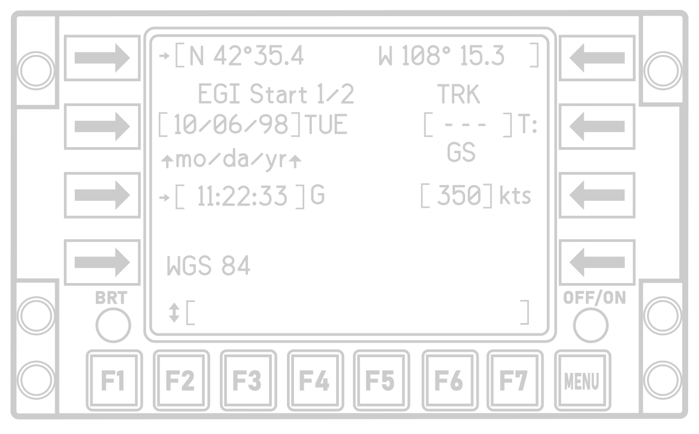 | 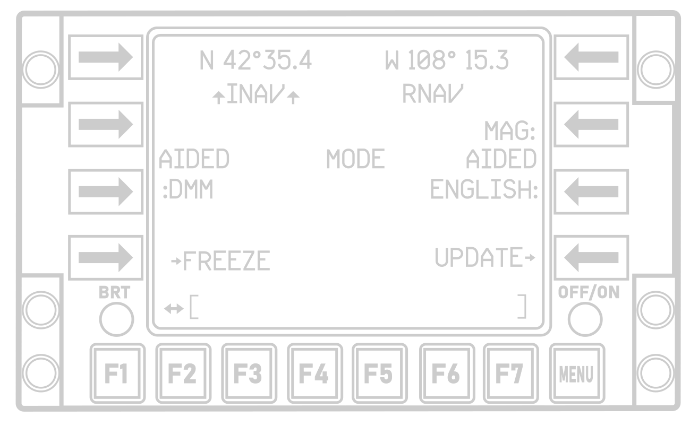 |

| Icon                                                                                           | Meaning                                                                                          |
| ---------------------------------------------------------------------------------------------- | ------------------------------------------------------------------------------------------------ |
|                              | Go To Arrow. Pushing the Line Select Key access a different page. (Arrow points toward Key).     |
|                       | Pushing the Line Select Key will select the item or enable the mode. (Arrow points toward text). |
|              | Function is Enabled.                                                                             |
|                    | Alternate selections are available.                                                              |
|                            | Check status pages for BIT failures.                                                             |
|                                      | No computed data is available or meaningful.                                                     |
|                       | Data entry from the scratchpad is possible/required.                                             |
|                      | Vertical page or line scrolling is possible.                                                     |
|                        | Lateral page scrolling is possible.                                                              |
|  | Lateral and Vertical page scrolling is possible.                                                 |

## The CDNU flight plan and Steering sources

The F-14B(U)’s CDNU flight plan system is built to manage multiple routes while
allowing both preplanned and dynamic navigation during a mission. The system can
store up to twelve separate flight plans, each composed of a sequence of
waypoints that define the intended path of flight. These waypoints are not
organized by their numerical identifiers, but strictly by the order in which
they are intended to be flown, meaning the order in which the waypoints are
displayed on the CDNU FPLN page. The waypoint ID itself, or the waypoint label,
has no influence on its position within a given flight plan.

Waypoints are divided into two main categories: preset and impromptu. Preset
waypoints occupy identifiers one through fifty and are typically loaded via
mission data prior to flight, while impromptu waypoints begin at fifty-one and
are created by the crew in real time or by the system to provide turn
anticipation. This separation allows the crew to distinguish between planned
navigation points and those generated on the fly without affecting how they are
sequenced within the active route. The active flight plan route, and the
sequence in which waypoints are meant to be flown, can be changed at any time
during flight by copying, inserting, and/or deleting redundant waypoints.

The F-14B(U)’s navigation system provides four types of steering output. Because
of the B(U)’s system architecture, there are essentially two steering sources:
first, the EGI, which is overall responsible for positional data, and second,
the F-14’s Mission Computer (FMC). The EGI is controlled by the CDNU, and its
steering modes are selected through the CDNU.

The FMC is responsible for attack steering modes such as GGW LP and TGT
steering, but also for DEST steering.

### EGI Steering

As the aircraft progresses along a flight plan, waypoint sequencing is governed
by the selected mode. In AUTO mode, the system automatically advances to the
next waypoint once certain criteria are met, such as passing a defined proximity
threshold. OFLY (overfly) mode requires the aircraft to pass directly over, or
very near, the waypoint before sequencing occurs; this is useful in low-level
navigation, for example, where overflight of a precise point is crucial. In both
modes, once a waypoint has been passed, it transitions into a history state,
allowing the crew to track what has already been flown. The third mode is Manual
Mode (MAN). In this mode, the flight plan does not sequence automatically.
Steering is only provided to the currently active waypoint shown on the first
FPLN page. The only way to advance the flight plan in this mode is by using the
DIR function located on the CDNU.

### DEST Steering

DEST steering is entirely separate from the CDNU flight plan and can be used
independently of the EGI fly-to point. DEST steering for the RIO is not to be
confused with DEST steering set on the pilot’s PDCP. In DEST steering, the RIO
may select one waypoint from the CDNU’s flight plan to provide steering to. This
can be achieved through the CDNU WP EDIT page, or through the PTID’s DEST rotary
on PB 8 and PB 9.

### BDHI Steering

BDHI steering can be entirely separate from DEST and EGI steering and is only
presented on the BDHI. Through the BDHI steering page on the CDNU, accessed via
the F4 key, the RIO can direct the BDHI to either synchronize with HUD and HSD
steering, provide launch point and target steering to the next launch GGW
target, or provide steering to a CDNU flight plan waypoint. Like DEST steering,
no AUTO or OFLY sequencing occurs.

### TACAN Steering

TACAN steering can be selected through the pilot’s or RIO’s TACAN command panel.
The TACAN command panel cycles between TACAN and EGI steering. In TACAN
steering, the HUD and HSD provide steering to the selected TACAN station. If
DEST steering is selected on the PDCP, the HSD will not display it; only TACAN
selected on the PDCP will show TACAN steering on the HSD. The BDHI is not
affected if TACAN steering is selected and the RIO has the BDHI set to EGI
fly-to or FPLN waypoint steering.

### History Waypoints

The five waypoints most recently passed are also maintained in the flight plan.
These waypoints along with the associated altitude, Flight Mode and planned time
of arrival may be reviewed by scrolling the Flight Plan page with the up arrow
key. These waypoint definitions may not be edited or deleted but they may be
used with Direct-To.

## Data Entry

This section describes acceptable data entry formats, valid data ranges and
display formats.

All navigation−related quantities may be displayed in either metric or English
units unless specifically stated elsewhere (e.g., altitude related quantities,
which are always displayed in feet and feet/minute). When metric units are
chosen the unit labels are changed appropriately. Generally speaking data is
always entered into the scratchpad (SP) before the data-line for data entry is
selected with a Line Select Key (LSK).

### Entry and Display of Waypoints

The F−14B uses a common numbering scheme for display of waypoints. The CDNU,
PTID (including the LTS display), and HUD will all display the same two digit
number assigned to each waypoint. When a flight plan is first activated, the
waypoints are assigned numbers from 01 to 50 in flight plan order. When new
waypoints are added, they are assigned numbers sequentially beginning with
number 51. When waypoints are deleted, the remaining waypoints retain their
original number. he RIO may change the waypoint number of a specific waypoint
using LSK 3 on the Waypoint Edit 1/2 page. (Link)

> 💡 Duplicate waypoint display IDs can be entered and will be displayed.

Flight plan waypoints and other horizontal locations are entered in one of three
basic formats:

| Entry Method         | Type                                                                            |
| -------------------- | ------------------------------------------------------------------------------- |
| ICAO                 | Stored in CDNU memory                                                           |
| UDL                  | User Defined Label (loaded via MDL)                                             |
| Position Coordinates | DMM and MGRS on FPLN Page - DMS only on high precision coordinate entry display |

User Define Label (UDL) — Waypoints can be inserted into the flight plan via
their (User Defined Label). Any UDL waypoint stored on the MDL can be entered
into the SP and inserted into the FPLN.

ICAO Identifier — position labeled with up to a 5 character alphanumeric. The
appropriate data are extracted from a database contained in the MDL or
downloaded to CDNU nonvolatile memory

Position coordinates — either as a latitude/ longitude waypoint pair or as a
Military Grid Reference System coordinate.

#### Entry and Display of Latitude/Longitude Waypoints

Latitude/longitude waypoints are entered in the form of degrees and decimal
minutes (DMM). The required format is an "N" or "S" followed by four digits
(with a decimal point and up to three additional digits optional), followed by
"E" or "W" followed by five digits (with a decimal point and up to three
additional digits optional). Leading zeros are required as no deliminator are
used between degrees and minutes. All waypoints are stored, and calculations
made, using thousandth of a minute precision.

> 💡 Do not enter spaces between degrees and minutes or between latitude and
> longitude entries. Do not put a "/" or any other character between entries. A
> typical entry will have the form: "Nddmm.mmmWdddmm.mmm" (where dd = degrees
> and mm = minutes) with digits to the right of the decimal points optional.

Latitude/longitude waypoints are displayed left-justified to the nearest tenth
of a minute on all CDNU pages, except on the [RNAV Pages](#rnav-inav-page) and
the Waypoint Edit pages where thousandths of minutes are displayed. Coordinates
are displayed based on RIO selection of any of the following formats using LSK3
on the [RNAV page](#rnav-inav-page).

- DMM − Degrees, Minutes, fractional minutes to 0.0001
- DMS − Degrees, Minutes, Seconds, fractional seconds to 0.01
- MGRS − Military Grid Reference System Coordinates Tactical Display
  Enhancements

| Type         | Entry Example                                                    |
| ------------ | ---------------------------------------------------------------- |
| MGRS         | 37TDH4989754515 (WP EDIT/FPLN Page)                              |
| Lat/Long DMM | N4358.257W10700.347 (WP EDIT/FPLN Page)                          |
| Lat/Long DMS | LAT N133528.44 LONG E1445647.76 (High Precision Coordinate Edit) |

DMM and MGRS coordinate formats are available for entry and display. MGRS and
DMM formats can be entered in Scratch Pad (SP) on FPLN and WP Edit pages. Only
valid formats are entered after selection. Invalid formats will remain in the
SP.

DMS coordinates can only be entered through the high precision coordinate edit
display page, DMS coordinates can be displayed via LSK 5 on the WP edit page, or
via LSK 3 on the [RNAV INAV page](#rnav-inav-page)

MGRS, DMM and DMS Coordinate display can be toggled between on the
[RNAV page](#rnav-inav-page). Selection of any of these formats on the CDNU
controls the format of coordinates on the PTID, hooked WP position coordinates
on the PTID NVD WP page, and LANTIRN displays.

#### High Precision Coordinate Edit

The exception to the above scheme is on the
[High Precision Coordinate Edit page](#high-precision-waypoint-edit-page).
Depressing the F3 key when on the Flight Plan or Waypoint Edit 1/2 page calls up
the page. This page permits the entry of coordinates to either a ten−thousandth
of a minute, or a hundredth of a second. The RIO selects the format by choosing
either DMM or DMS with LSK 1. Due to space limitations, spaces and symbols for
degrees, minutes, and seconds are eliminated. After coordinates are entered,
selecting LSK 5 returns the CDNU to the originating page.

> 💡 The format for displaying position (DMM, DMS, or MGRS) on the cockpit
> displays is selected using LSK 3 on the [RNAV INAV page](#rnav-inav-page) of
> the CDNU. LSK 1 on the High Precision Edit page of the CDNU only controls the
> data entry mode on that page.

#### Entry and Display of Military Grid Reference System Waypoints

Military Grid Reference System (MGRS) coordinates are entered as three
components:

1. Grid zone designation
2. Meter square identification
3. Grid coordinates

Display format for MGRS waypoints on the WP EDIT and FPLN pages is the grid zone
designation followed by one space followed by the 100,000 meter square
identification followed by a space followed by the grid coordinates. Six-digit
grid coordinates (i.e., 100 meter precision) are used everywhere except on the
Area Navigation pages and the Waypoint Data page where ten-digit coordinates (1
meter precision) are used. This yields roughly the same display precision used
in the latitude/longitude format.

#### Data For?/Copy What?

Waypoints, and all their associated data, may be copied in their entirety by
using Function Key 7. Pressing F7 alternately writes "DATA FOR?" and "COPY
WHAT?" into the scratchpad. "DATA FOR?" permits access to the detailed Waypoint
Data page, and "COPY WHAT?" copies a waypoint with all associated attributes
into the scratchpad.

#### Deletion of Data

Most data entry fields may have the associated data deleted by entering a dash
"-" in the scratchpad and pressing the LSK adjacent to the desired field. The
primary exceptions are waypoints with user supplied names (i.e., those with a
slash ("/") as the lead character). These must have the name removed by
depressing the "/" key followed by the LSK adjacent to the waypoint. Once this
is accomplished, the waypoint can be deleted using the dash.

## CDNU Pages

The following section will show all CDNU Pages available as well as highlight
possible CDNU actions.

### Index Page

STEP 1: Access the IDX Page

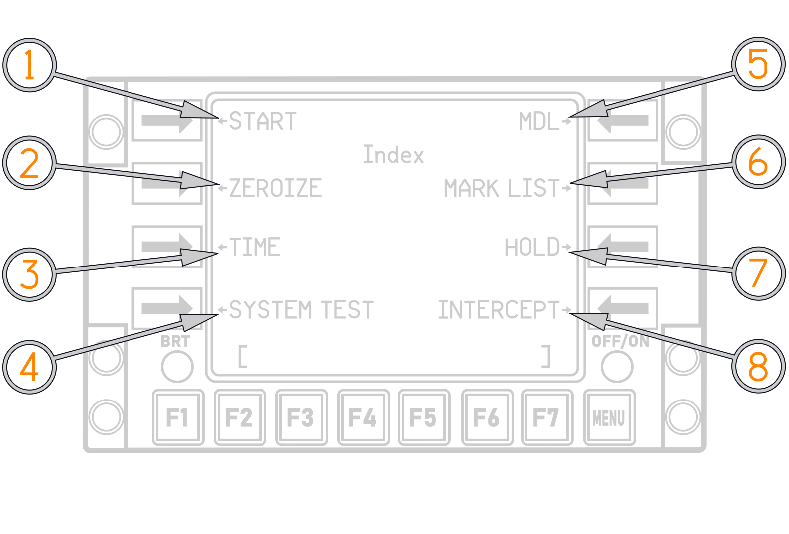

(<num>1</num>) Access the [Start Page](#start-page-12).

(<num>2</num>) Zeroize Page.

(<num>3</num>) Time Selection (No Function).

(<num>4</num>) System Test (No Function).

(<num>5</num>) [Mission Data Loader Page](#mdl-page) (Loading of Flight Plans).

(<num>6</num>) [Mark List Page](#mark-page) (Shows all Marked Coordinates).

(<num>7</num>) [Hold Page](#holding-page) (Programming of Holding Patterns).

(<num>8</num>) [Intercept Page](#intercept-page) (Programming of Intercepts).

### Start Page 1/2

STEP 1: Go to the IDX Page

STEP 2: Press LSK 1 to access the START page

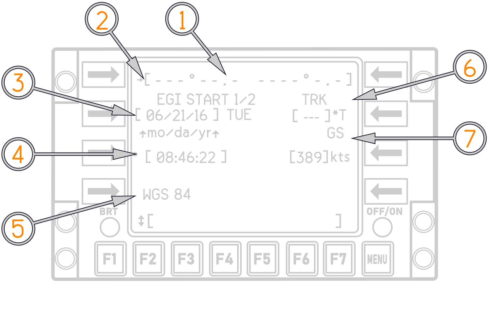

(<num>1</num>) The GPS initializes at the shutdown position. Entering a new
position in the scratchpad will allow the GPS to acquire satellites faster.

(<num>2</num>) Present position of aircraft. Arrow ( ->) indicates
initialization mode can be enabled with LS key 1.

(<num>3</num>) Enter date from SP; Date and day of week.

(<num>4</num>) Time; Enter time from SP; enable time display.

(<num>5</num>) Horizontal datum name and number.

(<num>6</num>) Ground track.

(<num>7</num>) Ground Speed.

### Start Page 2/2

STEP 1: Access the IDX Page. 

STEP 2: Press LSK 1 to access the START page.

STEP 3: Press the arrow down key to switch to START page 2/2.

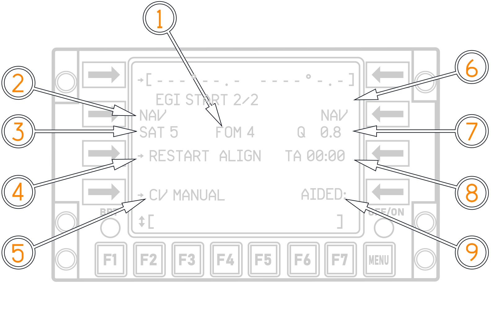

(<num>1</num>) FOM: GPS Figure of Merit

(<num>2</num>) PTID NAV MODE SEL Switch position:

- NAV
- GND
- CV
- AHRS
- IMU
- OFF

(<num>3</num>) Number of Satellites.

(<num>4</num>) Restart Alignment: Returns EGI to Initialize and then to the EGI
chosen alignment mode.

(<num>5</num>) Press LSK 4 to access the CV Manual Align page.

(<num>6</num>) EGI Operation Mode:

- Off
- Initialize
- Gyro Compass
- Stored Heading
- SINS In Motion Align (IMA)
- SINS Stored Heading
- GPS IMA
- Manual IMA
- Air Data IMA

(<num>7</num>) Blended Align Quality in nm/hr.

(<num>8</num>) Alignment time.

(<num>9</num>) Position Solution: GPS; Blended/Aided; Blended/Unaided; Free
Inertial.

### MDL START Page

STEP 1: Press IDX Key

STEP 2: Press LSK 1 on IDX page to access START page

STEP 3: Vertical scroll until MDL START page

The Mission Data Loader (MDL) provides bulk storage of mission essential data.
The Data Transfer Module (DTM), can be loaded in the Mission Editor with up to
12 flight plans, Pre-Planned Missions for JDAM employment and countermeasure
profiles for the ALE-47 CDMS.

The MDL Start page is accessed by scrolling up from the EGI Start 1/2 page or
down from the EGI Start 2/2 page. Display line 3 contains the MDL cartridge
label and date stamp; display line 3 is blank if no cartridge is installed.

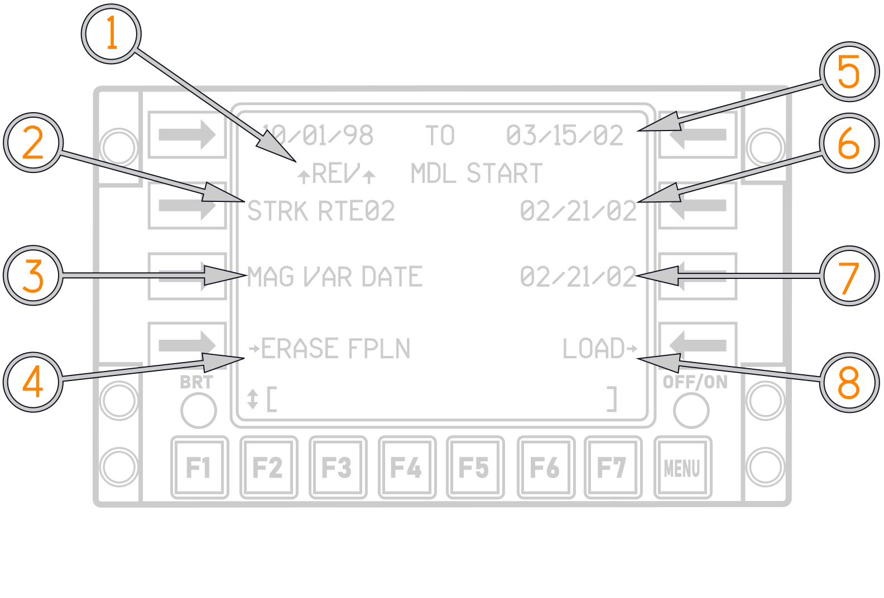

(<num>1</num>) Indicates data is from the Revisionary Database.

(<num>2</num>) Name of current Flight Plan.

(<num>3</num>) Mag Var Date.

(<num>4</num>) Erases currently loaded flight plan.

(<num>5</num>) Database validity dates.

(<num>6</num>) Date of the currently loaded flight plan.

(<num>7</num>) Date of the currently loaded mag var table.

(<num>8</num>) LOAD accesses the [FPLN select page](#flight-plan-select-page).

### MDL Page

MDL STEP 1: Press IDX Key

STEP 2: Press LSK 5 on IDX page to access MDL page

The MDL Page provides the RIO with the ability to search the entire database of
waypoints stored in the MDL, as well as the ability to load different flight
plans.

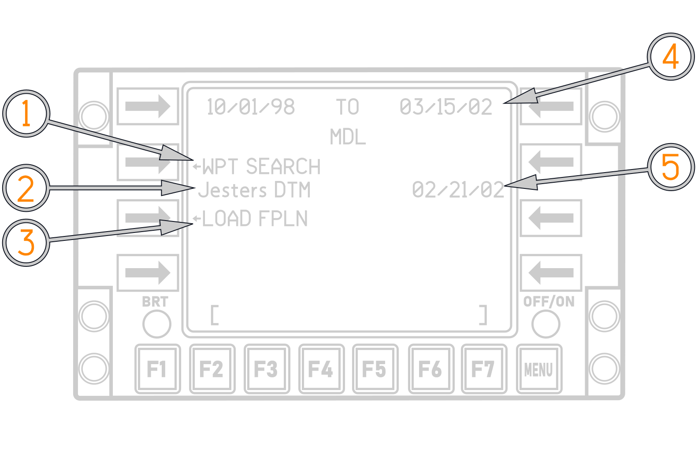

(<num>1</num>) [Waypoint Search Page](#waypoint-search-page)

(<num>2</num>) Name of inserted cartridge.

(<num>3</num>) [Load FPLN page](#flight-plan-select-page) (Permits Loading of
one of the up to 12 Flight Plans).

(<num>4</num>) Flight Plan Date.

(<num>5</num>) Current Mission Date.

### Flight Plan Select Page

FP STEP 1: Press IDX Key

FP STEP 2: Press LSK 5 on IDX page to access MDL page

STEP 3: On MDL Page press LSK 3 to select Flt Pln select page

Flight plan selection is accomplished from the FPLN Select Pages of the CDNU.
These pages may be accessed from either the MDL Start page or the MDL page. To
activate a specific flight plan, press the LSK adjacent to the selected flight
plan. A check mark will be displayed adjacent to the LSK indicating the
selection, and FP DATA LOADING will be annunciated on display line 7.

Up to 12 flight plans can be stored on the MDL and accessed via the Flt Pln
Select page 1/2 and 2/2. Each flight plan can store 50 pre-planned waypoints.

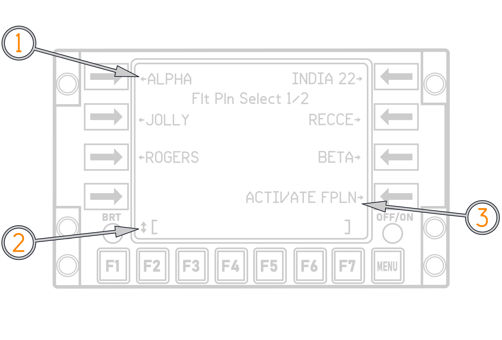

(<num>1</num>) With LSK 1-3 and 5-7 the desired flight plan can be selected,
once selected a check mark is displayed instead of an arrow. The currently
active Flight plan has a \* next to it.

(<num>2</num>) With the vertical scroll keys Flt Pln Select 2/2 can be accessed.

(<num>3</num>) LSK 8 allows for the loading of the desired flight plan. A
"CONFIRM FPLN ACTIVATE" message will be displayed in the scratchpad. Depressing
LSK 8 again will then load the flight plan.

### Flight Plan Page

STEP 1: Press FPLN Key

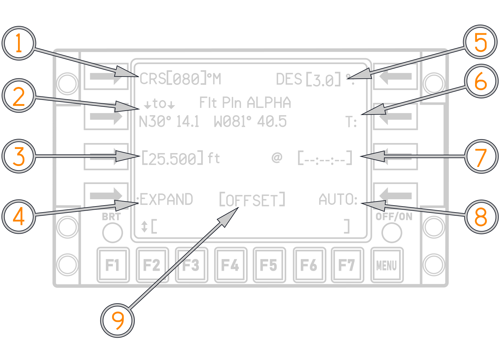

(<num>1</num>) Command Course to Active Waypoint.

(<num>2</num>) Indicates course is Active Waypoint. Just below is the Active
waypoint.

(<num>3</num>) Assigned altitude for waypoint passage.

(<num>4</num>) Toggles between: EXPAND (2 waypoints per page); COMPACT (4
waypoints per page).

(<num>5</num>) Current vertical angle.

(<num>6</num>) Toggles between flight modes (non-functional).

(<num>7</num>) Planned Time of arrival.

(<num>8</num>) Toggles between AUTO; OFLY; and MAN leg sequencing.

(<num>9</num>) Parallel Course Offset input.

> 💡 Auto Leg sequencing will "LEAD" turns as required to maintain the flight
> path within notional airway boundaries and is not recommended for low level
> navigation because of this feature.

| MODE | DESCRIPTION                                                                                                                                                                                                                                                                                                                                                                    |
| ---- | ------------------------------------------------------------------------------------------------------------------------------------------------------------------------------------------------------------------------------------------------------------------------------------------------------------------------------------------------------------------------------ |
| AUTO | Steering to the next waypoint in a flight plan is in accordance with FAA requirements for a "lead turn" when doing Airways Navigation. The lead turn is calculated using a fixed angle of bank, aircraft speed, and course geometry. Automatic sequencing occurs when the aircraft passes an imaginary line perpendicular to the inbound course through the "lead turn" point. |
| MAN  | Manual steering to a flight plan waypoint. No automatic sequencing to subsequent waypoint occurs upon reaching the selected waypoint.                                                                                                                                                                                                                                          |
| OFLY | Steering calculations are provided directly to the desired waypoint so that the aircraft passes directly over the waypoint. Automatic sequencing occurs when the aircraft passes an imaginary line perpendicular to the inbound course through the waypoint.                                                                                                                   |

### Waypoint Search Page

WP STEP 1: Press IDX Key

STEP 2: Press MDL on LSK 5

STEP 3: Press Waypoint search on LSK2

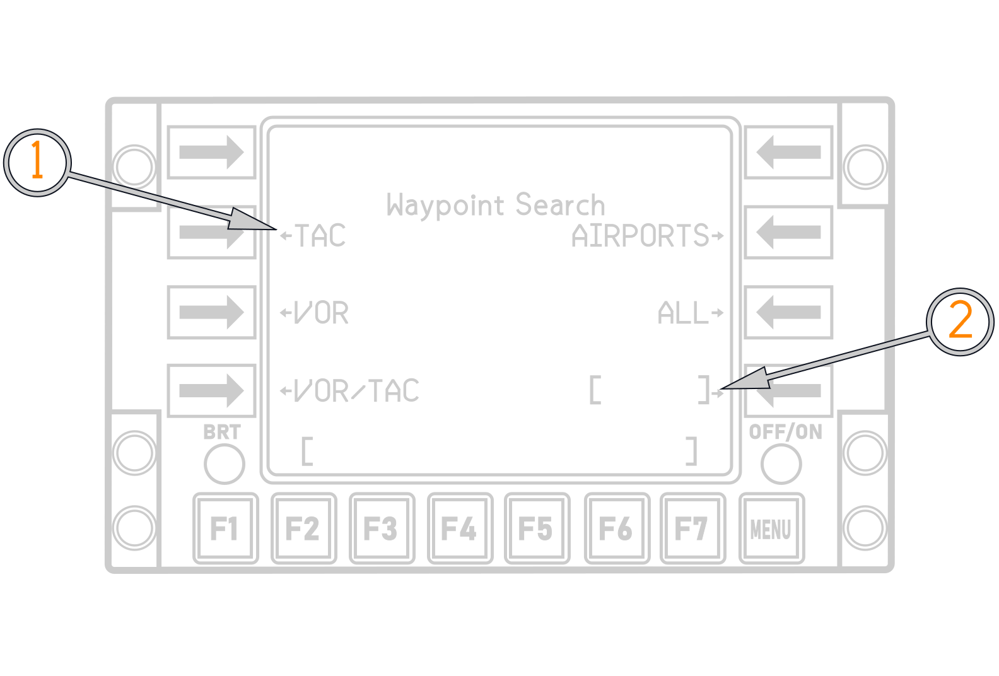

(<num>1</num>) ICAO identifiers can be accessed from the Waypoint Search page.
Search of the database can be accomplished by waypoint type, (TACAN, VOR,
VORTAC, Airports, or All), or by entering a partial or complete ICAO Identifier.

(<num>2</num>) Enter ICAO Identifier into SP and press LSK8 to search for
waypoint.

Once the desired waypoint has been identified it can be selected by pressing the
adjacent LSK. Using the F7 [COPY WHAT?/DATA FOR?](#data-forcopy-what) function
lets the operator copy the coordinates and insert them as desired for example
into the flight plan.

### Attach User Defined Label

Label STEP 1: Press FPLN Key

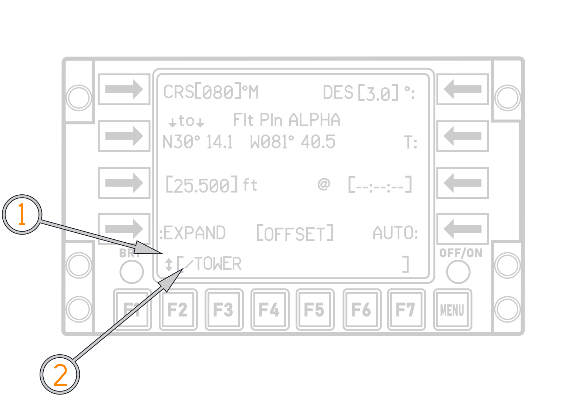

(<num>1</num>) Enter UDL with the keyboard keys

(<num>2</num>) To enter a UDL the text has to be lead by a "/" up to 5
characters can be in a UDL, if more characters are entered they are not inserted

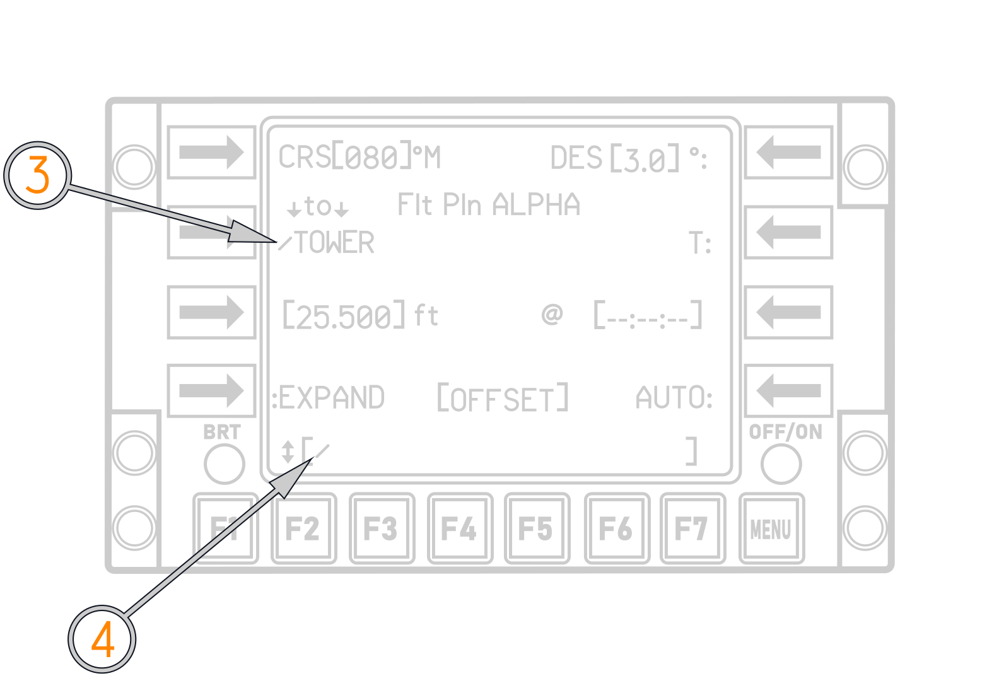

(<num>3</num>) Pressing the LSK next to the desired waypoint will insert the UDL

(<num>4</num>) To delete a UDL type a "/" into the SP and repeat step 3

### FPLN Insert Initial Waypoint

When the flight plan has been erased, the current integrated navigation solution
of present position is inserted as the first history waypoint and the Flight
Plan page indicates "\*End of Flight Plan" in lieu of the active waypoint. To
insert a waypoint into the flight plan:

1. Enter the desired waypoint (Position, ICAO ID, or ID/Bearing/Distance) into
   the scratchpad.

2. Press the left LSK at which "\*End of Flight Plan" is displayed.

When airborne, "CONFIRM FLT PLN CHG" will be annunciated in the scratchpad;
pressing the left LSK a second time will enter the point in the flight plan.

STEP 1: Press the FPLN Key

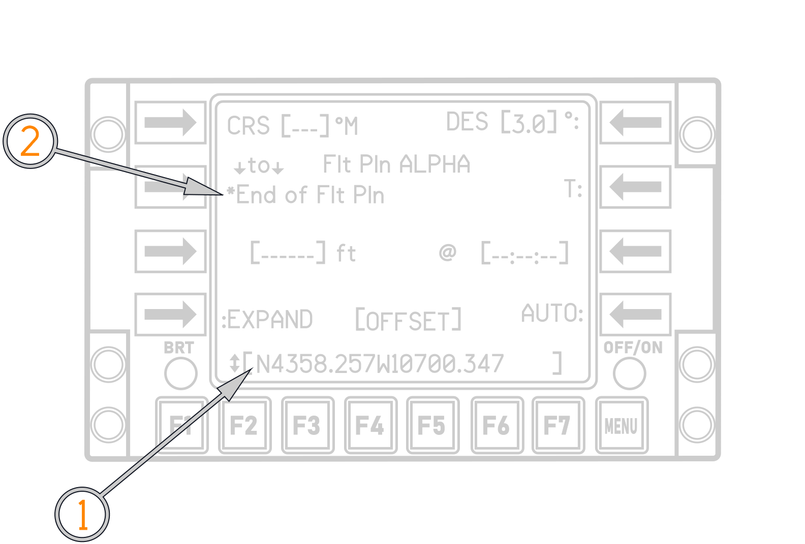

(<num>1</num>) Type in a Valid Coordinate format into SP. Waypoints can be
entered in DDM or MGRS, for DMS use the high precision coordinate edit page.

(<num>2</num>) Depress the LSK next to the waypoint you want the new waypoint to
precede, in this example the Flight plan is empty, so the new waypoint will be
inserted as the active waypoint regardless if LSK1 or LSK2 is depressed.

> 💡 If the flight plan were not empty depressing LSK1 would insert the new
> waypoint as the active waypoint.

### FPLN Page Insert a Waypoint

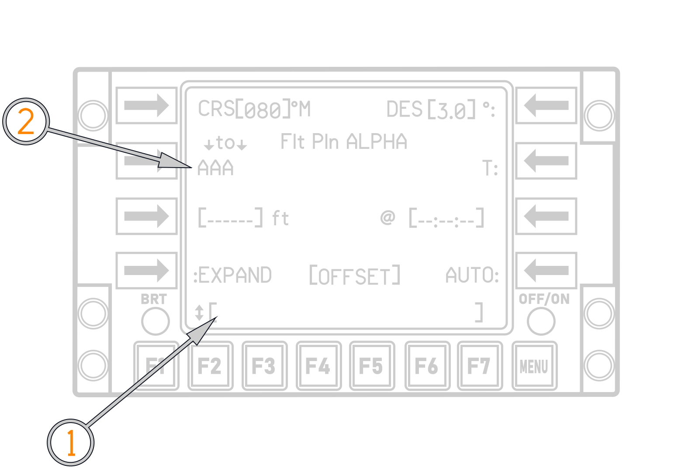

(<num>1</num>) Insert initial Waypoint into SP

(<num>2</num>) Press LSK of the waypoint you want the new waypoint to precede

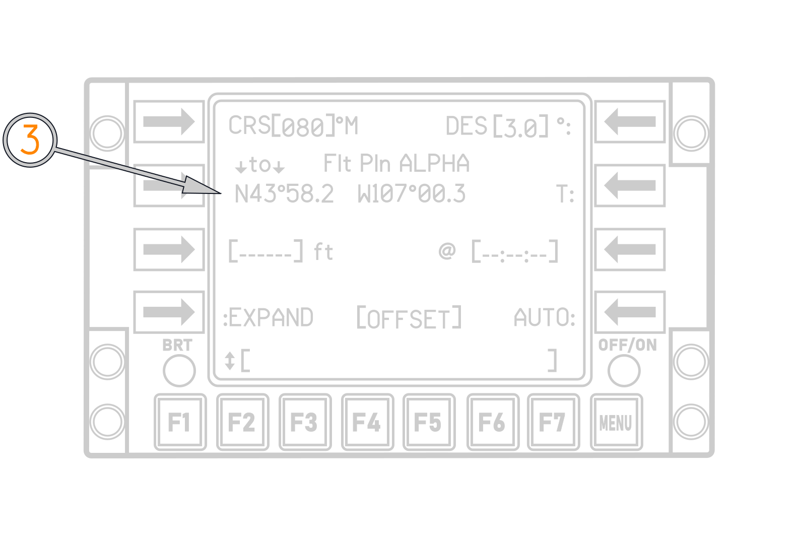

(<num>3</num>) New waypoint added between AAA and BBB.

### Bearing/Distance Vector Waypoint Calculator

A new waypoint which is a bearing/distance vector from an existing waypoint may
be created in the scratchpad. This new waypoint may be inserted in the flight
plan, if desired. The vector waypoint is calculated by entering the desired
"bearing/ distance" in the scratchpad and pressing the LSK adjacent to the base
waypoint of interest. The CDNU displays the coordinates (either
Latitude/Longitude or MGRS) of the vector waypoint at the specified bearing and
distance from the specified point in the scratchpad. This location may then be
entered wherever desired, but it does not affect the original waypoint in the
flight plan.

The bearing and distance are entered as a bearing, optionally followed by a "T"
or "M" (True/Magnetic reference), followed by a "/", followed by distance,
followed optionally by an "N" or "K" (nautical miles or kilometer reference).
Bearings are entered as up to three digits, optionally followed by a decimal
point and an additional digit. Distances are entered as up to four digits,
optionally followed by a decimal point, and up to two additional digits. If the
optional "T"/"M" or "N"/"K" are not entered, the bearing will default to
Magnetic and English/Metric toggle state determines the distance format.

### FPLN Insert with LANTIRN

The CDNU permits the creation of new waypoints via LANTIRN. Newly created
waypoints will always be placed at the end of the Flight plan and be numbered 51
and up.

The naming convention for LTS Designated waypoint depends on the accuracy of the
LTS designation. The naming scheme is as follows: Start name with "/LT"

- If a valid laser range is available at designation, add "\*".
- If no laser range is available a dash is appended.
- If the LTS is GPS aided at the time of designation, add "\*", if not GPS is
  not available a dash is appended.
- Add the GPS FOM.

For example, an LTS designated waypoint made with laser ranging and perfect GPS
will be named: `/LT**1`.

Similarly, if the designation was made without laser ranging and with a GPS FOM
of 4, the name will be `/LT−*4`.

If the LTS designation is established with valid laser ranging, GPS aiding, and
a FOM of 1 (`**1`), then the displayed target altitude will be sent to the new
waypoint file. If not `**1`, then the altitude for the new waypoint will be set
to zero.

STEP 1: Depress the S-7 FOV hat on the LTS controller for more than 2 seconds

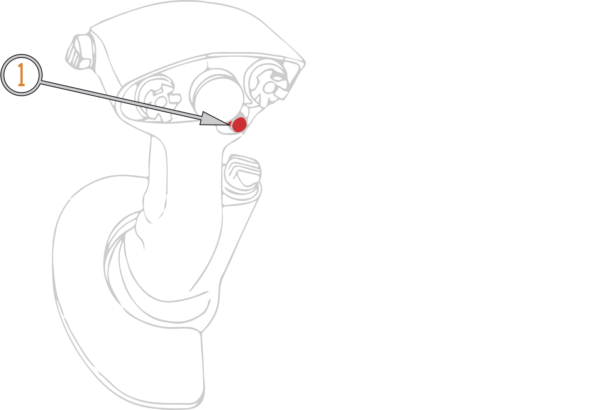

STEP 2: Scroll to end of flight plan

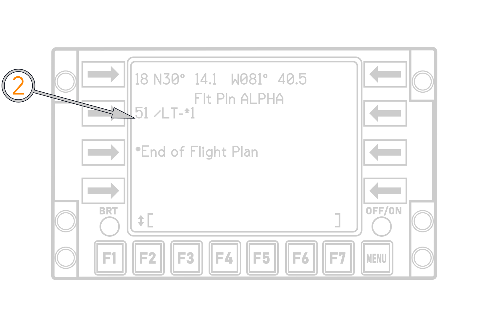

The newly created waypoint is inserted as waypoint 51 into the flight plan.

### FPLN waypoint deletion

FPLN STEP 1: Press FPLN Key

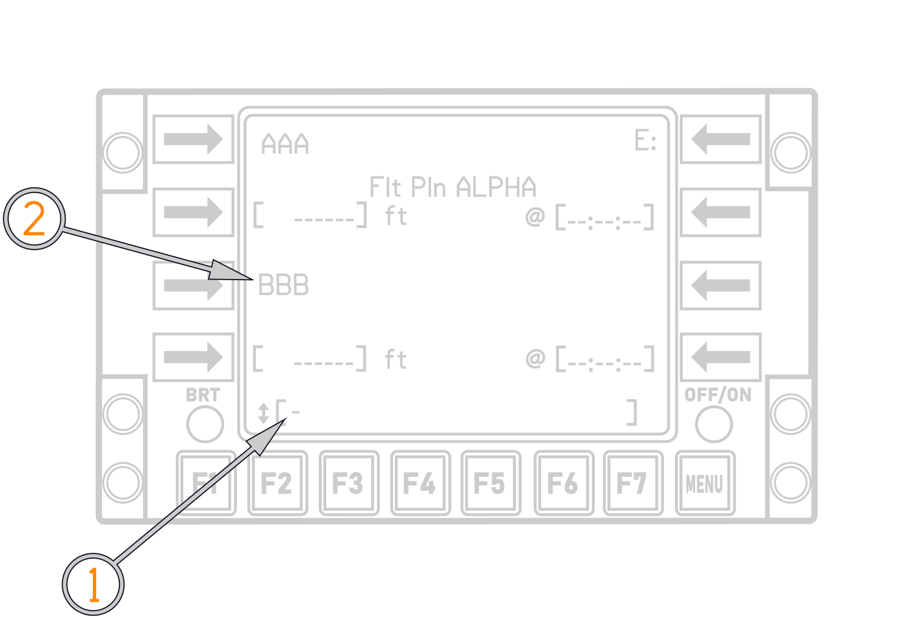

(<num>1</num>) Type"-" (dash) into SP using keypad

(<num>2</num>) Press LSK of waypoint to be deleted

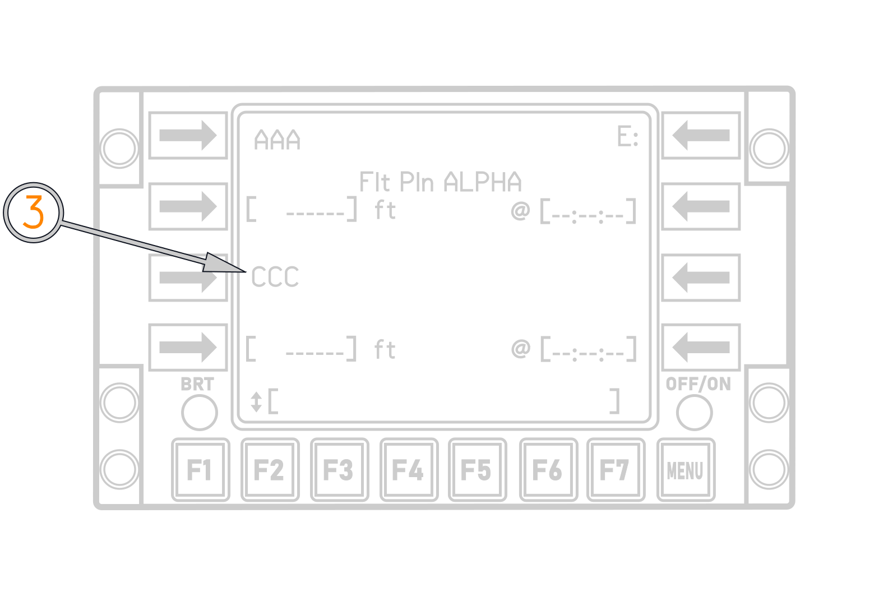

(<num>3</num>) Waypoint BBB deleted. Other waypoints move up in Flight Plan

### Waypoint Edit Page 1/2

WP STEP 1: Press the FPLN Key

STEP 2: Press LSK left of desired waypoint

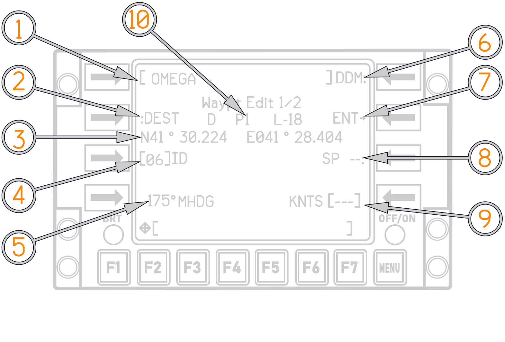

(<num>1</num>) Waypoint Name

(<num>2</num>) Special Waypoint designation, waypoint can be designated as one
of 3 Priority waypoints or as one of 4 generic priority waypoints, additionally
DEST can be selected to designated the waypoint as the DEST steering waypoint.
And LTS can be selected to make the waypoint one of 20 LTS waypoints. Any
waypoint designation can be saved by depressing the ENTER Key on the Opposite
LSK.

(<num>3</num>) Waypoint coordinates. Format can be changed by depressing LSK 5.
If coordinates need to be edited the modified coordinates are entered in the SP
and inserted by depressing LSK 1

(<num>4</num>) Waypoint ID. Waypoint IDs can be set as desired. Multiple
waypoints can have the same ID. Waypoint ID has no effect on waypoint position
in the flight plan.

(<num>5</num>) Magnetic Heading to waypoint from current position.

(<num>6</num>) Waypoint coordinate format (DMM or DMS), also controls in which
format waypoint coordinates are entered in the SP. MGRS is always enterable and
does not need to be selected with LSK 5.

(<num>7</num>) ENT key updates the FMC and CDNU with the changes made to the
waypoint.

(<num>8</num>) SP. Special waypoint designations are available. FP, ST, DP, HA,
IP, HB are available to be associated with any waypoint. Only one waypoint can
have a specific waypoint designation at a time. For example WP32 might be
designated as Surface Target.

(<num>9</num>) Desired Airspeed to Waypoint.

(<num>10</num>) Priority Waypoint: Number P1-P7. DEST waypoint designation: only
1 waypoint at a time. LANTIRN Waypoint number: Up to 20 waypoints from a CDNU
flight plan can be transferred to the LTS. The LANTIRN waypoints so transferred
are numbered sequentially from 1 to 20.

### Waypoint Edit Page 2/2

WP STEP 1: Press FPLN Key

STEP 2: Press LSK left of desired waypoints

STEP 3: Horizontal scroll to WPEDIT 2/2 page

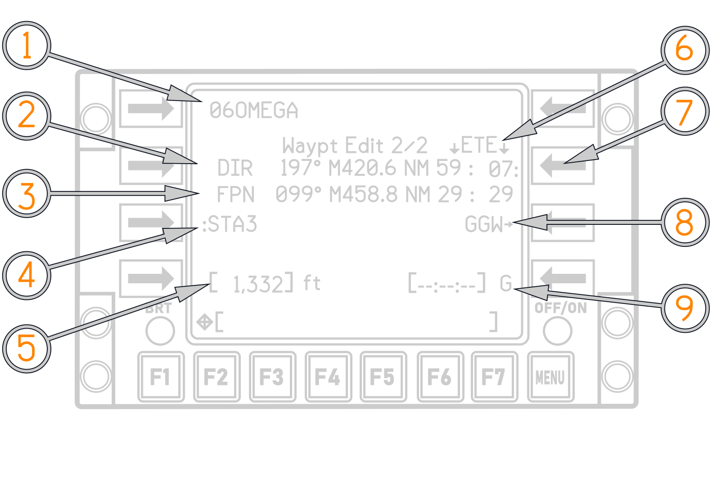

(<num>1</num>) Waypoint ID and Name

(<num>2</num>) Range, Bearing, and ETA/ETE to waypoint via Direct.

(<num>3</num>) Range, Bearing, and ETA/ETE to waypoint via the Flight Plan.

(<num>4</num>) GGW Station Selection (toggles between 3/4/5/6). Designates
station to which target information will be sent when LSK 7 is depressed.

(<num>5</num>) Waypoint Altitude.

(<num>6</num>) Estimated Time Enroute (ETE) or Estimated Time of Arrival (ETA)
to waypoint.

(<num>7</num>) LSK6 toggles DIR/FPN time readouts (Items 16 and 17 below)
between ETE and ETA formats.

(<num>8</num>) Depression of LSK 7 transfers Waypoint information to GGW station
specified using LSK 3 as the new primary target. Aircrew should verify transfer
using PTID JMSN page.

(<num>9</num>) Time of Arrival (TOA) Readout.

### High Precision Waypoint Edit Page

STEP 1: Press the F3 Key

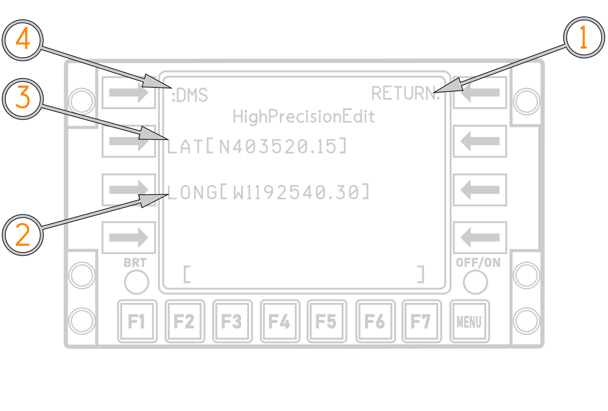

(<num>1</num>) Return to previous CDNU Display page

(<num>2</num>) Edit Longitude

(<num>3</num>) Edit Latitude

(<num>4</num>) Coordinate Format Selection (cycles between DMS/DMM)

### Direct Steering

Direct to steering is available with:

A. Impromptu waypoints:

- Lat/Long
- UDL
- ICAO IBD
- Vector

B. Flight plan waypoints:

- Inserting via UDL
- Scrolling through DIR to page

The Direct steering page offers multiple ways to obtain steering to a horizontal
position.

- Direct to a Flight Plan waypoint
- Direct to a History waypoint
- Direct to a User defined Label
- Direct to an ICAO waypoint
- Direct to an impromptu waypoint

Direct to steering can be initiated to the next flight plan waypoint or to any
of the horizontal positions described above. It is also possible to bypass a
number of future flight plan waypoints with the DIR steering function.

Impromptu waypoints may be inserted into the flight plan by entering the desired
position into the scratchpad, then pressing LSK1 (adjacent to "Direct-To [ ]").
The impromptu point may also be defined as a vector from the present position of
the aircraft by inserting a bearing and range in the scratchpad instead of a
position. Vector waypoints are handled in exactly the same manner as a normal
waypoint. In both cases, the impromptu waypoint is inserted prior to the current
active waypoint, which becomes the first future waypoint.

It is possible to insert an impromptu waypoint and bypass a number of future
flight plan waypoints. First depress the "DIR TO" key on the CDNU, then enter
the impromptu waypoint into the scratchpad. Finally, press the LSK adjacent to
the waypoint where the original flight plan is to be resumed. This makes the
impromptu waypoint the active waypoint and the selected waypoint the second
waypoint in the flightplan.

After selecting a waypoint for the Direct-To operation, the normal Flight Plan
page display is returned, with the course, vertical angle, offset and advance
displays restored as appropriate. Ability to edit the flight plan is restored.
The computer-generated turn point is inserted as a standard latitude/longitude
or MGRS waypoint in history as the most recently passed point. The use of the
Direct-To function has no affect on waypoint sequencing (AUTO/OFLY/MAN).

### DIRECT-TO a Flight Plan Waypoint

STEP 1: Press the DIR key

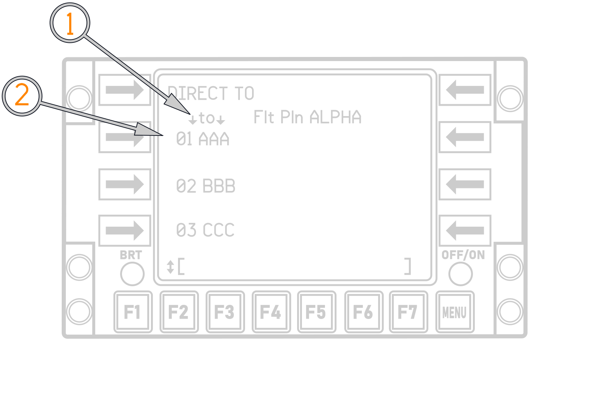

(<num>1</num>) "to" disappears when scrolled away from active waypoint.

(<num>2</num>) Active waypoint.

STEP 2: Vertical Scroll to desired waypoint and select with left LSK

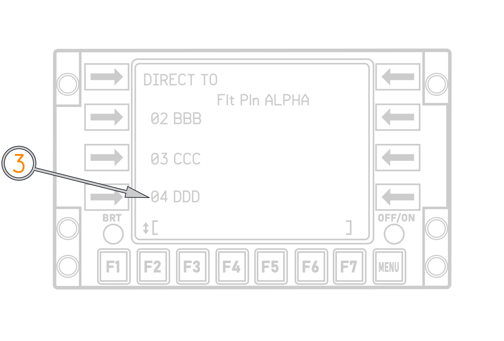

(<num>3</num>) Scrolling down to the desired Direct-To-Waypoint (DDD) and
pressing the associated LSK will make that waypoint the new active waypoint.

> 💡 All passed waypoints (In this case 01;02;03) pass into history. Any
> waypoints after the one DIR TO is selected remain in the flight plan as
> normal. The last 5 history waypoints can be recalled and steered DIR TO again.

RESULT

DDD is now the Active FPLN waypoint. All preceding FPLN waypoints have been
passed into history.
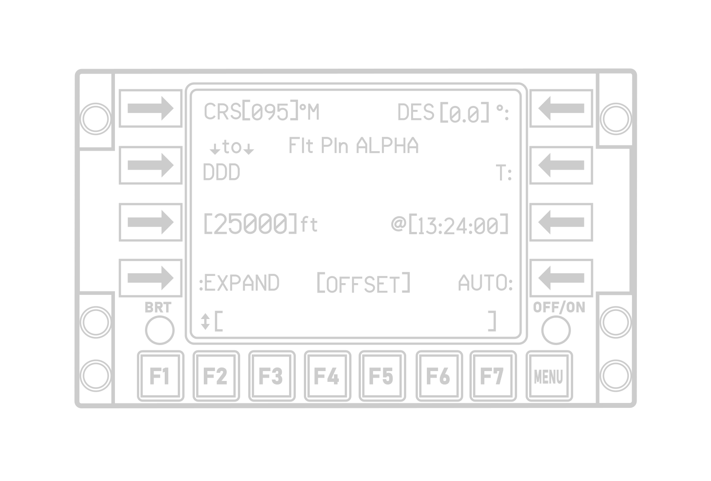
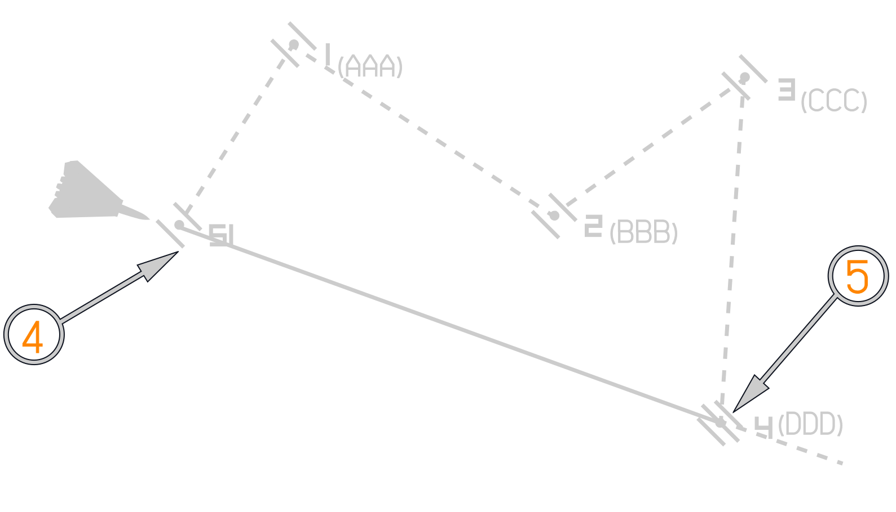

(<num>4</num>) Direct-To turn point is computer generated to provide turn
anticipation. Any next empty waypoint from 51 and up is chosen and passes into
history once passed.

(<num>5</num>) DDD (Waypoint 4) is now the new active waypoint. On PTID that
waypoint is displayed with the "Hot Dog" Symbol.

### DIRECT-TO an Impromptu Vector Waypoint from present position

Direct STEP 1: Press the DIR key

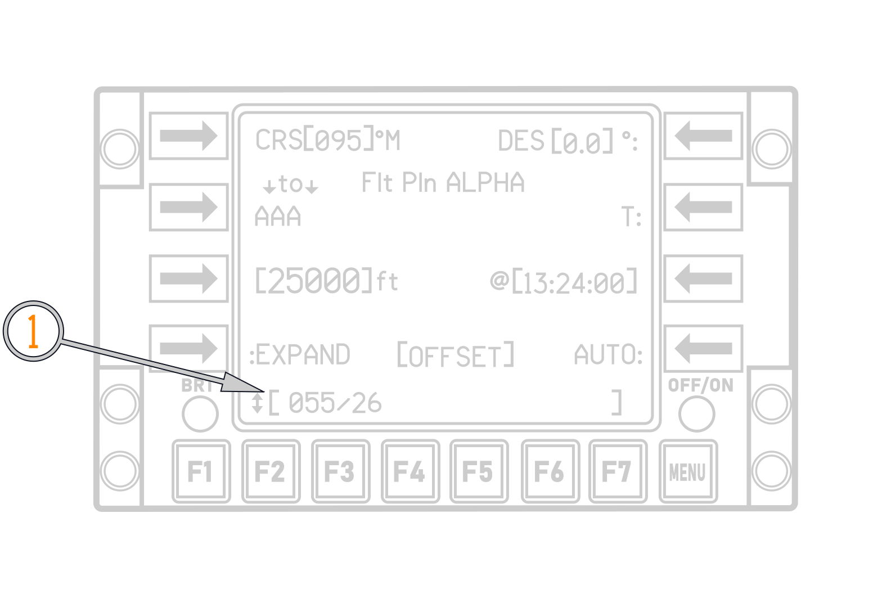

(<num>1</num>) Enter desired vector into SP.

(<num>2</num>) New waypoint is entered as new EGI Fly To Point into flight plan.

(<num>3</num>) After new waypoint has been passed normal flight plan sequencing
will continue.

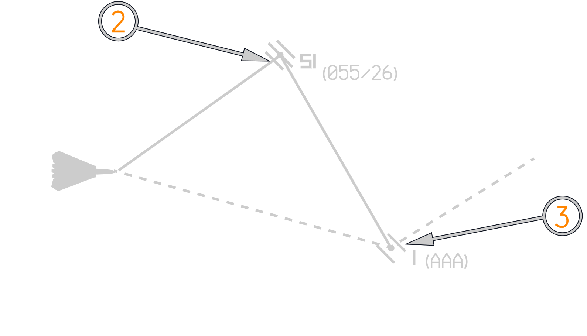

The Vector is inserted as Lat Long into the flight plan.

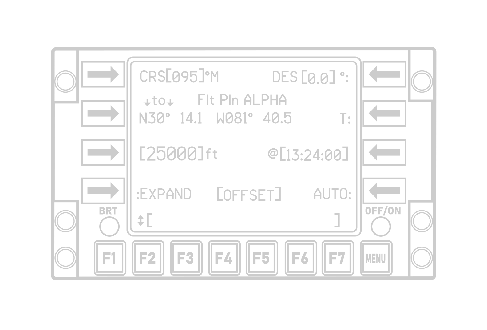

### Progress Page 1/3

STEP 1: Press the PROG Key

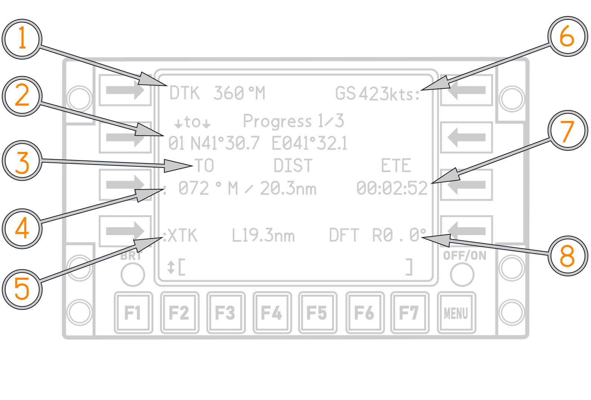

(<num>1</num>) Desired Track - corrected for aircraft present position MVAR.

(<num>2</num>) Active waypoint.

(<num>3</num>) Displays TO, FROM, DIST and TTG to and from active waypoint.

(<num>4</num>) Toggles Lines 4 and 5 between:

- TO-DIST
- FROM- DIST
- TO-RANGE
- FROM - RANGE

(<num>5</num>) Display cross track deviation (XTK) or track angle error (TKE).

(<num>6</num>) Displays:

- Ground Speed (GS)
- Ground Speed CMD (Gscmd)
- Ground Speed Error

(<num>7</num>) ETE to active waypoint.

(<num>8</num>) Aircraft drift (ground track related to heading right (R) or left
(L)).

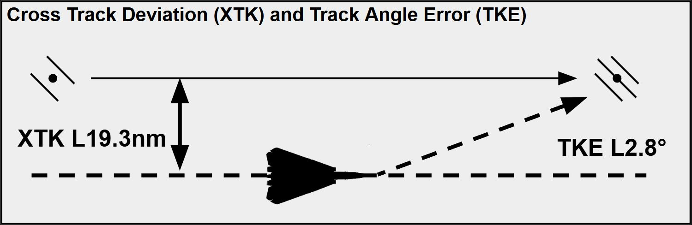

- Ground Speed (GS): Current ground speed
- Ground Speed Command (Gscmd): Ground speed necessary to achieve current
  planned time of arrival at active waypoint.
- Ground Speed Error (FAST/SLOW): Correction required to achieve current planned
  time of arrival at active waypoint.

### Progress Page 2/3

Progress STEP 1: Press the PROG Key

STEP 2: Vertical Scroll to PROG 2/3 Page

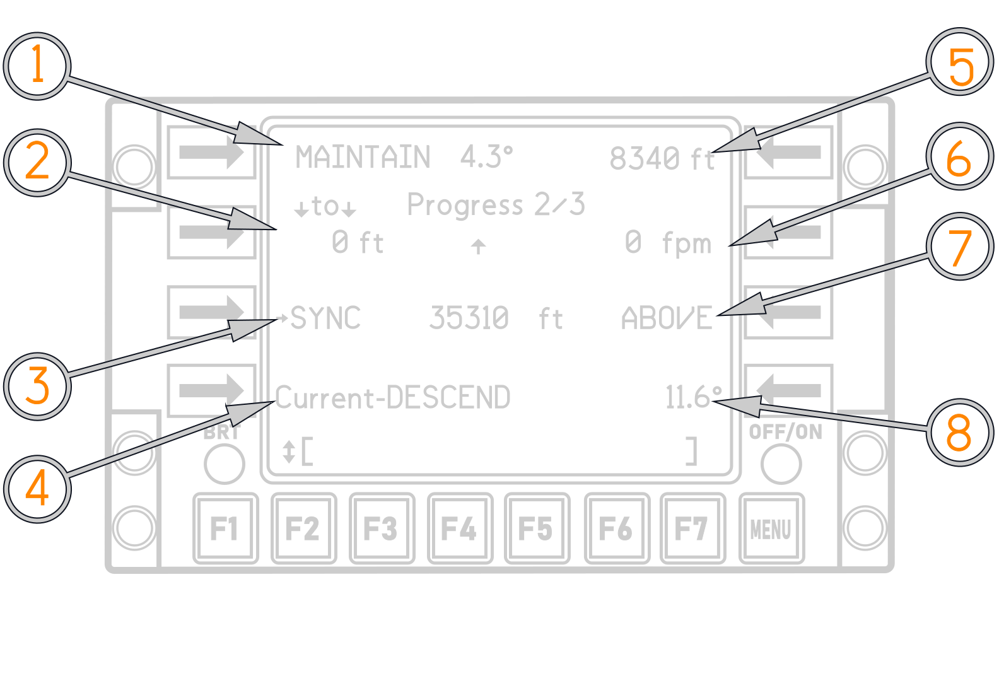

(<num>1</num>) Descend Angle to maintain to arrive at next FPLN waypoint at
desired altitude.

(<num>2</num>) Next FPLN waypoint altitude.

(<num>3</num>) SYNC function. Syncs maintain alt readout back to glidepath.

(<num>4</num>) Indicates required descend angle to intercept glideslope.

(<num>5</num>) Current Altitude MSL.

(<num>6</num>) Current Descend Rate in Feet Per Minute (FPM)

(<num>7</num>) Above or Below vertical path to next FPLN waypoint.

(<num>8</num>) Required Descend Angle.

### Progress Page 3/3

STEP 1: Press PROG Key

STEP 2: Vertical Scroll to PROG 3/3 Page

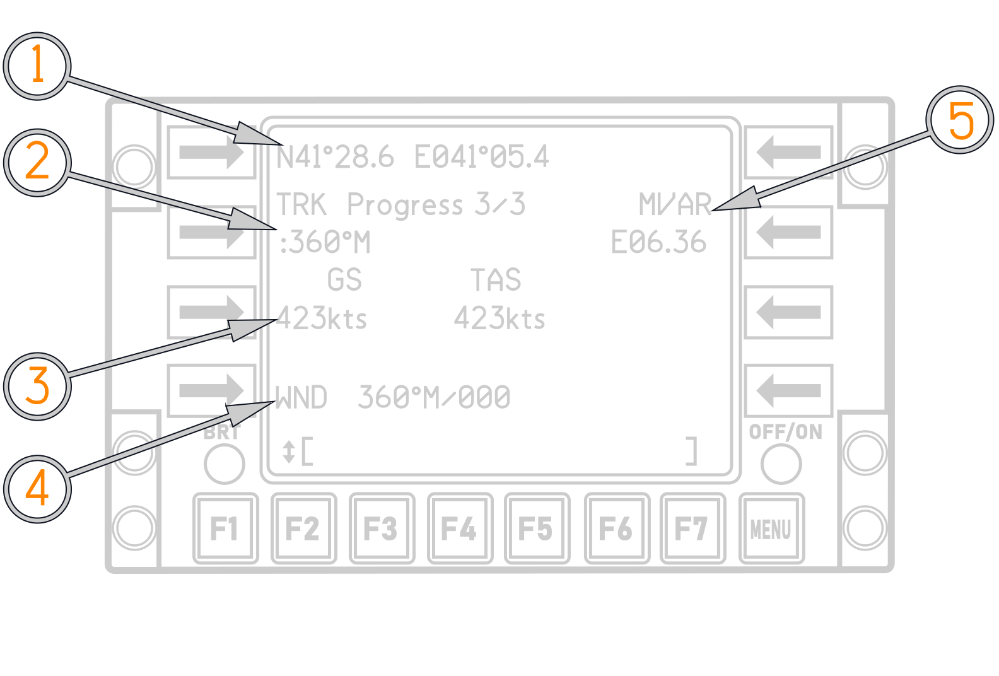

(<num>1</num>) Integrated navigation solution of present position.

(<num>2</num>) Current ground track (Toggle Between Magnetic and True heading)

(<num>3</num>) Ground Speed (GS) readout and True Airspeed (TAS) from CSDC(R).

(<num>4</num>) CDNU calculated wind.

(<num>5</num>) Magnetic Variation.

### MARK Page

STEP 1: Press the IDX key

STEP 2: Press LSK 6 (MARK Page)

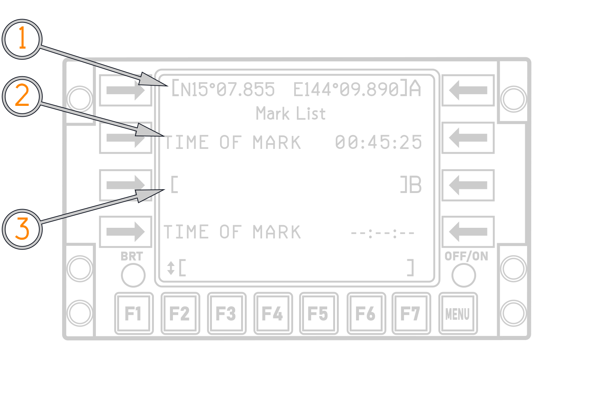

(<num>1</num>) Mark position inserted in first slot.

(<num>2</num>) Time of Mark in Zulu time.

(<num>3</num>) Empty Mark position slot, mark position is inserted by depressing
the MARK key on the CDNU keyboard and then depressing the LSK lef of the mark
position slot to be filled.

Nine mark positions may be saved in nonvolatile memory and given a user defined
label in the same manner as on the Flight Plan page. The Mark List page records
the position of the mark and the associated time of the mark.

To save a point in the Mark List, press the "MARK" key when the aircraft is
directly over the point to be marked. This action puts the position
(latitude/longitude or MGRS coordinates) in the scratchpad.

Access the MARK page from the Index page and depress the LSK to the left of the
position where the mark will be saved. The time of the mark will also be saved.
Once a marked position is entered into the Mark List, pressing the LSK to the
right of a position copies it to the scratchpad. A waypoint may be retrieved
from the flight plan and copied into the Mark List.

First, use the vertical arrow keys (↑/↓) to scroll the Flt Pln page to the
waypoint (active, history, or future) to be stored in the Mark List. Press the
F7 key twice, [entering COPY WHAT?](#data-forcopy-what) into the scratchpad,
then press the LSK to the left of the waypoint to be copied. This will enter the
position (or user-defined label) in the scratchpad, as well as all available
waypoint attributes (identifier, elevation, frequency, and declination). Go to
the Mark List page and insert the waypoint normally.

### RNAV INAV Page

STEP 1: Press the RNAV key

Integrated navigation solution Page (INAV)

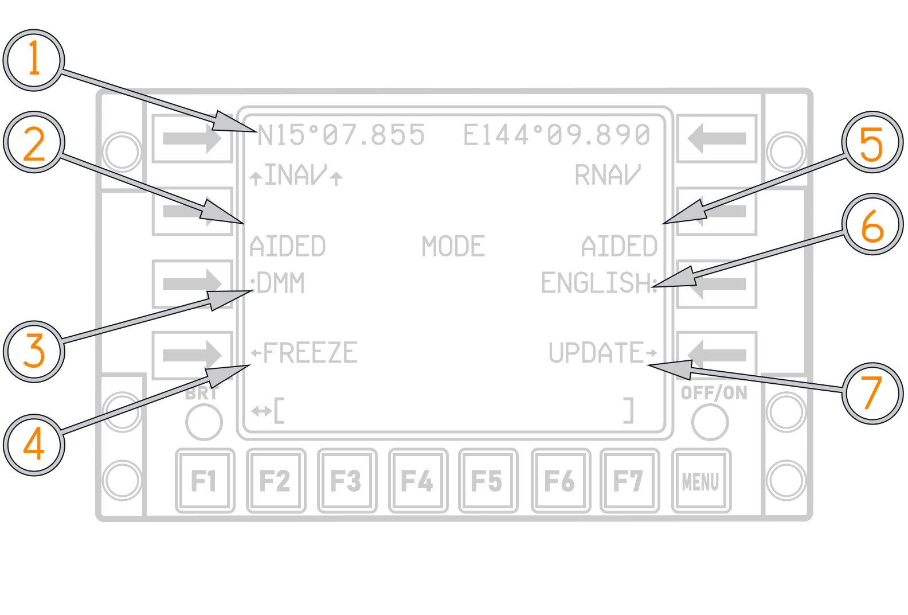

(<num>1</num>) Current Position (High Precision) Integrated position from IMU
and GPS.

(<num>2</num>) RIO Requested System Mode (start page).

(<num>3</num>) Coordinate format set for display on all navigation displays.

(<num>4</num>) FREEZE function. (Not Implemented).

(<num>5</num>) CSDC(R) Selected System Mode.

(<num>6</num>) Changes between Metric or English units on all CDNU displays.

(<num>7</num>) Enters Map Bias or Optimum page.

(<num>7</num>) Enters Map Bias page.

### RNAV GPS Page

STEP 1: Press RNAV key

STEP 2: Horizontal scroll until RNAV GPS Page

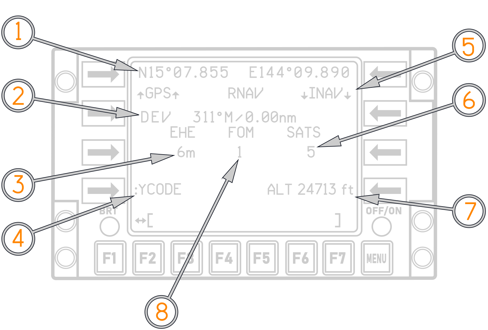

(<num>1</num>) Current Position (High Precision) as derived from the GPS.

(<num>2</num>) Deviation from integrated solution.

(<num>3</num>) Estimated Horizontal Error (EHE).

(<num>4</num>) Y-Code.

(<num>5</num>) Indicates deviation data is from integrated solution.

(<num>6</num>) Number of tracked satellites (SATS).

(<num>7</num>) GPS computed Altitude.

(<num>8</num>) Figure of Merit (FOM).

### RNAV INS Page

STEP 2: Horizontal scroll until RNAV INS Page

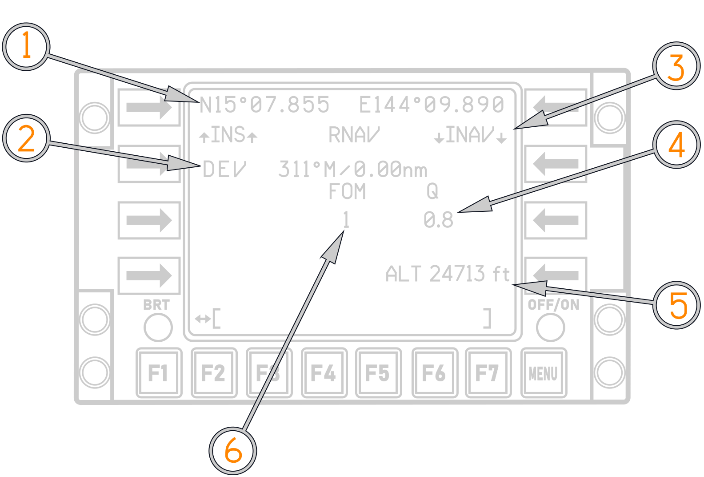

(<num>1</num>) Current Position (High Precision) as derived from the INS.

(<num>2</num>) Deviation from integrated solution.

(<num>3</num>) Indicates deviation data is from integrated solution.

(<num>4</num>) INS Quality (Q) in NM per Hour.

(<num>5</num>) INS computed Altitude.

(<num>6</num>) Figure of Merit (FOM).

### RNAV Blend Page

STEP 2: Horizontal scroll until RNAV Blend Page

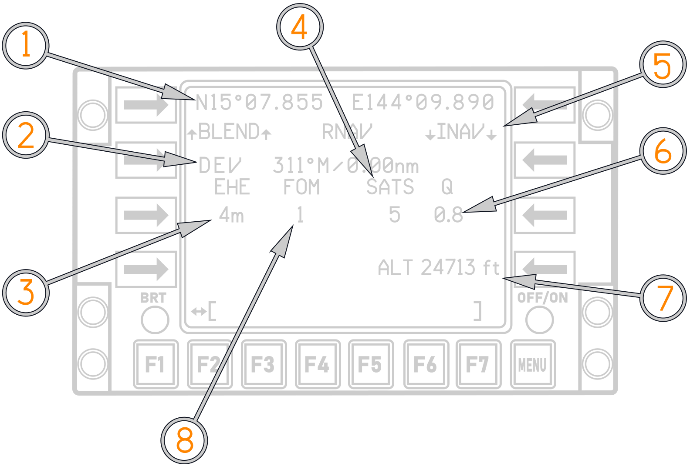

(<num>1</num>) Current Position (High Precision) as derived from the Blended
Solution.

(<num>2</num>) Deviation from integrated solution.

(<num>3</num>) Estimated Horizontal Error (EHE).

(<num>4</num>) Number of tracked satellites (SATS).

(<num>5</num>) Indicates deviation data is from integrated solution.

(<num>6</num>) INS Quality (Q) in NM per Hour.

(<num>7</num>) GPS computed Altitude.

(<num>8</num>) Figure of Merit (FOM).

### STAT Page

STEP 1: Press the STAT key

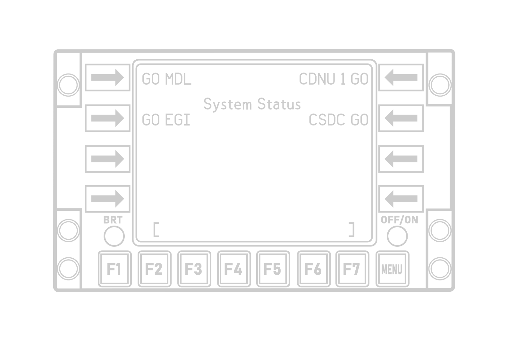

The stat page displays the system status of the F-14B(U)s navigation equipment.

### Holding Page

A holding pattern may be associated with one fixed waypoint in the flight plan,
called the holding fix. When the aircraft crosses the holding fix, holding
guidance is activated, suspending normal leg sequencing until the holding
pattern is canceled. Three parameters define the holding pattern: Inbound
Course, Turn Direction, and Pattern Length. The CDNU Hold page is accessed from
the Index page. If no holding course is entered, then the flight plan inbound
course will be used when holding guidance is activated.

Holding STEP 1: Press the IDX key

STEP 2: Press LSK 7 to access the HOLD page

When the holding fix is passed for the first time, holding guidance computations
are activated. At that time several changes occur, both in flight plan operation
and page displays:

1. Automatic leg sequencing is suspended.

2. Course edits on the Flight Plan page may no longer be made. Inbound holding
   course edit may be made on the Hold page.

3. All displays reference the inbound course displayed on the Hold page.

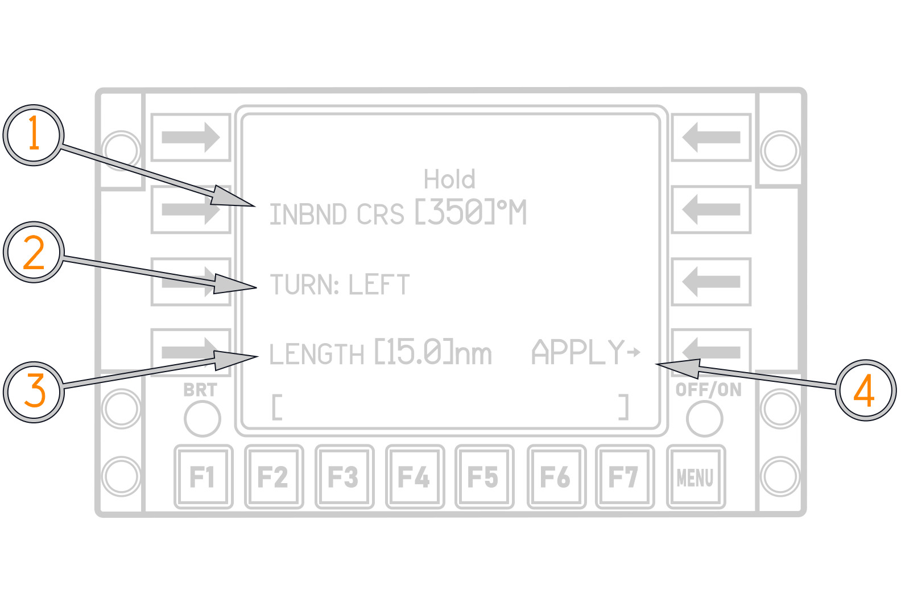

(<num>1</num>) Inbound Course. Insert 3 digit value in scratchpad and press
LSK2.

(<num>2</num>) Toggles between left and right turn direction.

(<num>3</num>) Insert a 3 digit number in the scratchpad and press LSK4.

(<num>4</num>) Press apply once Hold point parameters are set.

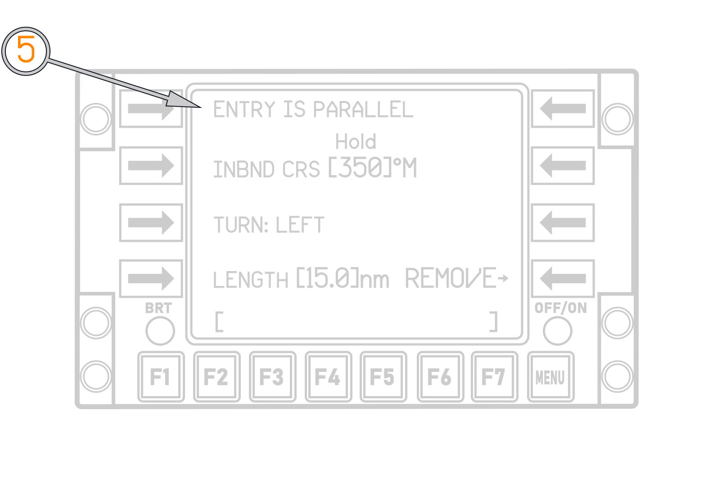

(<num>5</num>) Hold point entry

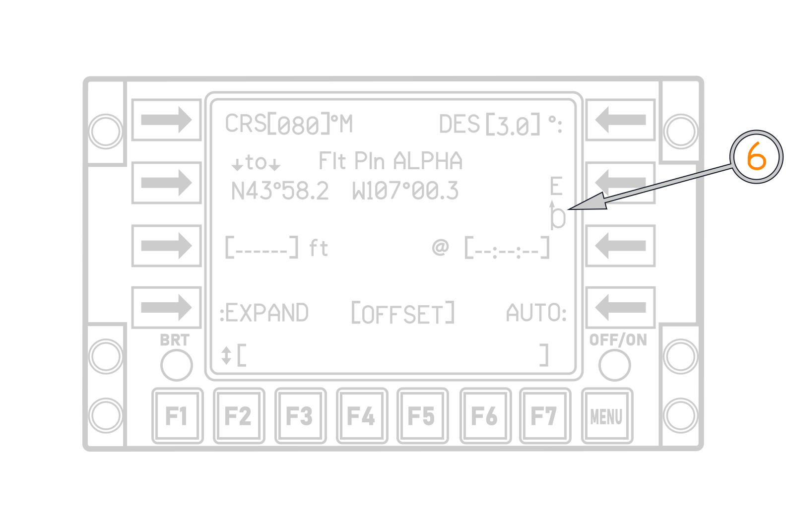

(<num>6</num>) HOLD Symbol on FPLN page

Once the Hold Pattern has been entered, the course display and "to" indicator on
the Flight Plan page are replaced with "Holding" and "at". The entry advisory
display on display line 1 of the Hold page is changed to read "HOLD IS ACTIVE".
Vertical angle display is automatically changed to "MAINTAIN" and selection of
other vertical angles is prohibited.

If any holding pattern definition parameters are changed while in the pattern,
the changes are applied after the aircraft passes the holding fix (transition
from "TO" to "FROM"). When holding guidance has been activated, all course and
lateral deviation displays now reference the inbound holding course,
irrespective of whether the aircraft is on the inbound or outbound leg of the
holding pattern. However, the ten second turn alert
([Pilot VDIG-R Bezel](../../../cockpit/pilot/center_panel.md#vdi-caution-lights)
and [RIO DDI](../../../cockpit/rio/right_console.md#digital-data-indicator-ddi))
will be computed on the outbound leg as though there is a phantom waypoint on
the outbound leg where the turn inbound should be initiated.

### Exiting a Holding Pattern

Holding STEP 1: Press IDX key

Holding STEP 2: Press LSK 7 to access the HOLD page

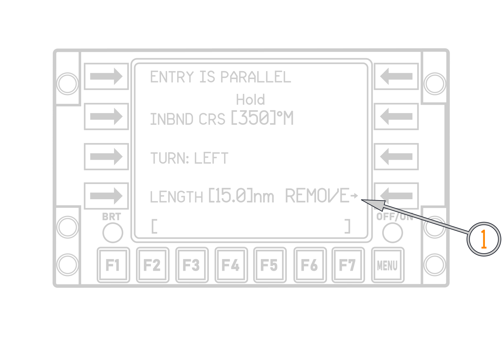

Holding patterns may be terminated in two ways:

1. Press LSK8 on the Hold page to cancel. In this case a leg switch to the next
   flight plan waypoint will occur when the fix is crossed again (if automatic
   flight plan advancing is selected).

2. The Direct-To function is activated to a future waypoint.

### Intercept Page

Up to nine moving targets may be simultaneously defined. Intercept solutions to
these targets may be used in two ways:

1. The intercept solution may be inserted as the active waypoint for immediate
   (i.e., Direct To) execution.
2. The intercept solution may be inserted as a future waypoint to implement a
   future rendezvous with a moving target.

Intercept STEP 1: Press the IDX key

STEP 2: Press LSK 8 to access the Intercept page

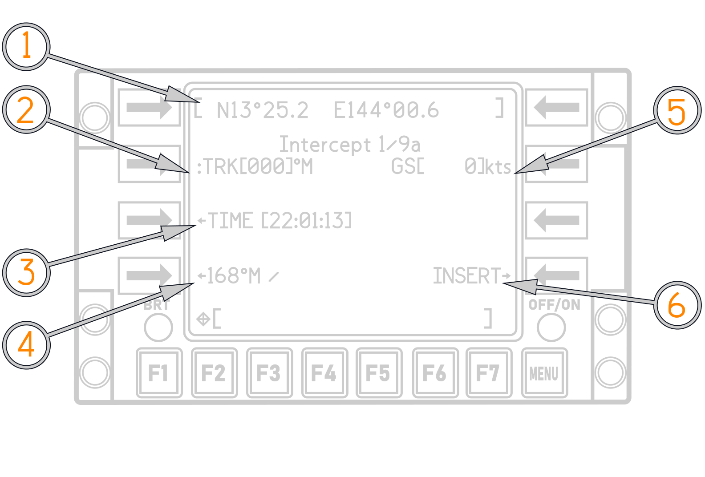

(<num>1</num>) Position of last target fix.

(<num>2</num>) Track of target. Toggles between Magnetic and True North.

(<num>3</num>) Time of last target fix.

(<num>4</num>) Bearing and distance to present target.

(<num>5</num>) Target ground speed.

(<num>6</num>) Moving target parameters have been entered and this intercept is
selected for insertion into the flight plan.

#### Intercept Calculations

The Intercept 1/9a page is accessed from the Index page using LSK8. Subsequent
pages (Intercept 2/9a and beyond) are reached by scrolling up or down until the
desired page is visible. Current position, Ground Track, and Ground Speed is
displayed or can be entered on the Intercept x/9a page (where "x" is the
specific intercept number). Range and bearing to the intercept is also shown.
Intercept x/9b page is accessed by using the left/right arrow keys to scroll
from the Intercept x/9a page. The Intercept x/9b page displays the current Time
to Intercept, point of closest approach if no intercept in possible, and the
current true airspeed.

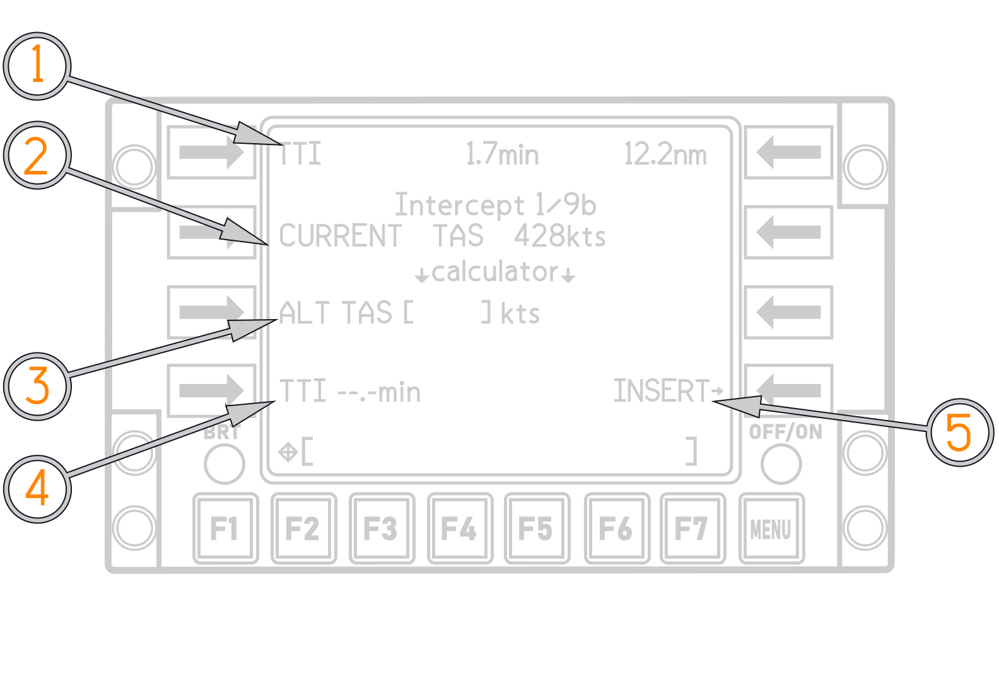

(<num>1</num>) Current Time to Intercept.

(<num>2</num>) Current true air speed.

(<num>3</num>) Can enter and display alternate true air speed.

(<num>4</num>) Alternate time to intercept based on alternate TAS.

(<num>5</num>) Moving target parameters have been entered and this intercept is
selected for insertion into the flight plan.

A calculator function is provided to allow the RIO to enter an alternate true
airspeed and see the effect on the time to intercept and point of closest
approach miss distance. This calculator is available for all intercepts not
inserted into the flight plan (based on Direct-To solution) and for the next
intercept in the flight plan.

The CDNU calculates the true minimum time intercept to the moving waypoint. If
intercept is not possible, a point of closest approach is computed. The
calculations are based on a flat earth approximation about the equator.
Therefore, the solution will slowly begin to degrade as the distance to the
intercept point increases, and the intercept solution gets close to the poles.

Solutions are cyclically computed for all intercepts, whether inserted in the
flight plan or not. If they are not inserted, the computations are performed as
if they were Direct-To intercepts. Changes on the Intercept "a" page immediately
affect the intercept solution in the flight plan.

#### Inserting Intercepts

An intercept can be inserted directly into the flight plan as the active
waypoint by accessing the desired Intercept x/9a page and pressing LSK8 twice
(confirmation is required). This calls up the Flt Pln page, and depressing the
LSK next to the waypoint before which the intercept is desired enters it into
the flight plan. When an intercept is the active waypoint, the intercept
location is cyclically updated based on current aircraft position and speed, the
moving target definition, and current wind. The intercept point location is
adjusted, as required, and the inbound course is edited to match the current
Direct-To course into the waypoint. When the intercept is inserted as a future
waypoint, then the intercept location is updated based on the location of the
flight plan waypoint immediately prior to the intercept, the distance along the
flight plan to that waypoint, current aircraft speed, the moving target
definition, and current wind. The estimated time of arrival at the waypoint
immediately prior to the intercept is computed. Then the intercept point is
computed from that point and time.

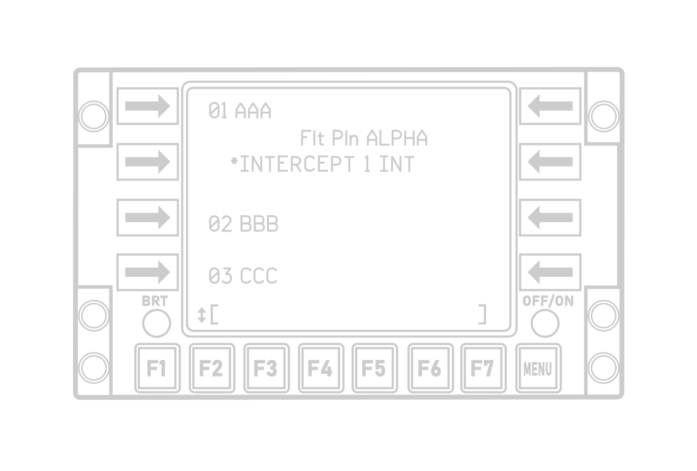

#### Intercept Passage

When an intercept is passed into history, the latitude/longitude of the
intercept at the time of waypoint passage is recorded as the flight plan history
waypoint. All parameters defining the moving target remain on the intercept
page, but the intercept is removed from the flight plan.

### Parallel Offsets

WIP

### BDHI Steering Page

If EGI is selected on the TACAN command panel, then the RIO has four options:
selecting the EGI fly−to point (default), selecting a flight plan waypoint,
selecting the GGW/LTS next launch WP (TGT or LP), or synchronizing the BDHI with
HUD steering.

STEP 1: Press the F4 Key

(<num>1</num>) Current Steering source waypoint location.

(<num>2</num>) Select Next Launch GGW Target Steering. (Currently selected
Station with programmed Target).

(<num>3</num>) Select Next Launch GGW Launch Point Steering. (Currently selected
Station with programmed Launch Point).

(<num>4</num>) Default the EGI Fly to WP is selected.

(<num>5</num>) Select a waypoint from the FPLN to receive BDHI steering to.
(Separate from EGI Fly-To or DEST Steering Waypoint).

(<num>6</num>) Synchronizes BDHI with HUD/VDIGR steering source.

### BDHI Steering to Page

BDHI STEP 1: Press LSK adjacent to FP WP on BDHI steering page.

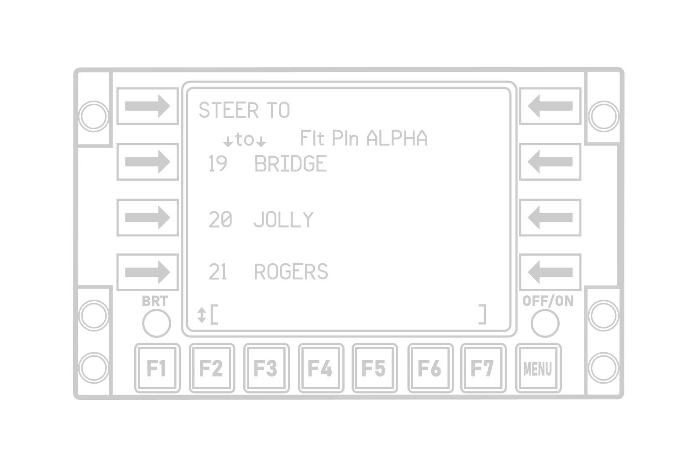

### Time Selection Page

STEP 1: Press the F6 Key

The CDNU has a Time Selection Page accessed via the CDNU F6 function key. The
Time Selection menu allows the RIO to select the source for HUD/VDI Primary and
Secondary TTG and ETA windows. The Primary TTG/ETA is present on both the HUD
and VDI. To avoid cluttering the HUD, the Secondary TTG/ETA is present ONLY on
the VDI and defaulted to OFF. If desired, the RIO must manually select the
Secondary TTG/ETA to ON via the F6 page.

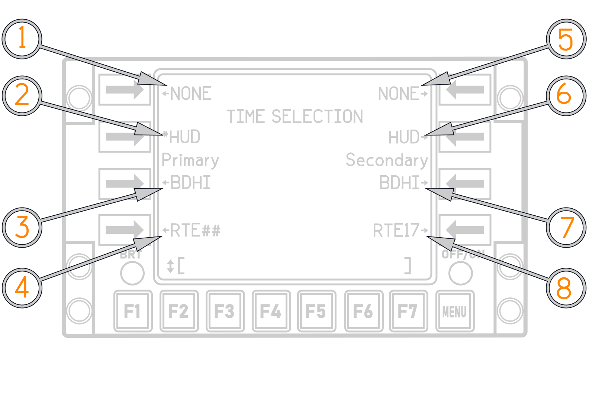

(<num>1</num>) Displayed on the CDNU page when TTG/ETA is turned OFF via LSK 1
or LSK 5.

(<num>2</num>) Time To Go and Estimated Time of Arrival for the HUD steering
point.

(<num>3</num>) (BTG/BTA): Time To Go and Estimated Time of Arrival for the BDHI
steering point.

(<num>4</num>) (RTG/RTA): Time To Go and Estimated Time of Arrival to a
designated "Route To" waypoint.

(<num>5</num>) through (<num>8</num>) same but for secondary TTG and ETA.
