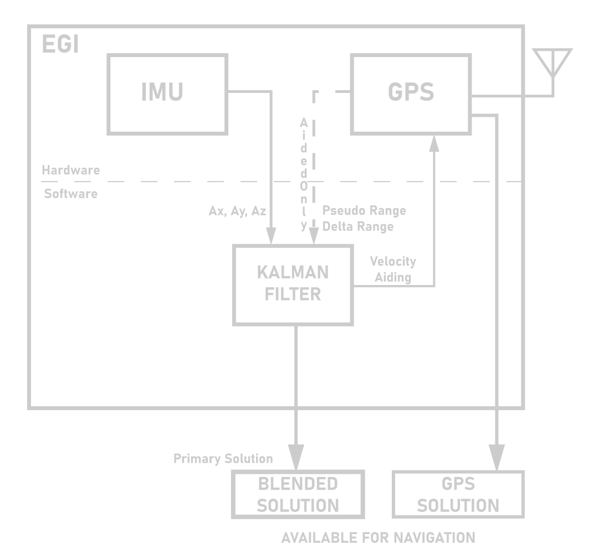
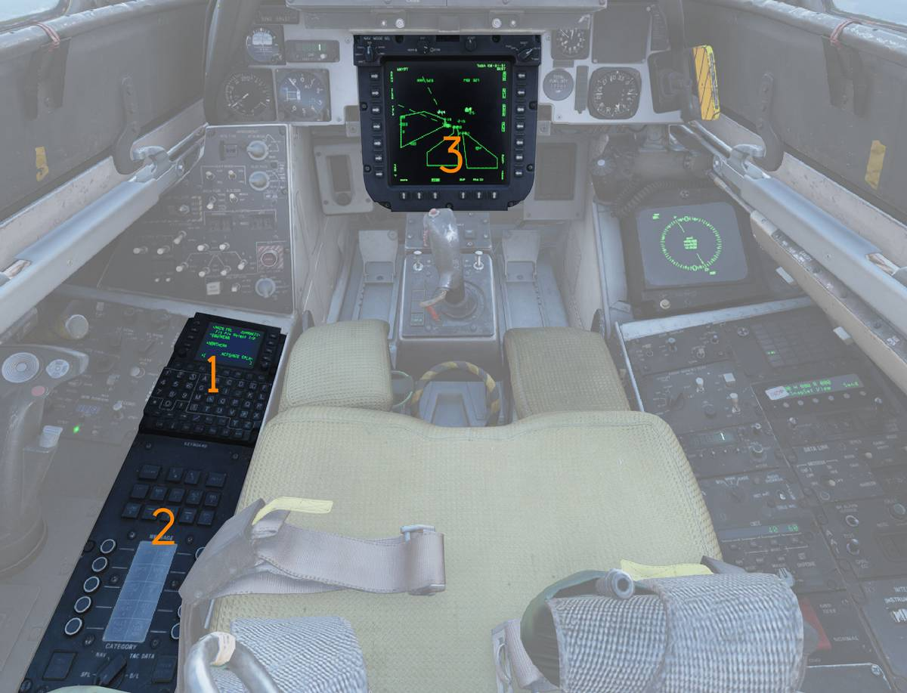
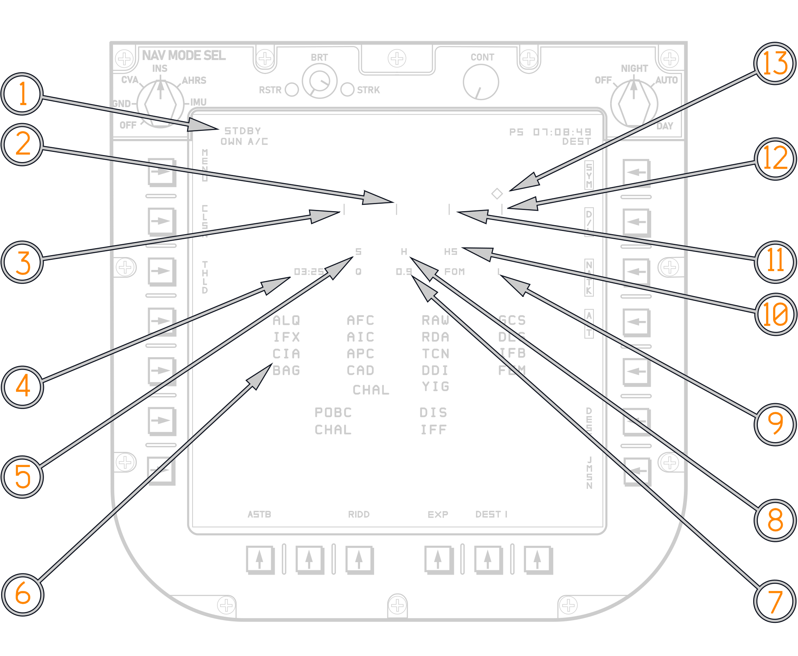
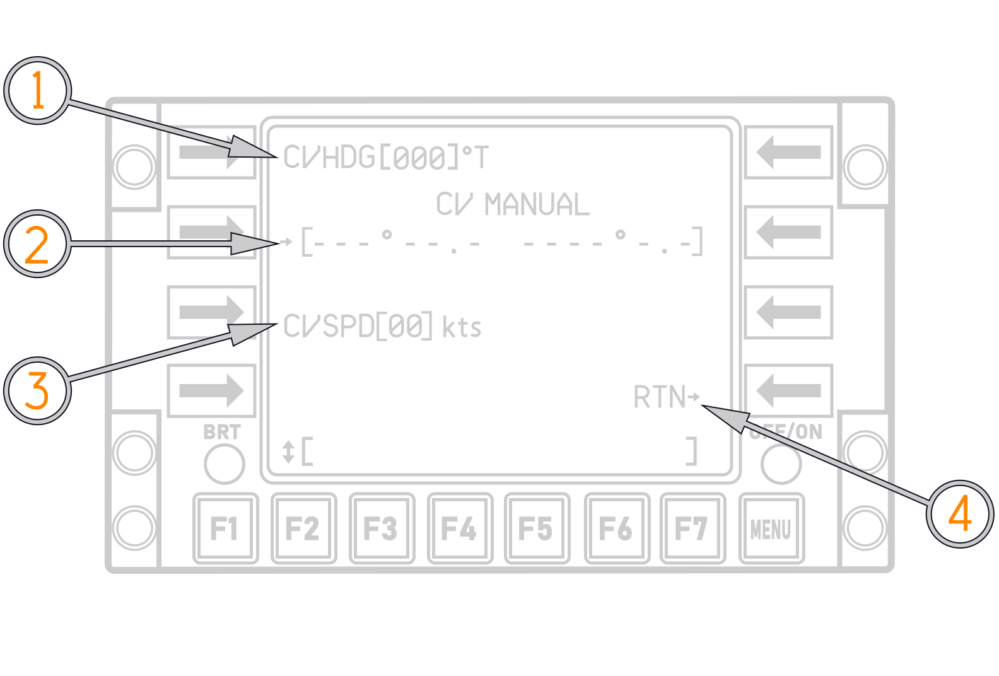

# Introduction

The early F-14A and F-14B relied on a traditional Carrier Aircraft Inertial
Navigation System (CAINS). In the F-14B Upgrade, this architecture was
modernized with a new navigation suite centered around the Embedded GPS/INS
(EGI) and the F-14 Mission Computer (FMC). While the older system relied
entirely on inertial navigation, the upgraded system combines inertial sensors
with satellite navigation, greatly improving long-term accuracy and reducing
drift.

The F-14B(U)s primary navigation components are the H-764G Embedded GPS/INS
(EGI) and the C-12284/A Control Display Navigation Unit (CDNU). The CDNU acts as
the BUS controller for the MIL-STD-1553B digital data bus. The MIL-STD-1553B
digital data bus was the primary element allowing for the integration of the
Navigation system and associated weapons.

The EGI consists of a Ring Laser Gyro (RLG) IMU and a five-channel GPS receiver.
A Kalman filter is used to combine the data of the IMU and the GPS resulting in
a navigation system with essentially no drift.

## Embedded GPS/INS (EGI)

The EGI is a Ring Laser Gyro (RLG) IMU complemented by an embedded five-channel
GPS receiver to provide precise position in addition to the highly accurate RLG
velocity and attitude measurements. A Kalman filter is used to optimally combine
the data from both sensors resulting in a navigation system with essentially no
drift.

The EGI provides three separate position solutions simultaneously:

1. GPS
2. Blended
3. Free Inertial

The GPS solution uses the timing signals transmitted by the NAVSTAR GPS
constellation of satellites to determine position near the earth’s surface. As
long as four satellites are being tracked, extremely accurate position and time
are available even when the EGI is in an alignment mode. The receiver also
provides aircraft velocity in three dimensions, although during rapid
maneuvering the velocity information can lag slightly due to update timing.

The Blended solution is the primary solution determined by the EGI, and is
available for use as soon as the EGI estimates its drift rate is less than 5.0
nm/hr. It uses a Kalman filter that both improves IMU quality and GPS quality
and also uses the GPS solution to refine the position derived from the IMU.

The EGI has the ability to remove the GPS data from the Kalman filter. This is
useful in areas of known GPS spoofing for example. There are therefore two
Blended solutions: Blended (Aided) and Blended (Unaided). The F-14 uses the
Blended (Unaided) solution when GPS aiding is not desired because it still uses
the Kalman filter to improve the IMU position outputs.

The Free Inertial solution is similar to the Blended (Unaided), however it also
excludes the kalman filter and provides only a raw IMU output, this solution
drifts much more than the others and is only used for IMU diagnostic purposes,
it cannot be used for Navigation purposes by the CDNU or FMC.

## EGI MODES OF OPERATION

The EGI has ten modes of operation. In addition to Off, Initialize and Navigate,
there are seven separate alignment modes:

- Gyro Compass
- Stored Heading
- SINS In Motion Align (IMA)
- SINS Stored Heading
- GPS IMA
- Manual IMA
- Air Data IMA

The EGI chooses the alignment mode automatically as soon as the NAV MODE Select
switch on the PTID is in any other position than OFF. The alignment mode is
determined based on NAV MODE SEL switch position, aiding data available, the
state of the parking brake and any detected motion. After alignment the
transition to Navigate can either occur automatically or by RIO action. For a
detailed discussion of the alignment modes refer to the chapter on alignment
modes.

Whilst the Aircrew will primarily interface with the EGI through the CDNU and
use it for navigation purposes, the EGI is crucial for all functions of the
F-14s weapons systems. An accurate position and altitude location is vital to
employing GPS Guided Weapons (GGW).

The old AN/ASN-92 CAINS would drift significantly over longer duration flights,
which would become visible when Datalink and Radar Tracks would not align
properly anymore. This deficiency of the system has essentially been eliminated
by the EGI. With a GPS solution the EGI has essentially no drift, and even
without a GPS solution, the RLG of the EGI now provides much better performance
than the old CAINS.

The EGI paired with the CDNU and the MDL (Mission Data Loader) allows for the
storage of up to 12 flight plans and the usage of up to 50 pre planned waypoints
during flight. Additionally 49 more waypoints can be inserted during flight.

| System Mode                               | Symbol | Attitude Source | Position Source                      | Velocity Source    |
| ----------------------------------------- | ------ | --------------- | ------------------------------------ | ------------------ |
| Blended – Aided (Y-Code Only)             | BY     | EGI             | GPS/INS                              | IMU                |
| Blended – Aided (Mixed P-Code and Y-Code) | BM     | EGI             | INS Only                             | IMU                |
| Blended – Unaided (RIO Commanded)         | IN     | EGI             | INS Only                             | IMU                |
| Blended – Unaided (CSDC Commanded)        | BU     | EGI             | INS Only                             | IMU                |
| GPS                                       | G      | EGI             | GPS Only                             | IMU                |
| IMU/AM                                    | IM     | EGI             | FMC Dead Reckoning                   | FMC Dead Reckoning |
| AHRS/EGI                                  | AE     | AHRS            | EGI (Aided — GPS/INS; Unaided — INS) | IMU                |
| AHRS/GPS                                  | AE     | AHRS            | GPS                                  | GPS                |
| AHRS/AM                                   | AH     | AHRS            | FMC Dead Reckoning                   | FMC Dead Reckoning |
| NAV FAIL                                  | —      | None            | None                                 | None               |

(_EGI Modes Of Operation - Displayed in bottom right of PTID and bottom of HSD_)

## Navigation System Caution and Advisory Lights/Legends

The caution advisory panel on the RIO’s right knee panel has three advisory
lights that indicate failures within the navigation system (IMU, NAV COMP,
AHRS). The panel also has two other advisory lights, C&D HOT and AWG-9 COND,
that are indirectly related to navigation system operation. Illumination of
either or both of these lights could mean degraded navigation operation because
of improperly working displays.

### NAV COMP Light / NAV HUD Display

The NAV COMP advisory light in the RIO annunciator panel will illuminate any
time a fault is detected in the EGI, CDNU, or SDC that could degrade the
navigation solution, or when communication is lost between the EGI and CDNU
(i.e., a NAVBUS failure occurs). A "NAV" indication will display on the HUD in
window 34 anytime a NAV COMP light appears. The light/NAV display will also
appear any time a tolerance level for a particular mode of flight is exceeded.
The NAV COMP advisory light/NAV display should be treated as a cue to check the
status indications on the CDNU. The RIO should read the CDNU annunciator line
and, if necessary, the status page, to determine the exact nature of the fault.

### IMU Light

If the IMU advisory light illuminates, there is either a failure in the EGI IMU
or in the analog circuitry that sends attitude information to the CSDC(R). If
the IMU light illuminates without a corresponding NAV COMP light, the fault is
in the analog circuitry. In either case, attitude information for the VDIG and
missile control system will be provided by the AHRS. If only the IMU light
illuminates, the EGI is still providing a complete navigation solution to the
CSDC(R) and CDNU; only attitude information to the flight instruments is
affected. If both the IMU and NAV COMP lights illuminate, in addition to bad
attitude information, the Blended and Free-Inertial solutions from the EGI will
be unusable. The GPS solution may still be available. Check the EGI status on
the CDNU. Regardless of the nature of the fault, the CSDC(R) will switch the
navigation system mode to the best available. The pilot does not receive any
indication of an IMU failure.

### STANDBY/READY Legends

The Navigation status indicators on the PTID (STBY and READY legends) are used
to interpret the status of the Navigation System. The figure below lists the
possible combinations, the interpretation, and required actions, if any.

| Status                                                                                                                 | Interpretation                                                                                                                                                                                                                                                                                                          |
| ---------------------------------------------------------------------------------------------------------------------- | ----------------------------------------------------------------------------------------------------------------------------------------------------------------------------------------------------------------------------------------------------------------------------------------------------------------------- |
| **ALIGN** STBY ON READY ON  _(STBY and/or READY blinks – parking brake not set or hydraulic pressure low)_ | - Coarse align not complete. - **"HS"** blinks if NAV MODE is **CVA** and no GPS or SINS. If attempting a GPS IMA, wait for a valid GPS solution. If no GPS and no SINS, enter carrier LAT, LONG, true HDG, and SPD on the CDNU via the CV Manual Page. - Normal during align until **ALIGN QUALITY ±3.0 nm/hr**. |
| STBY OFF READY ON  _(STBY blinks – parking brake released for taxi)_                                          | Minimum Phoenix criteria met.                                                                                                                                                                                                                                                                                           |
| STBY OFF READY OFF  _(READY blinks – parking brake released for taxi)_                                        | **ALIGN QUALITY <1.0 nm/hr.**                                                                                                                                                                                                                                                                                           |
| **NAVIGATE** STBY OFF READY OFF                                                                                  | Selected NAV MODE SEL position valid.                                                                                                                                                                                                                                                                                   |
| STBY OFF READY ON                                                                                                   | A better NAV MODE SEL selection is available (INS or IMU if in AHRS, INS if in IMU).                                                                                                                                                                                                                                    |
| STBY ON READY ON                                                                                                    | NAV MODE SEL selection failed.                                                                                                                                                                                                                                                                                          |

(_Standby Ready Legend Logic - Displayed in top left of PTID_)

## EGI ALIGNMENT MODES

Associated equipment for alignment is the Control Display Navigation Unit (CDNU)
(<num>1</num>), Computer Address Panel (CAP) (<num>2</num>) and Programmable
Tactical Information Display (PTID) (<num>3</num>).

Before the EGI can be used for navigation, the GPS must be initialized and the
IMU must determine its orientation with respect to true north. This process is
termed "alignment", and the EGI accomplishes this task automatically, with the
exact alignment mode determined by the reference data available. The unit is
capable of providing accurate position data as soon as the GPS unit acquires the
four satellites necessary for a solution. However, attitude and inertial
velocity measurements require the alignment procedure.

Power is applied to the EGI by selecting any mode other than OFF on the NAV MODE
SEL switch, at which time the unit transitions to its power-up initialization
(INIT) mode. In this mode it performs a Startup BIT; loads initial values for
position, velocity, and time (PVT); loads the GPS almanac if necessary; checks
the availability of data for a Stored Heading Alignment; and then transitions to
the appropriate alignment mode.

Initial position, date, and time values must be entered via the CDNU. The EGI
will use (and the CDNU will display) its last known values until new data are
entered or GPS becomes available. While in INIT, all navigation outputs are set
to zero, null, or invalid as appropriate. The RIO must verify the correct
position appears in Line 1 of the CDNU START 1/2 or START 2/2 page. Upon
verification that the position is correct, LSK1 should be depressed. If the
entered position is the one to which the EGI initialized, the alignment will
continue normally; if the position is significantly different (greater than
approximately 20 miles), the alignment will restart.

(<num>1</num>) Standby/Ready Legends.

(<num>2</num>) 5.0NM/HR Tick.

(<num>3</num>) Coarse Align Tick.

(<num>4</num>) Align time.

(<num>5</num>) SINS Data Required.

(<num>6</num>) OBC Display.

(<num>7</num>) Blended Align Quality.

(<num>8</num>) Align Hold.

(<num>9</num>) GPS FOM.

(<num>10</num>) HS (Flashing): Hand Set Data Required. HS (Steady): Manual IMA
In Progress.

(<num>11</num>) 3.0NM/HR Tick.

(<num>12</num>) 1.0NM/HR Tick.

(<num>13</num>) Align Progress Indicator.

| Symbol                                                                          | Meaning                   |
| ------------------------------------------------------------------------------- | ------------------------- |
|            | Alignment is initializing |
|  | Coarse Align Complete     |
|                | Align Complete            |

> 💡 Initial position for alignment can only be entered using the CDNU; a CAP
> entry will have no effect. Information entered via the CAP goes only to the
> FMC, not the EGI. Communication with the EGI is only effected through the
> CDNU.

The EGI will perform a coarse alignment with the NAV MODE SEL switch in any
position except OFF. However, full specified accuracy is only guaranteed if the
NAV MODE SEL switch is left in an alignment position (GND or CVA) until ALIGN
COMPLETE (a "Dot-in-Diamond") appears. The only operator action required once
power is applied is the entry of initial position using LSK1 on either the START
1/2 or START 2/2 page of the CDNU.

(<num>1</num>) The GPS initializes at the shutdown position. Entering a new
position in the scratchpad will allow the GPS to acquire satellites faster.

(<num>2</num>) Present position of aircraft. Arrow ( ->) indicates
initialization mode can be enabled with LS key 1.

(<num>3</num>) Enter date from SP; Date and day of week.

(<num>4</num>) Time; Enter time from SP; enable time display.

(<num>5</num>) Horizontal datum name and number.

(<num>6</num>) Ground track.

(<num>7</num>) Ground Speed.

> 💡 If power is applied to the EGI prior to the CDNU, depression of LSK1 on
> either of the CDNU START pages may be delayed until after the CDNU is
> functioning.

> 💡 Pressing LSK1 on either page reinitializes the GPS receiver, so momentary
> loss of GPS satellites can be expected. The EGI should reacquire satellites in
> 15–30 seconds.

> 💡 All available sources of reference data are used by the EGI Kalman filter
> to improve the quality of alignment. This includes GPS when in the aided mode,
> and air data (true airspeed, pressure altitude, and pressure altitude rate) at
> all times. The EGI provides the current status of the alignment for display on
> the CDNU and the PTID. Alignment Quality, GPS Figure of Merit (FOM), and Time
> in Alignment are updated every second. Discrete messages for Coarse Align
> Complete; 5.0 nm/hour, 3.0 nm/hour, and 1.0 nm/ hour align quality; Align
> Hold; and Alignment Complete signals are also sent to the CDNU and CSDC(R).

(<num>1</num>) FOM: GPS Figure of Merit

(<num>2</num>) PTID NAV MODE SEL Switch position:

- NAV
- GND
- CV
- AHRS
- IMU
- OFF

(<num>3</num>) Number of Satellites.

(<num>4</num>) Restart Alignment: Returns EGI to Initialize and then to the EGI
chosen alignment mode.

(<num>5</num>) Press LSK 4 to access the CV Manual Align page.

(<num>6</num>) EGI Operation Mode:

- Off
- Initialize
- Gyro Compass
- Stored Heading
- SINS In Motion Align (IMA)
- SINS Stored Heading
- GPS IMA
- Manual IMA
- Air Data IMA

(<num>7</num>) Blended Align Quality in nm/hr.

(<num>8</num>) Alignment time.

(<num>9</num>) Position Solution: GPS; Blended/Aided; Blended/Unaided; Free
Inertial.

When the RIO selects an alignment mode using the NAV MODE SEL switch, alignment
data will normally be displayed on the PTID This display can also be activated
at any time, even while displaying tactical information, by depressing NAV FB-2
on the CAP. Information concerning the status of the alignment is displayed on
both the PTID and the CDNU.

> 💡 If an alignment begins without the Alignment Display appearing on the PTID,
> verify that NAV category FB-2 is selected (button illuminated) on the CAP.

> 💡 If the PTID Alignment Display is selected after the alignment is complete,
> the display will contain the Time In Align at the time the alignment was
> accepted. The Align Quality (Q) and GPS FOM readouts, however, will accurately
> reflect the current state of the EGI, including any improvements to the
> alignment (due to GPS aiding) made after selecting INS on the NAV MODE SEL
> switch.

The PTID will first display a caret (v) on the far left side of the alignment
display, indicating that INIT is in progress. At COARSE ALIGN COMPLETE the caret
transitions to a diamond (◊).

As the alignment progresses, the diamond will move in steps across the alignment
display from left to right aligning with four tick marks representing coarse
align complete, 5.0 nm/hr, 3.0 nm/hr, and 1.0 nm/hr align quality, respectively.
The display also shows the align time in minutes and seconds, Blended align
quality in nm/hr, and the GPS FOM. The actual alignment mode is shown on the
right side of display line 3 of the EGI Start 2/2 page on the CDNU. The left
side of the same line indicates the detected position of the NAV MODE SEL switch
(that is, the position that the CSDC(R) is currently sending to the CDNU).

Alignment telltales are displayed between the tick marks if necessary. An "S"
will appear between the first and second tick-marks indicating invalid SINS data
(only in CV align). An "H" will appear between the second and third tick-mark if
the EGI goes into an align-hold state. An "HS" acronym will appear between the
third and fourth tick-marks when a Manual InMotion Alignment (IMA) is in
progress. The "HS" will flash if hand set data for the Manual IMA are needed.

## Transition to NAV Mode

During alignment, the Free Inertial and Blended solutions are "Coupled", with
gyro and accelerometer biases determined within the Kalman filter for both. Once
the alignment is complete, the two solutions are decoupled, and the Free
Inertial solution continues to use the bias information available at the time of
de-coupling.

The Kalman filter continues to refine those errors for use by the Blended
solution. Thus, even if GPS becomes unavailable, the Blended solution will
provide a more accurate position than the Free Inertial solution. The intent of
the Free Inertial solution is to provide an IMU derived dead-reckoning solution
for IMU diagnostic purposes only. Align quality, displayed on the PTID and CDNU
during alignment, is the EGI’s best estimate of what the Blended (Unaided)
solution drift would be if the EGI were to transition to Navigate mode at that
point.

The EGI signals the FMC when it has achieved full specified alignment accuracy.
This is indicated to the aircrew by the appearance of a dot within the alignment
status diamond on the PTID. The time required to achieve ALIGN COMPLETE is
determined by the total amount of time in alignment with good data, and the
alignment mode used. If ALIGN COMPLETE is set, alignment will continue until the
EGI senses a ground speed of 80 knots, or, until the RIO selects INS, AHRS, or
IMU on the NAV MODE SEL switch.

> 💡 Full specified INS performance (see the specific alignment sections below)
> is only guaranteed if the alignment is allowed to proceed to completion, i.e.,
> the NAV MODE SEL switch stays in an alignment position (GND or CV) until
> achieving ALIGN COMPLETE and a dot appears in the alignment diamond on the
> PTID. If the switch is moved to NAV, AHRS, or IMU prior to ALIGN COMPLETE, the
> Blended solution will continue to improve, but the Free Inertial gyro and
> accelerometer biases will be frozen at the point at which the switch was moved
> out of alignment. Align time will stop incrementing, but blended align quality
> will show improvement.

## GPS

Before the GPS can navigate, the GPS receiver must lock on to the satellite
signals it will use to provide a position. To do this it uses a GPS almanac
stored in its memory to determine where in orbit each of the satellites is. To
properly use this information it must also know its own location, the current
date and time, and its motion with respect to the earth. This information is
supplied using the EGI Start 1/2 page.

## Stationary Alignments

EGI stationary alignment logic is used whenever the parking brake is set, and
the NAV MODE SEL switch is placed in the GND position to initiate an alignment.
Two EGI modes are available in this case: Gyro Compass (GC) alignment and Stored
Heading (SH) alignment.

### Gyro Compass Alignment (GC)

Gyro Compass alignment is the primary ground based inertial alignment mode of
the EGI. Full specified performance (unaided INS drift of less than 0.8 nm/hr)
is available after 4.0 minutes in this mode.

GC alignments require an estimate of current position, GND selected on the NAV
MODE SEL switch, and the parking brake set. In GC, the priority for present
position initialization by the EGI is:

1. GPS, if available

2. CDNU entered Latitude and Longitude

3. The position stored in the EGI at its last shutdown.

> 💡 Note The contents of Home Base or any other waypoint have no effect on the
> alignment.

The procedure for initiating a GC alignment is:

1. Parking Brake — SET

2. CDNU — ON After CDNU SELF TEST complete:

3. NAV MODE SEL switch — GND

4. PTID — ON

5. FMC — ON

6. AWG-9 Cooling — AWG-9/AIM-54

7. CDNU Index Page LSK1 — DEPRESS (Select EGI Start 1/2 Page) On either the EGI
   Start 1/2 or Start 2/2 page, ensure that present position is correct or enter
   a correct position.

8. CDNU LSK1 — DEPRESS A momentary asterisk next to the position on display line
   1 confirms that the Anti-Spoof function (Y-Code) is correctly initialized.
   When ALIGN COMPLETE (Dot in diamond):

9. NAV MODE Switch — INS

10. Verify Blended Mode (BY acronym on PTID)

If the parking brake is released before a COARSE ALIGN COMPLETE indication and
the GPS is navigating (i.e., the GPS is tracking four satellites), then the EGI
will transition to INIT and then to GPS IMA mode (see below). If the parking
brake is released before COARSE ALIGN COMPLETE and GPS is not available, the
alignment will stay in INIT until GPS is available.

> 💡 Note If the alignment stops because the parking brake was released prior to
> COARSE ALIGN COMPLETE, LSK3 on the EGI Start 2/2 Page (RSTRT ALGN) should be
> depressed after the parking brake has been reset, unless a GPS IMA is desired.

If the parking brake is released after COARSE ALIGN COMPLETE, the EGI will
suspend the alignment, set ALIGN HOLD, and wait for the parking brake to be
reset An ALIGN HOLD indication will be posted on the PTID and CDNU, and the STBY
and/or READY legends will flash to indicate the suspension. Align time does not
increment while in ALIGN HOLD, but Align Quality may improve.

> 💡 Note The EGI will not restart incrementing align time until 20 seconds
> after the parking brake has been reset.

> 💡 Note Once the EGI achieves ALIGN COMPLETE (Dot in Diamond appears),
> subsequent release of the parking brake will not cause an ALIGN HOLD. In this
> case the RIO should select INS on the NAV MODE SEL switch prior to releasing
> the parking brake.

### Stored Heading Alignment (SH)

Stored Heading Align is a fast, ground based inertial alignment where the IMU
identifies the direction of local vertical, then initializes position and
heading to the value it had at the last shutdown. Specified performance in this
mode is the same as that for a normal GC alignment. A complete GC reference
alignment must be successfully completed just prior to the last EGI shutdown,
and the aircraft must not be moved after the reference alignment in order to
transition to a SH alignment. When these conditions are met, SH will complete in
30 seconds.

The parking brake must remain set throughout the SH alignment. If it is
released, the EGI will transition to the GPS IMA mode. If the EGI determines
that any of the other required parameters (besides "parking brake set") have not
been met, it will revert to a GC alignment. The only indication that a SH has
been done, is the presence of an ALIGN COMPLETE dot after thirty seconds of
align time.

## In-Motion Alignments

The carrier alignment procedures are used when NAV MODE SEL switch is set to the
CV position. These procedures should be used whenever the aircraft is in motion
with respect to the earth (either because it is taxiing on the ground, is aboard
a moving carrier, or is airborne). The EGI supports five types of In Motion
Alignment (IMA): SINS IMA, SINS SH, GPS IMA, Air Data IMA, and Manual IMA. A
SINS alignment can be done using either the rf data link or the deck-edge cable.
An In-Motion Alignment is begun by selecting the CV position on the NAV MODE SEL
switch; from that point, the mode the EGI uses to align is dependent on the
reference data available.

The data priority is:

1. SINS Data

2. GPS Data

3. Manual Handset Data

> 💡 Note Any time the EGI enters ALIGN HOLD with the NAV MODE SEL switch in CV
> and before COARSE ALIGN COMPLETE, the alignment will restart from the
> beginning.

### SINS In Motion Alignment (SINS IMA)

In SINS IMA, the EGI uses the Ships Inertial Navigation System (SINS) to align
the IMU. The inertial inputs are received by the ASW-27 and transmitted to the
EGI. These inputs include ship’s latitude, longitude, north and east velocity,
as well as roll, pitch, heading, and heading rate. To align the EGI using SINS
data, use the following procedure:

1. CDNU — ON

2. DATA LINK — ON

3. DATA LINK mode — TAC

   After CDNU SELF TEST Complete:

4. DATA LINK mode — CAINS/WAYPT

5. NAV MODE SEL — CVA

6. PTID Power — ON

7. WCS — STBY

8. CDNU INDEX Key — DEPRESS

9. CDNU Index Page LSK1 — DEPRESS (Select EGI Start 1/2 Page), On either the EGI
   Start 1/2 or Start 2/2 page, ensure that present position is correct or enter
   a correct position.

10. CDNU LSK1 — DEPRESS, A momentary asterisk next to the position on display
    line 1 confirms that the Anti-Spoof function (Y-Code) is correctly
    initialized.

    When ALIGN COMPLETE (Dot in diamond):

11. NAV MODE SEL — INS

12. Verify Blended Mode (BY acronym on PTID)

To transition to GPS IMA from SINS IMA, insert the following steps into the
above procedure:

- 9a. Ensure GPS is navigating (FOM < 4)
- 9b. DATA LINK Mode — TAC
- 9c. On EGI Start 2/2 Page LSK3 — DEPRESS (RESTART ALIGN)

The EGI enters SINS IMA mode whenever the NAV MODE SEL switch is placed in the
CV position with "CAINS/WAYPT" selected on the DATA LINK MODE Switch, and a SINS
SH is not available. A full performance alignment (unaided INS drift of less
than 1.0 nm/hr) using this mode will take 5 minutes providing that there are no
SINS data dropouts lasting more than 4 seconds. If a dropout occurs, or the
parking brake is released, the alignment will be suspended. An ALIGN HOLD
indication will be posted on the PTID and CDNU, and the STBY and/or READY
legends will flash to indicate the suspension.

If within 30 seconds the parking brake is reset, or SINS data again become
valid, the alignment will continue. If the alignment is suspended before COARSE
ALIGN COMPLETE, the alignment will restart with align time reset to zero. If
SINS is lost for more than 30 seconds, and the Align Quality has not yet reached
3.0 nm/hr, the EGI will transition to MANUAL IMA. If Align Quality is better
than 3.0 nm/hr, the EGI will transition to NAV mode

### SINS Stored Heading Alignment (SINS SH)

SINS SH is the shipboard equivalent to the ground based SH alignment. In this
mode the EGI uses stored spotting angle to reduce the time required for a full
performance alignment to 4 minutes. A reference alignment must be performed in
accordance with the procedure given above for SH, and the aircraft must not be
moved relative to the ship. If SINS data drop out for longer than 4 seconds or
the parking brake is released during SINS SH, the EGI will suspend the alignment
and transition to SINS IMA.

### GPS In-Motion Alignment (GPS IMA)

GPS IMA is available any time GPS data are valid. The mode can be entered in
three ways:

1. The RIO selects CV on the NAV MODE SEL switch with the DATA LINK MODE Switch
   in TAC

2. The aircraft reaches 80 knots and Weight-OffWheels (i.e., the aircraft is
   airborne) without an alignment.

3. The RIO selects GND on the NAV MODE SEL switch and the pilot releases the
   parking brake prior to a COARSE ALIGN COMPLETE indication

> 💡 Note The EGI will enter GPS IMA with the NAV MODE SEL switch in either GND
> or CV if the aircraft becomes airborne and the alignment is not complete (no
> "Dot-in-Diamond").

If GPS IMA is entered before COARSE ALIGN COMPLETE (i.e., the alignment begins
in GPS IMA), the alignment time for full EGI performance (unaided INS drift of
less than 0.8 nm/hr) will be 10 minutes. If GPS IMA is entered after a COARSE
ALIGN COMPLETE indication in GC, the EGI can complete the alignment in 5
minutes, provided at least 2 of those minutes occur while the aircraft is in
flight (i.e., the aircraft takes off after COARSE ALIGN COMPLETE, but before an
alignment complete dot is posted). If GPS data are lost, the alignment will be
suspended and an ALIGN HOLD indication will be posted on the PTID and the CDNU.

> 💡 Note Once the EGI enters the GPS IMA mode, it will stay in that mode as
> long as GPS data remain valid and the NAV MODE SEL switch remains in an
> alignment position (GND or CV). If GPS is lost, the EGI will suspend the
> alignment if the NAV MODE SEL switch is in GND, and it will transition to
> Manual IMA if the switch is in CV (SINS data are not available). The EGI will
> transition to AIR DATA IMA if the aircraft is airborne.

### Manual In-Motion Alignment (Manual IMA)

If, after entering SINS IMA, the EGI fails to detect valid SINS data, it will
transition to the Manual IMA mode. If this occurs, the RIO should enter the
appropriate latitude, longitude, carrier heading, carrier speed and Z-lever arm
on the CV Manual Page of the CDNU. The CV Manual Page is accessed via the
[Start 2/2 page](../nav_com/cdnu/control_display_navigation_unit.md#start-page-22).

(<num>1</num>) Carrier True Heading.

(<num>2</num>) Carrier Start Location.

(<num>3</num>) Carrier Speed.

(<num>4</num>) Depressing RTN, enters the input data.

> 💡 Any time the "HS" telltale flashes on the PTID alignment display, the RIO
> should enter or re-enter the manual alignment data.

A Manual IMA will take 10 minutes, at which time an alignment complete dot will
appear in the alignment progress diamond. Full specified accuracy for this mode
is only 3.0 nm/hr unaided INS drift. For this reason, Manual IMA should be
considered a backup mode. If the EGI is in Manual IMA and either SINS or GPS
data become available, the RIO should depress LSK3 on the EGI Start 2/2 page
(RSTRT ALGN) to restart the alignment. The EGI will not automatically transition
to a better mode from Manual IMA.

## In-Flight Alignments

If, for any reason, the EGI loses its alignment while airborne, or if it is
necessary to launch before an alignment can be achieved, the EGI is capable of
alignment in flight. The two modes available are GPS IMA and AIR DATA IMA.

### GPS IMA Airborne

GPS IMA while airborne is equivalent to a GPS IMA done prior to takeoff. There
are no restrictions on speed, heading, or maneuvers, only that GPS data be
available. The time in alignment is 10 minutes (provided a GPS solution is
available for that entire period), unless coarse alignment was completed in GC
mode prior to take-off. In that case, the GPS IMA can complete in as little as 5
minutes, provided two of those minutes occur airborne. Inertial alignment
quality for a GPS IMA while airborne will be the equivalent of a GPS alignment
done on the ground or shipboard (i.e., < 0.8 nm/hr unaided INS drift). If GPS
data are lost, the alignment will be suspended and an ALIGN HOLD indication will
be posted on the PTID and the CDNU.

### Air Data In-Motion Alignment (AIR DATA IMA)

Air Data IMA can be used whenever the aircraft is airborne (ground speed greater
than 80 knots and Weight-Off-Wheels), CADC data and AHRS magnetic heading are
valid, and GPS data are not available. If the EGI is in GPS IMA while airborne,
and GPS data become invalid for more than 90 seconds, the EGI will automatically
attempt to transition to Air Data IMA. Once in Air Data IMA, if GPS data is
recovered, LSK3 on the EGI Start 2/2 page (RSTRT ALIGN) must be depressed before
GPS IMA can be used. The total time for an AIR DATA IMA is 35 minutes and the
best inertial alignment quality it can produce is 3.0 nm/hr.

> 💡 Note AIR DATA IMA requires that true heading be provided to the EGI with a
> maximum error of 2.5°. The RIO should thus verify that an accurate value for
> magnetic variation is entered into the FMC.

Aircraft heading, speed, altitude, and the wind must remain constant for the
entire alignment period. If the air data become invalid for more than 5 seconds,
the EGI will enter ALIGN HOLD. If this happens, the alignment will reinitialize
once the data again become valid, and the Align Time will begin counting from
zero. This mode should be considered a backup.

## NAVIGATION UPDATING

> 🚧 Work in Progress

The GPS receiver in the EGI provides highly accurate position. As a result,
there is very little need to update the solution to account for drift. Even if
GPS is degraded to Standard Positioning System accuracy, the quality of the EGI
Blended (Aided) solution will be much better than can be obtained using updates.
For that reason, only “Map Bias” updates (temporary position offsets of a
specific amount which are added on top of the Kalman filter solution) are
allowed under normal circumstances. This feature allows the flight crew to
modify their position to match other, non-GPS equipped units.

> 💡 Note Only the Blended and Free-Inertial solutions will reflect the offset
> when a Map Bias update is performed. The GPS solution will always show the
> actual position computed by the GPS receiver.

> An asterisk will appear next to the position readout on the RNAV, Start, and
> Progress pages of the CDNU when a Map Bias is in effect.

When the actual Blended and Free Inertial solutions must be updated because of
drift experienced when GPS is unavailable, Kalman filter updates are permitted.
The NAV MODE SEL Switch must be in an Align position (GND or CVA), and the
update will not take effect if GPS is available. These updates are termed
“Optimal” updates, and actually modify the Blended solution and Free Inertial
calculations.

The Updates can also be used to modify the latitude or longitude in
[FMC](../nav_com/navigation_controls_displays.md#system-architecture-and-terminology)
position of the aircraft in the AHRS/AM and IMU/AM modes if the EGI has failed.

Similar navigation updating techniques are employed whether a Map Bias or
Optimal position update is performed. For both, a ground reference point
(latitude and longitude) position is required. The range and bearing of this
position to present aircraft position is used to make the correction. The
general procedure for doing an update is:

1. Select the Map Bias page or Optimal Page on the
   [CDNU RNAV](../nav_com/cdnu/control_display_navigation_unit.md#rnav-inav-page)
   Page.
2. Establish a reference point using an FMC navigation point.
3. Determine the offset to that point.
4. Accept or reject the update based on the size of the offset.
5. Confirm that the CDNU reflects the update.

The latitude and longitude of the desired update point must be stored in one of
eighteen FMC navigation waypoint locations (12 WPs, FIX PT, HOME BASE, HOST
AREA, DEF PT, and IP) prior to initiating the Map Bias or Optimal update. This
data may be stored prior to flight, by data link, by manual insertion, or by
transfer from the CDNU. The point selected for the update must be hooked. The
pre-stored latitude and longitude should be checked on the PTID. The CATEGORY
select switch is rotated to NAV and the desired type of update selected.

> 💡 Note Do not use SURF TGT as a reference for updating the navigation system.
> The surface target position symbol is repositioned with respect to
> own-aircraft vice own-aircraft being updated in reference to the surface
> target.

### Radar Update

For a radar update, the FMC computes own-aircraft position by measuring radar
range and bearing from the reference point coordinates in the track file.

Once the update point is called up, its latitude and longitude are verified on
the PTID readouts. The same point is then located on the DDD, using the hand
control with the radar operating in the pulse search mode. DDD CURSOR is
selected on the hand control and halfaction is selected so that the DDD cursors
are presented on the DDD. Once the cursors overlay the selected point, full
action is selected. This tells the computer the point selected.

> 💡 Note RDR FIX may be selected before or after positioning DDD cursors.

When the RDR FIX pushbutton is depressed, the computer will compute the present
position of the aircraft by measuring the range and bearing from the selected
point. The difference between the computer position and the position determined
by the EGI is then displayed on the PTID. If it is desired to enter this delta
into the navigation computations, the FIX ENABLE pushbutton is depressed.
However, if the observed delta does not appear to be correct, the computer and
the readout can be cleared by deselecting the RDR FIX pushbutton. The fix may
then be attempted again. Once FIX ENABLE is depressed on the CAP, the delta will
appear on line five (5) of the Map Bias or Optimal page on the CDNU.

> 💡 Note Data line five (5) of on the CDNU Map Bias and Optimal pages may be
> toggled between delta latitude/delta longitude display or an error distance
> display in nautical miles.

Radar updating is performed as follows:

1. Select — CDNU Map Bias or Optimal page.

2. Hook — Desired navigation point.

3. PULSE SRCH pushbutton — DEPRESS.

4. On sensor control panel:

   a. STAB switch — IN.\

   b. EL BARS switch — 1.\

   c. AZ SCAN switch — AS DESIRED.\

5. If Ground Map desired:

   a. CATEGORY Switch — TGT DATA.\

   b. FB-1 — DEPRESS.\

6. RDR FIX pushbutton — DEPRESS.

7. CURSOR pushbutton — DEPRESS.

8. HCU — Select HALF ACTION.

9. Cursor — is displayed on DDD.

10. Manipulate hand control — DDD cursor over desired ground map point.

11. HCU — FULL ACTION and RELEASE.

    > Note 💡 This causes the DDD cursor to remain at the selected position.

12. Observe present position delta readout on the PTID.

13. If Delta is Unsatisfactory:

    a. Deselect — RDR FIX.\

    b. Repeat — steps 2–11.\

14. FIX ENABLE pushbutton — DEPRESS to accept update. 15. Confirm delta LAT/LONG

### TACAN Update

Updating the navigation system by TACAN requires that the waypoint used for the
update be the same latitude and longitude as the TACAN station. The TACAN
channel that corresponds to the station selected must be selected, and should be
verified by listening to the identifier (coded tone) in the headset. To update
the aircraft position with respect to the station, the TACAN FIX pushbutton is
depressed. The FMC then computes own aircraft position error based on the range
and bearing from the TACAN station. The delta is then observed and entered into
the computer in the same manner as for radar updating. TACAN updating is
performed as follows:

1. Pilot Select — TACAN channel corresponding to desired update point.

2. Hook — Desired update point.

3. Select — TACAN on TACAN CMD panel.

   > Note 💡 Failure to select TACAN on the TACAN command panel will result in
   > the use of the CDNU active waypoint instead of the TACAN station when
   > determining delta latitude and longitude.

4. Select — CDNU Map Bias or Optimal page.

5. CATEGORY switch — NAV.

6. TACAN FIX pushbutton — DEPRESS.

7. Observe present position delta readout on the PTID.

8. If Delta is Unsatisfactory:

   a. Deselect — TACAN FIX.\

   b. Repeat — steps 3–6.\

9. FIX ENABLE pushbutton — DEPRESS to accept update.

10. Confirm delta LAT/LONG appears on line five of the CDNU.

> Note 💡 When performing a TACAN update, aircraft MAGVAR must match the TACAN
> station’s declination, otherwise, the update will be in error. An assumption
> is made by the FMC that the TACAN station bearing information is adjusted for
> the TACAN’s declination, and that it is the same as the manually entered value
> of MAGVAR. TACAN declination will normally not be the same as the MAGVAR at
> the aircraft and may not be the same as the MAGVAR at the station. If the
> TACAN station is one of the waypoints stored on the MDL or in the CDNU
> database, TACAN declination can be found on the right side of Data Line 5 on
> the CDNU Waypoint Data page for that station. To illustrate the impact of
> MAGVAR error, assume that a TACAN station with a range of 100 nautical miles
> from ownship is used for an update. A 1 degree difference between MAGVAR and
> TACAN declination will result in a 1.74 nautical mile error in the update
> position.

### Visual Update

A visual update is performed by flying over the previously entered FMC waypoint
and depressing the VIS FIX pushbutton. A timing estimate must be made since the
aircraft nose and fuselage may obscure the ground reference point for some time
during the overflight. Also, it is difficult to estimate when directly overhead
a ground reference point when altitude is greater than 10,000 feet. The delta
then appears on the PTID. Again, this delta may be entered into the computer by
depressing FIX ENABLE.

Visual updating is accomplished as follows:

1. Select — CDNU Map Bias or Optimal page.

2. Hook — Desired update point.

3. CATEGORY switch — NAV.

4. Overfly the selected pre-stored point and when over the point, depress the
   VIS FIX pushbutton on the CAP.

5. Observe present position delta readout on the PTID.

6. If delta is unsatisfactory:

   a. Deselect — VIS FIX.\

   b. Repeat — steps 3–5.\

7. FIX ENABLE pushbutton — DEPRESS to accept update.

8. Confirm delta LAT/LONG appears on line five of the CDNU.

### CDNU Visual Update

A Visual Update can also be accomplished using the CDNU alone with the following
procedure:

1. Select — CDNU Map Bias or Optimal page.

2. Enter a known position into Data Line 3 of the CDNU using LSK2.

3. Overfly known position, and when over the point, depress the MARK Key on the
   CDNU.

4. Enter the resulting position into Data Line 1 of the CDNU using LSK1.

5. Observe present position delta on Data Line 5 of the CDNU.

6. If delta is unsatisfactory:

   a. LSK8 — DEPRESS.\

   b. Repeat — steps 2–5.\

7. LSK7 — Depress to accept the update

### Fighter-to-Fighter Navigation Update

Net aircraft using fighter-to-fighter data link (FF/DL) can coordinate their
navigation systems while in the FF/DL mode. Hooking an associated net aircraft
symbol and pressing D/L FB-5 causes the coordinates of the hooked aircraft to be
used as a reference for updating own-aircraft coordinates. The exact procedure
is:

1. Obtain a radar STT on or fly in close formation with another net aircraft.

2. CATEGORY switch — D/L.

3. Hook — Net aircraft symbol.

4. CAP FB-5 — DEPRESS.
