# Vertical Display Indicator Group-Replacement

The VDIG-R (Vertical Display Indicator Group Replacement) was introduced as part
of the F-14B upgrade program to address the limitations of the original
F-14A-era pilot displays and HUD. The upgrade combines a new HUD with updated
mission-processing hardware while retaining portions of the existing VDI
installation. By presenting primary flight, navigation, radar, and weapon
information in the pilot’s field of view, the VDIG-R reduces the need to
reference cockpit instruments and improves integration between the aircraft's
sensors and displays.

The VDIG(R) provides the pilot symbolic takeoff, cruise, air−to−air (A/A),
air−to−ground (A/G), landing, and test information. Electronically generated
symbology portrays aircraft attitude, command, and tactical information.

The information is displayed on the Heads Up Display (HUD) and depends on
mission phase and the mode of operation the pilot selects for a given phase. The
Vertical Display Indicator (VDI) acts as a HUD repeater, or can display TCS or
LANTIRN video. The VDIG(R) includes the HUD, HUD Camera, VDI, VDIG(R) Bezel, and
the CP−24341AYK Processor Interface Unit (PIU).

The VDIG(R) system displays, HUD and VDI, are mounted in the chassis unit
assembly with peripheral indicators and switches. The HUD and VDI are mounted in
the front cockpit behind the center windscreen. The HUD is the primary source of
flight information. Flight critical data (airspeed, altitude and attitude) is
presented on the HUD in all modes. The Stores Status Indicators’ flag
information is selectively displayed on the VDI HUD Repeat.

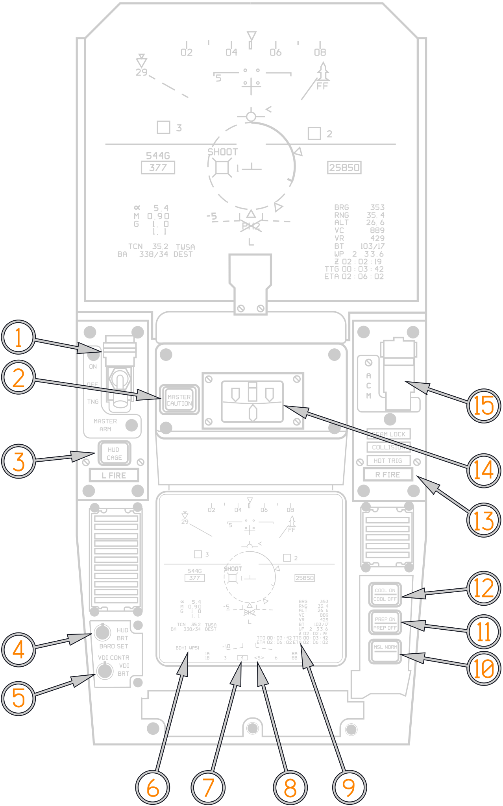

(<num>1</num>) Master Arm.

(<num>2</num>) Master Caution Pushbutton.

(<num>3</num>) HUD Cage/Uncage button.

(<num>4</num>) HUD Brightness/Barometric setting.

(<num>5</num>) VDI Contrast, VDI Brightness.

(<num>6</num>) Bearing Distance Heading Indicator mode. Only shown on VDI.
(Currently BDHI showing steer to WP51).

(<num>7</num>) Station Status Indicator. Only shown on VDI. Boxed denotes is
station selected.

(<num>8</num>) Station Status Indicator. Only shown on VDI. Station store is
ready.

(<num>9</num>) Primary and Secondary Time To Go and Estimated Time of Arrival.
Secondary TTG and ETA only shown on VDI. (See
[Time Selection Page](../nav_com/cdnu/control_display_navigation_unit.md#time-selection-page))

(<num>10</num>) Missile Mode selector pushbutton.

(<num>11</num>) Missile Prep pushbutton.

(<num>12</num>) Missile Cool pushbutton.

(<num>13</num>) Right Engine Fire warning. Hot Trigger light. Collision Steering
light. Seam Lock light.

(<num>14</num>) Turn-Slip indicator.

(<num>15</num>) Air Combat Maneuvering mode cover.

## Symbology Common To All Display Modes

The symbology described below is designed to provide accurate flight path
information on the HUD as well as maintain conventional pitch and roll attitude
indicator type information.

### FPM, CDM, PFPM, Aircraft Reticle

One of the fundamental benefits of the HUD is the presentation of flight path
information as the primary control reference. Traditional pitch referenced
displays require the pilot to mentally determine aircraft flight path by
referencing pitch attitude, vertical velocity, and AOA. The incorporation of
flight path information eliminates the need for these mental interpretations by
indicating where the aircraft is going rather than where it is pointing (i.e.,
pitch attitude).

The HUD presents flight path information utilizing the symbols FPM, CDM, and
Potential Flight Path Marker (PFPM).

 _Shown here: Flight
Path Marker (FPM) and Potential Flight Path Marker (PFPM)_

Unlike a fixed pitch reference, which indicates where the nose of the aircraft
is pointing, the FPM’s position changes based on the dynamic characteristics of
the aircraft and the atmospheric conditions in which the aircraft is flying
(i.e., winds).

This displacement of the FPM can cause two undesirable effects. First, the
displacement of the FPM also displaces all the symbols that are positioned
relative to the FPM (e.g., instrument landing system ILS/TACAN symbology, or the
climb/dive ladder). The displacement of the symbols can overwrite or interfere
with the interpretation of other primary flight information (i.e., altitude and
airspeed scales). Second, during dynamic maneuvering, the FPM, along with the
Climb/Dive Ladder (CDL), can disappear from the display leaving the pilot with
no attitude reference whatsoever.

To compensate for these shortcomings, the CDM was adopted as a standard display
reference and is used in the F−14B Upgrade VDIG(R) system.

The adoption of a CDM has several advantages as a primary display reference as
compared to the FPM:

- The lateral displacement of the display reference due to sideslip and winds is
  restricted.
- Since stability of the display reference is greatly enhanced by the
  incorporation of the CDM, the stability of all symbology referenced to the CDM
  is also improved.
- The CDM more accurately displays the resultant climb/dive angle.

The FPM continues to be displayed at 1/3 size when the CDM is displayed.
However, the CDM will occlude the FPM when the FPM is within 15 mils of the CDM
center.

 _Shown here:
Climb Dive Marker (CDM) and small Flight Path Marker (FPM)_

Supplementing the CDM and FPM is the PFPM, which moves up and down along the
right side of the CDM or FPM indicating aircraft acceleration or deceleration
along the flight path. The PFPM can thus be used to:

- Show if aircraft is accelerating or decelerating.
- Determine achievable climb or dive angle while maintaining constant airspeed
  for the selected power setting.
- Determine if aircraft is gaining or losing total energy.
- Show which way to move the throttle to stabilize at current energy state.

The inertial data dependent symbology (FPM, CDM, PFPM, ground speed, vertical
velocity, aircraft G and aircraft peak G) are displayed when operating in the
Blended Aided or Blended Unaided navigation modes. When the CSDC(R) detects and
commands a degraded navigation mode [NAV Fail, AHRS/GPS, AHRS/AM, IMU/AM or
AHRS/EGI (GPS)], inertial data dependent symbols are not displayed and the
system reverts to a pitch reference only display.

In the pitch reference state, the Aircraft Reticle becomes the reference symbol
for attitude. The reticle is fixed at a position 3.5° below the Fuselage
Reference Line (FRL), or 2.5° above the HUD optical center.

A HUD caging function is provided to limit display motion so that needed
symbology stays within the Instantaneous Field Of View (IFOV). The default
setting is caged for all display modes except A/G. A/G display default mode is
UNCAGED.

When the HUD is caged, the CDM is displayed. The CDM is constrained in lateral
motion, and to the Instantaneous Field Of View (IFOV) of the HUD in elevation. A
simultaneous FPM and CDM will be seen whenever the HUD is caged, and the flight
path differs laterally from the CDM by greater than 10 mils. In this case, when
the FPM appears from behind the CDM area, it is displayed at 1/3 normal size.

When uncaged, either by pilot selection using the HUD CAGE push-tile on the VDI
bezel or by selection of A/G display mode, the FPM is displayed and is free to
move about the IFOV. If the FPM reaches the edge of the IFOV, it will flash; the
CDM provides vertical flight path information. When flight path returns within
the IFOV, the HUD will again only display the FPM.

When the CDM/FPM symbol is pegged at the Instantaneous Field of View (IFOV)
limit, the symbol will flash. At the same time, the Waterline symbol on the HUD
will also flash if it is displayed (Takeoff or Landing PDCP modes and during
failure modes that result in the Waterline symbol appearing). Thus, at extreme
angles of attack, when the flight path is markedly different from the aircraft’s
longitudinal axis, the pilot can expect to see the CDM/FPM and Waterline symbol
flash.

The HUD maintains the last pilot selection (caged or uncaged) when the PDCP
selection is changed, unless the selection is A/G. PDCP A/G default is uncaged.
The pilot may select CAGE in A/G mode.

> **CAUTION** Due to the proximity of the HUD CAGE pushbutton to the MASTER ARM
> switch, the pilot should avoid caging the HUD when dropping conventional
> ordnance.

### Climb/Dive Ladder

The CDL consists of a horizon line that depicts 0° flight path angle, and index
lines numbered in 5° increments.

The positive index lines are solid with the vertical legs pointing to the
horizon. The negative index lines are dashed and are angled at one half the dive
angle to the horizon. For example, if the aircraft were in a 30° dive, the CDL
index lines would be angled at 15° down from the horizon line.

The HUD TFOV will typically display four CDL index lines. The aircraft pitch
attitude determines the CDL index line displayed on the HUD.

The CDM indicates aircraft flight path. When the aircraft is at a flight path
angle/attitude where the horizon line is outside the IFOV, the HUD displays a
Ghost Horizon Line at the edge of the IFOV closest to the actual horizon.

A zenith symbol is shown at 90° nose up and a nadir symbol is displayed at 90°
nose down. The CDL is positioned using EGI attitude data, or AHRS data (pitch
reference state).

It is important to note that the CDL is always referenced off of the CDM, or
FPM, even when these symbols are pegged at the edge of the IFOV. This means that
above approximately 18 Units AOA, the CDL will no longer represent pitch
attitude when read against the waterline, aircraft reticle or ADL.

Actual aircraft flight path will still be accurate when read against the CDM.
The end result is that the CDL does not conform to the real world in some cases,
and the horizon line will not be coincident with the actual horizon.

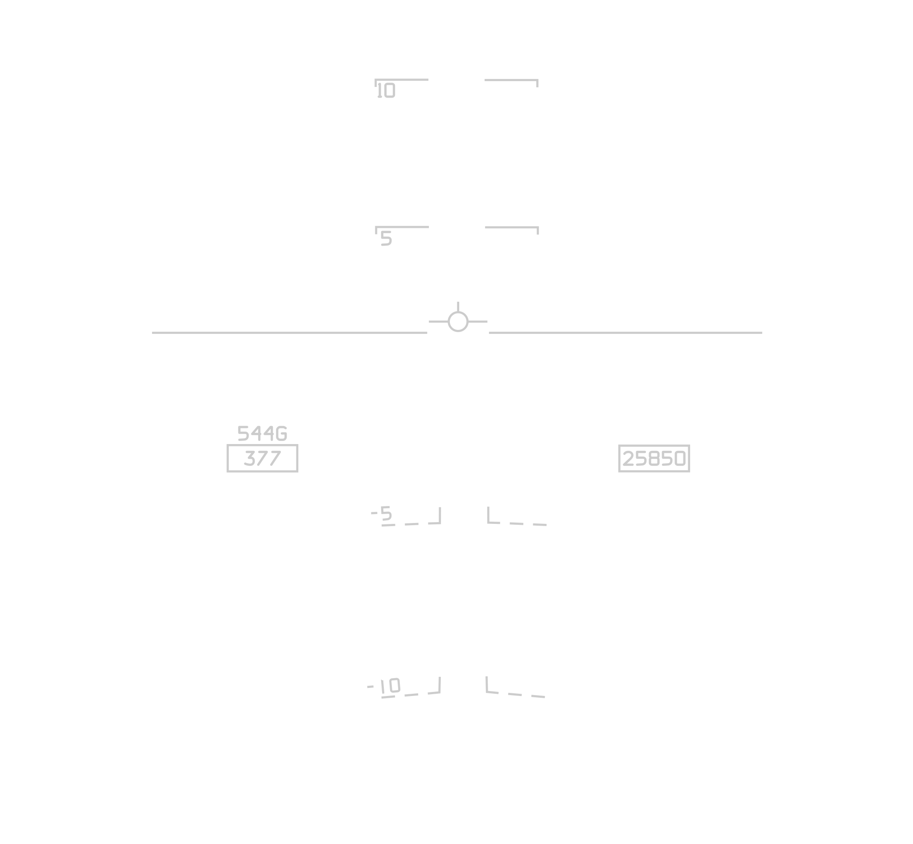

> **WARNING** The waterline and aircraft reticle must not be used for pitch
> reference when the Climb Dive Marker is limited by the HUD IFOV.

### Heading Scale

The heading scale displays magnetic heading provided via the CSDC(R). It
consists of a scale of tic marks with numerical values and a triangular pointer
pointing to the current value of magnetic heading.

In T.O., LDG, CRUISE and A/G modes, the scale has major divisions of 10 degrees.
In the A/A mode, the scale has major divisions of 20 degrees.

The Heading Scale is laterally centered at the upper IFOV boundary in CRUISE,
A/A and A/G modes. In T.O. and LDG modes it is laterally centered with the
bottom of the scale’s digits located 2 degrees above the top of the CDM, or the
FPM if the CDM is not displayed, but never lower than 3 degrees above the
horizon line.

If the FPM/CDM is inhibited (e.g., INS degraded) in T.O. and LDG modes, the
scale is placed at the same fixed position as in CRUISE, A/A, and A/G Mode.

[AHRS](../../../f14ab/systems/nav_com/ahrs.md) data via the CSDC is the primary
heading source. If AHRS data is invalid, AWG−9 derived magnetic heading (true
heading + magnetic variation) is used.

### Airspeed and Altitude Information

Airspeed information is provided on the HUD from
[CADC](../../../f14ab/systems/flight_controls_gear/cadc.md) data.

Altitude information is provided on HUD from either barometric (from
[CADC](../../../f14ab/systems/flight_controls_gear/cadc.md)) or radar sources,
depending upon pilot’s selection of BARO or RDR with the PDCP HUD ALT switch.

If ANLG is selected on the PDCP FORMAT switch, Airspeed and Altitude Analog
Dials are displayed around a digital readout of the respective quantities.
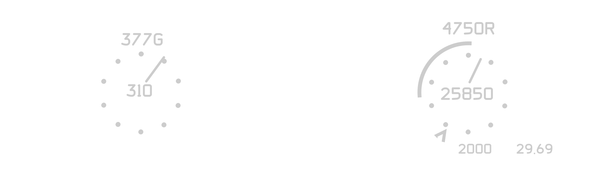

#### Airspeed Analog Dial

The Airspeed Analog Dial consists of ten dots equally spaced around a circle and
a pointer with the pointer making one complete clockwise revolution for every
100 knots of airspeed. Zero and multiples of 100 knots are referenced to the 12
o’clock position.

Auxiliary Airspeed is normally groundspeed. This adds a ready display of
groundspeed for use in high density altitude takeoff and landing conditions.

Groundspeed is displayed in T.O., LDG, CRUISE, A/A and A/G HUD display modes.
VDIG-R calculated groundspeed is displayed in CRUISE and A/A modes and in A/G.
The letter G for groundspeed is posted following the numerical readout.

#### Altitude Analog Dial

The Altitude Analog Dial consists of 10 dots encircling the digital altitude
with a pointer rotating on the inside circumference of the dots. One full
rotation of the pointer equals 1000 feet of altitude change. Zero and multiples
of 1000 feet are referenced to 12 o’clock.

Clockwise rotation of the pointers indicates increasing value.

The HUD will display Barometric Altitude with a flashing "B" if radar is
selected and Radar Altitude is not available. An "R" is shown if Radar Altitude
is displayed.

The HUD barometric pressure setting is independent of the altimeter setting in
the cockpit.

> **WARNING** VDIG(R) HUD altimeter and cockpit altimeter settings are
> independent. The pilot must ensure BOTH systems are updated with every
> altimeter change.

The analog Vertical Velocity speed tape is displayed only in T.O. and LDG,
superimposed on the Analog Altitude Dial. The zero point is at the 9 o’clock
position, with each dot representing 400 ft/min. A ^ mark is positioned at −650
ft/min to aid in instrument approaches. A vertical speed tape originates at the
9 o’clock position and pegs at −2000 ft/min if at or beyond that sink rate,
positioned just outside the radius of the dots so as to not obscure the dots.

### Angle of Attack Readout

AOA is displayed in all modes. However, in T.O. and LDG, the readout is removed
when the AOA is between 14 and 16 units. To prevent the display from cycling at
the boundary of these values, a dead-band is provided.

If AOA is greater than 14 units and decreasing, the readout remains off until
the AOA decreases below 13 units.

If AOA is less than 16 units and increasing, the readout remains off until the
AOA increases above 17 units.

The central air data computer
([CADC](../../../f14ab/systems/flight_controls_gear/cadc.md)) provides AOA
values up to 19 units. Above 19 units, an AOA estimate is calculated by the
VDIG(R). When the estimated value is displayed, parentheses are placed around
the AOA numeric to indicate the displayed value is an approximation.

The VDIG(R) will display AOA in excess of 19 units up to an estimated 40 units.
The value is calculated based on EGI flight path data corrected for yaw and
roll. Flight test results indicate that the estimate will typically be accurate
to within five units.

The display is intended as a trend indicator. When the estimate is greater than
40 units, "(40+)" will be displayed; when the estimate is less than 19 units and
the [CADC](../../../f14ab/systems/flight_controls_gear/cadc.md) AOA is greater
than 19 units, "(19.1)" is displayed.

### Waterline

The Waterline is a pitch reference symbol. It is displayed in a fixed location
on the HUD, laterally centered at the aircraft fuselage datum (6° above HUD
optical center).

The waterline is always displayed in T.O. and LDG modes. If the VDIG(R) enters
the pitch reference state (inertial data failure), the waterline is shown in all
display modes.

### Aircraft G

Aircraft g is displayed as a digital readout indicating aircraft normal
acceleration as provided by the EGI.

> **Note** Because of different sensor sources for the g-meter and the EGI,
> their respective g indications can differ. At maximum g, the g-meter can lag
> the HUD g readout by 0.5g prior to reaching a steady state condition.

Aircraft g is always displayed in A/A, A/G or CRUISE PDCP modes. Aircraft g is
also displayed in the T.O. or LDG PDCP modes when aircraft g is greater than
+1.5 or less than +0.5.

### Barometric Pressure

Since the VDIG(R) receives uncorrected (29.92 referenced) pressure altitude from
the CADC, the local altimeter (barometric pressure) setting must be supplied.

The pilot enters the setting using the HUD BARO set knob located on the lower
left portion of the VDIG(R) bezel.

The VDIG(R) altimeter setting is continuously displayed on the HUD in T.O. and
LDG modes.

In all display modes except A/G, the setting display flashes at 3 Hz for five
seconds to alert the pilot to one of the following conditions:

- Whenever the aircraft passes 17,700 MSL altitude.
- Whenever descending below 10,000 MSL with calibrated airspeed less than 300
  knots, after previously exceeding both of these values.

The VDIG(R) altimeter setting is also displayed on the HUD without flashing
whenever the setting is changed. The setting remains displayed for five seconds
after the new entry is completed.

The VDIG(R) altimeter setting displays continuously in all display modes on the
VDI display.

> **WARNING** VDIG(R) HUD altimeter and cockpit altimeter settings are
> independent. The pilot must ensure BOTH systems are updated with every
> altimeter change.

### TACAN course deviation indicator

The displacement of the course bar from the reference symbol provides TACAN
deviation. The vertical course bar is solid when receiving TO TACAN information
and dashed when receiving FROM TACAN information. Two solid dots appear on the
course bar side of the reference symbol and perpendicular to it. The dot closest
to the reference symbol represents a half scale deflection of 3° off course. The
outermost dot represents full scale deflection of 6° off course. For
deviations > 7°, the bar pegs. When the aircraft crosses the selected course,
the bar moves to the opposite side of the reference symbol and the dots appears
on that side. If the bar is centered on course ±1/2°, the dots disappear. The
course bar indicates being on course when centered over the reference symbol.
Course and deviation dots are to the right of the reference symbol when TACAN
deviation is positive and to the left when negative. The course bar and
deviation dots are only displayed with TACAN steering selected while in T.O.,
CRUISE and LDG modes.

### ICLS Vectors

The ILS vectors consist of two independent vectors (horizontal and vertical)
which form a cross pointer. The displacement of the horizontal vector from the
reference symbol indicates the ILS glide slope error and the vertical vector
displacement indicates the ILS localizer error. The ILS vectors are only
displayed in LDG mode with AWL steering selected. The Vectors are displayed by
default on the VDI, they are only displayed on the HUD when the VDI mode is in
Video whilst AWL is selected on the PDCP submode. (ACL Tadpole explained below).

### Automatic Carrier Landing (ACL) Steering Indicator

The ACL steering indicator displays ACL steering information with respect to the
reference symbol. Zero vertical and lateral error results in the indicator being
superimposed on the reference symbol. It is only displayed in LDG with AWL
steering selected. The ACL Steering Indicator is always displayed on HUD and VDI
with AWL submode and LNG selected on the PDCP, and valid ACLS datalink tuned.

### Navigation Data Readout

DEST/TACAN steering range and range source are displayed at the lower right
corner of the HUD.

TACAN data is displayed when TACAN is selected for steering. Otherwise WP# / LP#
/ TGT# is displayed, followed by range to that point.

- WP # (Waypoint ID)
- TGT # (Selected Station)
- LP # (Selected Station)

### Steering Mode

The PTID steering mode selected by the RIO is displayed in the lower left in
T/O, A/A, A/G, and CRUISE.

The steering mode options include:

- DEST
- CDNU Mode (MAN/AUTO/OFLY)

### Time Display

The Universal Coordinated Time (UTC) time display is presented in all modes at
the lower right corner. This time is obtained from the EGI system via the 1553
Navigation Bus connection.

### Estimated Time of Arrival and Time to Go

Estimated Time of Arrival (ETA) and Time to Go (TTG) to either the BDHI steering
point, route waypoint, or HUD steering points are displayed on the HUD/VDI on
the bottom right.

Additionally, the ETA/TTG to a secondary point can be displayed on the VDI only
left of the normal TTG and ETA displays.

The CDNU has a
[Time Selection Page](../../systems/nav_com/cdnu/control_display_navigation_unit.md)
accessed via the CDNU F6 function key. The Time Selection menu allows the RIO to
select the source for HUD/VDI TTG and ETA.

This information is not displayed with Weight-On-Wheels.

## Takeoff

The Takeoff display mode is entered by depressing the T.O. pushbutton on the
PDCP. The steering command selections are TACAN, Destination (DEST), All Weather
Landing/ Precision Course Direction (AWL/PCD), Manual (MAN), and Vector (VEC).

The figure below depicts the symbology and the format of the F−14B Takeoff Mode
with DEST, AWL/PCD, MAN, or VEC steering selected display. In addition to the
basic flight symbology discussed previously, the following symbology is
displayed on the HUD in this mode: Vertical Velocity, CDI and Angle of Attack
Bracket. The Aircraft Reticle is displayed when the CDM/FPM is not available.

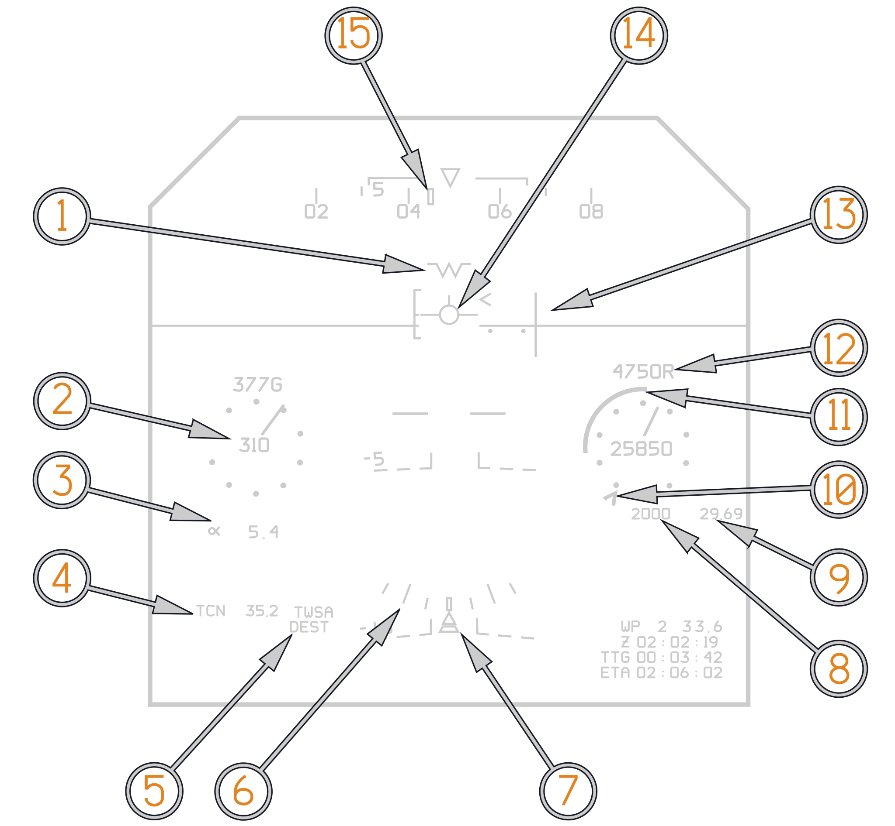

(<num>1</num>) Waterline.

(<num>2</num>) Indicated Airspeed. (Analogue Dials selected on PDCP).

(<num>3</num>) AOA readout.

(<num>4</num>) Range to tuned TACAN station.

(<num>5</num>) PTID steering mode (DEST) and Radar Mode (TWSA).

(<num>6</num>) Bank Scale.

(<num>7</num>) Bank/Sideslip Arrow.

(<num>8</num>) Digital Vertical Velocity readout.

(<num>9</num>) Altimeter Setting.

(<num>10</num>) -650/MIN Index.

(<num>11</num>) Analogue vertical velocity tape.

(<num>12</num>) Radar Altimeter readout.

(<num>13</num>) Course Deviation indicator (TACAN selected on PDCP).

(<num>14</num>) Flight Path Marker (FPM) with Angle Of Attack Bracket (AOA
indicator removed with Gear Handle up).

(<num>15</num>) Command Heading Marker.

## Cruise

Depressing the CRUISE pushbutton on the PDCP enters the cruise display mode.
There are four steering command selections valid during cruise operations:
Destination, TACAN, Manual, and Vector. CRUISE like TAKEOFF and LANDING inhibits
the display for ALR-67 data, Target Designate Boxes are still shown in cruise.
CRUISE mode with Dest Steering symbology is depicted in the figure below.

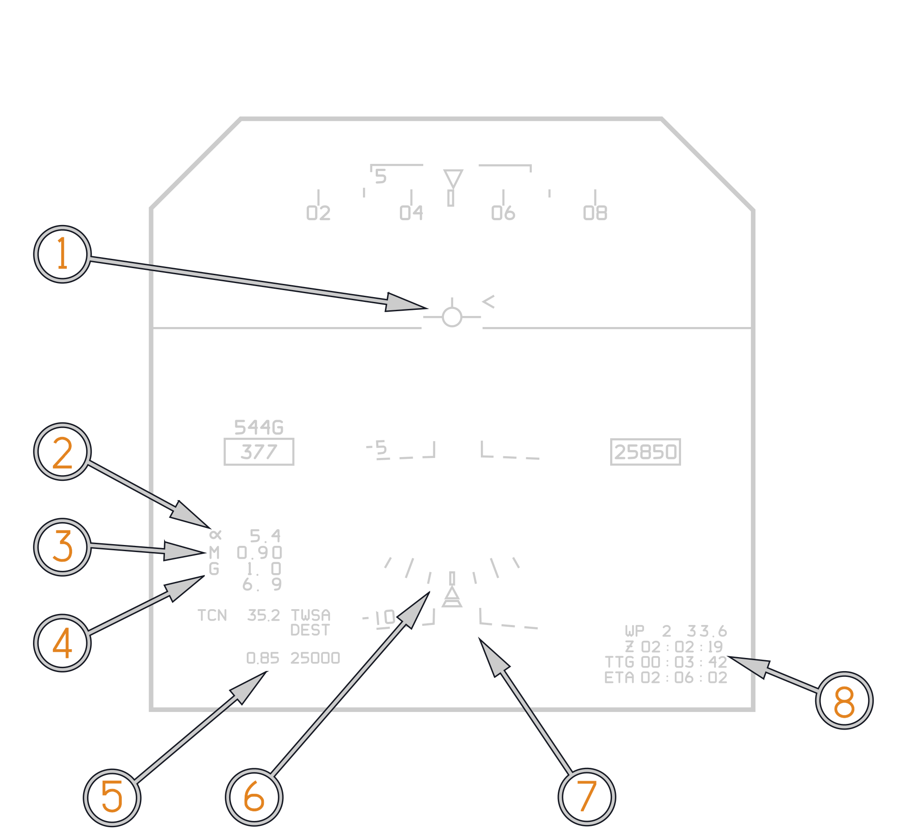

(<num>1</num>) Flight Path Marker (FPM).

(<num>2</num>) Angle Of Attack.

(<num>3</num>) Mach Number.

(<num>4</num>) Current G and Peak Aircraft G.

(<num>5</num>) Command Mach and Command Altitude.

(<num>6</num>) Bank Scale.

(<num>7</num>) Bank/Sideslip Arrow.

(<num>8</num>) Currently selected waypoint (EGI or DEST) and Range to Waypoint.
Zulu Time. TTG and ETA to selected waypoint.

Only in cruise Command Mach and Command Altitude are displayed in the bottom
left corner. These always reference the next steering waypoint, either EGI
Fly-To or Destination. The values are dependent on set waypoint altitude and set
waypoint TOT or Ground Speed. The Settings can be input in mission planning or
during flight on the
[waypoint Edit 1/2 page](../nav_com/cdnu/control_display_navigation_unit.md#waypoint-edit-page-12).

## Air-To-Air

Air−To−Air (A/A) displays are presented when the pilot selects the A/A
pushbutton on the PDCP, the pilot or RIO selects a radar hot mode, or when the
ACM guard is raised. The A/A displays provide target acquisition and weapon
status, in addition to primary flight information. Target data and the selection
legends PH, SP, SW, and G are displayed. Quantity of the selected weapon is also
shown. When GUN is selected, the quantity number indicates rounds remaining in
hundreds. A large X through a weapon selection legend indicates that the MASTER
ARM switch is in OFF or TNG position.

### Air−To−Air Mode — AIM-54 Phoenix

The Figure below is an example of A/A mode and TWS with Phoenix selected. The
display will be the same for Sparrow except SP will be shown instead of PH and
Tracks will not be shown with firing order number next to them. For a complete
discussion of VDIG-R A/A formats consult the
[A/A Employment chapter](../../weapons/air_to_air/overview.md).

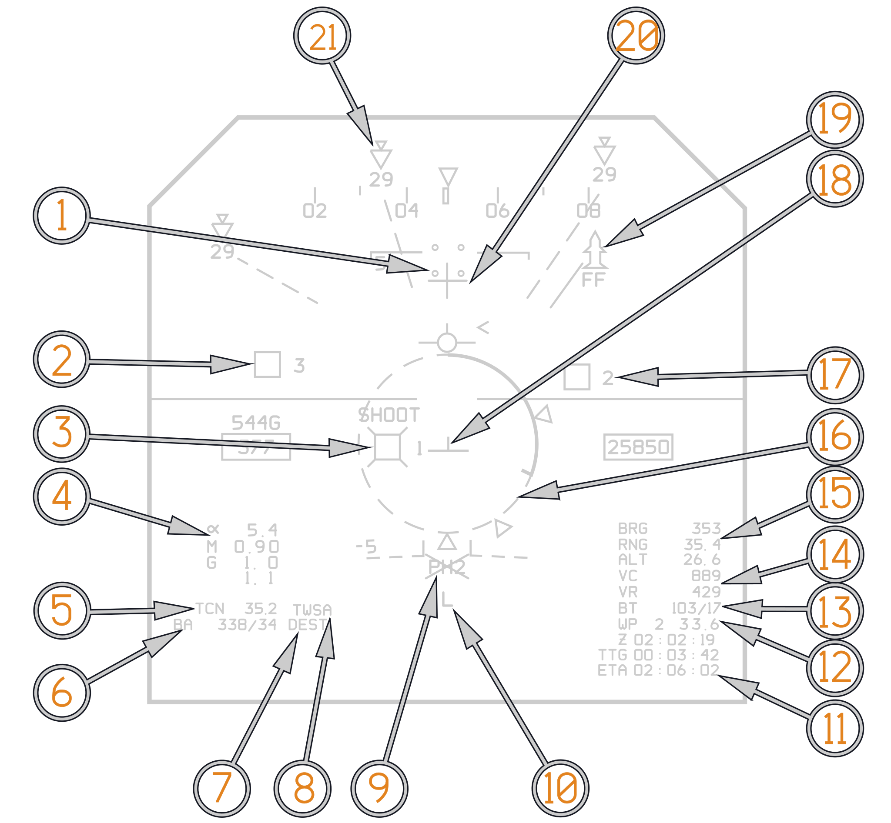

(<num>1</num>) Television Camera Set (TCS) Line Of Sight (LOS) Indicators.

(<num>2</num>) Target Designate (TD) Box with Firing Order Number (FONO) 3.

(<num>3</num>) Hooked (Whiskers) Unknown Target Designate (TD) Box, with FONO 1
and SHOOT cue.

(<num>4</num>) AOA, Mach Number and G.

(<num>5</num>) Yardstick to tuned TACAN station.

(<num>6</num>) BA: Bullseye to Own Aircraft.

(<num>7</num>) Selected PTID steering mode (DEST).

(<num>8</num>) RIO commanded Radar mode (TWSA).

(<num>9</num>) Armament Legend showing selected weapon (AIM54). Crossed out with
Master Arm in the OFF position.

(<num>10</num>) LANTIRN Laser Armed (L).

(<num>11</num>) ETA and TTG to currently selected waypoint.

(<num>12</num>) Currently selected waypoint.

(<num>13</num>) BT: Bullseye to Hooked Target.

(<num>14</num>) VC: Closure. VR: Target Radial Velocity.

(<num>15</num>) BRG: Bearing to Hooked Target. RNG: Range to Hooked Target. ALT:
Altitude of Hooked Target.

(<num>16</num>) Launch Range Designator (LRD).

(<num>17</num>) Target Designate (TD) Box.

(<num>18</num>) Steering T.

(<num>19</num>) RWR information. (Surface To Air Missile Radar. FF: Flat Face).

(<num>20</num>) Armament Datum Line (ADL).

(<num>21</num>) RWR information. (Air To Air Radar. 29: Mig-29).

### Air−To−Air Mode — AIM-7 Sparrow

The Figure below is an example of A/A mode and STT with Sparrow selected. The
display will be the same for Phoenix except PH will be shown instead of SP. For
a complete discussion of VDIG-R A/A formats consult the A/A Employment chapter.

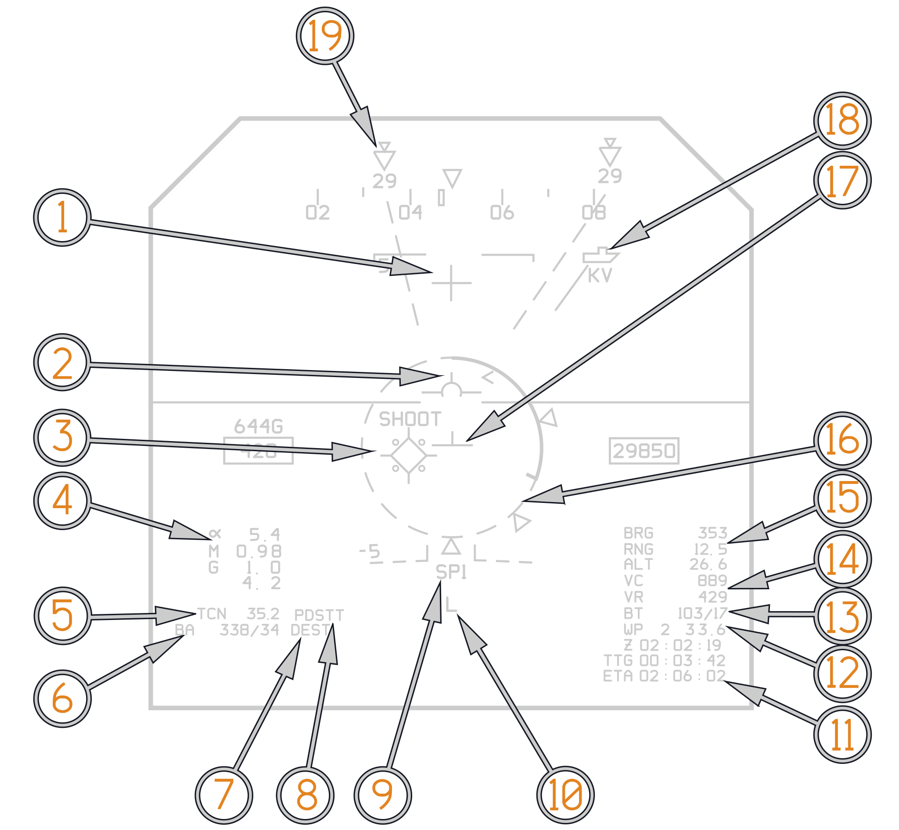

(<num>1</num>) Armament Datum Line (ADL).

(<num>2</num>) Climb Dive Marker (CDM). Shown when HUD is Caged.

(<num>3</num>) Hooked (Whiskers) Hostile Target Designate (TD) Box, with FONO 1
and SHOOT cue. TCS is slewed to Radar LOS.

(<num>4</num>) AOA, Mach Number and G.

(<num>5</num>) Yardstick to tuned TACAN station.

(<num>6</num>) BA: Bullseye to Own Aircraft.

(<num>7</num>) Selected PTID steering mode (DEST).

(<num>8</num>) RIO commanded Radar mode (PDSTT).

(<num>9</num>) Armament Legend showing selected weapon (SP1).

(<num>10</num>) LANTIRN Laser Armed (L).

(<num>11</num>) ETA and TTG to currently selected waypoint.

(<num>12</num>) Currently selected waypoint.

(<num>13</num>) BT: Bullseye to Hooked Target.

(<num>14</num>) VC: Closure. VR: Target Radial Velocity.

(<num>15</num>) BRG: Bearing to Hooked Target. RNG: Range to Hooked Target. ALT:
Altitude of Hooked Target.

(<num>16</num>) Launch Range Designator (LRD).

(<num>17</num>) Steering T.

(<num>18</num>) RWR information. (Ship Radar. KV: Kirov).

(<num>19</num>) RWR information. (Air To Air Radar. 29: Mig-29).

### Air−To−Air Mode — AIM-9 Sidewinder

The Figure below shows an example of A/A mode and STT with Sidewinder selected.
With VDIG(R), the Sidewinder Seeker Head Position Display (SHPD) is indicated
with a circle symbol. For a complete discussion of VDIG-R A/A formats consult
the A/A Employment chapter.

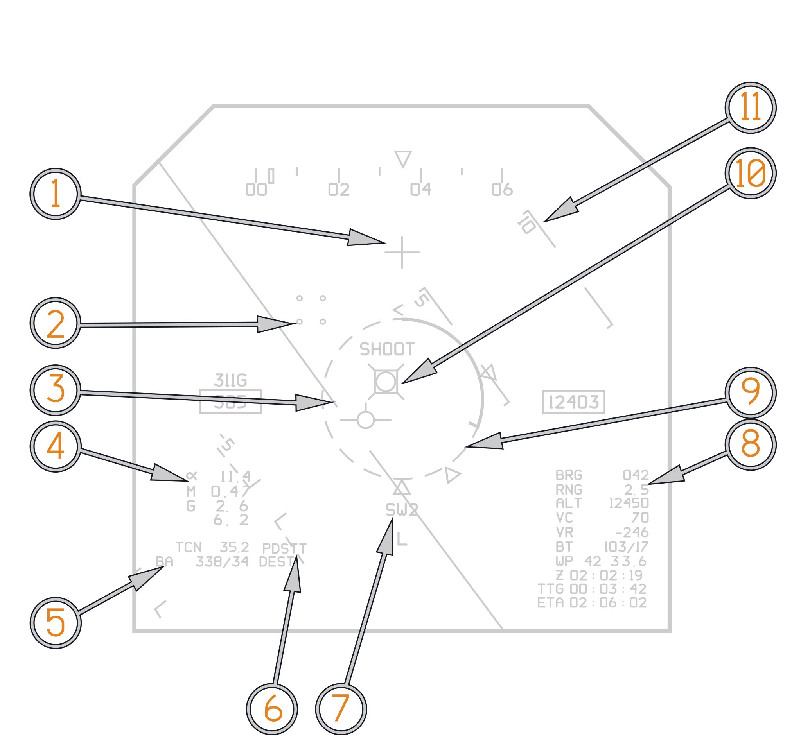

(<num>1</num>) Armament Datum Line (ADL).

(<num>2</num>) Television Camera Set (TCS) Line Of Sight (LOS) Indicators.

(<num>3</num>) Artificial Horizon. (High Left Bank).

(<num>4</num>) AOA, Mach Number and G.

(<num>5</num>) BA: Bullseye to Own Aircraft.

(<num>6</num>) RIO commanded Radar mode (PDSTT).

(<num>7</num>) Armament Legend showing selected weapon (SW2).

(<num>8</num>) BRG: Bearing to Hooked Target. RNG: Range to Hooked Target. ALT:
Altitude of Hooked Target.

(<num>9</num>) Launch Range Designator (LRD).

(<num>10</num>) Hooked (Whiskers) Unknown Target Designate (TD) Box, with FONO 1
and SHOOT cue. Circle in center denotes sidewinder seeker position. Filled
circle indicate Sidewinder Expanded Acquisition Mode (SEAM) has been activated.

(<num>11</num>) Pitch Ladder referenced to the FPM.

### Air−To−Air Mode — Director Gunsight

Selecting A/A on the PDCP and Gun on the Pilot Control Stick activates the
Multi−Mode Gun Sight (MMGS). With STT, the Director Gunsight is displayed as
shown in The Figure below. The pilot can toggle between Director Sight and
Manual Gunsight with the Cage/SEAM switch. When target radar track is not
available, the LCOS gunsight is presented. For a complete discussion of VDIG-R
A/A formats consult the A/A Employment chapter.

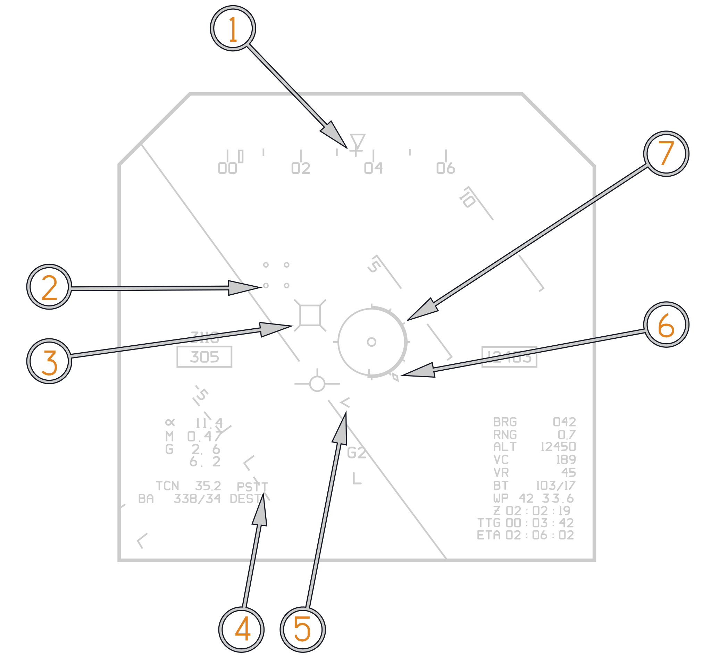

(<num>1</num>) Gun Cross.

(<num>2</num>) TCS Line of Sight indicator.

(<num>3</num>) Hooked PSTT Target Designate Box.

(<num>4</num>) Radar Mode (PSTT).

(<num>5</num>) Flight Path Marker (FPM) and Potential Flight Path Marker (PFPM),
otherwise known as energy caret.

(<num>6</num>) Gun In−Range Cue.

(<num>7</num>) Target Range Tape.

## Air-To-Ground

A/G pushbutton selection on the PDCP enables A/G displays on the HUD (without
A/A weapon selected). HUD TARPS mode steering cues are supported. TAS is
displayed in window 42, just below the indicated airspeed readout. Symbology for
Air−To−Ground Gun is shown below.

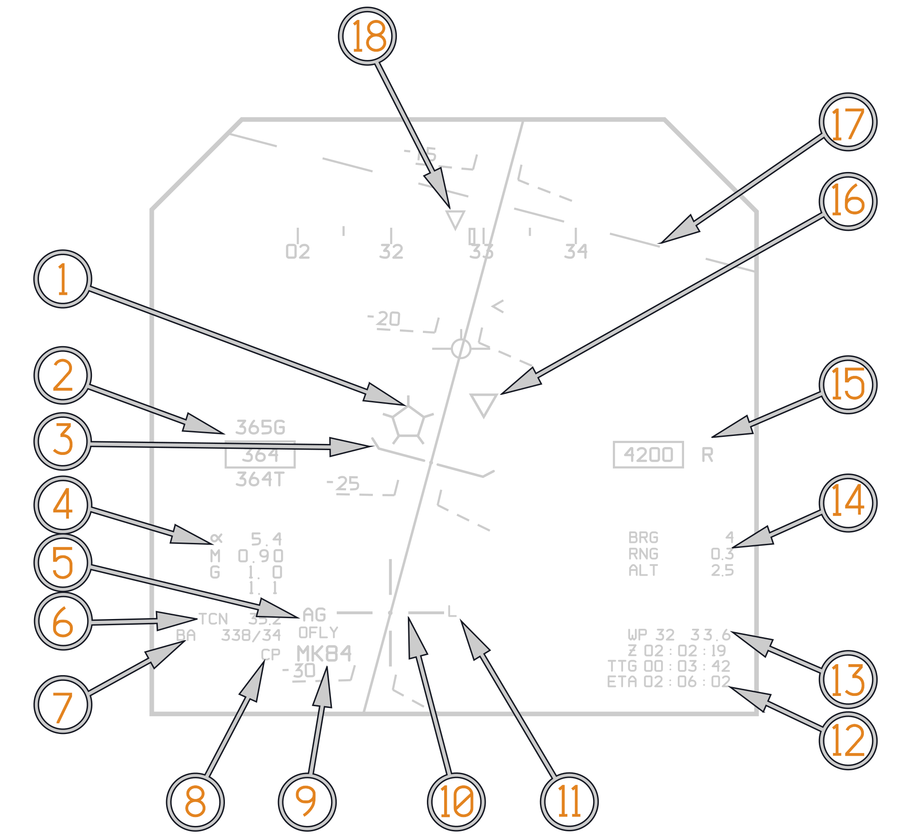

(<num>1</num>) Surface Target Pentagon. Whiskers denote Surface Target waypoint
is hooked.

(<num>2</num>) Top: Ground Speed (G). In Box: Indicated Airspeed. Below: True
Airspeed (T).

(<num>3</num>) Pull Up Cue.

(<num>4</num>) AOA, Mach Number and G.

(<num>5</num>) AG denotes AG Tapes are loaded and any other mode than MAN is
selected on the ACP.

(<num>6</num>) Yardstick to tuned TACAN station.

(<num>7</num>) BA: Bullseye to Own Aircraft.

(<num>8</num>) CP: Computer Pilot is selected on ACP.

(<num>9</num>) MK84 is selected on weapons wheel.

(<num>10</num>) Weapon Impact Point (WIP).

(<num>11</num>) LANTIRN Laser Armed (L).

(<num>12</num>) ETA and TTG to currently selected waypoint.

(<num>13</num>) Currently selected waypoint.

(<num>14</num>) Bearing and Range to Surface Target and Altitude of Surface
Target. Only displayed if hooked by RIO on PTID.

(<num>15</num>) Altitude. R indicated data is Radar Altimeter derived.

(<num>16</num>) Inverted Triangle denotes LANTIRN Pod Line of sight.

(<num>17</num>) Ghost Horizon Line.

(<num>18</num>) Command Heading.

## Landing

Landing mode is selectable on the PDCP, with TACAN steering and AWL steering as
sub−mode selections. The Landing mode TACAN display is similar to the Takeoff
mode TACAN display previously described. The Landing mode AWL Steering display
provides ILS steering indicators, ACLS steering indicator, AWL legend, and the
Breakaway/ Waveoff X. PTID steering mode, radar mode, and TACAN range are not
displayed in any landing mode.

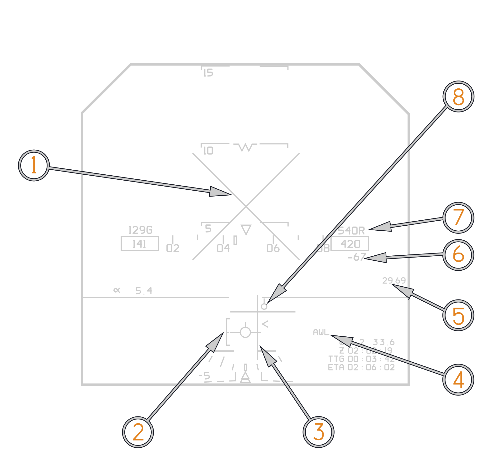

(<num>1</num>) Breakaway / Waveoff X.

(<num>2</num>) E-Bracket.

(<num>3</num>) ILS Vectors.

(<num>4</num>) AWL Legend.

(<num>5</num>) Altimeter setting.

(<num>6</num>) Vertical Velocity.

(<num>7</num>) Radar Altimeter.

(<num>8</num>) ACL Steering indicator.

With PDCP LDG Mode and PDCP AWL Steering selected, the VDI Video Mode is
inhibited and the VDI is commanded to the VDI HUD repeat mode. If the VDI Mode
switch is set to VIDEO, ILS symbology is displayed on the HUD, otherwise the ILS
Vectors appear on the VDI display only.

This effectively allows declutter of the ILS vectors from the HUD by selecting
PDCP VDI Mode switch to VDI while PDCP Mode is set to LDG. The ACL Steering
Indicator ("tadpole") is always displayed, on both HUD and VDI, in PDCP LDG mode
with AWL Steering while ACLS steering is valid.
