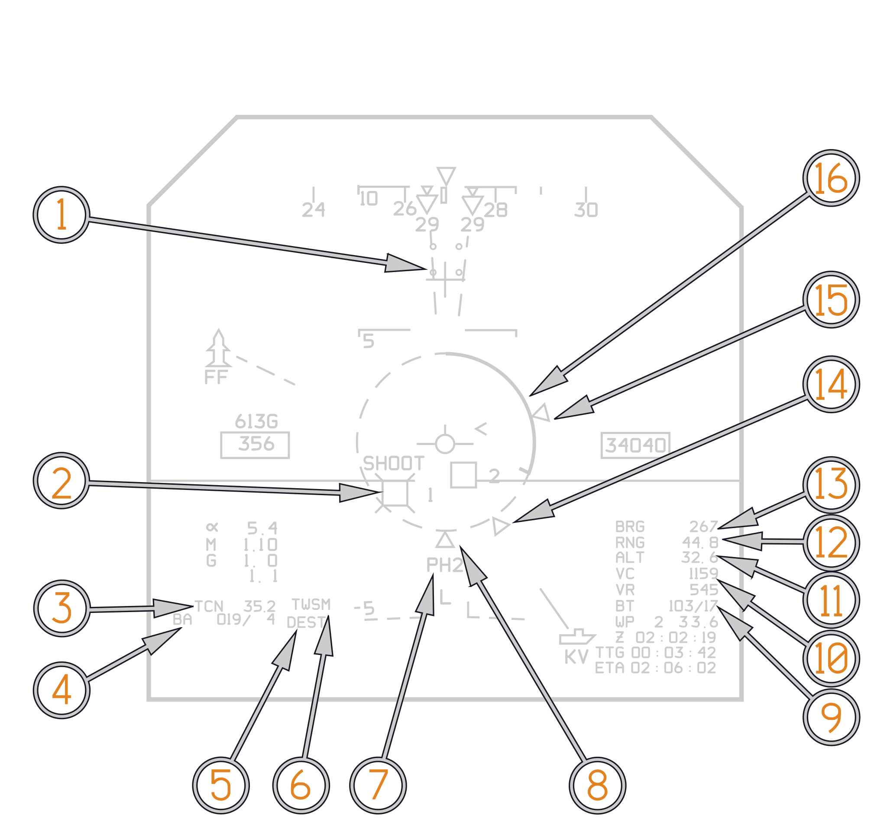
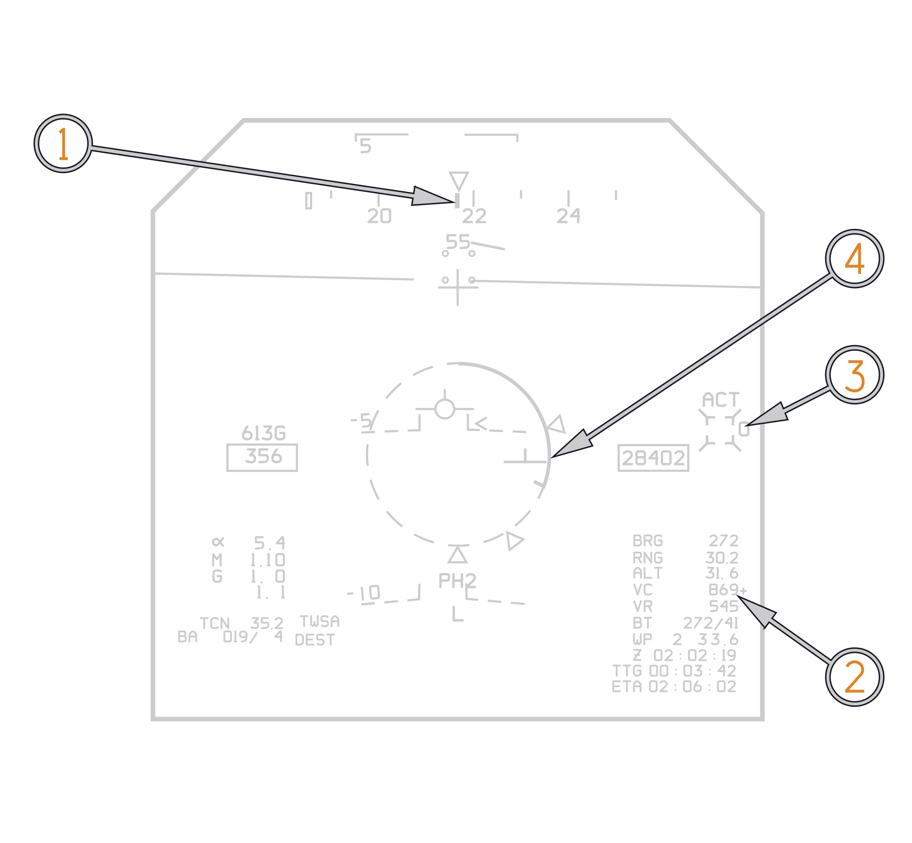
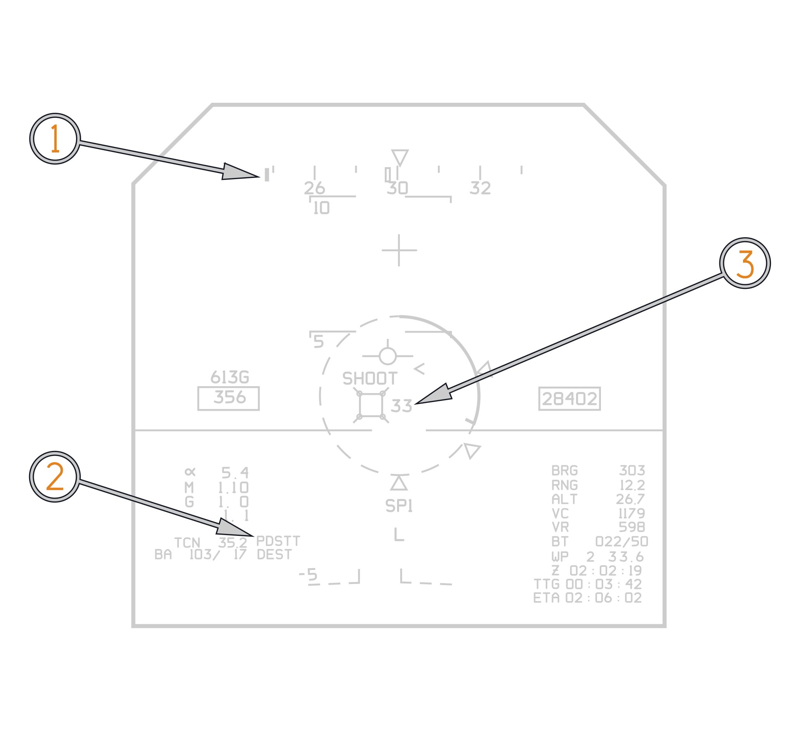
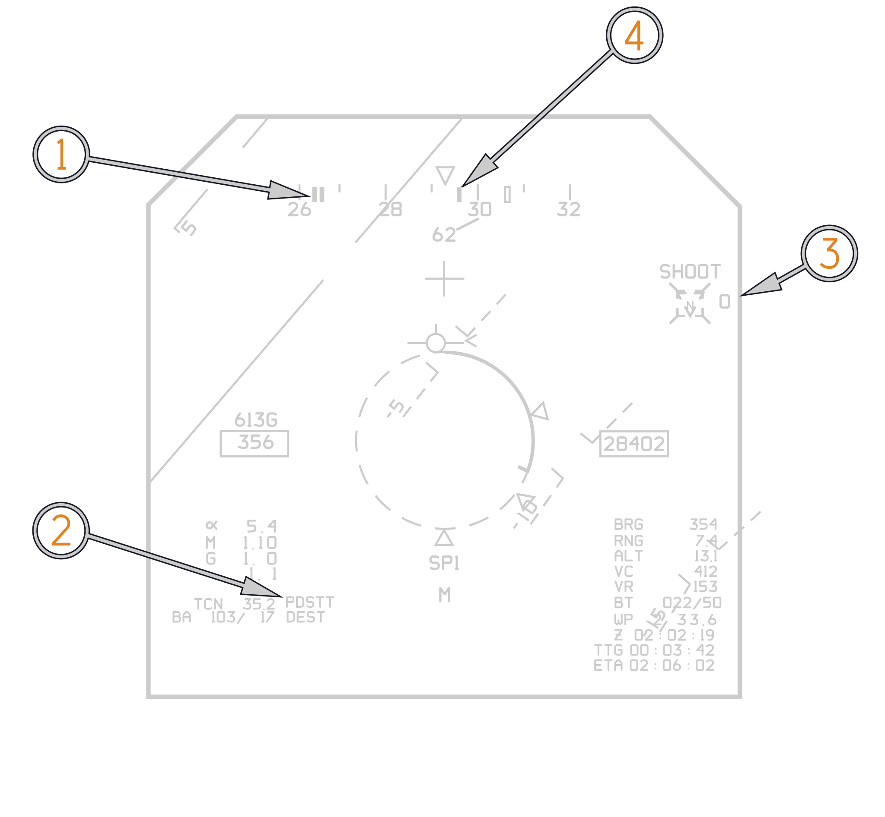
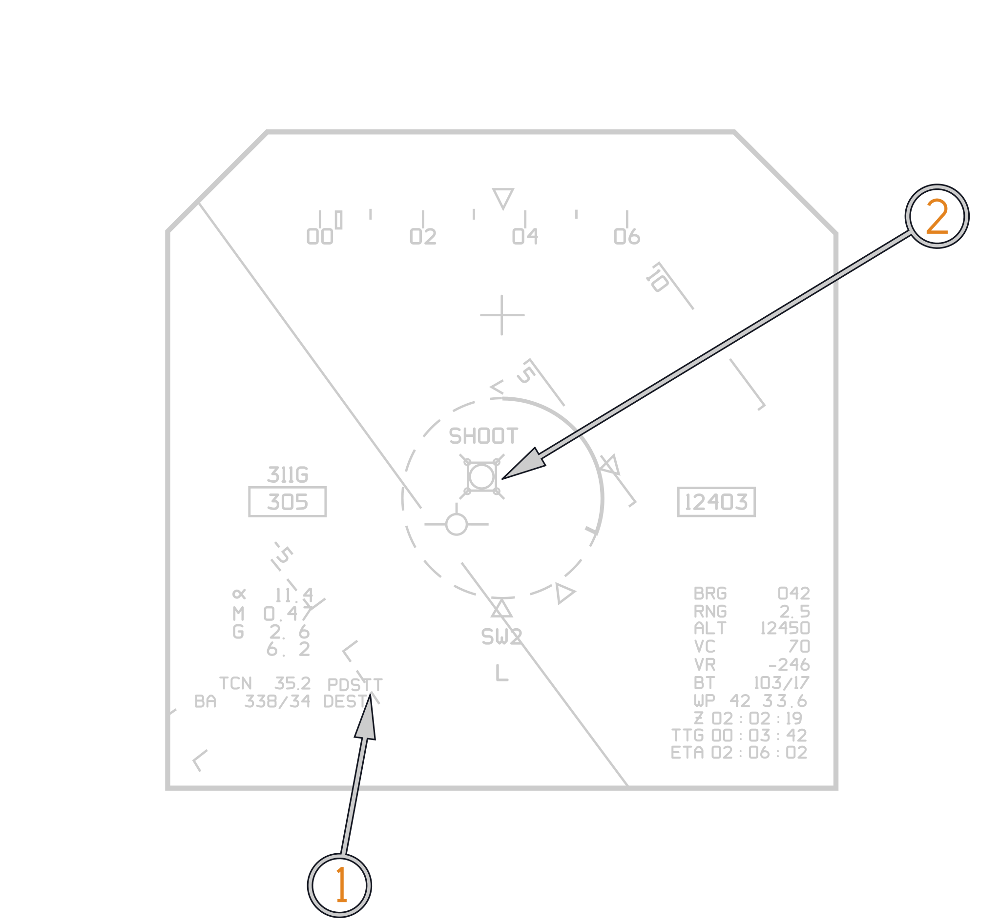
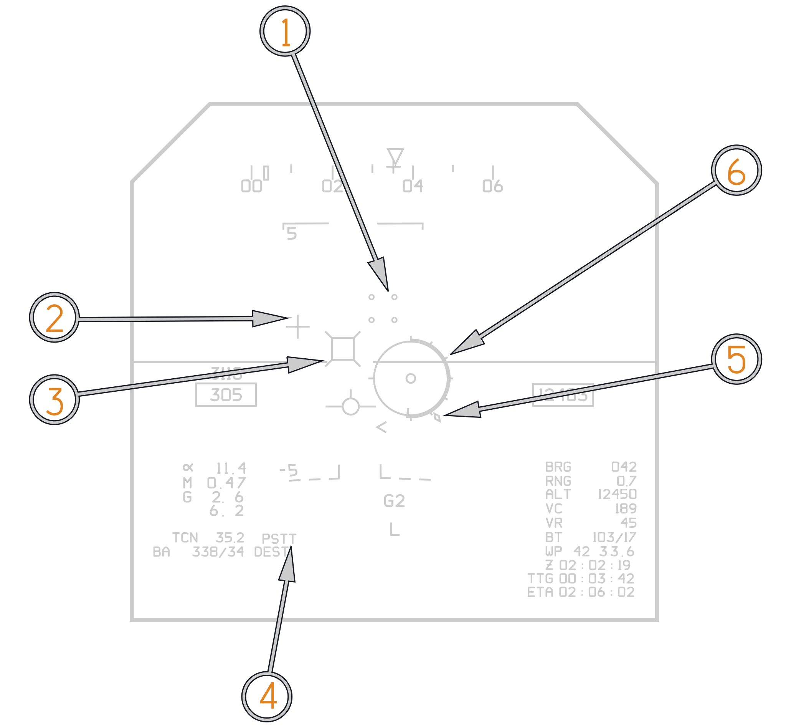
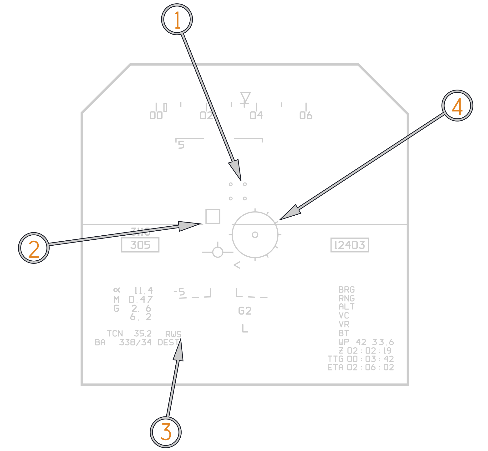
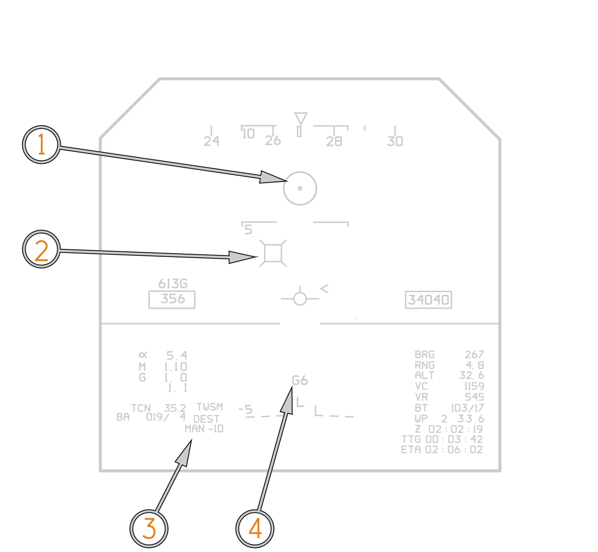
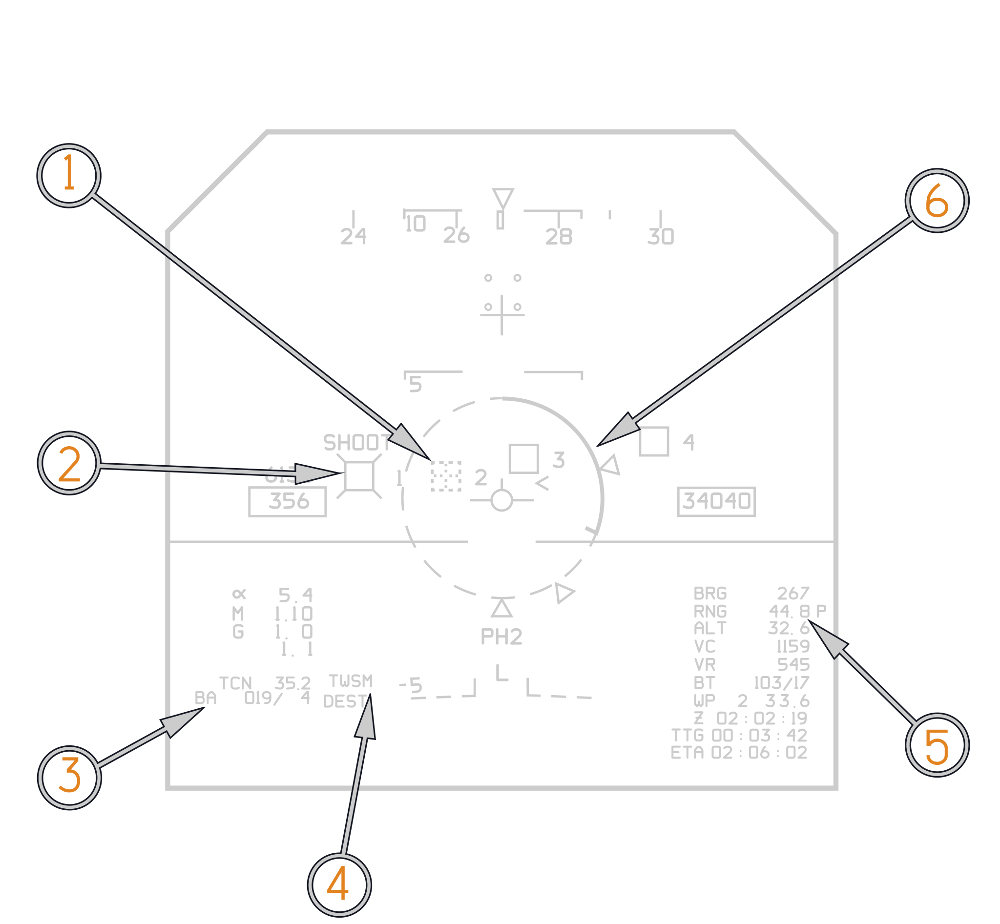
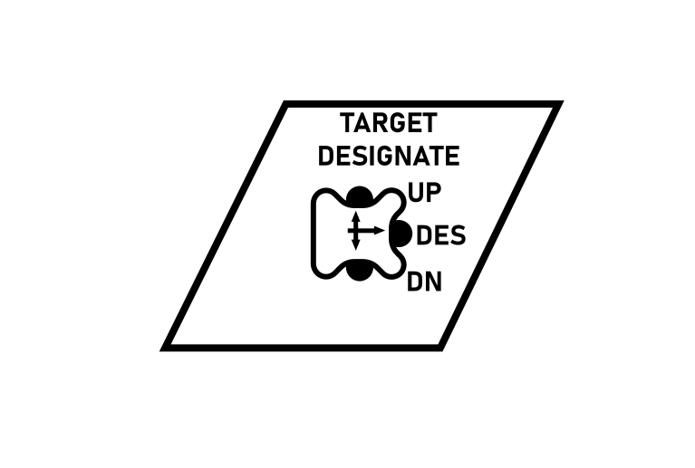

# Vertical Display Indicator Group Replacement A/A

The VDIG-R (Vertical Display Indicator Group Replacement) was introduced as part
of the F-14B upgrade program to address the limitations of the original
F-14A-era pilot displays and HUD.

For air-to-air employment, the VDIG-R serves as the pilot's primary tactical
display. During A/A combat the pilots need to reference the HSD for situational
awareness is greatly reduced, all TWS tracks are displayed directly in the HUD.
Tracks hooked by the RIO are denoted with whiskers and associated track
information is posted on the right side of the HUD. An angle off nose indicator
directs the pilot to hooked TWS tracks outside the HUDs field of view. The
following section will describe the VDIG-Rs A/A symbology in detail.

## VDIG-R Symbology common to all A/A formats

### Target Designator (TD) Box

TD box either represents radar target line of sight for a Single Target Track
(STT), or the location in azimuth and elevation for each Track While Scan track.
All tracks built by the AWG-9 in TWS are presented in the HUD as target
designate boxes. A FONO (a numeral from 1 to 6) or a TOF counter (0 to 99
seconds) will be displayed to the right of the TD box.

| Target Designate Box Variation                                 | Meaning        | Target Designate Box Variation                                          | Meaning             |
| -------------------------------------------------------------- | -------------- | ----------------------------------------------------------------------- | ------------------- |
|                | Unknown        |                       | Friendly            |
|  | Unknown Hooked |         | Friendly Hooked     |
|                | Hostile        |                | Outside IFOV        |
|  | Hostile Hooked |  | Outside IFOV Hooked |

> Note: any type of TD box (UNKNOWN, FRIEND, HOSTILE) becomes dashed when
> outside the IFOV.

### TD Box Modifiers

"Whiskers" indicate associated track is hooked, shape indicates track
classification (UNKNOWN, FRIEND, HOSTILE).

### Active Cue "ACT"

indicates AIM−54C Active parameters met.

### Shoot Cue

"SHOOT" − indicates target between Rmax and Rmin ranges.

### FFDL Wingman

Symbology similar to PTID, displayed on HUD when FFDL wingman is within +/-45°
of own A/C nose, and less than 4 TD boxes are present.

### RWR Symbols

ALR−67 RWR HUD symbology.

| Icon                                                   | Meaning               |
| ------------------------------------------------------ | --------------------- |
|        | Seaborne Threat Radar |
|          | AAA Threat Radar      |
|       | SAM Threat Radar      |
|           | A/A Threat Radar      |
|  | Unknown Threat Radar  |

### Steering Tee

The Steering Tee symbol provides three types of steering commands in the A/A
mode. The VDI steering tee information is displayed on both VDI and HUD.

1. When an A/A weapon is selected, the steering tee is used in conjunction with
   the ASE circle (LRD described below) for weapons steering.

2. If the radar is in STT without a weapon select (no ASE circle), the steering
   tee provides RIO selected attack steering.

3. When in TWS AUTO, the steering tee provides steering to a weighted centroid
   of TWS targets.

The steering is referenced to the Launch Range Designator to determine allowable
steering error for weapon steering of SW, SP or PH.

### Launch Range Designator (LRD)

The Launch Range Designator presents normalized target range, maximum range
(Rmax), median range (Ropt) and minimum range (Rmin) launch cues to the pilot.
It consists of a dashed circle, a solid range tape with reference tic and three
triangles that represent Rmax, Ropt and Rmin. The range tape (and reference
mark) is a circular arc that unwinds counterclockwise to show normalized target
range, uncovering the dashed circle. The Rmax cue is placed at the 6:00 position
of the circle, the Rmin cue is placed at the 2:30 position, and Ropt is placed
per the Ropt calculation. It is shown with all A/A weapons except GUN.

### Target Angle Off Nose Indicator

The HUD displays a relative bearing readout below the center of the heading
scale that provides bearing to the currently hooked A/A Track, or an indication
to of the most direct route to the LP for a hooked GGW target. The arrow
indicates the direction to steer, and the numerical readout provides the number
of degrees to turn. The Angle Off Nose indicator is paired with the Target
Locator Line (TLL).

### Target Locator Line

TLL originates at Angle Off Nose (AON) readout and points to the currently
selected TD box if the TD box is outside the HUD IFOV. TLL points in azimuth
elevation. Displayed in A/A only.

### F−Pole Cue

Cue to heading for maximum F−pole. Provides cues to achieve maximum slant range
between the launch aircraft and target, at the time of missile impact. Displayed
in PDSTT and TWSA.

### Notch Cue

The Notch Cue is presented on the heading scale and provides the pilot steering
to put the F−14 into the beam of the target. The cue is only provided in PDSTT.
When the PDSTT lock is broken, the information is stored and the cue is
displayed for an additional 15 seconds. Note Due to AWG−9 tracking limitations,
after gimbaling the radar, the Notch Cue can initially overshoot the beam by
approximately 5 degrees.

### A/A Track Info Box

#### Target Altitude

Displayed in A/A mode, and A/G mode when Surface Target is hooked on the PTID.
The AWG−9 calculates target altitude from available data. Target altitude is
displayed in thousands of feet to one decimal point preceded by the legend ALT.
Shows a leading zero only if altitude is less than 1000 feet. Target altitude is
not available with GUN selected.

#### Target Range

Displayed in A/A mode and in A/G mode when Surface Target is hooked on the PTID.
Target range in nautical miles is preceded by the legend RNG. There are two
range scales used. The high 0−255.75 nmi scale and the low 0−0.9 nmi scale. The
low scale is displayed only when GUN is selected in A/A mode. The display shows
two decimal places if in the high scale and one decimal if in the low scale.
When using the low scale, the resolution is to the nearest tenth of a mile (0.1)
and when in the high scale, the resolution is to the nearest quarter of a mile
(0.25). Range is blanked if invalid, and followed by a plus sign if
extrapolating.

#### Target Bearing

Displayed in A/A mode, and A/G mode when Surface Target is hooked; preceded by
the legend BRG.

#### Target Closure Rate

The AWG−9−supplied target closure rate is displayed when in A/A mode, preceded
by the legend VC. It is up to four digits long and displayed to one nautical
mile per hour. A minus sign preceding numbers indicates negative closure. Target
Closure Rate symbol is followed by a plus sign if extrapolating.

#### Target Radial Velocity

Displays target velocity component along LOS to F−14. Preceded by a minus sign
when opening.

#### Target Bullseye

Bullseye−to−Target "BT" bearing and range.

### Ownship Bullseye

Displays Bullseye−to−Aircraft "BA".

### TWS AIM-54 Typical A/A Cues during intercept

(<num>1</num>) Television Camera Set (TCS) Line Of Sight (LOS) Indicators.

(<num>2</num>) Hooked (Whiskers) Unknown Target Designate (TD) Box, with FONO 1
and SHOOT cue.

(<num>3</num>) Yardstick to tuned TACAN station.

(<num>4</num>) BA: Bullseye to Own Aircraft.

(<num>5</num>) Selected PTID steering mode (DEST).

(<num>6</num>) RIO commanded Radar mode (TWSM).

(<num>7</num>) Armament Legend showing selected weapon (AIM54). Crossed out with
Master Arm in the OFF position.

(<num>8</num>) Rmax Launch Range.

(<num>9</num>) BT: Bullseye to Hooked Target.

(<num>10</num>) VC: Closure. VR: Target Radial Velocity.

(<num>11</num>) ALT: Altitude of Hooked Target.

(<num>12</num>) RNG: Range to Hooked Target.

(<num>13</num>) BRG: Bearing to Hooked Target.

(<num>14</num>) Ropt Launch Range.

(<num>15</num>) Rmin Launch Range.

(<num>16</num>) Launch Range Designator (LRD).

### TWS AIM-54 Typical A/A Cues at LRM ARHM active parameters

(<num>1</num>) F-Pole Cue.

(<num>2</num>) "+" indicates track is extrapolated.

(<num>3</num>) "ACT" indicates AIM-54 active parameters met. (Dashed Box: Track
is outside of IFOV).

(<num>4</num>) Steering T referenced toward the LRD, only displayed in TWS Auto
and STT.

### STT AIM-7 Typical A/A Cues after LTE

(<num>1</num>) F-Pole Cue.

(<num>2</num>) Radar Mode (PDSTT).

(<num>3</num>) TD BOX with TCS indicator overlaid, Sparrow TTI (33) is displayed
after launch to eject cycle (LTE).

### STT Notch Cue

(<num>1</num>) Notch Cue.

(<num>2</num>) Radar Mode (PDSTT).

(<num>3</num>) TD BOX with LTS indicator overlaid (N Indicates LANTIRN is not In
point Track), Sparrow TTI (0) is displayed. TD Box is dashed outside of IFOV.

(<num>4</num>) F-Pole Cue.

### STT AIM-9 Typical A/A Cues

(<num>1</num>) Radar Mode (PDSTT).

(<num>2</num>) TD BOX with TCS indicator overlaid, Circle indicates sidewinder
seeker-head position. Solid circle indicates SEAM mode has been activated.

### Director Reticle

The Director Reticle is composed of a circle with range markings at 12 o’clock
for 1 nmi, 9 o’clock for ¾ nmi, 6 o’clock for ½ nmi and 500 foot marks for the
remaining half the circle for use with the range tape as a director solution.

For the Director sight, both the Launch Range Designator and In−Range Cue flash
at 1 or 4 Hz as an in−range cue. The pilot can distinguish between the Director
reticle and the LCOS by observing the Range Tape and In−Range Cue. Lack of a
Range Tape and In−Range Cue indicates an LCOS solution.

The Director reticle is displayed under the following conditions; A/A mode, GUN
selected and sight uncaged. This symbol is flashed at approximately 16 Hz for
one second when reaching Rmax in the forward quarter and Ropt in the rear
quarter. The reticle occludes all symbols except the FPM, Range Tape and TD Box/
BATR/Reticle.

> In range flashing is not currently implemented.

#### Gun In−Range Cue

The diamond−shaped Rmax cue is placed perpendicular to the Target Range Tape at
a point representing Maximum Range. It is displayed with a valid Reticle and
Target Range. This symbol is flashed at 1 Hz when reaching Rmax and 4 Hz when
reaching Ropt. For ranges greater than 1 nmi, the diamond pegs at the 12 o’clock
position.

#### Target Range Tape

Target Range Tape is superimposed over the Director Reticle when the Director
Reticle is displayed and there is a valid target range. The range tape unwinds
counterclockwise to show target range when used with the reticle. The range tape
is calculated as the percentage of target range to 1 nmi with a percentage of
100 or greater shown as a full circle.

### Manual Gun Reticle

The symbol is centered in azimuth and positioned in elevation based upon the mil
setting input from ELEV LEAD knob on the Elevation Lead Panel located beneath
the PDCP. A value of zero mils positions the Manual Reticle at a point 0.6
degrees below the boresight/FRL/ Waterline.

### Director Gunsight

(<num>1</num>) TCS LOS indicator.

(<num>2</num>) Bullet At Target Range (BATR) represents the bullet stream
position one bullet time− of−flight after trigger squeeze, and the 2,000 ft.
solution for the Lead Computing Optical sight.

(<num>3</num>) Hooked PSTT Target Designate Box.

(<num>4</num>) Radar Mode (PSTT).

(<num>5</num>) Gun In−Range Cue.

(<num>6</num>) Target Range Tape.

### LCOS Gunsight

(<num>1</num>) TCS LOS indicator.

(<num>2</num>) 2000 ft. Reticle.

(<num>3</num>) Radar Mode (RWS).

(<num>4</num>) Lead computing optical sight (LCOS) gunsight reticle.

### Manual Gunsight

(<num>1</num>) Manual Gun Reticle.

(<num>2</num>) Hooked TWS TD Box.

(<num>3</num>) Manual MIL setting.

(<num>4</num>) Gun Selected and rounds counter in hundreds.

### Pilot Selected Target Designate Box

In the F-14B(U), a way for the pilot to display A/A target data independently of
the RIO was added. Typically, the information box displays data for the TWS
track or certain pseudo-files currently hooked by the RIO. In the F-14B(U), the
Target Designate Switch on the left sidewall was repurposed, allowing the pilot
to cycle through A/A TWS tracks and select a specific track for display. Once a
track has been selected by the pilot, the pilot's selection overrides the RIO's
hooked track until the pilot depresses the Target Designate Forward switch again
to deselect it.

Because of this change, the pilot-selected radar modes VSL High, VSL Low, and
PAL are only available with the ACM cover in the UP position.

(<num>1</num>) Target Designate Box selected via the Target Designate switch.

(<num>2</num>) Target Designate Box hooked by the RIO.

(<num>3</num>) Bullseye to Own Aircraft.

(<num>4</num>) Radar Mode (TWSM).

(<num>5</num>) "P" Indicates all data in info Box is derived from Pilot selected
Target designate box.

(<num>6</num>) With Pilot selected Target Designate switch active and TD box
selected by pilot, LRD is referenced to the pilot selected Target Designate box.

UP and DOWN cycle through tracks. Forward selects a track for information
display.

### Air Combat Maneuvering (ACM) Cover logic

ACM Cover UP: Target Designate Switch Actuates Pilot selected Radar Modes.

1. TD Down: VSL LO.

2. TD Up: VSL High.

3. TD Forward: PAL.

For a complete discussion of Pilot selected Radar modes refer to the
[Radar Chapter](../../../f14ab/systems/radar/acm_modes.md#acm-modes)
