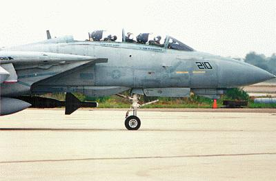

# Enhanced Paveway™ III Dual Mode GPS/Laser Guided Bomb

 _**First flights** - The
GBU-24E/B hangs beneath an F-14 prior to one of two test missions in late
September. The Tomcat was crewed by pilot Cdr. Mark Bathrick and LCdr. William
Chubb, Radar Intercept Officer_

GBU-24E/B, is an Enhanced Paveway Laser Guided Bomb, that was first tested in
September 1999 at NAWCWD Point Mugu. The F-14B upgrade and the F-14D aircraft
were able to employ the GBU-24E/B.

GBU-24E/B is a precision-guided hardened target penetrator used to destroy
hardened aircraft hangers and underground bunkers. It integrates a Global
Positioning System and a ring laser gyro inertial measuring unit (IMU) to the
already fielded GBU-24B/B "Paveway III" with the existing laser guidance.

A guidance and control unit was modified to incorporate GPS electronics, GPS
antenna, IMU and software for precision GPS/INS guidance. This was a significant
war-fighting enhancement that enables the F-14B(U) to attack targets in all
weather conditions with a precision guided munition.

## GBU-24 Employment Principles

> 🚧 Work In Progress

The Guided Bomb Unit-24 (GBU-24E/B) Dual Mode Low-Level GPS/Laser-Guided Bomb
(LLLGB) consists of a BLU-109 penetrator bomb modified with a Paveway III dual
mode low-level GPS/laser-guided bomb kit to add proportional guidance in place
of the bang-bang type used in the Paveway II. The LLLGB was developed in
response to sophisticated enemy air defenses, poor visibility, and limitations
imposed by low ceilings. The weapon is designed for low-altitude delivery and
has a capability for improved standoff ranges to reduce exposure. The GBU-24
LLLGB/Paveway III has a low-level standoff capability of more than 10 nautical
miles. Performance envelopes for all modes of delivery are improved because the
larger wings of the GBU-24 increase maneuverability. Paveway III also has
increased seeker sensitivity and a larger field of regard.

The operator illuminates a target with a laser designator, and then the munition
guides to a spot of laser energy reflected from the target. One way to deliver
LGBs from low altitude is a loft attack. In this maneuver, the aircraft pulls up
sharply at a predetermined point several miles from the target, and the LGB is
lofted upward and toward the target.

Because of the GBU-24E/B's dual-mode capability, if no laser energy is detected,
the weapon will fly to its pre-planned impact point and detonate as planned. A
higher amount of accuracy is achieved if laser designation is provided.

The GBU-24E/B also provides greater mission flexibility, allowing for a guided
release through thick cloud layers, then acquiring a ground-based laser once the
cloud layer has been cleared.

Due to its size, only 2 GBU-24E/Bs can be carried by a Tomcat at a time.
Stations 3 and 5 are available for GBU-24E/B carriage. In the F-14B Upgrade, the
GBU-24E/B can be released in a TOO capacity or as a pre-planned mission.
