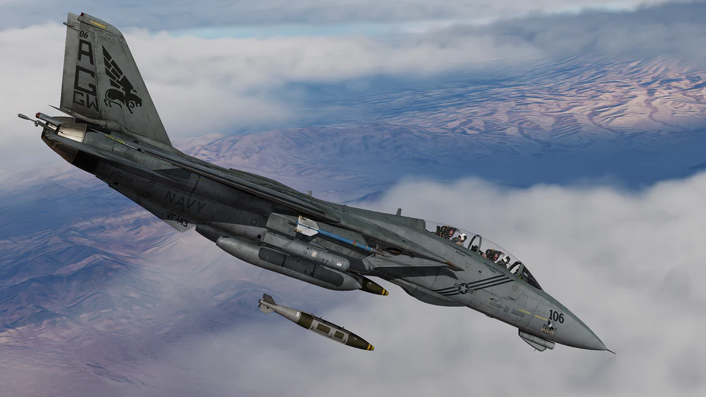
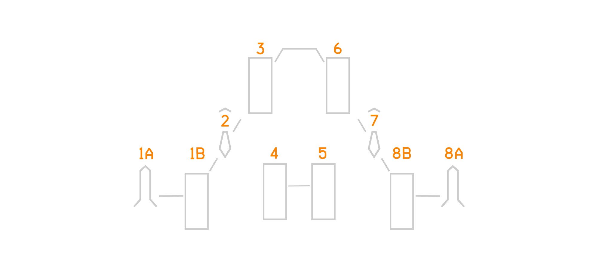

# F-14B Upgrade Weapons Employment

The F-14B Upgrade added a whole host of new A/G stores and a plethora of ways to
both employ A/A and A/G ordnance.

The F-14B Upgrade, like earlier F-14s, features 4 main types of air-to-air
weaponry: the Long-Range Active Radar Homing (LRM ARH)
[AIM-54](./../../f14ab/stores/air_to_air/aim_54.md) Phoenix missile, the
Medium-Range Semi-Active Radar Homing (MRM SARH)
[AIM-7](./../../f14ab/stores/air_to_air/aim_7.md) missile, the Short-Range
Infrared-Guided (SRM IR) [AIM-9](./../../f14ab/stores/air_to_air/aim_9.md)
missile, and the
[M61A1 Vulcan cannon](./../../f14ab/stores/guns.md#internal-cannon-m61a1-vulcan).

The aircraft can be armed with a variety of bombs, rockets, and guided munitions
to engage and neutralize ground targets. All A/G stores carried in earlier F-14
versions are retained.

As opposed to older versions of the F-14 Tomcat, the F-14B Upgrade attains the
ability to employ GPS-guided weapons (GGW). These include the
[GBU-31](./air_to_ground/gps_guided_weapons/gbu-31.md) with the 2,000-pound
hard-target penetrator BLU-109 or 2,000-pound general-purpose BLU-117 warhead;
the
[GBU-38](./air_to_ground/gps_guided_weapons/gbu-31.md#guided-bomb-unit-38-gbu-38)
with the 500-pound general-purpose BLU-111 warhead; and the Enhanced
[GBU-24E/B](./air_to_ground/gps_guided_weapons/gbu-24eb.md) Paveway III with the
2,000-pound hard-target penetrator BLU-109 warhead.

## Loadout

The F-14B Upgrade is able to employ GPS and Laser Guided Stores from stations
4 - 5 - 3 - 6, also commonly refered to as the tunnel stations. These stations
utilze the phoenix pylon paired with the BRU-32 rack. The implementation of the
1553 data bus allows the aircraft to send targeting data to the stations for
transferral into the JDAMs.

The GPS Guided stores available for the F-14B Upgrade are:

- GBU-31v(2)
- GBU-31v(4)
- GBU-24
- GBU-38

Loading of stores in the tunnel follows certain restrictions. These restrictions
are only applied in DCS if the air-to-ground stores cannot physically fit side
by side or behind one another in the tunnel, as is the case for the GBU-24 for
example.

Nonetheless, certain carriage rules should be followed to ensure that the Tomcat
remains within CG limits and is flyable throughout all flight regimes.

For single-type store loadouts, it is recommended to load the stores from front
to back and release them in a back-to-front sequence. For example, when loading
two GBU-31 JDAMs, they should be loaded on the front stations (3 and 6). When
loading four GBU-31 JDAMs, they should then be released in the opposite order,
i.e. back to front. Stations 4 and 5 should be released first, followed by
stations 3 and 6.

When employing mixed loadouts, it is desirable to stagger the weapons in the
tunnel. This ensures that stores can always be released from back to front while
providing the aircrew with the ability to choose which stores are released. For
example, when employing a mixed loadout of two GBU-31s and two GBU-12s, stations
3 and 6 should each carry one GBU-31 and one GBU-12, while stations 4 and 5
should each carry a GBU-31 and a GBU-12 on the opposite side.

The F-14B Upgrade Tomcat in DCS comes with a default set of loadouts. These
loadouts follow the Standard Conventional Loadout (SCL) principle. The SCLs are
divided into air-to-air (A/A) and air-to-ground (A/G) categories, with a few
special loadouts for TARPS missions and peacetime flight operations.

The A/G SCLs in particular are not intended to provide a comprehensive set of
loadouts, but rather a standard format in which specific air-to-ground stores
can be exchanged depending on the mission.

The SCLs are listed below, together with their gross weights and maximum trap
fuel weights. The maximum trap fuel weight is the amount of fuel the Tomcat can
carry with the specific loadout while remaining at the maximum carrier landing
weight of 54,000 pounds.

| SCL     | Description        | AA Stores | A/G Stores             | Gross Weight | Max Trap Fuel Weight |
| ------- | ------------------ | --------- | ---------------------- | ------------ | -------------------- |
| AAW01   | BFM                | (0/0/2)   | —                      | —            | —                    |
| AAW02   | Light CAP          | (1/1/1)   | —                      | —            | —                    |
| AAW03   | Light CAP          | (1/2/2)   | —                      | —            | —                    |
| AAW04   | Medium CAP         | (2/3/2)   | —                      | —            | —                    |
| AAW05   | Heavy CAP          | (4/2/2)   | —                      | —            | —                    |
| AAW06   | Six Shooter        | (6/0/2)   | —                      | —            | —                    |
| AG01    | Light Strike       | (1/0/2)   | 1×GBU-12, 1×GBU-16     | —            | —                    |
| AG02    | Medium CAS         | (1/0/2)   | 2×GBU-12, 2×Mk-82 JDAM | —            | —                    |
| AG03    | Medium CAS         | (1/0/2)   | 2×Mk-82 JDAM, 2×GBU-16 | —            | —                    |
| AG04    | Medium Strike      | (1/0/2)   | 2×Mk-84 JDAM           | —            | —                    |
| AG05    | Heavy CAS          | (1/0/2)   | 2×Mk-84 JDAM, 2×GBU-12 | —            | —                    |
| AG06    | Heavy Strike       | (1/0/2)   | 2×GBU-24E/B            | —            | —                    |
| AG07    | Heavy Strike       | (1/0/2)   | 3×Mk-84 JDAM           | —            | —                    |
| AG08    | Heavy Strike       | (0/0/1)   | 4×Mk-84 JDAM           | —            | —                    |
| AG09    | Self Escort Strike | (2/1/2)   | 1×Mk-82 JDAM           | —            | —                    |
| TARPS01 | TARPS              | (0/2/2)   | TARPS Pod              | —            | —                    |
| TNG01   | LTS                | (0/0/0)   | ACMI Pod, CATM-9M      | —            | —                    |
| TNG02   | LTS                | (1/0/2)   | —                      | —            | —                    |

The air to air stores are listed in a standard format.(AIM-54/AIM-7/AIM-9) The
AIM-54 Phoenix is always written first, the AIM-7 Sparrow is second, the AIM-9
is third.

For Example: (2/3/2) is 2x AIM-54s; 3x AIM-7s and 2x AIM-9s.

> 🚧 Work In Progress

## Armaments Section Overview

This section covers the F-14B(U) specific weapons employment. For A/A weapons
employment specific VDIG-R Formats and PTID Formats are covered. For a detailed
discussion on the AWG-9 weapons system refer to the
[AWG-9 Section](./../../f14ab/systems/radar/overview.md) in the F-14A/B manual.
For A/G the section covers GPS Guided Weapons (GGW) employment in detail. Laser
Guided Weapons (LGB) and Unguided Weapons employment are also covered.

## Magnetic Tape Load

The Tomcat's weapons control system uses magnetic tape programs to load
mission-specific software into the aircraft's computer. The computer has three
levels of memory: Non-Destructive Readout (NDRO) memory, which permanently
stores the main tactical program; Destructive Readout (DRO) memory, which serves
as working memory for mission-specific software; and bulk storage, provided by
the magnetic tape system.

The main tactical program is stored in NDRO memory and is always available. It
controls the overall operation of the weapons control system, including
air-to-air radar modes, such as TWS or RWS etc. Special programs, such as
air-to-ground (A/G), TID AVIA, or training software, are stored on magnetic
tape. When required, they are loaded from the tape into DRO memory, replacing
any previously loaded special program. Because DRO memory cannot hold multiple
special programs simultaneously, only one can be active at a time. Depending on
the program, loading can take from several seconds to several minutes.

In the F-14B(U), air-to-ground magnetic tapes are loaded through the PTID Menu
page as part of the startup procedure if A/G operations are planned. Once the
A/G program is loaded, no other special program can be accessed until it is
replaced. Without the A/G program loaded, the AWG-9 radar cannot operate in
air-to-ground ranging mode.

However, with the A/G program loaded, when selecting MANUAL on the ACP attack
mode selector, the A/G radar ranging function of the AWG-9 is disabled while
leaving the A/G program loaded. This allows the AWG-9 to operate in all
air-to-air modes and permitting the employment of air-to-ground stores that do
not require radar ranging.
