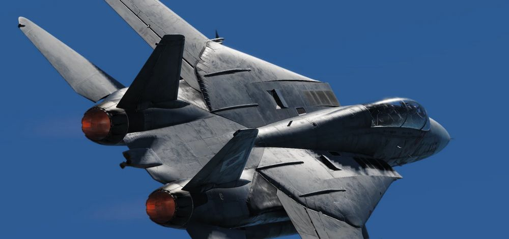

# Imprint

Heatblur Simulations™\
Ulica Wrzosowa 11, 72-602, Świnoujście, Poland

Contact: <support@heatblur.se>

<https://store.heatblur.com/>

## The Heatblur F-14 Team

Nicholas Dackard, Creative Director and Lead Artist\
Daniel Malmquist, Lead Engineer (Flight Dynamics and JESTER-AI)\
Bert van Leeuwen, Senior Programmer (Weapons, Radar, Systems and Multi-crew)\
Krzysztof Sobczak, Senior Programmer (Systems, Avionics, RWR and Radios, Nav and LANTIRN)\
Andrew O'Donnel, Senior Programmer (Flight Dynamics, Systems and Engines)\
Aleksander Studen-Kirchner, Producer (QA, Content and Director JESTER-AI)\
Johan Malmquist - Lead Research and Lead Author Manual\
Andreas Sandin - Lead Design, Web-Design and Liveries\
Adrian Caparzo, Video Editing and Trailers\
Grayson Frohberg, Voice of the JESTER-AI

### Post Release

Daniel Tischner, Senior Programmer (UI, Systems and AI)\
Dominik Głowacki, Senior Programmer (Systems, Avionics, AI)\
Szymon Skarzyński, Senior Programmer (Systems, Avionics, AI)\
Joshua Nelson, Programmer (Weapons)\
Yannis Leon Bößmann, Junior Programmer\
Nicola Faggiani, Artist, 3D Model\
Davi Bernardino, Artist, 3D Model and Textures\
Ben Mährlein, Liveries and Art\
Kenneth Ellis, Research\
Daria Kurhuzova, Administrative Assistant

### See You In The Skies

