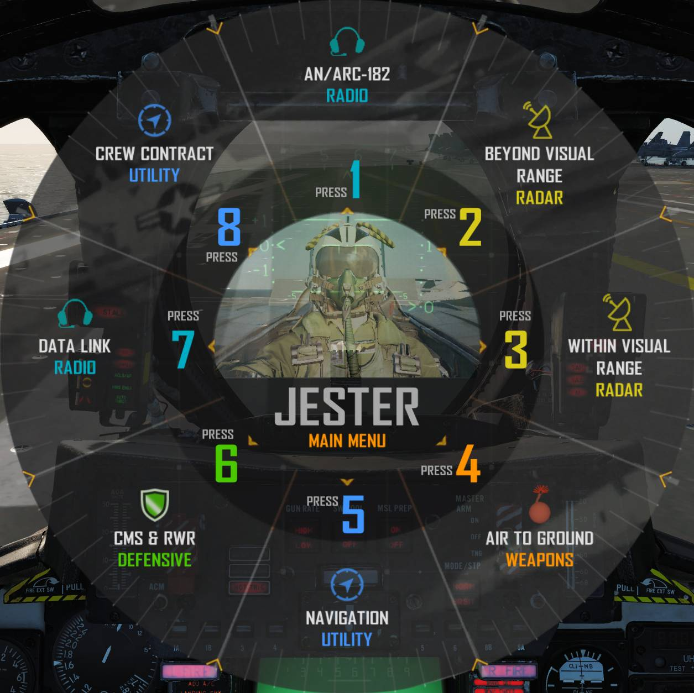

# Interface

> 🚧 Work in Progress

Jester's user interface allows for easy communication and access to various
settings mid-flight, conveniently even during high stress situations.

The **Jester menu** is opened by default with the <kbd>A</kbd> key. Selection of
items (<num>1</num>–<num>8</num>) is done using <kbd>CTRL</kbd> + <kbd>1</kbd>
through <kbd>CTRL</kbd> + <kbd>8</kbd>. These controls can be remapped under the
**Jester** category in the **F-14 Pilot** DCS key-binds. The menu system is
designed to support 8-way hat switch mapping. Optionally, you can use your
viewing angle in the cockpit to select menu petals by holding the Jester menu
key for over 0.5 seconds - this can be toggled in the F-14 options.

- The first press brings up a **contextual menu** based on current aircraft mode
  and situation.
- A second press opens the **Main Menu**.
- A third press closes the menu.

Examples:

- **Air-to-Air mode (airborne)**: opens _Beyond Visual Range – Radar_ menu.
- **Air-to-Ground mode**: opens _Air-to-Ground – Weapons_ menu.
- **Take-off/Landing**: context-specific menus available.

From these menus, pilots can control RIO systems. Menu contents can change based
on prior selections. In some cases, menu petals act as inputs/keypads for
entering data like frequencies or waypoints.

You can also:

- Set a **waypoint** from an F10 map marker (menu shows time and name).
- Lock targets on the **TID** using options like _closest target_ or _specific
  azimuth/range_.
- Run a **startup checklist**.
