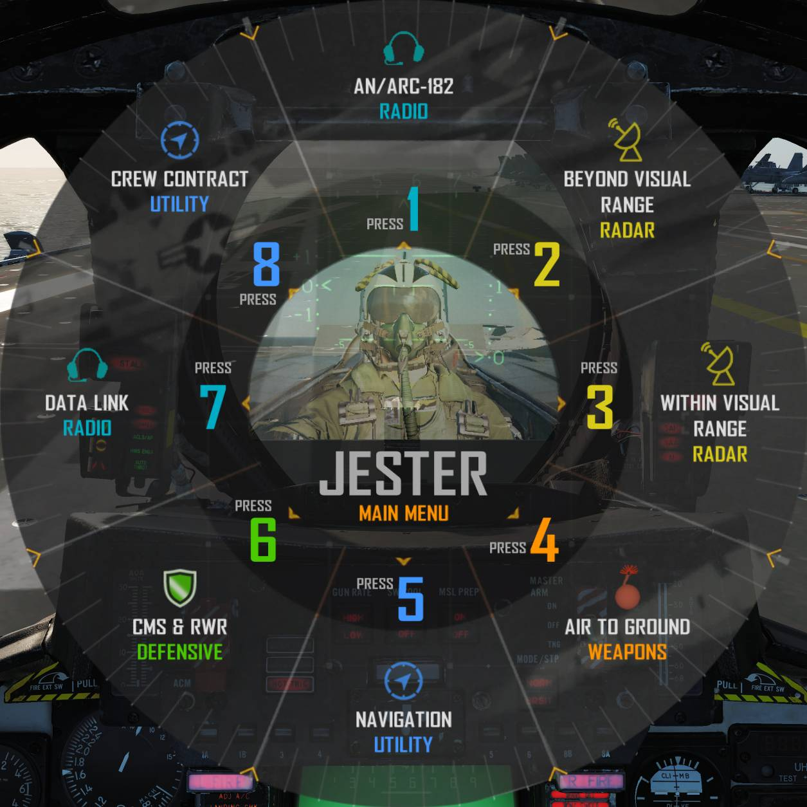

# Jester & Iceman

## Jester

The **Jester AI** aims to be a functional AI Radar Intercept Officer (RIO) for
the Heatblur DCS F-14, enabling a multi-crew experience in a single-player (per
aircraft) environment.

He is fully integrated into the rear cockpit, controlling nearly all back seat
systems, with a focus on systems not controllable from the pilot seat. He is
also modeled to simulate human limitations—his head position, visual spotting
range, and hand positions are all accounted for. When controlling systems at the
RIO seat, he performs all actions a human RIO would.

To control Jester, a **command wheel** is used for quick access. This wheel is
dynamic based on the selected mode and the current situation. Feedback to the
pilot is given via ICS using a library of recorded audio, simulating a RIO
actually talking. In addition to acknowledging orders, Jester will provide
pertinent information based on the situation.

In multiplayer, if a human RIO disconnects mid-flight, Jester resumes control of
the rear cockpit systems in the configuration left by the human player.

### Functionality

The **Jester menu** is opened by default with the <kbd>A</kbd> key. Selection of
items (<num>1</num>–<num>8</num>) is done using <kbd>CTRL</kbd> + <kbd>1</kbd>
through <kbd>CTRL</kbd> + <kbd>8</kbd>. These controls can be remapped under the
**Jester** category in the **F-14 Pilot** DCS key-binds. The menu system is
designed to support 8-way hat switch mapping. Optionally, you can use your
viewing angle in the cockpit to select menu petals by holding the Jester menu
key for over 0.5 seconds - this can be toggled in the F-14 options.

- The first press brings up a **contextual menu** based on current aircraft mode
  and situation.
- A second press opens the **Main Menu**.
- A third press closes the menu.

Examples:

- **Air-to-Air mode (airborne)**: opens _Beyond Visual Range – Radar_ menu.
- **Air-to-Ground mode**: opens _Air-to-Ground – Weapons_ menu.
- **Take-off/Landing**: context-specific menus available.

From these menus, pilots can control RIO systems. Menu contents can change based
on prior selections. In some cases, menu petals act as inputs/keypads for
entering data like frequencies or waypoints.

You can also:

- Set a **waypoint** from an F10 map marker (menu shows time and name).
- Lock targets on the **TID** using options like _closest target_ or _specific
  azimuth/range_.
- Run a **startup checklist**.

### Assisted Startup

For aircraft cold start, Jester can either perform his checklist like a real RIO
would, or he can also help the pilot with an assisted startup in which he reads
the pilot's checklist to him while starting.

To access the normal, unassisted startup, select startup, Jester will then go
through his checklist. He will at times ask the pilot if he has completed
certain checks or ask for specific tests, this is answered via the Jester menu
using the options appearing there. As an example he will start by asking for a
comms check which is answered via the Jester menu. Note that after engine
startup and EMERG GEN Master test he will ask for what INS alignment to go for,
select this via the Jester menu as well.

To access the assisted startup select assisted start on the Jester menu. Jester
will now read out the checklist to the pilot and highlight the relevant
indicators and switches during startup. Use the Jester menu to tell Jester when
a check/step is complete.

## Iceman

**Iceman** is a basic autopilot AI and a subset of the Jester system. It is
designed for singleplayer scenarios where a player may switch between the front
and rear seats.

When the player switches to the RIO seat:

- Iceman takes control of heading and altitude.
- The Iceman menu allows setting heading, altitude, and speed—either relative to
  a target or as absolute values.
