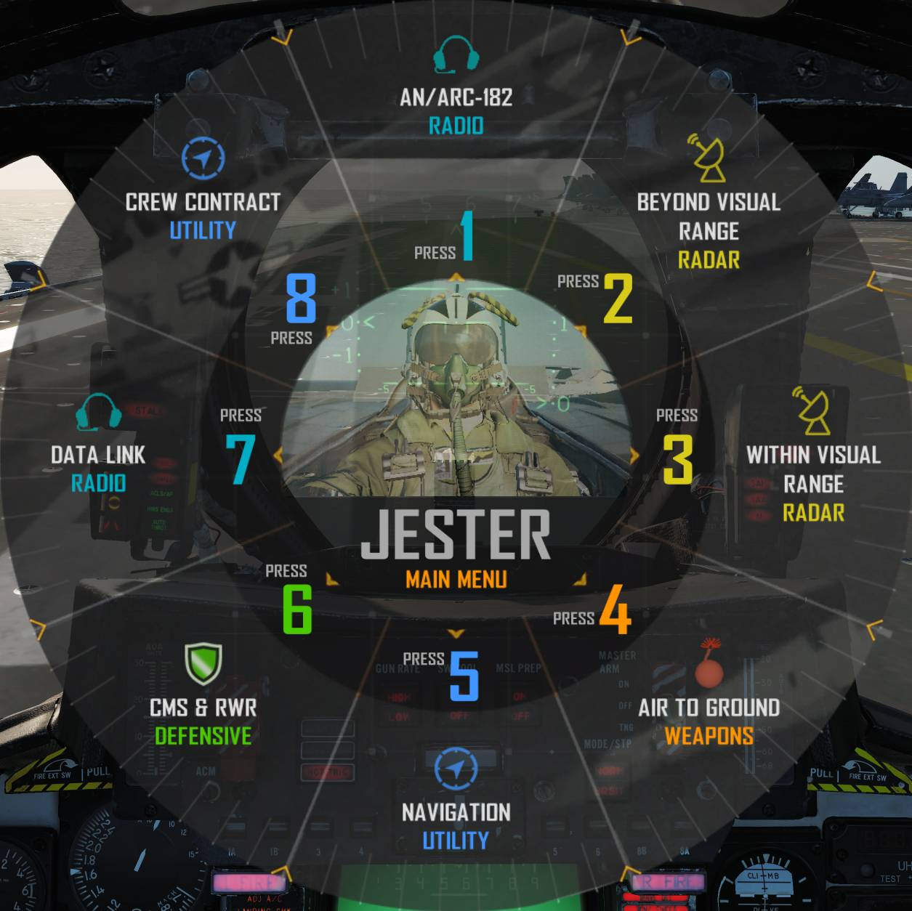

# Jester & Iceman

## Jester

**Jester AI** 的目标是为 Heatblur DCS
F-14B 打造一个 AI 雷达拦截官（即 RIO），便于玩家能够在单人（单人单架飞机）的环境下享受双人协作驾驶的快感。

Jester 被完全集成进了后座驾驶舱，他需要控制后座驾驶舱内几乎所有的航电，特别是那些前座飞行员无法操作的系统。我们为 Jester 构建模型时，还考虑了到一名真正人类 RIO 的局限性，也就是说，除了各种各样的限制因素外，RIO 当前头部位置，目视搜索范围以及他的手在操作什么——Jester
AI 的人类行为模型充分考虑到了这些因素。Jester
AI 能够像人类一样坐在 RIO 座位上控制所有系统，执行各种各样的操作。

玩家可以通过一个 **指令转盘**
快速访问并选择 Jester 的命令/控制。该选单中的内容会根据当前所处的模式和目前的状况进行动态的调整。Jester 的反馈会调用语音库中的语句并通过内话系统（ICS）传递给玩家，以此模拟与 RIO 交流的真实体验，而且，除了确认指令外，Jester 还会根据当前的情况向飞行员传达相关信息。

最后，在多人游戏中，作为 RIO 加入的玩家会发现，加入时所有的控制（例如：开关的位置等）都处在 Jester 离开前操作的位置上，同理，若玩家 RIO 离开，Jester 也会按照玩家所留下的设置来接手 RIO 的工作。

### 功能

在默认设置下，按下 <kbd>A</kbd> 来调出 Jester 菜单，通过 CTRL +
<num>1</num>–<num>8</num> 选择其中的项目（<kbd>CTRL</kbd> + <kbd>1</kbd> 到
<kbd>CTRL</kbd> +
<kbd>8</kbd>）。这些按键命令可以被更改或是设置到控制器上玩家可以在 DCS 按键设置中选择
**F-14 飞行员** 分类并在 **Jester**
子类别下找到上述按键设定。按花瓣状的菜单子选项使得它们可以被轻松设定对应游戏控制器的八向苦力帽位置。此外，玩家可以通过按住 Jester 菜单按键超过 0.5 秒，然后通过转动驾驶舱视角的方式来选择环形选单中的某个选项。这个功能可以在 F-14B 的专用设置中启用或禁用。

- 首次按下将根据当前的飞机模式和状况弹出一个 **联想菜单**。
- 再次按下将打开 **主菜单**。 - 第三次按下将关闭菜单。

例如：

- **空对空模式 (升空)**: 打开 *超视距 – 雷达*菜单。
- **空对地模式**: 打开 _空对地 – 武器_ 菜单。
- **起/降**: 联想-特定菜单可用。

通过这些菜单便使得玩家能够控制 RIO 驾驶舱中的诸多系统成为了可能。不同子菜单的内容可能会根据之前的指令而发生变化，并且某些系统使用环形选单中的选项作为输入/数字键盘在对应系统中设置频率或是其他数值。

玩家还可以：

- 从 F10 地图标记（菜单显示时间和名称）设置一个 **航路点** 。
- 使用如 _最近的目标_ 或 _特定方位/距离_ 在 **TID** 锁定一个目标。
- 执行一次 **起动检查单**。

### 协助起动

冷启动飞机时， Jester 可以像一名真正的 RIO 一样执行他的检查单，也可以帮助飞行员进行协助启动。在协助启动中， Jester 会向玩家朗读飞行员的检查单。

如需执行常规的，无协助的启动，选择启动， Jester 将执行他的检查单。他有时候会询问飞行员是否完成了某些检查或是要求进行具体的测试，这可以通过 Jester 菜单中的选项来回复。举例，他会首先要求进行通讯检查，这便需要用到 Jester 菜单了。注意，在完成发动机启动和 EMERG
GEN 测试之后他将会询问使用何种方式进行 INS 对准，这同样也是通过 Jester 菜单来选择的。

若需执行协助启动，在 Jester 菜单上选择协助启动。在启动过程中 Jester 将会像飞行员读出检查单并提醒飞行员有哪些相关的指示和开关。当检查/步骤完成后使用 Jester 菜单来通知 Jester 操作已完成。

## Iceman

除了 Jester ，或者说，作为 Jester AI 的一部分， Heatblur DCS F-14B 同样实现了
**Iceman** ，一个基础的自动驾驶/AI ，设计用来让玩家可在前后座切换游玩。

在玩家切换到 RIO 时：

- Iceman 将获取控制权，保持飞机当前的航向和高度。
- 通过菜单——现在是 Iceman 菜单了——玩家可以设置航向、高度和速度。航向和高度可以相对某个目标进行设定，也可以设定为不参考任何外部目标的绝对值。
