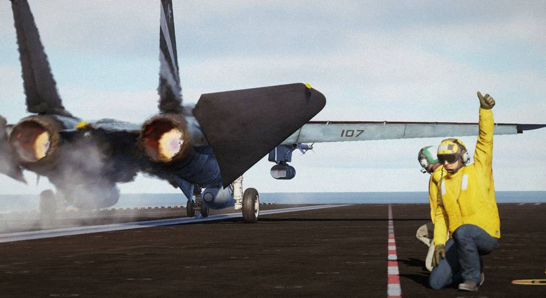

# Normal Procedures

This chapter contains standard procedures for operating the F-14 Tomcat.

The aircrew procedures are separated into individual procedures for the
**pilot** and **radar intercept officer**. These separate procedures allow the
individual crew-member to perform the checks without requiring them to read the
checks performed by the other crew-member. The remaining procedures are combined
and are coded for applicable crew-member action.

> 💡 Real procedures and checklists evolved over time. The procedures provided
> in this manual are tailored to our simulation of the Tomcat specifically.
> Procedures provided in other resources may differ slightly.

