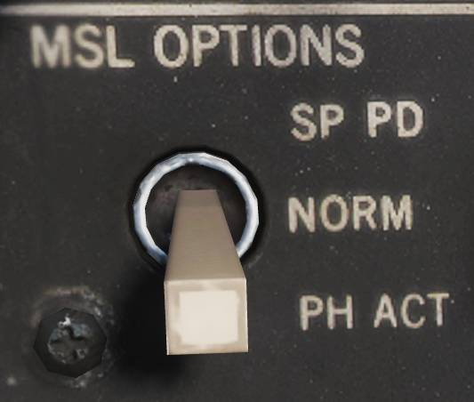
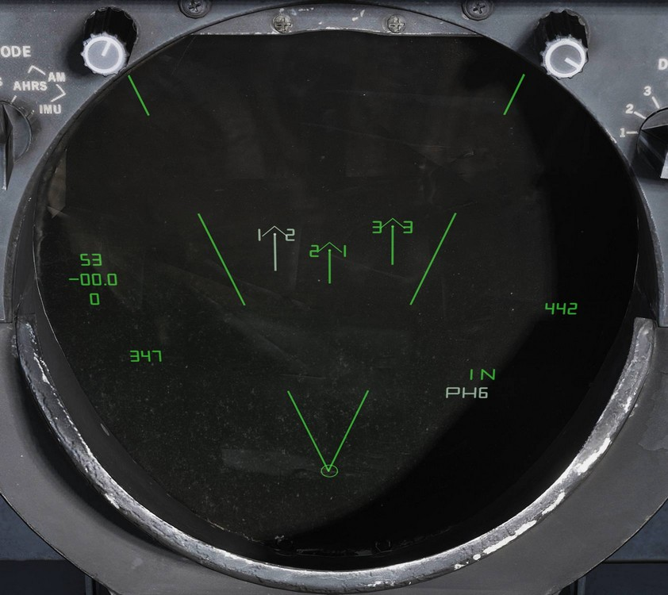

# AIM-54 “不死鸟”

 _由美国海军摄影师 Felix Garza
Jr. 拍摄（030320-N-4142G-013）_

> 💡 照片中的导弹还未装上前部弹翼。

AIM-54
“不死鸟”导弹是一种远程空空导弹，它本来是为流产的 F-111B 舰队防空战斗机计划而设计的。F-111B 计划以失败告终，F-111B 的 AIM-54 导弹与配套的 AN/AWG-9
WCS 最终被用于装备在 F-14 身上。

F-14 最多可携带 6 枚 AIM-54 导弹，左右翼套挂架上各搭载一枚，其余四枚搭载于机身武器导轨上。由于导弹冷却系统的设计原因，必须安装两个前武器导轨，才可使用后武器导轨以及挂载的导弹。而翼套挂架内置了单独的冷却系统。

“不死鸟”导弹支持使用 STT（单目标跟踪）攻击单个目标和 TWS（边扫描边跟踪）攻击多个目标。

AIM-54 有两个不同的型号——AIM-54A 和 AIM-54C。Heatblur
Simulations 的 F-14“雄猫”模拟了这两种型号的“不死鸟”，此外，我们为 AIM-54A 单独模拟了 Mk47 和 Mk60 火箭发动机。
装备这两种不同型号发动机的 AIM-54A 在射程上有些差异，而 AIM-54C 和 AIM-54A 的主要区别则是 C 型使用了数字信号导引头，而不是模拟信号导引头，从而提升了性能。
AIM-54C 还装有一个改进的无烟 Mk47 火箭发动机。

使用 PD STT 模式在高空攻击战斗机大小的目标时，AIM-54 的射程超过 60 海里。
而使用 TWS 攻击多目标时，射程缩短到约 50 海里。攻击大型目标时，射程会增加，反之，攻击小型目标时，射程会缩短。

如果使用主动模式发射，根据目标的大小射程也会稍有差异，例如攻击战斗机大小的目标射程会缩短至大约 10 海里。
需要注意的是，在 SARH 模式下使用主动模式发射后，如果导引头没有探测到目标，那么导弹将会返回 SARH 模式。

## 导弹发射准备

选择飞行员 ACM 面板上的 MSL PREP 按钮开关或激活 ACM 模式开始 AIM-54 导弹的准备
这将接通导弹的电源和冷却系统，同时也会启动导弹的机内自检（BIT）。

与 AIM-7 一样，在发射 AIM-54 前，需要通过装在武器导轨末端的发射器向导弹尾部的接收机发送调谐数据。
整个导弹准备周期大约需要2分钟来完成，完成后飞行员 ACM 面板上相应的状态标识旗窗口会指示 AIM-54 准备完毕。

## 发射模式

AIM-54 的导引头能够使用半主动雷达制导（SARH）和主动雷达制导（ARH）模式。

通常来说，导弹的发射至弹射（LTE），也就是从按下扳机开始，直到导弹弹射出导轨所需的时间，是3秒钟。但 ACM 主动模式下发射则是个例外，如果目标在离 ADL
15°内，LTE 会缩短至1秒。

### TWS SARH/ARH

在 TWS 模式下，AN/AWG-9 可以支持同时对6个不同目标发射6枚 AIM-54 导弹。
在 AIM-54 跟踪的第一阶段，导弹接收由 AN/AWG-9 雷达发射的制导指令和目标的雷达反射波来进行半主动制导。
当目标进入导弹导引头 ARH 模式的距离内后，AN/AWG-9 会命令导弹切换至 ARH。

如果 AN/AWG-9 雷达不发送这条指令，导弹便无法切换至 ARH 模式。
然而，作为备用措施，AN/AWG-9 会继续向导弹传输制导指令，以防导弹无法自主截获目标。这说明 AIM-54 本质上并非发射后不管，但可以认为导弹进入 ARH 模式后能够自主攻击目标。

### PD STT SARH

在 PD STT（脉冲多普勒 单目标跟踪）模式下，AIM-54 全程使用 SARH 模式，
相比 TWS 模式，导弹以会更高的频率接收雷达制导指令，并且由于使用单目标跟踪，目标会受到持续聚焦照射。
使用 PD STT 可以略微增加 AIM-54 导引头的有效探测距离。

### 主动雷达制导（ARH）

无论是在 TWS 还是在脉冲多普勒 STT 模式下，AIM-54 可以在发射后接收指令立刻令开机，这是通过在发射导弹前，将 MSL
OPTIONS 开关拨至 PH
ACT 档位来实现的。这会让 WCS 在导弹发射后传输的第一条制导指令中立刻命令 AIM-54 进入主动雷达制导。
如果从目标后半球6海里内，或目标前半球10海里内发射导弹，WCS 会自动发送这条指令，而不再使用 SARH 模式。

与另外两种 SARH 模式下一样，如果导弹导引头未能主动截获到目标，导弹会返回 SARH 模式，直到导引头主动截获目标。

> 💡 当 AIM-54 在空中时，将 MSL OPTIONS 开关拨动至 PH
> ACT 档位并不会命令 AIM-54 进入主动制导，PH ACT 档位仅可以在导弹发射前设置。

### ACM 主动模式

AIM-54 的最后一种工作模式是 ACM 主动模式，在这个模式下，导弹在发射前就已经接收指令开机，因此导弹在该模式下才是真正的射后不管。
AIM-54 导弹除了在发射前接收开机指令外，还会从 WCS 额外接收一条预对准的指令，将导引头指向当前可用的 WCS 跟踪目标。

在飞行员 ACM 面板上按下 MSL
MODE 按钮开关选择 BRSIT（瞄准轴）、在无 WCS 跟踪目标时进入 ACM 模式、使用非脉冲多普勒雷达或 TCS 跟踪模式时，导弹便会进入 ACM 主动模式。
无跟踪目标的情况下使用瞄准轴模式或 ACM 模式时，导弹会沿着 ADL 发射，并锁定它探测到的第一个目标，但如果使用非脉冲多普勒雷达跟踪目标，发射前导引头会提前对准跟踪目标。

## ECM 模式

在所有引导模式中，如果受到干扰，导引头会自动切换至被动 ECM 寻的模式，来对目标进行角跟踪，直到导引头能重新使用 SARH 或 ARH 跟踪目标。
这个切换过程是自动完成的，不需要机组操作，操作员也不会收到提示。

## 导弹操作

在飞行员驾驶杆上选择 SP/PH（麻雀/不死鸟）开关档位，然后按下选择开关来从 SP 切换至 PH 来选择 AIM-54 导弹。再次按下武器选择开关可以重新选择 SP。

WCS 无跟踪目标的情况下使用瞄准轴或 ACM 主动模式发射 AIM-54 时，除了用于瞄准导弹的 ADL 外，HUD 上不会显示任何标识。

在 STT 模式下，且 WCS 有跟踪目标时，HUD 上会显示目标指示符，如果 TCS 也有跟踪目标，那么目标上会显示随动准星。
前者指示了 WCS 跟踪目标，后者指示了 TCS 的视线。HUD 右侧的距离标度上指示了目标当前距离、Rmin和 Rmax，而 VDI、DDI 和 TID 上则显示了攻击引导标识。

### TWS

在 TWS 模式下使用 AIM-54 时，WCS 会自动分配跟踪目标的优先级，给每个目标指定一个发射序号，表示导弹的发射顺序。
向第一个目标发射导弹后，目标上的发射序号会消失，所有其他目标的发射序号分别减少 1。

依次对每个目标按下一次扳机来继续攻击跟踪目标 2 至 6，等前一枚导弹离轨后再按下扳机，依此类推直到所需发射的导弹全部发射完毕。

导弹发射后，跟踪目标右侧的发射优先级数字会被替换为 TTI，也就是预计命中时间，这是计算出的导弹命中目标所需的时间。

此外，当 AN/AWG-9 向导弹发送开机指令时，TTI 数字将会闪烁，数字闪烁表示跟踪目标的导弹已经接收指令使用主动雷达制导模式对目标进行跟踪。
导弹何时进入主动雷达制导取决于 DDD 中 TGTS 开关的设置。
开关 SAMLL 档位为 6 海里、NORM 档位为 10 海里、LARGE 为 13 海里。开关需要在导弹发射前进行设置。

正被导弹攻击的目标会保持高亮，直到预计命中时间 + 15秒为止，超过预计命中时间 +
15秒后，VDI、DDD 和 TID 上会显示脱离 “X” 标识。

TID 标识信息详见 TID 标识符 。

通过 CAP 设置可以强制 WCS 在发射序列中加入一个目标，还可以强制 WCS 排除某个目标，不对其进行攻击，同样也是在 CAP 面板上设置。
此外，勾选一个目标并按下 RIO 武器控制面板上的 NEXT
LAUNCH 按钮，可以命令 WCS 将该目标作为发射序列 1 号优先级目标。

如果先前 WCS 未进入 TWS
AUTO 模式，那么 WCS 会自动切换至该模式来接管 AN/AWG-9 雷达，照射所有攻击目标。
除了跟踪目标数字编号外，TID 也会显示转向质心来指示 TWS 栅状扫描的中心点。

HUD 和 VDI 上显示了一个转向提示来引导飞行员控制飞机，使雷达以最优条件照射目标，
同时 HUD 和 VDI 上也显示了本机至 1 号目标的距离、Rmin 和 Rmax。TID 上显示了完整的攻击符号标识，
包括目标优先级序号和每个目标的最佳发射距离，详见边扫描边跟踪（TWS）。

## DCS 中的 AIM-54

HB DCS
F-14 包括了单独定制的 AIM-54A 和 AIM-54C 导弹，其中 AIM-54A 包含有两种不同版本的火箭发动机可供选择。
导弹的空气动力学和发动机性能经过了大量的研究和计算机模拟以在空气动力学方面使上述的三枚导弹的表现显得更加真实。

在导弹导引头和飞行曲线方面我们与 Eagle Dynamics 展开合作，来使我们的 F-14
AN/AWG-9 雷达在一定程度上控制 AIM-54。在 DCS 中将意味着以下几点：

在 TWS 模式中导弹将使用 AN/AWG-9 提供的制导飞向目标，直到命中时间只剩下大约 16 秒时为止，当到达这个时间后，如果目标仍在雷达的扫描区内，那么 AN/AWG-9 将会告知导弹开机
。AN/AWG-9 发送 ATC 确切的距离取决于 TGTS 开关所处的档位，TGTS 开关详见上文中的描述。这就导致在攻击过程中，直到导弹进入主动雷达制导模式前，目标不会收到任何雷达告警提示，当导弹进入主动模式后，目标的雷达告警接收机将会收到一枚导弹正在进行攻击的警告。
如果目标在特定的距离外，AIM-54 将会高抛以获得更远的射程。设置不同的导引头主动雷达制导距离将会影响到目标的反应时间，但同样也会影响到需要继续为导弹提供制导的时间。

在 PD-STT（脉冲多普勒 单目标跟踪）模式下，AIM-54 发射后将使用纯半主动模式进行制导，并在全程使用 PD-STT 模式进行制导直到命中目标（不会进入主动模式）。
这表示被攻击的目标将会在 AIM-54 离轨后立刻通过雷达告警接收机收到正在被 AN/AWG-9 攻击的警告。正如 TWS 模式一样如果目标在特定距离外导弹将会采用高抛弹道。

其他所有模式以及在 10 海里内的目标（或处在 ACM 或 PH
ACT），AIM-54 将会在离轨后立刻进入主动模式，目标飞机将会立刻看到导弹本身的雷达正在锁定攻击它。在前述模式下，导弹不会采用高抛弹道，因此射程比其他两种模式要短很多。

> DCS 中目前目标大小开关对 AIM-54C 没有影响。
