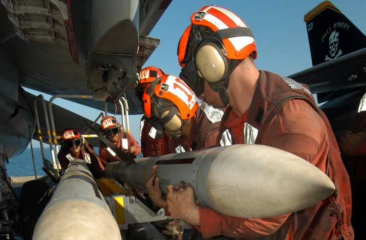
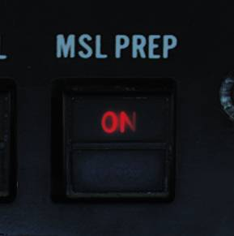
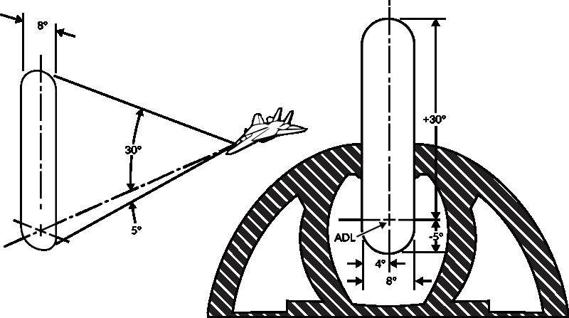

# AIM-7 “麻雀”

 _由美国海军摄影师 Joshua
Karsten 拍摄（041108-N-8704K-008）_

AIM-7“麻雀”空空导弹是一种超音速助推-滑翔导弹，它能在全天候条件下攻击飞机和导弹。AIM-7
“麻雀”是一款中程空对空导弹，AIM-7E 最大射程超过16海里（30千米）而 AIM-7F 和 AIM-7M 最大射程超过38海里（70千米）。AIM-7 的全天候能力来自于导弹使用雷达制导，更确切地说是半主动雷达制导（SARH）。这意味着“麻雀”只有依赖 AN/AWG-9 为其照射目标，其导引头才能跟踪目标的雷达反射信号。

F-14 可以在机身上的四个专用半埋式挂架和左右翼套挂架上分别挂载一枚 AIM-7E、AIM-7F 或 AIM-7M 导弹。

除了导弹射程，导引头和战斗部的各种改进之外，不同版本之间的主要区别在于 AIM-7F 及其改进型除了 CW（连续波）外也可以通过脉冲多普勒进行制导。

## 导弹发射准备

发射 AIM-7 导弹前，需要在前座飞行员 ACM 面板上选择 MSL
PREP-ON 按钮来开始准备程序。这将指令 WCS 开始准备 AIM-7 和 AIM-54 导弹。

按下导弹发射准备按钮时，对于 AIM-7 来说，WCS 将为导弹提供预热电子元件和陀螺仪所需的电力。WCS 还将会通过导弹导轨后端的发射器向导弹尾部的接收机输入 CW 雷达视频。此视频用于将 AIM-7 导弹调谐到 RIO 在 DDD 面板中选定的 CW 频率上。当一枚导弹调谐并准备完毕时，ACM 面板对应的挂架状态标识旗将变成白色，表示对应挂架上的导弹已经准备完毕。

## 发射模式

F-14 上有两种可用发射模式用于 AIM-7 ，分别是正常模式和瞄准轴模式。飞行员使用驾驶杆武器选择开关上的 SP/PH（“麻雀”/“不死鸟”）档位来选择发射 AIM-7。WCS 将自动选择一枚“麻雀”来发射。

按下武器选择开关会将选定的武器从 SP 切换至 PH，反之亦然。如果武器控制系统有 STT 目标，那么，除非在 ACM 面板的 MSL
MODE（导弹模式）开关上选择 BRSIT（瞄准轴），否则 WCS 将自动使用正常模式进行发射。所有其他情况下将使用瞄准轴模式发射导弹。

### 正常模式

因为正常模式是用于攻击使用 STT 跟踪的目标，所以 WCS 可以使用 CW（连续波）或脉冲多普勒进行制导。在正常模式下使用 CW 模式时，AN/AWG-9 雷达使用专用 CW 天线，它能比泛指天线更直接地聚焦照射跟踪的目标。虽然 CW 模式是所有 AIM-7 型号的正常制导模式，但使用 AIM-7F 和 AIM-7M 导弹时，可以选择脉冲多普勒制导模式。

RIO 可以在武器控制面板上将 MSL OPTIONS 开关设置到 SP
PD（“麻雀” 多普勒）档位来切换至脉冲多普勒制导。选择 SP
PD 将使 WCS 采用脉冲多普勒照射来为“麻雀”导弹提供制导。

无论采用哪种制导模式，WCS 都会计算导弹的 LAR（发射允许区间），并在 VDI 和 TID 上显示导弹发射距离。HUD 显示菱形目标指定符、当前目标距离、Rmin（最小发射距离）和 Rmax（最大发射距离），而 VDI、DDD 和 TID 显示攻击引导符号系统以及上述的导弹 LAR 指示。

### 瞄准轴模式

瞄准轴模式使用 AN/AWG-9 雷达上的 CW 泛指天线并使导弹跟踪泛指区内反射信号最强的目标。除了在瞄准轴模式下发射导弹外，雷达还将在目标丢失、麻雀发射前或者发射后切换至泛指模式，从而允许飞行员通过将目标保持在泛指区域内来尝试继续引导导弹。

