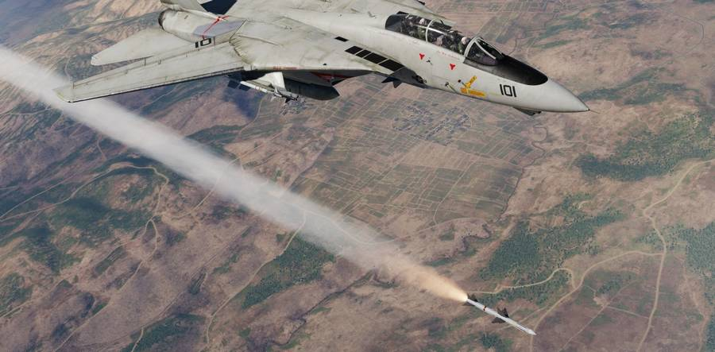
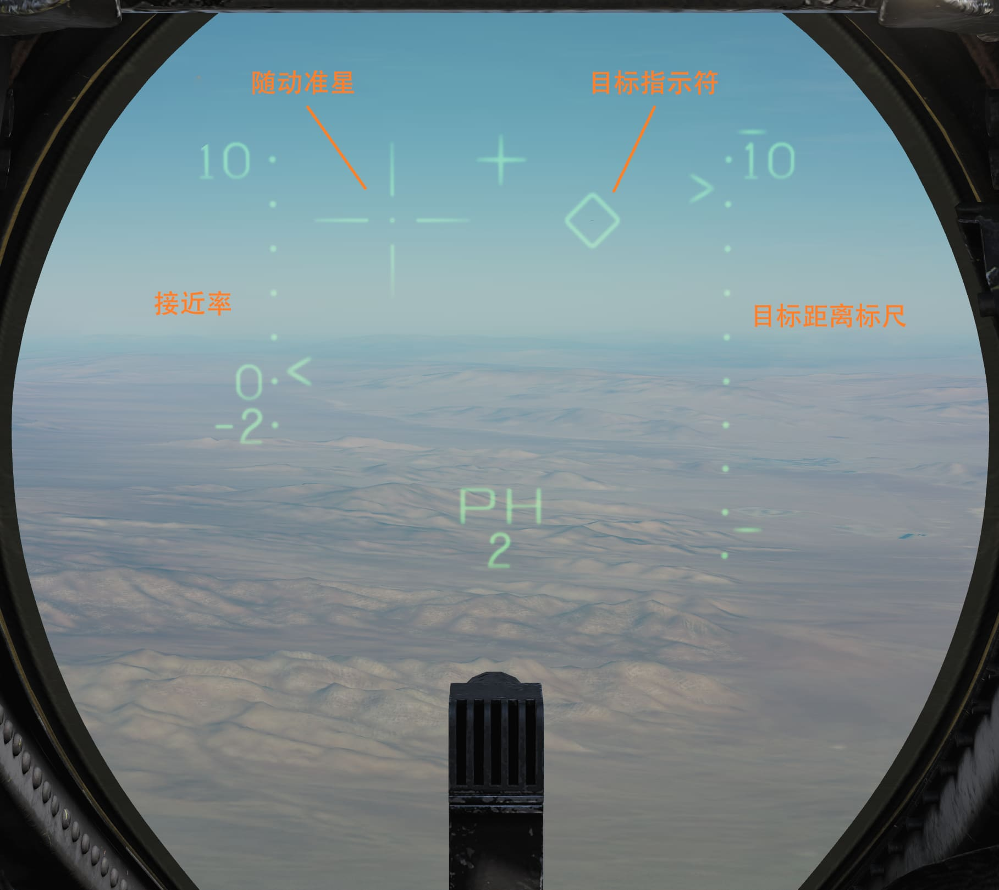

# 空对空

F-14 雄猫可挂载各种不同的空对空武器。

包括远距离攻击时用的 [AIM-54 “不死鸟”](aim_54.md) 以及 [AIM-7 “麻雀”](aim_7.md)。

在在近距离格斗中，“雄猫” 依靠 [AIM-9 “响尾蛇”](./aim_9.md)
进行攻击，这种短距红外制导导弹以其敏捷性和响应速度而闻名。

## 空对空导弹的 HUD 标识

上图展示了在空对空显示模式下选择了“不死鸟”导弹时的 HUD 标识。

作为标准，HUD 左侧显示了以百节为单位的 接近率 ，范围从-200节到+1000节。 `<`
符号指示当前的接近率。

另外，HUD 右侧显示的为目标距离标度——在显示的标度内指示目标的距离，如上图所示，当前距离标度为10海里。标度上的
`>` 符号指示当前目标的距离，短横（ - ）符号分别指示当前选中武器的最大和最小发射距离。

随动准星（空对地模式和使用航炮时被称为十字准星）和目标指示符标识根据不同情况有不同含义。

如果雷达正以 STT 模式跟踪目标， 随动准星会显示 TCS 视线，选中 AIM-9 时例外。选中 AIM-9 时随动准星则会指示 AIM-9 导引头的视线。

如果雷达以 STT 模式跟踪目标，目标指定符指示雷达当前视线，如果雷达无跟踪目标，则指示 TCS 视线。

因此，TCS 的视线可以由随动准星或目标指示符指示，这取决于雷达是否有 STT 目标，而在选中 AIM-9 的情况下则完全不显示（TCS 视线）。
