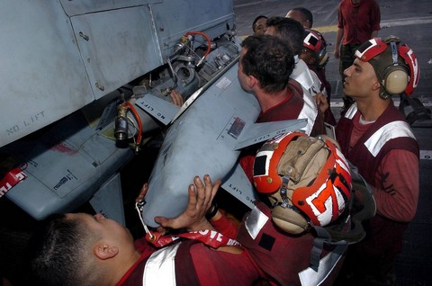

# ADM-141 TALD

 _由美国海军摄影师 Mark J.
Rebilas 拍摄（041018-N-6213R-021）_

ADM-141 战术空射诱饵（TALD）是一种利用主动和被动方式模拟真实飞机信号的滑翔诱饵。TALD 有许多个版本，例如有一个版本发射箔条，另一个版本使用龙伯透镜来增大雷达截面积，用来伪装成一架更大的飞机。

TALD 所有的版本都需要在起飞前预编程，且 TALD 自身无动力推进，仅能使用折叠翼滑翔。

F-14 最多可携带4枚 ADM-141
TALD，3号至6号挂点可分别挂载一枚，每个挂架都需要连接 TER 来增加 TALD 和飞机机身的间距。

> 💡 目前在 DCS 中，TALD 只能向正前方滑翔，直到坠地。
